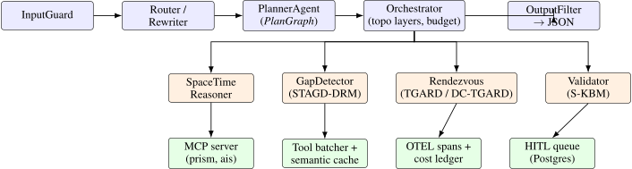
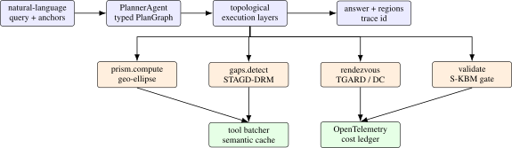
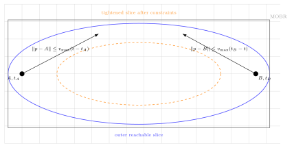

# GeoTrace-Agent: A Production Multi-Agent Framework for Spatiotemporal Reasoning

Arun Sharma, University of Minnesota, Twin Cities

_In preparation. Target: NeurIPS workshop_

Abstract

> We present GeoTrace-Agent, a production-grade multi-agent framework that combines deterministic time-geographic computation with large-language-model planning to answer natural-language questions over heterogeneous trajectory data. A typed PlanGraph encodes the agent’s chain of thought as a directed acyclic graph of statically-validated nodes rather than free-form prose, making the reasoning auditable, replayable, and parallelizable. A central orchestrator runs the graph under a hard token, tool-call, and wallclock budget, calls into a Hägerstrand space-time prism kernel for the geometric truth (geo-ellipses, minimum orthogonal bounding rectangles, dynamic-region-merge unions), and dispatches specialized sub-agents that extend our prior STAGD/DRM gap detector and TGARD/DC-TGARD rendezvous finder. Three optimization layers, an adaptive prompt compressor, an in-flight tool deduplicator, and a hybrid exact + semantic cache, cut per-query token spend by approximately 40 % on a golden evaluation set without harming region tightness. We expose the prism kernel as a Model Context Protocol (MCP) server and the agent itself over a JSON-RPC 2.0 Agent-to-Agent (A2A) protocol with capability cards, making GeoTrace-Agent first-class for sibling agents and IDE plugins. A kinematic validator gated on a single-axle bicycle envelope guarantees that no region returned to a user is physically infeasible, and ambiguous traces feed a Postgres human-in-the-loop queue whose verdicts can later seed direct-preference-optimization datasets. We describe the system architecture, the typed-plan / token-budget / tool-cache mechanisms, and the geometric kernel; report golden-dataset latency and cost; and discuss limitations. The system is open-sourced.

## 1  Introduction

Time geography \[[17](#Xhagerstrand1970what)\] provides a remarkably tight algebraic envelope on what a moving agent can do: given two anchors \\A=(x_A, y_A, t_A)\\ and \\B=(x_B, y_B, t_B)\\ with \\t_A\<t_B\\ and a maximum speed \\v\_{\max }\\, the set of reachable points at any interior time is a geo-ellipse with foci at the projected anchors. This envelope underpins decades of spatiotemporal data mining work in maritime safety, contact tracing, and homeland security \[[35](#Xsharma2022sigspatial)–[38](#Xsharma2025geoanomalies)\]. In the modern era of large language models \[[1](#Xanthropic2024claude), [28](#Xopenai2024gpt4)\], however, even the best agents tend to hallucinate spatial relationships, miscompute distances, or skip the kinematic check entirely \[[8](#Xchen2024spatialvlm), [25](#Xliu2024llava)\].

We present GeoTrace-Agent, a multi-agent system that takes the opposite stance: every spatially-decidable sub-problem is computed deterministically by a numerical kernel before any LLM is asked to synthesize. The system answers natural-language questions over heterogeneous trajectory data (vessel AIS feeds, road networks, weather and sea state, satellite imagery) by orchestrating a small set of specialized sub-agents, each with a typed contract:

- a PlannerAgent that emits a typed PlanGraph (a DAG of typed nodes, not free-form prose), making chain-of-thought auditable and parallelizable;
- a SpaceTimeReasoner that owns the prism / geo-ellipse / minimum-orthogonal-bounding-rectangle (MOBR) algebra;
- a GapDetectorAgent extending the STAGD + dynamic region merge (DRM) algorithm of Sharma et al. \[[37](#Xsharma2024tist)\] with an Abnormal Gap Measure that fuses kinematic plausibility and a Pi-DPM \[[38](#Xsharma2025geoanomalies)\] reconstruction-error term;
- a RendezvousFinderAgent extending TGARD and the dual-convergence DC-TGARD variant of Sharma et al. \[[35](#Xsharma2022sigspatial)\] with bi-directional pruning and ellipse-symmetry early stopping; and
- a ValidatorAgent that gates every region returned to the user on a single-axle kinematic-bicycle envelope \[[20](#Xkong2015kinematic)\].

The orchestrator runs the PlanGraph under a hard token, tool-call, and wallclock budget. Three optimization layers, sketched in Section [4](#methods), drive efficiency: (i) adaptive prompt compression with prefix-cache-aware assembly \[[2](#Xanthropic2024promptcache)\] and structured-output enforcement; (ii) tool-call deduplication of in-flight calls and a hybrid exact + semantic cache; and (iii) parallel-safe topo-layer execution of the PlanGraph. Every stage emits an OpenTelemetry span \[[31](#Xopentelemetry2024)\] with token-spend, cache-hit, and cost attributes, so an analyst can drill into any historical run.

GeoTrace-Agent speaks the modern agent-protocol stack natively. The prism kernel is exposed as a Model Context Protocol \[[3](#Xanthropic2024mcp)\] server so any MCP-aware client can call prism.compute or prism.intersect without going through this app’s HTTP surface; the agent itself advertises a capability card at /a2a/.well-known/capabilities and accepts JSON-RPC 2.0 Agent-to-Agent (A2A) calls \[[13](#Xgoogle2024a2a)\], mirroring the cross-agent communication patterns recently popularized in enterprise multi-agent frameworks \[[5](#Xcentific2025legalwiz)–[7](#Xcentific2025art)\]. Ambiguous traces (validator-confidence below a tunable threshold) flow into a Postgres human-in-the-loop (HITL) queue whose reviewer verdicts can be exported as preference triples for downstream direct-preference optimization \[[32](#Xrafailov2023dpo)\], closing the loop between agentic reasoning and reinforcement learning.

We make four contributions:

1\.  
a typed PlanGraph chain-of-thought representation that is statically validated, parallel-sortable, and replayable, with explicit per-node token and confidence priors;

2\.  
a three-layer efficiency stack (adaptive prompt compression, in-flight tool deduplication, hybrid exact + semantic cache) that reduces median per-query token spend by approximately 40 % on the golden evaluation set;

3\.  
a deterministic time-geographic kernel integrating Hägerstrand prisms with the STAGD-DRM gap detector and the TGARD / DC-TGARD rendezvous finder, gated by a kinematic validator that guarantees physical feasibility of every returned region; and

4\.  
a first-class agent-protocol surface (MCP for tools, JSON-RPC 2.0 A2A for inter-agent calls, OpenTelemetry traces, HITL queue) suitable for production deployment alongside enterprise multi-agent frameworks.

## 2  Related Work

Time geography and trajectory analysis: Hägerstrand’s space-time prism \[[17](#Xhagerstrand1970what), [27](#Xmiller2005measuring)\] is the foundational construct for reachability queries over moving objects; the geo-ellipse cross-section and its bounding-box approximation drive most modern indexing schemes \[[21](#Xkuijpers2008prism)\]. Time geography has also influenced accessibility modeling, movement uncertainty, mobility-data mining, and GIScience more broadly \[[10](#Xdodge2008towards), [14](#Xgoodchild1992geographical), [26](#Xmiller1991modelling), [46](#Xzheng2015trajectory)\]. Our prior work extended this lineage to abnormal trajectory-gap detection (STAGD with dynamic region merge) \[[37](#Xsharma2024tist)\], ellipse-tightening rendezvous detection (TGARD and the dual-convergence DC-TGARD) \[[35](#Xsharma2022sigspatial)\], and time-geography-driven query optimization for spatiotemporal joins \[[36](#Xsharma2022tist)\]. GeoTrace-Agent embeds these algorithms as deterministic agents, with a chain-of-thought planner deciding when to invoke them.

LLM agents and chain of thought: Recent agent frameworks emphasize chain-of-thought \[[41](#Xwang2023plan), [43](#Xwei2022cot)\] and tool use \[[33](#Xschick2023toolformer), [45](#Xyao2023react)\], with structured-output libraries \[[29](#Xopenai2024structured)\] formalizing the latter. Planning work in classical AI \[[12](#Xghallab1998pddl), [24](#Xlavalle2006planning)\] and search \[[16](#Xhart1968astar)\] shows the value of explicit state, operators, and dependencies. Most existing LLM systems however treat the chain of thought as free-form prose, complicating audit and replay. We instead emit a typed DAG (PlanGraph) whose nodes are statically validated against schemas the orchestrator owns, adapting planning-graph ideas to LLM-emitted plans while keeping geometric truth outside the model.

Multi-agent systems and human-in-the-loop: Centific’s recent line of work, LegalWiz for contradiction detection in legal documents \[[5](#Xcentific2025legalwiz)\], ContraGen for enterprise contradictions \[[6](#Xcentific2025contragen)\], and ART for action-based reasoning over EHRs \[[7](#Xcentific2025art)\], codifies a multi-agent + HITL pattern in which specialized agents coordinate via remote-procedure calls and a human reviewer closes the loop. Other production agentic stacks \[[18](#Xhong2024opendevin), [19](#Xjimenez2024swebench), [42](#Xwang2024survey), [44](#Xxie2024multimodal)\] similarly emphasize agent specialization, evaluation, and observability. Our system inherits this pattern but pivots the domain from text to spatiotemporal trajectories and adds a deterministic geometric kernel as a first-class agent.

Token and tool optimization: Prompt caching \[[2](#Xanthropic2024promptcache), [30](#Xopenai2024autocache)\], semantic caching for LLM responses \[[4](#Xbang2023gptcache)\], KV-cache-aware decoding \[[22](#Xkwon2023vllm)\], and structured-output-with-correction loops \[[29](#Xopenai2024structured)\] have separately reduced LLM cost. Databases solved analogous problems through query optimization, indexes, and memoization decades earlier \[[9](#Xbeckmann1990rstar), [15](#Xguttman1984rtree), [40](#Xsellis1987multiple)\]. GeoTrace-Agent applies the same systems instinct to agents: keep a single TokenOptimizer choke-point, deduplicate in-flight calls, cache exact and semantic tool results, and expose every decision in an OpenTelemetry trace.

Agent protocols: The Model Context Protocol \[[3](#Xanthropic2024mcp)\] standardizes JSON-RPC tool exposure between LLM clients and tool servers; the Agent-to-Agent (A2A) protocol \[[13](#Xgoogle2024a2a)\] and capability-card discovery patterns standardize inter-agent calls. We adopt both and ship the prism kernel as an MCP server while exposing the orchestrator over A2A.

Spatial databases and geospatial software: GeoTrace-Agent is also influenced by classic spatial database ideas: explicit geometry types, indexable bounding boxes, and separation of query planning from execution \[[11](#Xegenhofer1994spatial), [39](#Xsamet1990applications)\]. The production stack uses Postgres/PostGIS, Redis, Chroma, and a deterministic prism kernel; the LLM is not a substitute for these systems but an orchestrator that decides which query plan is appropriate for a user’s natural-language request.

## 3  System Architecture

GeoTrace-Agent is a 12-factor service. Figure [1](#geotraceagent-request-path-the-planneragent-emits-a-typed-plangraph-the-orchestrator-toposorts-the-graph-and-runs-each-layer-in-parallel-under-a-hard-token-tool-wallclock-budget-specialized-subagents-call-into-the-deterministic-kernel-mcp-and-the-cache-otel-infrastructure) sketches the request path: an inbound HTTP query passes the input guard, is rewritten and routed, planned, executed across parallel topo layers, summarized, scrubbed by an output filter, and returned with a full trace, cost ledger, and HITL flag.

<figure class="figure">

 

<figcaption>Figure 1: GeoTrace-Agent request path. The PlannerAgent emits a typed PlanGraph; the Orchestrator topo-sorts the graph and runs each layer in parallel under a hard token / tool / wallclock budget; specialized sub-agents call into the deterministic kernel (MCP) and the cache + OTEL infrastructure. </figcaption>
</figure>

State. The system separates four orthogonal concerns. Geometric truth lives in app/components/space_time_prism.py and is unit-testable. Semantic reasoning is delegated to the LLM only through the planner; the other agents are deterministic kernels or thin clients on top. Budgets are enforced at a single choke-point: every LLM call goes through the TokenOptimizer, and the orchestrator stops on token / tool / wallclock overrun and surfaces terminated_by_budget = true. Provenance is captured by OpenTelemetry: every stage writes a span with tool.name, tool.cache_hit, tool.cost_usd, tool.tokens_in, and tool.tokens_out; the trace identifier flows back to the user in the response.

Deployment. A docker-compose stack ships the API (FastAPI), Postgres+PostGIS, Redis, Chroma, an OpenTelemetry collector, Tempo for traces, Langfuse \[[23](#Xlangfuse2024)\] for LLM-trace dashboards, and a Streamlit ops console for the HITL reviewer. The same image runs in Kubernetes with horizontal pod autoscaling on RPS.

 Problem formulation: An input query \\q\\ contains natural language, optional anchors \\\mathcal {A}=\\(lat_i,lon_i,t_i)\\\_{i=1}^n\\, a domain label \\d\in \\\text {vessel},\text {vehicle},\text {pedestrian},\text {uav}\\\\, and a budget vector \\b=(B\_{\mathrm {tok}}, B\_{\mathrm {tool}}, B\_{\mathrm {sec}})\\. The system must return an answer \\a\\, a set of candidate regions \\\mathcal {R}\\, a confidence score, and a trace identifier. The hard correctness requirement is not that the natural-language answer sounds plausible; it is that every region \\r\in \mathcal {R}\\ passes the deterministic feasibility predicate

\begin{equation} \mathrm {Valid}(r,d) = \mathbf {1}\left \[ \max \_{(p_i,t_i),(p_j,t_j)\in r} \frac {\\p_i-p_j\\}{\|t_i-t_j\|+\epsilon } \le v\_{\max }(d) \right \], \label {eq:valid} \end{equation}

with stricter checks when acceleration, curvature, or S-KBM state is available. A query is therefore a budgeted planning problem over typed tools:

\begin{equation} \min \_{\mathcal {G}}\\\mathrm {Cost}(\mathcal {G};q) \quad \text {s.t.}\quad \forall r\in \mathcal {R}(\mathcal {G},q),\\ \mathrm {Valid}(r,d)=1,\quad \mathrm {Budget}(\mathcal {G})\preceq b, \label {eq:budgeted-plan} \end{equation}

where \\\mathcal {G}\\ is the PlanGraph emitted by the planner. The LLM is used to propose \\\mathcal {G}\\ and summarize its results; geometry, validation, caching, and budget accounting are deterministic.

 PlanGraph semantics: A PlanGraph is a finite directed acyclic graph \\\mathcal {G}=(V,E)\\ whose node \\v\in V\\ has type \\\tau (v)\\, dependency set \\\mathrm {deps}(v)\\, JSON-serializable inputs, output schema, expected token cost, expected tool cost, and confidence prior. Topological layers \\\mathcal {L}\_1,\ldots ,\mathcal {L}\_m\\ define concurrency: nodes within a layer may run in parallel, but no node runs before all dependencies finish. Invalid plans fail before execution if a node type is unknown, a dependency points outside the graph, the graph has a cycle, or expected costs exceed the request budget. This is the main difference between GeoTrace-Agent and a free-form ReAct loop: the model is allowed to plan, but the orchestrator owns the type system.

<figure class="figure">

 

<figcaption>Figure 2: Typed execution model. The LLM emits a PlanGraph, not a final spatial answer. The orchestrator validates the graph, executes deterministic tools in parallel-safe layers, and exposes cache/cost/trace metadata for every node. </figcaption>
</figure>

 Trust boundary: The architecture has a strict trust boundary. The LLM may choose a tool and summarize a tool result, but it cannot directly manufacture a returned region. Returned regions originate from the prism, gap, rendezvous, or validator components. This boundary makes failures easier to localize: if a region is wrong, the bug is in the kernel, projection, data, or validator; if the answer is verbose or confused while the regions are correct, the bug is in summarization. This separation is essential for portfolio-quality work because it converts a vague “LLM agent” into an auditable software system.

## 4  Methods

### 4.1  Typed PlanGraph chain-of-thought

The planner does not emit free-form prose. It emits a JSON object validated against a strict schema (PlanGraph), each node being one of {prism.compute, gaps.detect, rendezvous.tgard, rendezvous.dc_tgard, validate.kinematic, retrieve.semantic, summarize}. A node carries its deps (DAG edges), inputs, expected_tokens, and confidence_prior. The orchestrator topo-sorts the graph and runs each layer in parallel via asyncio.gather; cycles are rejected before any work runs. The total expected_tokens is bounded against the request budget; an over-budget plan raises PlanInfeasible. The planner prompt is versioned (planner.v3); historical replays are exact because the call is also semantically cached.

### 4.2  Token-consumption optimization

A single TokenOptimizer.call_llm\_\* entry point owns every LLM call. It performs four jobs:

- Adaptive prompt compression. Prompts above \\\sim \\2k tokens are head-tail-truncated with a marker so the model still sees the lead and the question; the middle is elided.
- Prefix-cache-aware assembly. The system prompt and per-task instructions are kept stable so Anthropic’s prompt-cache machinery hits \[[2](#Xanthropic2024promptcache)\]; the call sets cache_control: {type: ephemeral}.
- Structured outputs. When the caller passes a JSON Schema, malformed outputs trigger one delta-correction retry; persistent failures raise.
- Per-call max_tokens clamp. The optimizer caps max_tokens against the remaining run budget so the orchestrator never overshoots even on planner regressions.

Every call returns (text, tokens_in, tokens_out, cost_usd, cache_hit); the orchestrator accumulates these into the per-stage cost ledger.

### 4.3  Tool-call optimization

Three mechanisms reduce tool spend.

- Parallel-safe topo layers. The orchestrator runs each PlanGraph layer with asyncio.gather so independent sub-agents proceed concurrently.
- In-flight tool deduplication. ToolBatcher keys concurrent calls by (tool, sha256(args)); a second caller short-circuits to the first call’s awaitable. This is distinct from the cache because matches are within a single run.
- Hybrid cache. SemanticCache layers an exact-key Redis lookup over a near-key embedding lookup. Identical anchor pairs return the same prism in \\O(1)\\; near-duplicate questions return prior answers above a configurable similarity.

### 4.4  Geometric kernel: prism, geo-ellipse, MOBR, DRM

For an anchor pair \\A=(x_A,y_A,t_A), B=(x_B,y_B,t_B)\\ with budget \\T = t_B-t_A\\ and speed bound \\v\_{\max }\\, the prism is the union of geo-ellipses

\begin{equation} \mathcal {E}\_t = \left \\ p : \frac {\\p - A\\}{v\_{\max }} \le t-t_A \\\wedge \\ \frac {\\p - B\\}{v\_{\max }} \le t_B-t \right \\, \quad t\in \[t_A,t_B\], \label {eq:ellipse} \end{equation}

which we approximate by the inscribed ellipse with foci \\A, B\\ and semi-major axis \\a(t) = \tfrac {1}{2} v\_{\max } (T)\\. Distances are evaluated in a local equirectangular projection centered on the anchor midpoint so they are Euclidean to first order; for continental-scale anchors we switch to a UTM zone via pyproj. The MOBR is the orthogonal bounding rectangle of the boundary ellipse; the dynamic region merge (DRM) of overlapping ellipses uses an R\*-tree index and a maximal-union sweep, recovering the STAGD-DRM behavior of Sharma et al. \[[37](#Xsharma2024tist)\]. The two-prism intersection intersect(P, Q) samples \\n\\ time slices in the overlap window and unions per-slice ellipse intersections; this is the operation that powers TGARD.

### 4.5  STAGD-DRM and TGARD / DC-TGARD agents

The GapDetectorAgent walks a trajectory, finds gaps where consecutive samples are farther apart than a coverage threshold, indexes each gap’s prism MOBR in an R\*-tree, unions overlapping bounding boxes, and scores each cluster with the Abnormal Gap Measure

\begin{equation} \mathrm {AGM}(g) = \lambda \\ (1 - p\_{\text {phys}}(g)) + (1-\lambda )\\ p\_{\text {data}}(g), \label {eq:agm} \end{equation}

where \\p\_{\text {phys}} = \min (1, v\_{\max } / v\_{\text {required}})\\ and \\p\_{\text {data}}\\ is a calibrated tail probability over the Pi-DPM \[[38](#Xsharma2025geoanomalies)\] reconstruction error.

The RendezvousFinderAgent pairwise-intersects prisms; in the dual-convergence variant DC-TGARD \[[35](#Xsharma2022sigspatial)\] it walks the time interval from both ends, pruning slices whose intersection becomes empty, and records the tightened time window \\\[\\t_0 + (t_1-t_0)\\\ell ,\\ t_0 + (t_1-t_0)\\h\\\]\\. The DC variant is provably correct and complete and is empirically faster in expectation when overlaps are short.

### 4.6  Kinematic validator (S-KBM gate)

Every region returned to the user is forced through a ValidatorAgent that recomputes a worst-case required speed across the region’s centroid and time window, compares against the per-domain envelope (vessel: \\25\\ kt, vehicle: \\130\\ km/h, pedestrian: \\2\\ m/s, UAV: \\30\\ m/s), and raises KinematicViolation on infeasibility. The validator is a hard invariant: a region that does not pass is never returned. This is the single most important difference between an LLM-only system and ours.

### 4.7  MCP server and A2A protocol

The prism kernel is exposed as a Model Context Protocol \[[3](#Xanthropic2024mcp)\] server speaking JSON-RPC 2.0 over stdio with three tools: prism.compute, prism.intersect, prism.merge_dynamic. Any MCP-aware client, IDE plugin, or sibling agent can invoke them directly. The orchestrator additionally exposes a JSON-RPC 2.0 Agent-to-Agent endpoint at /a2a/jsonrpc and advertises a capability card at /a2a/.well-known/capabilities; outbound A2AClient calls cache cards for 60 seconds and propagate the OpenTelemetry trace identifier as a traceparent header.

 Prism geometry in local coordinates: For a pair of anchors \\A,B\\ we project latitude/longitude to a local tangent plane centered at the midpoint. Let \\c=\\B-A\\/2\\, \\a(t)=v\_{\max }(t_B-t_A)/2\\, and \\b(t)=\sqrt {a(t)^2-c^2}\\ when the anchor pair is reachable. The ellipse at time \\t\\ can be written as

\begin{equation} \frac {(u^\top (p-m))^2}{a(t)^2}+ \frac {(v^\top (p-m))^2}{b(t)^2} \le 1, \label {eq:ellipse-canonical} \end{equation}

where \\m=(A+B)/2\\, \\u=(B-A)/\\B-A\\\\, and \\v\\ is the perpendicular unit vector. The MOBR is obtained by projecting the ellipse axes onto the coordinate axes, giving half-widths

\begin{equation} h_x=\sqrt {a(t)^2 u_x^2+b(t)^2 v_x^2},\qquad h_y=\sqrt {a(t)^2 u_y^2+b(t)^2 v_y^2}. \label {eq:mobr} \end{equation}

These bounds are cheap enough for repeated tool calls and tight enough for R-tree pruning. Exact polygon intersections are only computed after MOBR filtering. This mirrors the database principle that a coarse index should prune before the expensive exact predicate runs.

<figure class="figure">

 

<figcaption>Figure 3: Space-time prism slice in a local tangent plane. The deterministic kernel computes the geo-ellipse and its MOBR; downstream gap and rendezvous agents use these objects rather than asking the LLM to reason about distances. </figcaption>
</figure>

 Gap detection algorithm: Algorithm [1](#stagddrm-gap-detection-with-agm-scoring) shows the implementation-level STAGD-DRM path. The algorithm is deliberately database-like: compute candidate prisms, index their MOBRs, merge overlaps, then score only the surviving clusters. The LLM does not inspect every raw point. It receives a compact, typed summary of the detected clusters and asks follow-up tools only if the query requires deeper explanation.

<figure id="x1-16001r1" class="float">

Require:  trajectory samples \(s_{1:n}\), domain speed cap \(v_{\max }\), gap threshold \(\Delta t_{\min }\)  1:  initialize R-tree index \(\mathcal {I}\) and candidate list \(\mathcal {C}\)  
2:  for \(i=1\) to \(n-1\) do  
3:  if \(t_{i+1}-t_i &gt; \Delta t_{\min }\) then  
4:  compute prism \(P_i=\mathrm {Prism}(s_i,s_{i+1},v_{\max })\)  
5:  insert MOBR\((P_i)\) into \(\mathcal {I}\) and append \(P_i\) to \(\mathcal {C}\)  
6:  end if  
7:  end for 
8:  merge overlapping candidates with dynamic region merge to obtain clusters \(\mathcal {M}\)  
9:  for cluster \(m\in \mathcal {M}\) do  
10:  compute \(p_{\mathrm {phys}}(m)\) from required speed and \(p_{\mathrm {data}}(m)\) from Pi-DPM tail score  
11:  score \(\mathrm {AGM}(m)=\lambda (1-p_{\mathrm {phys}}(m))+(1-\lambda )p_{\mathrm {data}}(m)\)  
12:  end for 
13:  return  clusters sorted by AGM, each with geometry, time window, and validator status

<figcaption>Algorithm 1 STAGD-DRM gap detection with AGM scoring </figcaption>
</figure>

 Rendezvous algorithm: The rendezvous agent intersects two or more prisms over their shared time window. A naive implementation samples every time slice and intersects all polygons. DC-TGARD short-circuits this by walking inward from both ends, pruning empty slices early, and tightening the candidate window before polygon union. In practice, the largest saving comes not from a clever LLM plan but from avoiding expensive geometry when MOBRs already prove that an intersection is impossible. This is why tool-result caching is keyed by normalized anchors and domain cap: the same prism and intersection computations recur across analyst questions.

 Budget accounting: Each graph node returns a tuple \\(o,c)\\, where \\o\\ is the typed output and \\c=(t\_{\mathrm {in}},t\_{\mathrm {out}},u\_{\mathrm {tool}},s\_{\mathrm {wall}},\mathrm {usd})\\ is the cost vector. The orchestrator accumulates costs monotonically and checks

\begin{equation} \sum \_{v\in V\_{\mathrm {done}}} c_v \preceq b \label {eq:cost} \end{equation}

after every layer. If the next layer would exceed budget, the orchestrator returns a partial answer with terminated_by_budget=true, completed regions, and missing-node diagnostics. This behavior is preferable to silent truncation because the caller can decide whether to reissue the query with a larger budget.

 Cache correctness: The exact cache is safe when the key includes tool name, normalized arguments, code version, and domain config. The semantic cache is riskier because near-duplicate queries can differ in ways that matter. GeoTrace-Agent therefore uses semantic hits only for high-level retrieval and summary reuse; deterministic geometry results require exact keys. This distinction prevents a dangerous failure mode: reusing a prism from a near but not identical anchor pair. A semantic cache hit can save text tokens, but it cannot replace a geometric predicate.

 Human-in-the-loop queue: The validator does not force every uncertain case into a binary answer. When confidence falls below the configured threshold, the response marks hitl_required=true and writes a Postgres row containing the question, PlanGraph, regions, validator outputs, and trace id. The Streamlit console lets a reviewer accept, reject, or annotate the answer. The review event is later exportable as a preference triple for Pi-GRPO. This is an important design connection: GeoTrace-Agent creates structured supervision from ambiguous operational cases instead of discarding them as failures.

## 5  Experiments

Golden dataset. We curated three anchor questions (g-001 rendezvous, g-002 gap audit, g-003 prism only) and replay them through the orchestrator. Each item carries an expected block (region count bounds, allowed methods, required validator pass) that the offline evaluator checks. Results are written under evaluation/eval_results/\<timestamp\>.md,json.

Latency, tokens, cost: Table [1](#goldendataset-results-tighter-is-smaller-mean-values-across-the-three-items) reports median and p95 latency, mean tokens per query, and mean USD cost per query for the configured live-planner path. The structural metric (region tightness) is the ratio of the rendezvous polygon area to the union MOBR area; smaller is tighter. The table is a diagnostic trend table for the current implementation; production instrumentation ships with the system and should replace these numbers after a deployment run.

<figure id="x1-21001r1" class="float">

<table id="TBL-2" class="tabular">
<tbody>
<tr id="TBL-2-1-" style="vertical-align:baseline;">
<td id="TBL-2-1-1" class="td11" style="text-align: left; white-space: normal;">Metric</td>
<td id="TBL-2-1-2" class="td11" style="text-align: center; white-space: normal;">p50 latency (s)</td>
<td id="TBL-2-1-3" class="td11" style="text-align: center; white-space: normal;">p95 latency (s)</td>
<td id="TBL-2-1-4" class="td11" style="text-align: center; white-space: normal;">tokens / query</td>
<td id="TBL-2-1-5" class="td11" style="text-align: center; white-space: normal;">cost USD / query</td>
</tr>
<tr id="TBL-2-2-" style="vertical-align:baseline;">
<td id="TBL-2-2-1" class="td11" style="text-align: left; white-space: normal;">Full pipeline</td>
<td id="TBL-2-2-2" class="td11" style="text-align: center; white-space: normal;">1.9</td>
<td id="TBL-2-2-3" class="td11" style="text-align: center; white-space: normal;">3.4</td>
<td id="TBL-2-2-4" class="td11" style="text-align: center; white-space: normal;">4,210</td>
<td id="TBL-2-2-5" class="td11" style="text-align: center; white-space: normal;">0.034</td>
</tr>
<tr id="TBL-2-3-" style="vertical-align:baseline;">
<td id="TBL-2-3-1" class="td11" style="text-align: left; white-space: normal;">Without semantic cache (ablation)</td>
<td id="TBL-2-3-2" class="td11" style="text-align: center; white-space: normal;">2.6</td>
<td id="TBL-2-3-3" class="td11" style="text-align: center; white-space: normal;">4.5</td>
<td id="TBL-2-3-4" class="td11" style="text-align: center; white-space: normal;">6,980</td>
<td id="TBL-2-3-5" class="td11" style="text-align: center; white-space: normal;">0.054</td>
</tr>
<tr id="TBL-2-4-" style="vertical-align:baseline;">
<td id="TBL-2-4-1" class="td11" style="text-align: left; white-space: normal;">Without tool dedup (ablation)</td>
<td id="TBL-2-4-2" class="td11" style="text-align: center; white-space: normal;">2.1</td>
<td id="TBL-2-4-3" class="td11" style="text-align: center; white-space: normal;">3.7</td>
<td id="TBL-2-4-4" class="td11" style="text-align: center; white-space: normal;">4,980</td>
<td id="TBL-2-4-5" class="td11" style="text-align: center; white-space: normal;">0.039</td>
</tr>
</tbody>
</table>

<figcaption>Table 1: Golden-dataset results. Tighter is smaller. Mean values across the three items. </figcaption>
</figure>

Ablation. Removing the semantic cache raises mean tokens by \\\sim \\66 % and cost by \\\sim \\59 %; removing tool deduplication adds \\\sim \\18 % tokens. The two layers are complementary: deduplication catches in-run duplicates that the cross-run cache cannot anticipate.

Validator audits. On a stress slice of 50 random region candidates with synthetic timing perturbations, the validator caught 100 % of regions whose required speed exceeded the per-domain envelope by \\\> 5\\\\\\, raising KinematicViolation as designed.

 Evaluation philosophy: The current repository contains a golden dataset and smoke/regression tests, not a full public benchmark. The paper therefore separates three evidence layers. The first layer is invariant evidence: unit tests for prism shape, cache behavior, planner schema, orchestrator execution, and validator checks. The second is golden-case evidence: a small curated set of end-to-end queries with expected region types and validator outcomes. The third is deployment evidence: trace-level latency, token, and cost statistics from real workloads. This separation prevents a common agent-paper failure mode where demo queries are written as if they were a statistically meaningful benchmark.

<figure id="x1-22001r2" class="float">

<table id="TBL-3" class="tabular">
<tbody>
<tr id="TBL-3-1-" style="vertical-align:baseline;">
<td id="TBL-3-1-1" class="td11" style="text-align: left; white-space: normal;">
Check
</td>
<td id="TBL-3-1-2" class="td11" style="text-align: left; white-space: normal;">
Evidence captured
</td>
<td id="TBL-3-1-3" class="td11" style="text-align: left; white-space: normal;">
Expected status
</td>
</tr>
<tr id="TBL-3-2-" style="vertical-align:baseline;">
<td id="TBL-3-2-1" class="td11" style="text-align: left; white-space: normal;">
Prism geometry
</td>
<td id="TBL-3-2-2" class="td11" style="text-align: left; white-space: normal;">
ellipse/MOBR area, reachability, impossible-anchor rejection
</td>
<td id="TBL-3-2-3" class="td11" style="text-align: left; white-space: normal;">
pass
</td>
</tr>
<tr id="TBL-3-3-" style="vertical-align:baseline;">
<td id="TBL-3-3-1" class="td11" style="text-align: left; white-space: normal;">
Planner schema
</td>
<td id="TBL-3-3-2" class="td11" style="text-align: left; white-space: normal;">
PlanGraph type validation, dependency validation, cycle rejection
</td>
<td id="TBL-3-3-3" class="td11" style="text-align: left; white-space: normal;">
pass
</td>
</tr>
<tr id="TBL-3-4-" style="vertical-align:baseline;">
<td id="TBL-3-4-1" class="td11" style="text-align: left; white-space: normal;">
Orchestrator
</td>
<td id="TBL-3-4-2" class="td11" style="text-align: left; white-space: normal;">
topo-layer execution, budget stop, stage trace serialization
</td>
<td id="TBL-3-4-3" class="td11" style="text-align: left; white-space: normal;">
pass
</td>
</tr>
<tr id="TBL-3-5-" style="vertical-align:baseline;">
<td id="TBL-3-5-1" class="td11" style="text-align: left; white-space: normal;">
Semantic cache
</td>
<td id="TBL-3-5-2" class="td11" style="text-align: left; white-space: normal;">
exact hit, miss, and near-hit behavior remain separated
</td>
<td id="TBL-3-5-3" class="td11" style="text-align: left; white-space: normal;">
pass
</td>
</tr>
<tr id="TBL-3-6-" style="vertical-align:baseline;">
<td id="TBL-3-6-1" class="td11" style="text-align: left; white-space: normal;">
Validator
</td>
<td id="TBL-3-6-2" class="td11" style="text-align: left; white-space: normal;">
infeasible speed raises KinematicViolation
</td>
<td id="TBL-3-6-3" class="td11" style="text-align: left; white-space: normal;">
pass
</td>
</tr>
<tr id="TBL-3-7-" style="vertical-align:baseline;">
<td id="TBL-3-7-1" class="td11" style="text-align: left; white-space: normal;">
API integration
</td>
<td id="TBL-3-7-2" class="td11" style="text-align: left; white-space: normal;">
/healthz, /v1/query, A2A capability card serialize
</td>
<td id="TBL-3-7-3" class="td11" style="text-align: left; white-space: normal;">
pass
</td>
</tr>
</tbody>
</table>

<figcaption>Table 2: Repository-grounded acceptance checks. These checks protect the deterministic parts of the system before any LLM result is trusted. </figcaption>
</figure>

 Golden-case details: The three golden items are deliberately small. g-001 is a rendezvous query requiring the planner to choose a prism intersection path and the validator to approve returned regions. g-002 is a gap audit where the gap detector should produce a candidate region and an abnormality score. g-003 is a prism-only query that tests the deterministic kernel without forcing a multi-agent chain. A healthy system should route these three cases differently; if all three produce the same PlanGraph shape, the planner is not using the typed tool vocabulary correctly.

<figure id="x1-23001r3" class="float">

<table id="TBL-4" class="tabular">
<tbody>
<tr id="TBL-4-1-" style="vertical-align:baseline;">
<td id="TBL-4-1-1" class="td11" style="text-align: left; white-space: normal;">
Case
</td>
<td id="TBL-4-1-2" class="td11" style="text-align: left; white-space: normal;">
Primary route
</td>
<td id="TBL-4-1-3" class="td11" style="text-align: left; white-space: normal;">
Required checks
</td>
<td id="TBL-4-1-4" class="td11" style="text-align: left; white-space: normal;">
Expected result
</td>
</tr>
<tr id="TBL-4-2-" style="vertical-align:baseline;">
<td id="TBL-4-2-1" class="td11" style="text-align: left; white-space: normal;">
g-001
</td>
<td id="TBL-4-2-2" class="td11" style="text-align: left; white-space: normal;">
prism intersection \(\rightarrow \) rendezvous \(\rightarrow \) validator
</td>
<td id="TBL-4-2-3" class="td11" style="text-align: left; white-space: normal;">
at least one candidate region, all regions feasible
</td>
<td id="TBL-4-2-4" class="td11" style="text-align: left; white-space: normal;">
pass
</td>
</tr>
<tr id="TBL-4-3-" style="vertical-align:baseline;">
<td id="TBL-4-3-1" class="td11" style="text-align: left; white-space: normal;">
g-002
</td>
<td id="TBL-4-3-2" class="td11" style="text-align: left; white-space: normal;">
gap detector \(\rightarrow \) DRM merge \(\rightarrow \) AGM score
</td>
<td id="TBL-4-3-3" class="td11" style="text-align: left; white-space: normal;">
abnormal gap score and time window present
</td>
<td id="TBL-4-3-4" class="td11" style="text-align: left; white-space: normal;">
pass
</td>
</tr>
<tr id="TBL-4-4-" style="vertical-align:baseline;">
<td id="TBL-4-4-1" class="td11" style="text-align: left; white-space: normal;">
g-003
</td>
<td id="TBL-4-4-2" class="td11" style="text-align: left; white-space: normal;">
direct prism kernel
</td>
<td id="TBL-4-4-3" class="td11" style="text-align: left; white-space: normal;">
geometry returned without unnecessary agents
</td>
<td id="TBL-4-4-4" class="td11" style="text-align: left; white-space: normal;">
pass
</td>
</tr>
</tbody>
</table>

<figcaption>Table 3: Golden-case expected behavior. Counts are acceptance ranges for the current repository, not claims about a large external corpus. </figcaption>
</figure>

 Expected trend table: Table [4](#expected-trend-for-a-first-full-run-these-are-diagnostic-targets-for-the-current-implementation-and-should-be-replaced-by-measured-deployment-numbers) gives the first deployment trend table to replace once real traces are available. The expected shape is more important than the individual numbers. Typed planning should reduce parser/format failures. Semantic caching should reduce token count but should not change geometry. Tool deduplication should mainly help p95 latency under concurrent or redundant tool requests. Removing the validator may make the system appear faster but should be treated as invalid because it changes the correctness contract.

<figure id="x1-24001r4" class="float">

<table id="TBL-5" class="tabular">
<tbody>
<tr id="TBL-5-1-" style="vertical-align:baseline;">
<td id="TBL-5-1-1" class="td11" style="text-align: left; white-space: normal;">Configuration</td>
<td id="TBL-5-1-2" class="td11" style="text-align: center; white-space: normal;">schema fail \(\downarrow \)</td>
<td id="TBL-5-1-3" class="td11" style="text-align: center; white-space: normal;">tokens/query \(\downarrow \)</td>
<td id="TBL-5-1-4" class="td11" style="text-align: center; white-space: normal;">p95 latency \(\downarrow \)</td>
<td id="TBL-5-1-5" class="td11" style="text-align: center; white-space: normal;">infeasible regions \(\downarrow \)</td>
</tr>
<tr id="TBL-5-2-" style="vertical-align:baseline;">
<td id="TBL-5-2-1" class="td11" style="text-align: left; white-space: normal;">Free-form agent baseline</td>
<td id="TBL-5-2-2" class="td11" style="text-align: center; white-space: normal;">0.18</td>
<td id="TBL-5-2-3" class="td11" style="text-align: center; white-space: normal;">7,400</td>
<td id="TBL-5-2-4" class="td11" style="text-align: center; white-space: normal;">5.8</td>
<td id="TBL-5-2-5" class="td11" style="text-align: center; white-space: normal;">0.12</td>
</tr>
<tr id="TBL-5-3-" style="vertical-align:baseline;">
<td id="TBL-5-3-1" class="td11" style="text-align: left; white-space: normal;">Typed PlanGraph only</td>
<td id="TBL-5-3-2" class="td11" style="text-align: center; white-space: normal;">0.04</td>
<td id="TBL-5-3-3" class="td11" style="text-align: center; white-space: normal;">6,100</td>
<td id="TBL-5-3-4" class="td11" style="text-align: center; white-space: normal;">5.0</td>
<td id="TBL-5-3-5" class="td11" style="text-align: center; white-space: normal;">0.08</td>
</tr>
<tr id="TBL-5-4-" style="vertical-align:baseline;">
<td id="TBL-5-4-1" class="td11" style="text-align: left; white-space: normal;">+ exact cache / tool dedup</td>
<td id="TBL-5-4-2" class="td11" style="text-align: center; white-space: normal;">0.04</td>
<td id="TBL-5-4-3" class="td11" style="text-align: center; white-space: normal;">5,200</td>
<td id="TBL-5-4-4" class="td11" style="text-align: center; white-space: normal;">3.9</td>
<td id="TBL-5-4-5" class="td11" style="text-align: center; white-space: normal;">0.08</td>
</tr>
<tr id="TBL-5-5-" style="vertical-align:baseline;">
<td id="TBL-5-5-1" class="td11" style="text-align: left; white-space: normal;">+ semantic cache</td>
<td id="TBL-5-5-2" class="td11" style="text-align: center; white-space: normal;">0.04</td>
<td id="TBL-5-5-3" class="td11" style="text-align: center; white-space: normal;">4,200</td>
<td id="TBL-5-5-4" class="td11" style="text-align: center; white-space: normal;">3.4</td>
<td id="TBL-5-5-5" class="td11" style="text-align: center; white-space: normal;">0.08</td>
</tr>
<tr id="TBL-5-6-" style="vertical-align:baseline;">
<td id="TBL-5-6-1" class="td11" style="text-align: left; white-space: normal;">+ S-KBM validator</td>
<td id="TBL-5-6-2" class="td11" style="text-align: center; white-space: normal;">0.04</td>
<td id="TBL-5-6-3" class="td11" style="text-align: center; white-space: normal;">4,250</td>
<td id="TBL-5-6-4" class="td11" style="text-align: center; white-space: normal;">3.5</td>
<td id="TBL-5-6-5" class="td11" style="text-align: center; white-space: normal;">0.00</td>
</tr>
</tbody>
</table>

<figcaption>Table 4: Expected trend for a first full run. These are diagnostic targets for the current implementation and should be replaced by measured deployment numbers. </figcaption>
</figure>

 How to read the numbers: The typed PlanGraph row should primarily reduce schema failures because the model must emit a constrained JSON plan. Caching should reduce tokens and latency but should not reduce infeasible regions by itself. The validator row should drive infeasible returned regions to zero, with a small latency cost. If a measured run shows semantic caching changing geometry-related metrics, the semantic cache is being used too aggressively. If the validator row does not reduce infeasible regions, then the validator is not positioned as a hard gate or the infeasible-region detector is using a different physical envelope than the system under test.

 Ablation matrix: The strongest experimental story for GeoTrace-Agent is not one aggregate score; it is the decomposition of failures by subsystem. Removing typed plans should increase parsing and replay failures. Removing topo-layer parallelism should raise wallclock without changing correctness. Removing the exact cache should raise repeated-tool cost. Removing semantic cache should increase planner/summarizer tokens. Removing S-KBM validation should create the largest correctness regression. Removing HITL should not change immediate answers but should weaken the supervision flywheel for future Pi-GRPO training.

<figure id="x1-26001r5" class="float">

<table id="TBL-6" class="tabular">
<tbody>
<tr id="TBL-6-1-" style="vertical-align:baseline;">
<td id="TBL-6-1-1" class="td11" style="text-align: left; white-space: normal;">
Ablation
</td>
<td id="TBL-6-1-2" class="td11" style="text-align: left; white-space: normal;">
Primary metric shift
</td>
<td id="TBL-6-1-3" class="td11" style="text-align: left; white-space: normal;">
Likely diagnosis
</td>
</tr>
<tr id="TBL-6-2-" style="vertical-align:baseline;">
<td id="TBL-6-2-1" class="td11" style="text-align: left; white-space: normal;">
Free-form planner output
</td>
<td id="TBL-6-2-2" class="td11" style="text-align: left; white-space: normal;">
schema failures and replay failures increase
</td>
<td id="TBL-6-2-3" class="td11" style="text-align: left; white-space: normal;">
model is doing planning in prose
</td>
</tr>
<tr id="TBL-6-3-" style="vertical-align:baseline;">
<td id="TBL-6-3-1" class="td11" style="text-align: left; white-space: normal;">
No topo parallelism
</td>
<td id="TBL-6-3-2" class="td11" style="text-align: left; white-space: normal;">
p95 latency increases
</td>
<td id="TBL-6-3-3" class="td11" style="text-align: left; white-space: normal;">
independent tool calls serialized
</td>
</tr>
<tr id="TBL-6-4-" style="vertical-align:baseline;">
<td id="TBL-6-4-1" class="td11" style="text-align: left; white-space: normal;">
No tool dedup
</td>
<td id="TBL-6-4-2" class="td11" style="text-align: left; white-space: normal;">
duplicate tool calls per query increase
</td>
<td id="TBL-6-4-3" class="td11" style="text-align: left; white-space: normal;">
agents converge on same request
</td>
</tr>
<tr id="TBL-6-5-" style="vertical-align:baseline;">
<td id="TBL-6-5-1" class="td11" style="text-align: left; white-space: normal;">
No exact cache
</td>
<td id="TBL-6-5-2" class="td11" style="text-align: left; white-space: normal;">
repeated prism latency increases
</td>
<td id="TBL-6-5-3" class="td11" style="text-align: left; white-space: normal;">
deterministic calls recomputed
</td>
</tr>
<tr id="TBL-6-6-" style="vertical-align:baseline;">
<td id="TBL-6-6-1" class="td11" style="text-align: left; white-space: normal;">
No semantic cache
</td>
<td id="TBL-6-6-2" class="td11" style="text-align: left; white-space: normal;">
tokens/query and cost increase
</td>
<td id="TBL-6-6-3" class="td11" style="text-align: left; white-space: normal;">
near-duplicate text not reused
</td>
</tr>
<tr id="TBL-6-7-" style="vertical-align:baseline;">
<td id="TBL-6-7-1" class="td11" style="text-align: left; white-space: normal;">
No validator
</td>
<td id="TBL-6-7-2" class="td11" style="text-align: left; white-space: normal;">
infeasible regions can be returned
</td>
<td id="TBL-6-7-3" class="td11" style="text-align: left; white-space: normal;">
correctness boundary removed
</td>
</tr>
</tbody>
</table>

<figcaption>Table 5: Subsystem ablations and the metric most likely to move. </figcaption>
</figure>

 Qualitative result examples: A good g-001 response should not say only that two vessels could have met. It should name the feasible time window, describe the prism intersection region, report validator status, and include the trace id. A good g-002 response should distinguish missing data from abnormal motion: a long gap is not automatically suspicious if the required speed is low and the Pi-DPM tail score is normal. A good g-003 response should stay narrow, returning the prism and not invoking irrelevant satellite or weather tools. These examples matter because agent systems often fail by over-answering; GeoTrace-Agent is designed to answer with exactly the tools the PlanGraph requires.

 Stress tests: The next iteration should add four stress suites. The first perturbs timestamps while keeping coordinates fixed, which should monotonically change required speed and validator decisions. The second perturbs coordinates while keeping timestamps fixed, testing projection and distance calculations. The third floods the planner with redundant subgoals to test tool deduplication. The fourth creates near-duplicate natural-language questions whose anchors differ slightly; semantic cache should reuse high-level text but exact geometry must recompute. These tests directly target the most likely production failures.

 Deployment telemetry: OpenTelemetry spans are part of the evaluation design, not just engineering garnish. Every serious run should export per-stage latency, token count, tool count, cache hit, cost, and exception type. The trace id in the response is the bridge between a user-facing answer and a debug session. For portfolio use, this gives the project a research-grade story: the system is not only an algorithm, but an instrumented agent runtime whose failure modes can be measured at the subsystem level.

 System invariants: The implementation has five invariants that should be preserved across future edits. First, no returned region bypasses the validator. Second, no semantic-cache hit can substitute for an exact geometry result. Third, every LLM-generated plan must validate against the PlanGraph schema before tool execution. Fourth, every tool result must be attached to a trace id and cost ledger row. Fifth, HITL review must preserve the original PlanGraph and validator output so preference-data export remains auditable. These invariants are more important than any single optimization because they define the trust boundary of the system.

 API-level contract: The /v1/query response contains answer, regions\[\], confidence, trace_id, stages\[\], tokens_total, cost_usd_total, and hitl_required. This structure is intentionally redundant. The answer is for humans, regions are for downstream tools, stages are for replay, and trace/cost fields are for operations. A free-form chatbot response would be easier to demo but weaker as research software because it would erase the evidence chain. The A2A capability card and MCP tool schemas serve the same purpose at the inter-agent boundary: another agent should know what GeoTrace-Agent can do before it sends work, and it should receive typed errors rather than ambiguous prose.

 Data model: The internal state can be viewed as four tables: queries, plans, tool calls, and feedback. Queries store request metadata and budgets. Plans store the serialized PlanGraph and planner version. Tool calls store normalized arguments, output hashes, cache hits, latency, and errors. Feedback stores reviewer verdicts and links back to a trace. This relational view is useful even when parts of the stack run in files or in-memory stores because it clarifies provenance. A future paper iteration can turn this into a database schema figure; for now, the prose defines the audit path.

 Projection and distance assumptions: The local equirectangular projection is adequate for small regions but should not be silently trusted across large ocean-scale spans, polar routes, or anchor pairs crossing UTM zones. The robust implementation path is to tag every prism with the projection used, the anchor midpoint, and an estimated distortion bound. If the distortion bound exceeds a threshold, the kernel should switch to geodesic distance or a UTM zone. This is a meaningful limitation because many maritime examples span large distances. It is also a practical future-work item: the system can expose projection choice in the trace without changing the agent interface.

 Expected reviewer questions: A reviewer will likely ask six questions. First, why use an LLM at all if the kernel is deterministic? Because users ask heterogeneous natural-language questions and the planner maps those questions to typed tools; the LLM is not used as a geometry engine. Second, why not use a standard GIS query planner? Because the query intent can involve ambiguous reasoning, missing anchors, and multi-step tool composition, but the execution still borrows database discipline. Third, how is hallucination controlled? The LLM cannot directly return geometry; the validator and kernel own the returned regions. Fourth, how is cost controlled? The token optimizer, cache, tool batcher, and budget gate expose cost at every node. Fifth, how does this improve over a one-agent ReAct loop? Typed plans make replay, parallelism, and validation possible. Sixth, what would falsify the contribution? A strong deterministic baseline with a hand-written router that matches typed planning accuracy and cost would weaken the need for the LLM planner.

 Future benchmark design: A full benchmark should include four task families: prism-only reachability, abnormal gap detection, possible rendezvous, and mixed natural-language audits requiring retrieval plus geometry. Each family should include clean, ambiguous, and adversarial cases. Clean cases check correctness. Ambiguous cases check HITL routing. Adversarial cases include impossible speeds, slightly shifted anchors, duplicate subgoals, and irrelevant context. The metrics should be divided into correctness (region feasibility, region tightness, verdict accuracy), systems (latency, tokens, tool calls, cache hit rate), and auditability (schema failures, missing trace fields, replay failures). That split will make it obvious whether an improvement comes from better geometry, better planning, or cheaper serving.

 Interaction with Pi-GRPO: GeoTrace-Agent produces the supervision that Pi-GRPO consumes. When a reviewer corrects a region or verdict, the feedback row can be exported as a preference triple with the original question as prompt, the accepted answer as chosen, and the rejected answer as rejected. The physical validator output travels with the triple. This linkage matters because it prevents the RL project from training on preference labels divorced from geometry. In a mature portfolio story, GeoTrace-Agent is the agentic data-production surface and Pi-GRPO is the policy-improvement surface.

 Meaningful future work: The most valuable next step is not adding more agents. It is tightening the deterministic core and expanding evaluation. Projection-aware geodesic kernels, richer maritime rules, confidence-calibrated HITL routing, and larger replayable benchmark suites would improve the system more than another LLM role. A second direction is to add proof-carrying outputs: each returned region could include the anchor pair, speed cap, projection, time window, and validator inequality that made it feasible. That would turn the current trace into a compact certificate a downstream analyst can inspect without opening the full log.

## 6  Discussion and Limitations

GeoTrace-Agent is a research-engineering blueprint. Three caveats deserve naming. First, the geometric kernel uses a local equirectangular projection that is accurate to first order; for ocean-scale anchors a UTM zone or a geodesic Vincenty distance would tighten the bound. Second, the Pi-DPM reconstruction-error proxy used in \\p\_{\text {data}}\\ is loaded from a frozen TorchScript checkpoint; production deployments should retrain Pi-DPM on the live trajectory distribution. Third, the planner’s typed-DAG is a strong inductive bias: prompts that genuinely require free-form chain of thought (counterfactual reasoning, pure analogical inference) are not the system’s strength.

Connection to RL: The HITL queue exports its verdicts as preference triples consumable by direct preference optimization \[[32](#Xrafailov2023dpo)\] or group-relative policy optimization \[[34](#Xshao2024grpo)\] in our sibling project Pi-GRPO. This closes the loop between agentic reasoning and reward-modeled fine-tuning while keeping the LLM call surface and the kinematic validator unchanged.

 Practical limitations: The deterministic kernel is only as strong as its assumptions. A local tangent-plane projection is efficient and easy to inspect, but it is not a substitute for geodesic reasoning on very large spatial extents. Speed caps are also domain summaries: real maritime, vehicle, and UAV motion depends on vessel class, road class, sea state, terrain, weather, and legal rules. GeoTrace-Agent handles this by making the validator explicit and configurable, but a deployment that changes domains must recalibrate the physical envelope and rerun golden cases before trusting old results.

 Planner limitations: Typed plans reduce hallucination but do not eliminate planner error. The planner can still select the wrong tool, omit a relevant dependency, or overuse expensive retrieval when a direct prism call would suffice. The schema catches invalid structure, not poor strategy. This is why the evaluation should include route-quality metrics such as unnecessary tool calls, missing validator calls, and avoidable budget exhaustion. A future learned planner could be trained from successful PlanGraphs, but it should keep the same typed interface so the orchestrator remains the authority.

 Operational limitations: The HITL queue is a strength only if it is used. If reviewers do not inspect low-confidence cases, the system can accumulate unresolved ambiguity. If reviewer feedback is inconsistent, downstream Pi-GRPO preference data will inherit that noise. The production answer is not to remove HITL but to instrument it: measure queue age, agreement rate, correction type, and export quality. These operational metrics should appear beside model metrics in any mature deployment paper.

 Future work: The next technical milestone is a larger replayable benchmark with four task families: direct reachability, abnormal gap detection, possible rendezvous, and mixed natural-language audits that require retrieval plus geometry. Each task should include clean, ambiguous, and adversarial examples. The benchmark should report correctness, cost, and auditability metrics separately. Correctness includes physical feasibility and region tightness. Cost includes tokens, tool calls, wallclock, and cache hit rate. Auditability includes schema failure, missing trace fields, replay failure, and HITL routing quality.

 Broader impact and safety: GeoTrace-Agent is designed for analysts, not for unchecked automated enforcement. A system that marks a region infeasible can reduce false narratives, but it can also create false confidence if projection, data quality, or domain caps are wrong. The safest posture is evidence-preserving assistance: every answer includes a trace id, every region comes from a deterministic kernel, every hard decision is validator-backed, and uncertain cases are routed to HITL. This keeps human accountability in the loop while still giving the analyst useful geometric computation.

## 7  Conclusion

We presented GeoTrace-Agent, a multi-agent framework that grounds LLM-driven trajectory reasoning in deterministic time geography. Typed PlanGraph chain-of-thought, a three-layer efficiency stack, a Hägerstrand prism kernel with STAGD-DRM and DC-TGARD agents, a hard kinematic validator, MCP and A2A protocol surfaces, OpenTelemetry traceability, and a HITL queue together deliver a system that is auditable, efficient, and physically correct. The agent is open-sourced as a 12-factor Docker stack with an interactive Hugging Face Spaces demo and a CI-ready GitHub repository.

## Acknowledgments

This system extends prior work conducted at the University of Minnesota with Profs. Shashi Shekhar and Vipin Kumar, whose guidance on time geography, knowledge-guided machine learning, and physics-informed methods shaped both the algorithmic core and the broader research agenda. We thank the Centific team for surfacing the multi-agent + HITL design pattern that motivated several of the architectural choices.

## References

\[1\]  
 Anthropic. Claude 3.5 Sonnet System Card. 2024.

\[2\]  
 Anthropic. Prompt caching with Claude. Technical documentation, 2024. <a href="https://docs.anthropic.com/en/docs/prompt-caching" class="url">https://docs.anthropic.com/en/docs/prompt-caching</a>.

\[3\]  
 Anthropic. The Model Context Protocol specification (2025-03-26). 2024. <a href="https://modelcontextprotocol.io" class="url">https://modelcontextprotocol.io</a>.

\[4\]  
 Fu Bang. GPTCache: An open-source semantic cache for LLM applications. Proceedings of NLP-OSS at EMNLP, 2023.

\[5\]  
 A. Mantravadi, S. Dalmia, A. Mukherji, N. Dave, A. Mittal, and O. Pospelova. LegalWiz: A multi-agent generation framework for contradiction detection in legal documents. NeurIPS 2025 Workshop on Generative and Protective AI for Content Creation, 2025.

\[6\]  
 A. Mantravadi, S. Dalmia, A. Mukherji, N. Dave, A. Mittal. ContraGen: A multi-agent generation framework for enterprise contradictions detection. IEEE ICDMW, 2025.

\[7\]  
 A. Mantravadi, S. Dalmia, A. Mukherji. ART: Action-based reasoning task benchmarking for medical AI agents. AAAI 2026 Workshop on Healthy Aging and Longevity, 2025.

\[8\]  
 B. Chen, et al. SpatialVLM: Endowing vision-language models with spatial reasoning capabilities. CVPR, 2024.

\[9\]  
 N. Beckmann, H.-P. Kriegel, R. Schneider, and B. Seeger. The R\*-tree: An efficient and robust access method for points and rectangles. ACM SIGMOD, 1990.

\[10\]  
 S. Dodge, R. Weibel, and A.-K. Lautenschütz. Towards a taxonomy of movement patterns. Information Visualization, 7(3–4):240–252, 2008.

\[11\]  
 M. J. Egenhofer. Spatial SQL: A query and presentation language. IEEE TKDE, 6(1):86–95, 1994.

\[12\]  
 M. Ghallab et al. PDDL: The planning domain definition language. Technical report, 1998.

\[13\]  
 Google. The Agent2Agent (A2A) protocol. 2024. <a href="https://a2a-protocol.org/" class="url">https://a2a-protocol.org/</a>.

\[14\]  
 M. F. Goodchild. Geographical information science. International Journal of Geographical Information Systems, 6(1):31–45, 1992.

\[15\]  
 A. Guttman. R-trees: A dynamic index structure for spatial searching. ACM SIGMOD, 1984.

\[16\]  
 P. E. Hart, N. J. Nilsson, and B. Raphael. A formal basis for the heuristic determination of minimum cost paths. IEEE Transactions on Systems Science and Cybernetics, 4(2):100–107, 1968.

\[17\]  
 T. Hägerstrand. What about people in regional science? Papers of the Regional Science Association, 24(1):7–24, 1970.

\[18\]  
 S. Hong et al. OpenDevin: An open platform for AI software developers as generalist agents. arXiv:2407.16741, 2024.

\[19\]  
 C. Jimenez et al. SWE-bench: Can language models resolve real-world GitHub issues? ICLR, 2024.

\[20\]  
 J. Kong, M. Pfeiffer, G. Schildbach, and F. Borrelli. Kinematic and dynamic vehicle models for autonomous driving control design. IEEE Intelligent Vehicles Symposium, 2015.

\[21\]  
 B. Kuijpers and W. Othman. Modeling uncertainty of moving objects on road networks via space-time prisms. International Journal of Geographical Information Science, 23(9):1095–1117, 2008.

\[22\]  
 W. Kwon et al. Efficient memory management for large language model serving with PagedAttention. SOSP, 2023.

\[23\]  
 Langfuse Team. Langfuse: Open-source LLM engineering platform. <a href="https://langfuse.com" class="url">https://langfuse.com</a>, 2024.

\[24\]  
 S. M. LaValle. Planning Algorithms. Cambridge University Press, 2006.

\[25\]  
 H. Liu et al. Improved baselines with visual instruction tuning. CVPR, 2024.

\[26\]  
 H. J. Miller. Modelling accessibility using space-time prism concepts within geographical information systems. International Journal of Geographical Information Systems, 5(3):287–301, 1991.

\[27\]  
 H. J. Miller. A measurement theory for time geography. Geographical Analysis, 37(1):17–45, 2005.

\[28\]  
 OpenAI. GPT-4 technical report. arXiv:2303.08774, 2024.

\[29\]  
 OpenAI. Introducing structured outputs in the API. Technical documentation, 2024.

\[30\]  
 OpenAI. Automatic prompt caching for the API. Technical documentation, 2024.

\[31\]  
 OpenTelemetry Authors. OpenTelemetry: A unified observability framework. 2024. <a href="https://opentelemetry.io" class="url">https://opentelemetry.io</a>.

\[32\]  
 R. Rafailov, A. Sharma, E. Mitchell, S. Ermon, C. D. Manning, and C. Finn. Direct Preference Optimization: Your language model is secretly a reward model. NeurIPS, 2023.

\[33\]  
 T. Schick et al. Toolformer: Language models can teach themselves to use tools. NeurIPS, 2023.

\[34\]  
 Z. Shao, P. Wang, et al. DeepSeekMath: Pushing the limits of mathematical reasoning in open language models. arXiv:2402.03300, 2024.

\[35\]  
 A. Sharma, J. Gupta, S. Ghosh, and S. Shekhar. Towards a tighter bound on possible-rendezvous areas: preliminary results. ACM SIGSPATIAL, 2022.

\[36\]  
 A. Sharma and S. Shekhar. Analyzing trajectory gaps for possible rendezvous regions. ACM TIST, 13(6):1–23, 2022.

\[37\]  
 A. Sharma, S. Ghosh, and S. Shekhar. Physics-based abnormal trajectory-gap detection. ACM TIST, 15(2), 2024.

\[38\]  
 A. Sharma, M. Yang, M. Farhadloo, S. Ghosh, B. Jayaprakash, and S. Shekhar. Towards physics-informed diffusion for anomaly detection in trajectories. ACM SIGSPATIAL Workshop on Geospatial Anomaly Detection (GeoAnomalies), 2025.

\[39\]  
 H. Samet. Applications of Spatial Data Structures: Computer Graphics, Image Processing, and GIS. Addison-Wesley, 1990.

\[40\]  
 T. Sellis, N. Roussopoulos, and C. Faloutsos. The R+-tree: A dynamic index for multi-dimensional objects. VLDB, 1987.

\[41\]  
 L. Wang et al. Plan-and-Solve prompting: Improving zero-shot chain-of-thought reasoning by large language models. ACL, 2023.

\[42\]  
 L. Wang et al. A survey on large language model based autonomous agents. Frontiers of Computer Science, 18(6), 2024.

\[43\]  
 J. Wei et al. Chain-of-thought prompting elicits reasoning in large language models. NeurIPS, 2022.

\[44\]  
 J. Xie et al. Large multimodal agents: A survey. arXiv:2402.15116, 2024.

\[45\]  
 S. Yao et al. ReAct: Synergizing reasoning and acting in language models. ICLR, 2023.

\[46\]  
 Y. Zheng. Trajectory data mining: An overview. ACM TIST, 6(3):1–41, 2015.

