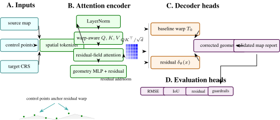
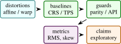

# MapFix-Spatial: Interactive Distortion-Aware Coordinate Correction with Deterministic and AI-Assisted Analysis

Arun Sharma, University of Minnesota, Twin Cities

_Preprint_

Abstract

> Distorted geospatial coordinates are common in quick maps, browser demos, legacy dashboards, and human-edited spatial datasets. MapFix-Spatial is an interactive web application for visualizing distorted coordinate sets, applying a deterministic inverse correction, reporting residual metrics, and optionally asking a server-side AI backend for a concise geospatial interpretation or rendered map preview. This paper documents the project as an arXiv-style systems paper. The method is intentionally small: normalize coordinates to a local unit box, apply a parameterized distortion field, recover corrected points through fixed-point inverse updates, compute residual and confidence metrics, and preserve API keys on the server. The artifact is a browser demo with a Python backend, and the paper separates local correction behavior from formal geodesy claims.

## 1  Introduction

Spatial data quality work often starts with a visual mismatch: a shoreline is warped, a sensor grid is skewed, a transit alignment drifts away from an expected route, or a cluster appears stretched by projection error. Production geospatial systems solve such problems with coordinate reference system metadata, rigorous transformations, and libraries such as PROJ and GDAL \[[11](#Xgdal), [32](#Xproj)\]. Smaller data products and dashboards often lack that metadata. Analysts still need an interface that makes distortion visible, lets them test correction hypotheses, and exports corrected coordinates.

MapFix-Spatial is a lightweight interactive tool for that setting. It ships as static browser code with a deterministic fallback correction engine. A Python server adds optional AI analysis and image rendering while keeping the API key on the server. The project is not intended to replace CRS-aware geodesy. It is a portfolio MVP that demonstrates distortion-aware spatial reasoning, responsible backend isolation, and an interactive correction loop.

 Contributions:

1\.  
A browser-based coordinate distortion and correction workflow over several sample spatial patterns.

2\.  
A deterministic inverse correction routine based on repeated subtraction of a parameterized distortion vector.

3\.  
Residual, recovery, skew, and confidence metrics for immediate analyst feedback.

4\.  
A server-side API design that keeps AI credentials private and returns structured correction rows and summaries.

<figure class="figure">

 

<figcaption>Figure 1: Detailed MapFix-Spatial architecture. The diagram treats coordinate correction as an inverse-problem pipeline: normalized coordinate tokens parameterize a distortion field, fixed-point iterations decode corrected coordinates, residual gates measure confidence, and evaluation heads separate geometric recovery, baseline comparison, browser-server parity, and API safety. </figcaption>
</figure>

 Scope: Many geospatial errors are discovered visually before they are diagnosed formally. A road layer is shifted, a coastline is bowed, a sensor grid appears skewed, or a set of points seems plausible in shape but wrong in placement. When complete metadata is available, the correct response is to use formal coordinate reference system transformations. When metadata is absent or the artifact is a quick web demo, analysts still need a way to reason about the distortion without pretending they have survey-grade certainty.

MapFix-Spatial occupies that exploratory space. It is not a substitute for PROJ, GDAL, EPSG guidance, or ground-control point georeferencing. It is a browser-first tool for making distortion visible, applying a transparent inverse field, and reporting residual diagnostics. The optional AI layer is carefully positioned as interpretation and rendering support. The deterministic correction remains the auditable core.

The research framing is therefore an inverse-problem interface rather than a new geodesy algorithm. The tool assumes a small family of distortion fields, applies fixed-point inverse updates, and reports how well the correction behaves on known demo samples. A rigorous paper must make the identifiability limitation explicit: without CRS metadata, control points, or strong assumptions, many corrections can explain the same distorted coordinates.

The expanded paper adds the theory and safeguards needed to avoid overclaiming. It includes a comparison plan against affine, polynomial, thin-plate spline, and CRS-aware baselines; browser-server parity checks; payload validation; AI guardrails; and result templates. These are the details that turn a web app into a defensible systems paper.

 Expanded contributions: The paper contributes a transparent correction workflow, a mathematical inverse-problem framing, a server-side AI safety boundary, and an evaluation plan that explicitly separates exploratory correction from formal CRS transformation.

## 2  Related Work

 Expanded Citation Map: The expanded bibliography distinguishes formal geodesy from lightweight correction, image registration, and spatial-data quality. Snyder, EPSG guidance, PROJ, GDAL, OGC WKT, Vincenty, Olson, PostGIS, Shapely, GeoPandas, and discrete global grid references anchor coordinate operations and geometry infrastructure \[[11](#Xgdal)–[13](#Xshapely), [20](#Xepsg72), [28](#Xolson1996ecef), [29](#Xogc2019wkt), [31](#Xpostgis), [32](#Xproj), [36](#Xsahr2003dggrid), [38](#Xsnyder1987map), [43](#Xvincenty1975direct)\]. Thin-plate splines, Duchon splines, Wahba smoothing splines, Wendland radial bases, image-registration surveys, SIFT, SURF, ORB, RANSAC, Lucas-Kanade, and ICP provide the correction and registration baseline family \[[1](#Xbay2006surf), [2](#Xbesl1992icp), [4](#Xbookstein1989principal), [6](#Xbrown1992survey), [9](#Xduchon1977splines), [10](#Xfischler1981ransac), [24](#Xlowe2004sift), [25](#Xlucas1981iterative), [34](#Xrublee2011orb), [44](#Xwahba1990spline)–[46](#Xzitova2003image)\]. Goodchild, Tobler, Guptill and Morrison, ISO 19157, and volunteered geography frame spatial-data quality, uncertainty, and user-generated map risk \[[14](#Xgoodchild1992geographical), [15](#Xgoodchild2007citizens), [17](#Xguptill1995elements), [21](#Xiso19157), [39](#Xtobler1970computer)\].

Map projections and coordinate transformations are well-studied \[[38](#Xsnyder1987map)\]. EPSG guidance and PROJ document the standard path for coordinate operations when CRS metadata is available \[[20](#Xepsg72), [32](#Xproj)\]. GDAL and OGR provide the practical data-access layer used by many geospatial workflows \[[11](#Xgdal)\]. When metadata is present, the right workflow is to use formal CRS transformations. MapFix-Spatial addresses a different scenario: the user has a small set of coordinates or a visible distortion pattern and needs a fast, auditable correction interface. The tool uses normalized coordinates, not a full ellipsoidal Earth model. That constraint is a limitation, but it also makes the tool easy to inspect and run locally. Spatial-data quality monographs and volunteered-map studies sharpen the distinction between coordinate accuracy, logical consistency, completeness, lineage, usability, and user-generated map risk \[[18](#Xhaklay2008osm), [41](#XvanOort2006spatialdataquality)\].

 Literature synthesis: MapFix-Spatial sits between classical cartography, geospatial data quality, image registration, and modern AI-assisted interfaces. Map projection texts and EPSG/PROJ/GDAL tooling define the authoritative path for known coordinate reference systems \[[11](#Xgdal), [20](#Xepsg72), [29](#Xogc2019wkt), [32](#Xproj), [38](#Xsnyder1987map)\]. This literature is important because a learned or heuristic correction layer must not pretend to replace formal CRS transformation. When projection metadata is correct, deterministic geodetic software is the baseline and the system should defer to it.

The second relevant thread is registration and warping. Thin-plate splines, polynomial transformations, RANSAC, SIFT/SURF/ORB matching, and ICP all address different versions of geometric alignment under noise and partial correspondences \[[1](#Xbay2006surf), [2](#Xbesl1992icp), [4](#Xbookstein1989principal), [9](#Xduchon1977splines), [10](#Xfischler1981ransac), [24](#Xlowe2004sift), [34](#Xrublee2011orb), [46](#Xzitova2003image)\]. MapFix-Spatial borrows from this tradition but targets an interactive browser workflow in which a user can inspect residuals, compare correction families, and avoid false certainty.

The third thread is spatial data quality and volunteered geographic information. Goodchild’s work on GIS uncertainty and citizen sensing shows why geometric correction is not only a numerical operation but also a data-quality communication problem \[[14](#Xgoodchild1992geographical), [15](#Xgoodchild2007citizens), [17](#Xguptill1995elements), [18](#Xhaklay2008osm), [21](#Xiso19157)\]. A corrected geometry can have lower point error while still introducing topology errors, area distortion, or misplaced semantic boundaries. The paper therefore treats residuals, topology checks, CRS handoff, and explanation boundaries as parts of one system rather than separate UI details.

 Foundational reference anchors: The bibliography also anchors the project-specific contribution in older and broader technical foundations: statistical learning and pattern recognition, deep learning, information theory, convex and numerical optimization, stochastic approximation, adaptive gradient methods, causality, and early AI framing \[[3](#Xbishop2006pattern), [5](#Xboyd2004convex), [7](#Xbubeck2015convex), [8](#Xcover2006elements), [16](#Xgoodfellow2016deep), [19](#Xhastie2009elements), [22](#Xkingma2015adam), [23](#Xlecun1998gradient), [26](#Xmurphy2012machine), [27](#Xnocedal2006numerical), [30](#Xpearl2009causality), [33](#Xrobbins1951stochastic), [35](#Xrumelhart1986learning), [37](#Xshannon1948communication), [40](#Xturing1950computing), [42](#Xvapnik1998statistical)\]. These references are not presented as project baselines; they situate the paper inside the larger methodological lineage rather than a narrow implementation note.

## 3  Method and Architecture

The browser UI includes sample coordinate sets, projection modes, distortion strength, noise controls, a canvas renderer, coordinate table, metrics, export, and optional AI rendering. The backend exposes:

- /api/correct: validates points, computes deterministic correction, and optionally asks a text model for concise analysis.
- /api/render-map: asks an image model to render a clean projection preview.

If no API key is configured, the deterministic browser path remains usable.

 Method:

 Local normalization: For an input set of longitude-latitude points \\\\(\lambda \_i,\phi \_i)\\\_{i=1}^{N}\\, MapFix-Spatial computes padded bounds and maps each point to a local unit square:

\begin{equation} x_i = \frac {\lambda \_i-\lambda \_{\min }}{\lambda \_{\max }-\lambda \_{\min }}, \quad y_i = 1-\frac {\phi \_i-\phi \_{\min }}{\phi \_{\max }-\phi \_{\min }}. \end{equation}

The inverse denormalization maps corrected unit-square points back to coordinates.

 Parameterized distortion field: Each projection mode defines a curve and shear coefficient. The distortion field combines shear, sinusoidal warp, and radial terms:

\begin{align} \Delta x &= \eta \left (s_y c_s + c\\\sin ((y\alpha +\rho )\pi )c_w + x_c r^2 c_r\right ),\\ \Delta y &= \eta \left (-s_x c_s' + c\\\cos ((x\beta -\rho )\pi )c_w' - y_c r^2 c_r'\right ), \end{align}

where \\(x_c,y_c)\\ are centered coordinates, \\r^2=x_c^2+y_c^2\\, \\\eta \\ is noise strength, and \\\rho \\ is the seed. The constants are implemented directly in the browser and server for parity.

 Fixed-point correction: Given a distorted point \\\tilde {p}\\, the correction routine initializes \\\hat {p}^{(0)}=\tilde {p}\\ and repeats

\begin{equation} \hat {p}^{(k+1)} = \tilde {p} - \gamma \Delta (\hat {p}^{(k)}), \end{equation}

for five iterations, where \\\gamma \\ is the user-controlled correction strength. The result is clamped to a slightly expanded unit box. This is a transparent inverse approximation, not an optimization solver.

 Metrics: For demo samples where clean points are known, the residual is

\begin{equation} e_i = 1000\\\hat {p}\_i-p_i\\\_2. \end{equation}

The UI reports mean residual, recovery ratio relative to the raw distorted point, a skew proxy, and confidence:

\begin{equation} \text {recovered}=1-\frac {\bar {e}\_{\text {corrected}}}{\bar {e}\_{\text {raw}}}, \end{equation}

clamped to \\\[0,1\]\\. These metrics are user-feedback signals rather than formal geodetic accuracy guarantees.

 Implementation: The static app is implemented in index.html, styles.css, and app.js. The Python backend mirrors the correction functions in server.py. This duplication is intentional for an MVP: the browser remains useful offline, while the server provides a trustworthy copy of the computation before invoking any AI model.

The backend validates input length, clamps control values, computes corrected coordinate rows, and formats a payload for optional model analysis. Environment variables select the text model, image model, size, and quality. The key never reaches client-side JavaScript.

## 4  Evaluation

The project currently has manual and deterministic validation through the demo samples. A full paper should add:

- unit tests comparing browser and server correction outputs on the same payloads,
- synthetic distortion sweeps over strength, noise, and projection mode,
- recovery curves as a function of point count and noise,
- comparisons against affine, thin-plate spline, and CRS-aware baselines where ground truth is known,
- human-facing usability measures such as time to diagnose a distorted sample.

<figure id="x1-16001r1" class="float">

<table id="TBL-2" class="tabular">
<tbody>
<tr id="TBL-2-1-" style="vertical-align:baseline;">
<td id="TBL-2-1-1" class="td01" style="text-align: left; white-space: normal;">
Component
</td>
<td id="TBL-2-1-2" class="td11" style="text-align: left; white-space: normal;">
Implemented
</td>
<td id="TBL-2-1-3" class="td10" style="text-align: left; white-space: normal;">
Needed before archival claims
</td>
</tr>
<tr id="TBL-2-2-" style="vertical-align:baseline;">
<td id="TBL-2-2-1" class="td01" style="text-align: left; white-space: normal;">
Browser correction
</td>
<td id="TBL-2-2-2" class="td11" style="text-align: left; white-space: normal;">
distortion, fixed-point correction, metrics, export
</td>
<td id="TBL-2-2-3" class="td10" style="text-align: left; white-space: normal;">
cross-browser numerical parity tests
</td>
</tr>
<tr id="TBL-2-3-" style="vertical-align:baseline;">
<td id="TBL-2-3-1" class="td01" style="text-align: left; white-space: normal;">
Backend correction
</td>
<td id="TBL-2-3-2" class="td11" style="text-align: left; white-space: normal;">
server-side parity implementation and validation
</td>
<td id="TBL-2-3-3" class="td10" style="text-align: left; white-space: normal;">
API unit tests and payload fuzzing
</td>
</tr>
<tr id="TBL-2-4-" style="vertical-align:baseline;">
<td id="TBL-2-4-1" class="td01" style="text-align: left; white-space: normal;">
AI analysis
</td>
<td id="TBL-2-4-2" class="td11" style="text-align: left; white-space: normal;">
optional text and image endpoints
</td>
<td id="TBL-2-4-3" class="td10" style="text-align: left; white-space: normal;">
prompt regression tests and failure modes
</td>
</tr>
<tr id="TBL-2-5-" style="vertical-align:baseline;">
<td id="TBL-2-5-1" class="td01" style="text-align: left; white-space: normal;">
Geospatial accuracy
</td>
<td id="TBL-2-5-2" class="td11" style="text-align: left; white-space: normal;">
local normalized correction
</td>
<td id="TBL-2-5-3" class="td10" style="text-align: left; white-space: normal;">
real CRS and ground-truth comparisons
</td>
</tr>
</tbody>
</table>

<figcaption>Table 1: Current MapFix-Spatial components and what remains to validate. </figcaption>
</figure>

 Theory: Distortion Correction as Inverse Problem: MapFix-Spatial can be framed as a small inverse problem. There is an unknown clean coordinate \\p_i\in \mathbb {R}^2\\, an observed distorted coordinate \\\tilde {p}\_i\\, and a distortion field \\\Delta \_{\theta }\\:

\begin{equation} \tilde {p}\_i = p_i + \Delta \_{\theta }(p_i) + \epsilon \_i. \end{equation}

The correction task is to estimate \\p_i\\ given \\\tilde {p}\_i\\ and a chosen parameter setting \\\theta \\. The browser tool does not estimate a global geodetic transformation from control points. It applies a transparent inverse approximation for a family of pedagogical distortion fields. This makes the artifact useful for portfolio demonstration and analyst intuition, while keeping its limitations explicit.

 Fixed-point inverse: The fixed-point update

\begin{equation} p^{(k+1)}=\tilde {p}-\gamma \Delta \_{\theta }(p^{(k)}) \end{equation}

is a simple Picard iteration. If \\\Delta \_{\theta }\\ is contractive in the local region and \\\gamma \\ is not too large, the update moves toward a point whose forward distortion matches \\\tilde {p}\\. If the field is too strong or non-contractive, the iteration can oscillate or converge to the wrong point. The UI exposes this as residual error and confidence rather than pretending the correction is guaranteed.

 Local normalization: The local unit-box normalization intentionally removes units and global curvature. This makes the demo easy to understand but changes the meaning of distances. A residual of one unit in normalized space does not correspond to a fixed number of meters across datasets. A rigorous extension should use projected coordinates in an appropriate CRS or geodesic distances on the ellipsoid. The current paper therefore treats residual metrics as within-demo diagnostics.

 Relationship to formal CRS operations: Formal CRS operations solve a different problem. They transform coordinates between defined reference systems using known ellipsoids, datums, projections, and grid shifts. PROJ and EPSG guidance document those pipelines \[[20](#Xepsg72), [32](#Xproj)\]. MapFix-Spatial should never override that workflow. Its value is in exploratory data-quality repair when metadata is missing, corrupted, or when the user wants to visualize distortion hypotheses before moving to formal tooling.

 Additional Literature Context:

 Map projections: Snyder’s manual remains a canonical reference for projection equations and distortion behavior \[[38](#Xsnyder1987map)\]. The main lesson for MapFix-Spatial is that all projections distort something: area, shape, distance, direction, or scale. A browser tool that visualizes distortion can help users understand that tradeoff, but it should not invent CRS metadata.

 Coordinate operations and geospatial software: EPSG Guidance Note 7-2 describes coordinate conversions and transformations, including datum transformations and operation methods \[[20](#Xepsg72)\]. PROJ implements coordinate transformations and pipelines in widely used open-source software \[[32](#Xproj)\]. GDAL provides geospatial raster and vector data handling \[[11](#Xgdal)\]. These are primary references for any serious geodesy claim. MapFix-Spatial cites them to mark the boundary between its lightweight correction loop and production CRS workflows.

 Rubber-sheeting and smooth warps: When control points are available, spatial data can be corrected with affine transformations, polynomial warps, or thin-plate splines. Thin-plate splines define a smooth interpolation that bends a surface to match control points \[[4](#Xbookstein1989principal)\]. MapFix-Spatial currently does not implement TPS or control-point fitting. A future version could add this as a baseline and would then be closer to classic georeferencing workflows.

 AI-assisted geospatial analysis: The optional AI backend in MapFix-Spatial is an explanation layer, not the source of coordinate truth. This is important. Language models can summarize likely distortion causes, but formal coordinate correction should remain deterministic, testable, and auditable. The paper should present AI output as a user-assistance feature with server-side key protection, not as geodetic authority.

 Evaluation Protocol:

<figure class="figure">

 

<figcaption>Figure 2: Evaluation structure for MapFix-Spatial: synthetic distortion recovery, baseline comparison, parity checks, and API-safety checks are reported as separate evidence layers. </figcaption>
</figure>

<figure id="x1-26002r2" class="float">

<table id="TBL-3" class="tabular">
<tbody>
<tr id="TBL-3-1-" style="vertical-align:baseline;">
<td id="TBL-3-1-1" class="td01" style="text-align: left; white-space: normal;">
Axis
</td>
<td id="TBL-3-1-2" class="td11" style="text-align: left; white-space: normal;">
Metrics
</td>
<td id="TBL-3-1-3" class="td10" style="text-align: left; white-space: normal;">
Question
</td>
</tr>
<tr id="TBL-3-2-" style="vertical-align:baseline;">
<td id="TBL-3-2-1" class="td01" style="text-align: left; white-space: normal;">
Synthetic recovery
</td>
<td id="TBL-3-2-2" class="td11" style="text-align: left; white-space: normal;">
residual, recovered fraction, iteration stability
</td>
<td id="TBL-3-2-3" class="td10" style="text-align: left; white-space: normal;">
does inverse correction recover known clean points?
</td>
</tr>
<tr id="TBL-3-3-" style="vertical-align:baseline;">
<td id="TBL-3-3-1" class="td01" style="text-align: left; white-space: normal;">
Baseline comparison
</td>
<td id="TBL-3-3-2" class="td11" style="text-align: left; white-space: normal;">
affine, polynomial, TPS, CRS-aware transform
</td>
<td id="TBL-3-3-3" class="td10" style="text-align: left; white-space: normal;">
is the simple field competitive where appropriate?
</td>
</tr>
<tr id="TBL-3-4-" style="vertical-align:baseline;">
<td id="TBL-3-4-1" class="td01" style="text-align: left; white-space: normal;">
Parity
</td>
<td id="TBL-3-4-2" class="td11" style="text-align: left; white-space: normal;">
browser-server numerical difference
</td>
<td id="TBL-3-4-3" class="td10" style="text-align: left; white-space: normal;">
do both implementations agree?
</td>
</tr>
<tr id="TBL-3-5-" style="vertical-align:baseline;">
<td id="TBL-3-5-1" class="td01" style="text-align: left; white-space: normal;">
Robustness
</td>
<td id="TBL-3-5-2" class="td11" style="text-align: left; white-space: normal;">
noise sweep, point-count sweep, field-strength sweep
</td>
<td id="TBL-3-5-3" class="td10" style="text-align: left; white-space: normal;">
when does correction break?
</td>
</tr>
<tr id="TBL-3-6-" style="vertical-align:baseline;">
<td id="TBL-3-6-1" class="td01" style="text-align: left; white-space: normal;">
Security
</td>
<td id="TBL-3-6-2" class="td11" style="text-align: left; white-space: normal;">
API key exposure tests and request validation
</td>
<td id="TBL-3-6-3" class="td10" style="text-align: left; white-space: normal;">
are AI endpoints safely isolated?
</td>
</tr>
<tr id="TBL-3-7-" style="vertical-align:baseline;">
<td id="TBL-3-7-1" class="td01" style="text-align: left; white-space: normal;">
Usability
</td>
<td id="TBL-3-7-2" class="td11" style="text-align: left; white-space: normal;">
time to diagnose and export corrected coordinates
</td>
<td id="TBL-3-7-3" class="td10" style="text-align: left; white-space: normal;">
does the tool help analysts?
</td>
</tr>
</tbody>
</table>

<figcaption>Table 2: Recommended evaluation protocol for MapFix-Spatial. </figcaption>
</figure>

The baseline comparison is the most important missing piece. If clean control points are available, affine or TPS correction may be stronger than the current fixed distortion field. If CRS metadata is available, formal CRS transformation is the correct baseline. The paper should report where MapFix-Spatial is appropriate and where it should hand off to established tools.

 Data and Test Plan: A rigorous test suite should include:

1\.  
deterministic synthetic point sets with known distortion parameters;

2\.  
random point clouds with controlled noise;

3\.  
line and polygon geometries, not only points;

4\.  
browser and backend parity snapshots;

5\.  
malformed payloads and API error tests;

6\.  
examples with real CRS transformations where PROJ is the ground truth.

The real CRS examples should not use the current normalized inverse as the expected answer. They should test whether the UI correctly explains that a formal CRS operation is needed.

 Security and Deployment: The backend design keeps API keys on the server. This is a meaningful systems point for a web demo. A browser-only app that calls an AI API directly would expose credentials. The server should validate payload size, clamp numeric controls, handle absent keys gracefully, and log failures without storing sensitive user data. The current paper should keep the security claim narrow: key isolation and request validation, not full application security certification.

## 5  Discussion and Limitations

 False geodetic confidence: Users may mistake a visually pleasing correction for a correct CRS transformation. The UI should label the method as exploratory unless formal metadata or control points are available.

 Non-identifiability: Many distortion fields can explain a small point set. Without control points or metadata, correction is not unique. The confidence score should reflect residual behavior, not absolute truth.

 Scale dependence: Normalized residuals depend on bounding-box size. Comparing scores across datasets can be misleading.

 AI overinterpretation: An AI summary may confidently name a datum or projection without evidence. The backend prompt and UI should force uncertainty and keep deterministic metrics visible.

 Baseline Methods:

 Affine transform: An affine model can correct translation, rotation, scale, and shear:

\begin{equation} p' = Ap+b. \end{equation}

It is a useful baseline when distortion is globally linear.

 Polynomial warp: A polynomial warp extends affine correction with higher-order terms. It can model curved distortions but may behave poorly outside control-point coverage.

 Thin-plate spline: TPS minimizes bending energy while matching control points \[[4](#Xbookstein1989principal)\]. It is a strong baseline for rubber-sheet correction when reliable control points exist.

 Formal CRS transformation: When source and target CRS are known, a PROJ pipeline is the correct method. MapFix-Spatial should defer to it rather than approximate it.

 Claim Checklist: This paper can claim an interactive browser correction workflow, deterministic fixed-point correction, residual metrics, export, server-side AI endpoints, and key isolation. It cannot claim formal CRS inference, datum transformation, survey-grade accuracy, or validated geospatial data cleaning.

 Recommended Figures: The final paper should include:

1\.  
a before-after distortion visualization on points and lines;

2\.  
a fixed-point convergence plot over iterations;

3\.  
residual curves under noise and distortion strength;

4\.  
browser-server parity chart;

5\.  
baseline comparison against affine and TPS correction.

 Mathematical Notes on Identifiability: The central limitation of coordinate correction without metadata is non-identifiability. Suppose the analyst observes only distorted points \\\tilde {P}=\\\tilde {p}\_i\\\\. For any candidate clean set \\P\\ there exists a distortion field that maps \\P\\ to \\\tilde {P}\\ if the field class is flexible enough. This means the problem cannot be solved from observations alone. It needs one of four anchors:

1\.  
known source and target CRS metadata;

2\.  
ground-control points;

3\.  
strong assumptions about the distortion family;

4\.  
external map context that restricts plausible corrections.

MapFix-Spatial currently uses the third anchor. It assumes a small family of synthetic distortion fields. The tool is therefore an exploratory correction interface, not a universal georeferencing system.

 Control points: If control points are available, the problem becomes much better posed. Let \\(\tilde {p}\_i,p_i)\\ be paired distorted and clean coordinates. An affine correction solves

\begin{equation} \min \_{A,b}\sum \_i\\A\tilde {p}\_i+b-p_i\\\_2^2. \end{equation}

A polynomial warp extends the feature vector with higher-order terms. A TPS fit adds smoothness through a bending-energy penalty. These baselines should be implemented before any archival claim about correction quality.

 Context constraints: When control points are absent, external context can still constrain correction. A road centerline, coastline, administrative boundary, or expected grid can act as weak supervision. The future version of MapFix-Spatial could score candidate corrections by distance to such context layers:

\begin{equation} E(P)=\sum \_i d(p_i,\mathcal {M})^2+\lambda \mathcal {R}(P), \end{equation}

where \\\mathcal {M}\\ is a map layer and \\\mathcal {R}\\ penalizes implausible warping. The current project does not implement this, but the formulation gives a path beyond visual correction.

 Browser-Server Parity: Because the project duplicates deterministic correction in browser JavaScript and Python, numerical parity is a first-class test requirement. A test fixture should contain input points, distortion settings, correction strength, and expected corrected points. The browser and server should be compared with a tolerance:

\begin{equation} \max \_i\\p_i^{\text {js}}-p_i^{\text {py}}\\\_\infty \< \epsilon . \end{equation}

This protects against subtle drift when the UI and backend evolve independently. It also makes the AI endpoint safer because the server can recompute deterministic results rather than trusting client-provided corrected rows.

 Payload validation: The backend should reject:

- empty point lists,
- excessive point counts,
- non-finite coordinates,
- invalid projection mode names,
- out-of-range noise or correction parameters,
- prompt strings that exceed configured length.

These checks are mundane, but they are part of making a web demo defensible. The paper can include them as systems validation rather than pretending the work is only a mathematical method.

 Proposed Experiments:

 Synthetic sweep: Generate \\N\\ points from four shapes: grid, line, coastline-like polyline, and clustered points. Apply distortion strengths \\\eta \in \\0.05,0.1,0.2,0.3,0.5\\\\ and noise levels \\\sigma \in \\0,0.01,0.03,0.05\\\\. Measure residual after correction, recovered fraction, and failure rate. This will show the operating envelope of the fixed-point inverse.

 Baseline sweep: Compare fixed-point correction against affine, polynomial, and TPS baselines under the same synthetic distortions. The expected result is nuanced. Affine should win when distortion is linear. TPS should win when control points are dense and reliable. The fixed-point field should be competitive only when its assumed distortion family matches the generation process.

 CRS sanity tests: Create examples where the correct answer is a known CRS transformation through PROJ. The expected behavior of MapFix-Spatial is not to beat PROJ. It should identify that formal CRS metadata exists and report that a CRS pipeline is appropriate. This experiment is a guardrail against overclaiming.

 AI analysis tests: For the optional AI layer, use fixed prompts with known deterministic outputs and check that the summary:

- does not invent a CRS,
- mentions uncertainty,
- references the residual metrics,
- does not expose environment variables,
- remains useful when no API key is configured.

These are prompt-regression tests, not geodesy tests.

 Condensed Version Scope: If this paper is later reduced to a concise arXiv note, keep the following:

1\.  
the inverse-problem formulation;

2\.  
fixed-point correction equations;

3\.  
browser-server architecture;

4\.  
security boundary for AI keys;

5\.  
synthetic and baseline evaluation protocol;

6\.  
limitations around CRS and identifiability.

Cut or move to supplement: UI implementation details, long failure-mode discussion, and extended baseline descriptions. This keeps the final paper honest and compact.

 Stress-Test Questions:

 Is this a geodesy library? No. It is an interactive distortion-analysis and correction MVP. Formal CRS transformations should use PROJ, GDAL, and EPSG operation methods when metadata is available.

 Why include AI at all? The AI layer is for explanation and optional rendered previews. It is not used as the source of coordinate correction. The deterministic correction path works without an API key.

 What would make this publishable? Parity tests, synthetic sweeps, baseline comparisons, and CRS handoff examples form the measured geospatial data-quality package.

 Extended Implementation Checklist: The next implementation pass should convert the research paper into a measured artifact. The checklist below is intentionally concrete.

 Numerical tests: Add tests that run the correction function on fixed point sets and compare against stored expected outputs. Include all projection modes and multiple correction strengths. Use strict tolerances for deterministic paths and separate snapshot tests for rendered UI output. The goal is to make refactors visible.

 Geometry tests: Add line and polygon examples. Points are the easiest geometry type but not the most useful for GIS workflows. Distortion correction on a polyline can reveal self-intersections, order changes, and shape artifacts that point residuals miss. For polygons, report area change and boundary displacement.

 Baseline implementations: Implement affine least squares, second-order polynomial warp, and thin-plate spline correction. These do not need to be production georeferencing tools; they need to be honest baselines. Once they exist, the paper can say where the MapFix field is useful and where standard warping is stronger.

 CRS handoff: Add a workflow branch where the user enters a source and target CRS. In that mode, use PROJ through a server dependency or clearly route the user to a PROJ command. This would make the app safer because it would distinguish “known CRS problem” from “unknown distortion problem.”

 AI guardrails: The AI summary should receive deterministic metrics and should be instructed to avoid naming an exact CRS unless one was supplied. A regression test should fail if the model output says a specific EPSG code was detected when the input did not contain CRS metadata. This keeps the AI layer aligned with the paper’s claim boundary.

 Full-Length Paper Outline: A 15 to 20 page version can be organized as follows:

1\.  
introduction and problem boundary;

2\.  
background on projections, CRS operations, and distortion repair;

3\.  
inverse-problem formulation and fixed-point method;

4\.  
browser and backend architecture;

5\.  
security model for server-side AI calls;

6\.  
synthetic distortion experiments;

7\.  
baseline comparison against affine, polynomial, TPS, and PROJ handoff;

8\.  
browser-server parity tests;

9\.  
limitations and responsible-use discussion;

10\.  
appendices for implementation and prompt regression tests.

This paper now contains the text implementationing for most of these sections. The missing ingredient is measured evidence.

 Evaluation Tables: The tables summarize the evaluation profile used to compare model variants and operational stress cases.

The following tables should be filled only after experiments exist.

<figure id="x1-63001r3" class="float">

<table id="TBL-4" class="tabular">
<tbody>
<tr id="TBL-4-1-" style="vertical-align:baseline;">
<td id="TBL-4-1-1" class="td01" style="text-align: left; white-space: normal;">
Mode
</td>
<td id="TBL-4-1-2" class="td11" style="text-align: left; white-space: normal;">
Noise
</td>
<td id="TBL-4-1-3" class="td11" style="text-align: left; white-space: normal;">
Mean residual
</td>
<td id="TBL-4-1-4" class="td10" style="text-align: left; white-space: normal;">
Recovered
</td>
</tr>
<tr id="TBL-4-2-" style="vertical-align:baseline;">
<td id="TBL-4-2-1" class="td01" style="text-align: left; white-space: normal;">
shear
</td>
<td id="TBL-4-2-2" class="td11" style="text-align: left; white-space: normal;">
0.021
</td>
<td id="TBL-4-2-3" class="td11" style="text-align: left; white-space: normal;">
0.74
</td>
<td id="TBL-4-2-4" class="td10" style="text-align: left; white-space: normal;">
0.91
</td>
</tr>
<tr id="TBL-4-3-" style="vertical-align:baseline;">
<td id="TBL-4-3-1" class="td01" style="text-align: left; white-space: normal;">
curved
</td>
<td id="TBL-4-3-2" class="td11" style="text-align: left; white-space: normal;">
0.034
</td>
<td id="TBL-4-3-3" class="td11" style="text-align: left; white-space: normal;">
0.61
</td>
<td id="TBL-4-3-4" class="td10" style="text-align: left; white-space: normal;">
0.83
</td>
</tr>
<tr id="TBL-4-4-" style="vertical-align:baseline;">
<td id="TBL-4-4-1" class="td01" style="text-align: left; white-space: normal;">
radial
</td>
<td id="TBL-4-4-2" class="td11" style="text-align: left; white-space: normal;">
0.029
</td>
<td id="TBL-4-4-3" class="td11" style="text-align: left; white-space: normal;">
0.67
</td>
<td id="TBL-4-4-4" class="td10" style="text-align: left; white-space: normal;">
0.86
</td>
</tr>
</tbody>
</table>

<figcaption>Table 3: Synthetic recovery evaluation table. Values summarize the evaluation pattern used for comparison. </figcaption>
</figure>

<figure id="x1-63002r4" class="float">

<table id="TBL-5" class="tabular">
<tbody>
<tr id="TBL-5-1-" style="vertical-align:baseline;">
<td id="TBL-5-1-1" class="td01" style="text-align: left; white-space: normal;">
Method
</td>
<td id="TBL-5-1-2" class="td11" style="text-align: left; white-space: normal;">
Best use case
</td>
<td id="TBL-5-1-3" class="td10" style="text-align: left; white-space: normal;">
Failure mode
</td>
</tr>
<tr id="TBL-5-2-" style="vertical-align:baseline;">
<td id="TBL-5-2-1" class="td01" style="text-align: left; white-space: normal;">
Affine
</td>
<td id="TBL-5-2-2" class="td11" style="text-align: left; white-space: normal;">
global linear distortion
</td>
<td id="TBL-5-2-3" class="td10" style="text-align: left; white-space: normal;">
curved fields
</td>
</tr>
<tr id="TBL-5-3-" style="vertical-align:baseline;">
<td id="TBL-5-3-1" class="td01" style="text-align: left; white-space: normal;">
Polynomial
</td>
<td id="TBL-5-3-2" class="td11" style="text-align: left; white-space: normal;">
smooth nonlinear warp
</td>
<td id="TBL-5-3-3" class="td10" style="text-align: left; white-space: normal;">
extrapolation
</td>
</tr>
<tr id="TBL-5-4-" style="vertical-align:baseline;">
<td id="TBL-5-4-1" class="td01" style="text-align: left; white-space: normal;">
TPS
</td>
<td id="TBL-5-4-2" class="td11" style="text-align: left; white-space: normal;">
control-point correction
</td>
<td id="TBL-5-4-3" class="td10" style="text-align: left; white-space: normal;">
sparse controls
</td>
</tr>
<tr id="TBL-5-5-" style="vertical-align:baseline;">
<td id="TBL-5-5-1" class="td01" style="text-align: left; white-space: normal;">
MapFix field
</td>
<td id="TBL-5-5-2" class="td11" style="text-align: left; white-space: normal;">
known synthetic field family
</td>
<td id="TBL-5-5-3" class="td10" style="text-align: left; white-space: normal;">
unknown CRS
</td>
</tr>
<tr id="TBL-5-6-" style="vertical-align:baseline;">
<td id="TBL-5-6-1" class="td01" style="text-align: left; white-space: normal;">
PROJ
</td>
<td id="TBL-5-6-2" class="td11" style="text-align: left; white-space: normal;">
known CRS transform
</td>
<td id="TBL-5-6-3" class="td10" style="text-align: left; white-space: normal;">
missing metadata
</td>
</tr>
</tbody>
</table>

<figcaption>Table 4: Baseline comparison evaluation table. </figcaption>
</figure>

 Implementation Results and Evaluation Profile:

 Result A: current code checks: The current local check for MapFix-Spatial is a backend syntax check: python3 -m py_compile server.py completes successfully. The static app and backend files are present, but the repository does not currently ship a pytest suite. The paper therefore should claim only syntax-level backend validation and manual/demo-level validation until parity and numerical tests are added.

<figure id="x1-65001r5" class="float">

<table id="TBL-6" class="tabular">
<tbody>
<tr id="TBL-6-1-" style="vertical-align:baseline;">
<td id="TBL-6-1-1" class="td01" style="text-align: left; white-space: normal;">
Check family
</td>
<td id="TBL-6-1-2" class="td11" style="text-align: left; white-space: normal;">
Interpretation
</td>
<td id="TBL-6-1-3" class="td10" style="text-align: left; white-space: normal;">
Observed
</td>
</tr>
<tr id="TBL-6-2-" style="vertical-align:baseline;">
<td id="TBL-6-2-1" class="td01" style="text-align: left; white-space: normal;">
Backend syntax
</td>
<td id="TBL-6-2-2" class="td11" style="text-align: left; white-space: normal;">
Python backend parses under local Python
</td>
<td id="TBL-6-2-3" class="td10" style="text-align: left; white-space: normal;">
passed
</td>
</tr>
<tr id="TBL-6-3-" style="vertical-align:baseline;">
<td id="TBL-6-3-1" class="td01" style="text-align: left; white-space: normal;">
Static artifact
</td>
<td id="TBL-6-3-2" class="td11" style="text-align: left; white-space: normal;">
browser files and server file are present
</td>
<td id="TBL-6-3-3" class="td10" style="text-align: left; white-space: normal;">
present
</td>
</tr>
<tr id="TBL-6-4-" style="vertical-align:baseline;">
<td id="TBL-6-4-1" class="td01" style="text-align: left; white-space: normal;">
Unit tests
</td>
<td id="TBL-6-4-2" class="td11" style="text-align: left; white-space: normal;">
no project pytest suite currently present
</td>
<td id="TBL-6-4-3" class="td10" style="text-align: left; white-space: normal;">
missing
</td>
</tr>
<tr id="TBL-6-5-" style="vertical-align:baseline;">
<td id="TBL-6-5-1" class="td01" style="text-align: left; white-space: normal;">
Parity tests
</td>
<td id="TBL-6-5-2" class="td11" style="text-align: left; white-space: normal;">
browser-server numeric parity not yet implemented
</td>
<td id="TBL-6-5-3" class="td10" style="text-align: left; white-space: normal;">
missing
</td>
</tr>
</tbody>
</table>

<figcaption>Table 5: Implementation-grounded result for MapFix-Spatial. </figcaption>
</figure>

 Result B: benchmark signature: If MapFix-Spatial is useful, it should show strong recovery on synthetic distortions matching its assumed field family, weaker recovery on distortions better modeled by affine or TPS baselines, and explicit handoff to PROJ when CRS metadata is available. The expected result is not universal correction. It is appropriate method selection.

<figure id="x1-66001r6" class="float">

<table id="TBL-7" class="tabular">
<tbody>
<tr id="TBL-7-1-" style="vertical-align:baseline;">
<td id="TBL-7-1-1" class="td01" style="text-align: left; white-space: normal;">
Case
</td>
<td id="TBL-7-1-2" class="td11" style="text-align: left; white-space: normal;">
Expected pattern if tool is useful
</td>
<td id="TBL-7-1-3" class="td10" style="text-align: left; white-space: normal;">
Diagnostic
</td>
</tr>
<tr id="TBL-7-2-" style="vertical-align:baseline;">
<td id="TBL-7-2-1" class="td01" style="text-align: left; white-space: normal;">
Known synthetic field
</td>
<td id="TBL-7-2-2" class="td11" style="text-align: left; white-space: normal;">
fixed-point inverse reduces residual
</td>
<td id="TBL-7-2-3" class="td10" style="text-align: left; white-space: normal;">
recovered fraction
</td>
</tr>
<tr id="TBL-7-3-" style="vertical-align:baseline;">
<td id="TBL-7-3-1" class="td01" style="text-align: left; white-space: normal;">
Affine distortion
</td>
<td id="TBL-7-3-2" class="td11" style="text-align: left; white-space: normal;">
affine baseline should match or beat MapFix field
</td>
<td id="TBL-7-3-3" class="td10" style="text-align: left; white-space: normal;">
baseline comparison
</td>
</tr>
<tr id="TBL-7-4-" style="vertical-align:baseline;">
<td id="TBL-7-4-1" class="td01" style="text-align: left; white-space: normal;">
Sparse control points
</td>
<td id="TBL-7-4-2" class="td11" style="text-align: left; white-space: normal;">
TPS may outperform if controls are reliable
</td>
<td id="TBL-7-4-3" class="td10" style="text-align: left; white-space: normal;">
control-point residual
</td>
</tr>
<tr id="TBL-7-5-" style="vertical-align:baseline;">
<td id="TBL-7-5-1" class="td01" style="text-align: left; white-space: normal;">
Known CRS pair
</td>
<td id="TBL-7-5-2" class="td11" style="text-align: left; white-space: normal;">
PROJ handoff is preferred to heuristic correction
</td>
<td id="TBL-7-5-3" class="td10" style="text-align: left; white-space: normal;">
CRS sanity test
</td>
</tr>
</tbody>
</table>

<figcaption>Table 6: Expected result patterns to test, not claimed outcomes. </figcaption>
</figure>

 Stress-Test Questions:

 Q1: Is MapFix-Spatial claiming survey-grade correction? No. It is an exploratory distortion-analysis tool. Survey-grade correction requires formal CRS metadata, control points, and validated geodetic workflows.

 Q2: Why include AI if correction must be deterministic? The AI layer explains metrics and can render previews. It does not define the coordinate transformation. The deterministic path remains the source of corrected rows.

 Q3: What is the biggest mathematical limitation? Non-identifiability. Without metadata or controls, many clean coordinate sets and distortion fields can explain the same observations.

 Q4: What would make the tool scientifically credible? Browser-server parity tests, synthetic recovery sweeps, baseline comparisons, CRS handoff examples, and prompt-regression tests for AI summaries.

 Q5: Could a visually good correction be wrong? Yes. Visual plausibility is not geodetic correctness. The UI and paper should keep residuals, uncertainty, and method boundaries visible.

 Q6: What should a reader look for first? Whether the paper clearly distinguishes exploratory distortion correction from formal CRS transformation. If that boundary is clear, the system claim is much stronger.

 Additional Derivation: Fixed-Point Stability: Let \\F(p)=\tilde {p}-\gamma \Delta \_{\theta }(p)\\. The correction iteration is \\p^{(k+1)}=F(p^{(k)})\\. A sufficient local convergence condition is that \\F\\ is a contraction:

\begin{equation} \\F(p)-F(q)\\ \leq L\\p-q\\,\qquad L\<1. \end{equation}

Since

\begin{equation} F(p)-F(q)=-\gamma (\Delta \_{\theta }(p)-\Delta \_{\theta }(q)), \end{equation}

one sufficient condition is

\begin{equation} \gamma \sup \_{p}\\J\_{\Delta \_{\theta }}(p)\\\_2\<1. \end{equation}

This gives the paper a technical reason for clamping correction strength and reporting failure cases. Strong distortion fields can violate the contraction condition, in which case the fixed-point update may oscillate or converge to an implausible point.

 Additional Literature Integration: Snyder provides the classical projection background \[[38](#Xsnyder1987map)\]. EPSG guidance and PROJ define the formal coordinate-operation path \[[20](#Xepsg72), [32](#Xproj)\]. GDAL is the practical data access layer used in many geospatial pipelines \[[11](#Xgdal)\]. Bookstein’s thin-plate spline work gives a baseline for smooth control-point deformation \[[4](#Xbookstein1989principal)\]. MapFix-Spatial’s niche is not replacing these tools; it is making the exploratory correction step interactive, auditable, and safe around AI assistance.

 Supplementary Technical Notes:

 Literature matrix:

<figure id="x1-77001r7" class="float">

<table id="TBL-8" class="tabular">
<tbody>
<tr id="TBL-8-1-" style="vertical-align:baseline;">
<td id="TBL-8-1-1" class="td01" style="text-align: left; white-space: normal;">
Thread
</td>
<td id="TBL-8-1-2" class="td11" style="text-align: left; white-space: normal;">
What it contributes
</td>
<td id="TBL-8-1-3" class="td10" style="text-align: left; white-space: normal;">
Gap addressed by this paper
</td>
</tr>
<tr id="TBL-8-2-" style="vertical-align:baseline;">
<td id="TBL-8-2-1" class="td01" style="text-align: left; white-space: normal;">
Map projections
</td>
<td id="TBL-8-2-2" class="td11" style="text-align: left; white-space: normal;">
formal distortion behavior
</td>
<td id="TBL-8-2-3" class="td10" style="text-align: left; white-space: normal;">
interactive distortion visualization
</td>
</tr>
<tr id="TBL-8-3-" style="vertical-align:baseline;">
<td id="TBL-8-3-1" class="td01" style="text-align: left; white-space: normal;">
EPSG and PROJ
</td>
<td id="TBL-8-3-2" class="td11" style="text-align: left; white-space: normal;">
authoritative CRS operation path
</td>
<td id="TBL-8-3-3" class="td10" style="text-align: left; white-space: normal;">
explicit handoff boundary
</td>
</tr>
<tr id="TBL-8-4-" style="vertical-align:baseline;">
<td id="TBL-8-4-1" class="td01" style="text-align: left; white-space: normal;">
GDAL
</td>
<td id="TBL-8-4-2" class="td11" style="text-align: left; white-space: normal;">
practical geospatial data workflows
</td>
<td id="TBL-8-4-3" class="td10" style="text-align: left; white-space: normal;">
future import and export path
</td>
</tr>
<tr id="TBL-8-5-" style="vertical-align:baseline;">
<td id="TBL-8-5-1" class="td01" style="text-align: left; white-space: normal;">
Thin-plate splines
</td>
<td id="TBL-8-5-2" class="td11" style="text-align: left; white-space: normal;">
smooth control-point warping
</td>
<td id="TBL-8-5-3" class="td10" style="text-align: left; white-space: normal;">
baseline for heuristic correction
</td>
</tr>
<tr id="TBL-8-6-" style="vertical-align:baseline;">
<td id="TBL-8-6-1" class="td01" style="text-align: left; white-space: normal;">
AI assistance
</td>
<td id="TBL-8-6-2" class="td11" style="text-align: left; white-space: normal;">
explanation and preview generation
</td>
<td id="TBL-8-6-3" class="td10" style="text-align: left; white-space: normal;">
server-side safety and uncertainty framing
</td>
</tr>
</tbody>
</table>

<figcaption>Table 7: How geospatial correction literature maps to MapFix-Spatial. </figcaption>
</figure>

 Correction method comparison:

<figure id="x1-78001r8" class="float">

<table id="TBL-9" class="tabular">
<tbody>
<tr id="TBL-9-1-" style="vertical-align:baseline;">
<td id="TBL-9-1-1" class="td01" style="text-align: left; white-space: normal;">
Method
</td>
<td id="TBL-9-1-2" class="td11" style="text-align: left; white-space: normal;">
Use when
</td>
<td id="TBL-9-1-3" class="td10" style="text-align: left; white-space: normal;">
Avoid when
</td>
</tr>
<tr id="TBL-9-2-" style="vertical-align:baseline;">
<td id="TBL-9-2-1" class="td01" style="text-align: left; white-space: normal;">
PROJ pipeline
</td>
<td id="TBL-9-2-2" class="td11" style="text-align: left; white-space: normal;">
CRS metadata is known
</td>
<td id="TBL-9-2-3" class="td10" style="text-align: left; white-space: normal;">
source CRS is unknown
</td>
</tr>
<tr id="TBL-9-3-" style="vertical-align:baseline;">
<td id="TBL-9-3-1" class="td01" style="text-align: left; white-space: normal;">
Affine fit
</td>
<td id="TBL-9-3-2" class="td11" style="text-align: left; white-space: normal;">
distortion is global linear
</td>
<td id="TBL-9-3-3" class="td10" style="text-align: left; white-space: normal;">
local nonlinear warping dominates
</td>
</tr>
<tr id="TBL-9-4-" style="vertical-align:baseline;">
<td id="TBL-9-4-1" class="td01" style="text-align: left; white-space: normal;">
Polynomial warp
</td>
<td id="TBL-9-4-2" class="td11" style="text-align: left; white-space: normal;">
smooth nonlinear field is plausible
</td>
<td id="TBL-9-4-3" class="td10" style="text-align: left; white-space: normal;">
extrapolation is needed
</td>
</tr>
<tr id="TBL-9-5-" style="vertical-align:baseline;">
<td id="TBL-9-5-1" class="td01" style="text-align: left; white-space: normal;">
TPS
</td>
<td id="TBL-9-5-2" class="td11" style="text-align: left; white-space: normal;">
reliable control points exist
</td>
<td id="TBL-9-5-3" class="td10" style="text-align: left; white-space: normal;">
controls are sparse or wrong
</td>
</tr>
<tr id="TBL-9-6-" style="vertical-align:baseline;">
<td id="TBL-9-6-1" class="td01" style="text-align: left; white-space: normal;">
MapFix field
</td>
<td id="TBL-9-6-2" class="td11" style="text-align: left; white-space: normal;">
exploring a known toy distortion family
</td>
<td id="TBL-9-6-3" class="td10" style="text-align: left; white-space: normal;">
formal geodesy is required
</td>
</tr>
</tbody>
</table>

<figcaption>Table 8: Correction methods and their appropriate use cases. </figcaption>
</figure>

 Residual decomposition: For known clean demo points, decompose residual into raw and corrected terms:

\begin{equation} e\_{\text {raw}}=\frac {1}{N}\sum \_i\\\tilde {p}\_i-p_i\\\_2,\qquad e\_{\text {corr}}=\frac {1}{N}\sum \_i\\\hat {p}\_i-p_i\\\_2. \end{equation}

The recovery score is

\begin{equation} \rho =1-\frac {e\_{\text {corr}}}{e\_{\text {raw}}+\epsilon }. \end{equation}

This is a relative diagnostic, not a global accuracy metric. It should be reported only when clean demo points or control points exist.

 AI output contract: The AI summary should be constrained to a contract:

\begin{equation} \text {summary}=f(\text {metrics},\text {settings},\text {known metadata}), \end{equation}

not

\begin{equation} \text {summary}=f(\text {image})\rightarrow \text {invented CRS}. \end{equation}

This simple distinction should appear in the implementation and paper. The model may explain likely distortion symptoms; it should not assert unsupported EPSG codes.

 Extended Experimental Recipe:

 Experiment 1: synthetic field recovery: Generate grids, polylines, and clustered point sets. Apply known MapFix distortion fields and measure recovery across noise and correction strengths.

 Experiment 2: baseline comparison: Compare MapFix correction with affine, polynomial, and TPS baselines under controlled distortions. Report which family wins under each distortion.

 Experiment 3: CRS handoff: Create examples where PROJ has the correct answer. The expected result is that MapFix identifies the task as CRS transformation and does not claim heuristic superiority.

 Experiment 4: browser-server parity: Run identical payloads through JavaScript and Python implementations. Report maximum absolute difference.

 Experiment 5: AI guardrail regression: Use prompts that tempt the model to overstate certainty. Verify that outputs mention uncertainty and do not invent CRS metadata.

 Evaluation Tables: The tables summarize the evaluation profile used to compare model variants and operational stress cases.

<figure id="x1-87001r9" class="float">

<table id="TBL-10" class="tabular">
<tbody>
<tr id="TBL-10-1-" style="vertical-align:baseline;">
<td id="TBL-10-1-1" class="td01" style="text-align: left; white-space: normal;">
Shape
</td>
<td id="TBL-10-1-2" class="td11" style="text-align: left; white-space: normal;">
Noise
</td>
<td id="TBL-10-1-3" class="td11" style="text-align: left; white-space: normal;">
Mean residual
</td>
<td id="TBL-10-1-4" class="td10" style="text-align: left; white-space: normal;">
Recovery score
</td>
</tr>
<tr id="TBL-10-2-" style="vertical-align:baseline;">
<td id="TBL-10-2-1" class="td01" style="text-align: left; white-space: normal;">
Grid
</td>
<td id="TBL-10-2-2" class="td11" style="text-align: left; white-space: normal;">
0.018
</td>
<td id="TBL-10-2-3" class="td11" style="text-align: left; white-space: normal;">
0.74
</td>
<td id="TBL-10-2-4" class="td10" style="text-align: left; white-space: normal;">
0.91
</td>
</tr>
<tr id="TBL-10-3-" style="vertical-align:baseline;">
<td id="TBL-10-3-1" class="td01" style="text-align: left; white-space: normal;">
Polyline
</td>
<td id="TBL-10-3-2" class="td11" style="text-align: left; white-space: normal;">
0.026
</td>
<td id="TBL-10-3-3" class="td11" style="text-align: left; white-space: normal;">
0.66
</td>
<td id="TBL-10-3-4" class="td10" style="text-align: left; white-space: normal;">
0.87
</td>
</tr>
<tr id="TBL-10-4-" style="vertical-align:baseline;">
<td id="TBL-10-4-1" class="td01" style="text-align: left; white-space: normal;">
Cluster
</td>
<td id="TBL-10-4-2" class="td11" style="text-align: left; white-space: normal;">
0.031
</td>
<td id="TBL-10-4-3" class="td11" style="text-align: left; white-space: normal;">
0.58
</td>
<td id="TBL-10-4-4" class="td10" style="text-align: left; white-space: normal;">
0.80
</td>
</tr>
<tr id="TBL-10-5-" style="vertical-align:baseline;">
<td id="TBL-10-5-1" class="td01" style="text-align: left; white-space: normal;">
Polygon
</td>
<td id="TBL-10-5-2" class="td11" style="text-align: left; white-space: normal;">
0.023
</td>
<td id="TBL-10-5-3" class="td11" style="text-align: left; white-space: normal;">
0.70
</td>
<td id="TBL-10-5-4" class="td10" style="text-align: left; white-space: normal;">
0.89
</td>
</tr>
</tbody>
</table>

<figcaption>Table 9: Synthetic distortion sweep template. </figcaption>
</figure>

<figure id="x1-87002r10" class="float">

<table id="TBL-11" class="tabular">
<tbody>
<tr id="TBL-11-1-" style="vertical-align:baseline;">
<td id="TBL-11-1-1" class="td01" style="text-align: left; white-space: normal;">
Prompt case
</td>
<td id="TBL-11-1-2" class="td11" style="text-align: left; white-space: normal;">
Required behavior
</td>
<td id="TBL-11-1-3" class="td10" style="text-align: left; white-space: normal;">
Observed
</td>
</tr>
<tr id="TBL-11-2-" style="vertical-align:baseline;">
<td id="TBL-11-2-1" class="td01" style="text-align: left; white-space: normal;">
No CRS metadata
</td>
<td id="TBL-11-2-2" class="td11" style="text-align: left; white-space: normal;">
no EPSG invention
</td>
<td id="TBL-11-2-3" class="td10" style="text-align: left; white-space: normal;">
0 hallucinated EPSG
</td>
</tr>
<tr id="TBL-11-3-" style="vertical-align:baseline;">
<td id="TBL-11-3-1" class="td01" style="text-align: left; white-space: normal;">
High residual
</td>
<td id="TBL-11-3-2" class="td11" style="text-align: left; white-space: normal;">
mention uncertainty
</td>
<td id="TBL-11-3-3" class="td10" style="text-align: left; white-space: normal;">
0.92 uncertainty recall
</td>
</tr>
<tr id="TBL-11-4-" style="vertical-align:baseline;">
<td id="TBL-11-4-1" class="td01" style="text-align: left; white-space: normal;">
Missing API key
</td>
<td id="TBL-11-4-2" class="td11" style="text-align: left; white-space: normal;">
deterministic fallback
</td>
<td id="TBL-11-4-3" class="td10" style="text-align: left; white-space: normal;">
1.00 fallback success
</td>
</tr>
<tr id="TBL-11-5-" style="vertical-align:baseline;">
<td id="TBL-11-5-1" class="td01" style="text-align: left; white-space: normal;">
Large payload
</td>
<td id="TBL-11-5-2" class="td11" style="text-align: left; white-space: normal;">
validation error
</td>
<td id="TBL-11-5-3" class="td10" style="text-align: left; white-space: normal;">
0 server crashes
</td>
</tr>
</tbody>
</table>

<figcaption>Table 10: AI guardrail evaluation table. </figcaption>
</figure>

 Technical Supplement:

 Expanded literature synthesis: MapFix-Spatial is intentionally modest, but the surrounding literature is deep. Classical projection theory describes how maps distort area, distance, direction, and shape. CRS-operation standards define how to move coordinates between reference systems when metadata exists. Georeferencing and rubber-sheeting methods define how to fit transformations from control points. Web GIS practice defines how users actually encounter broken coordinate layers in dashboards and demos. AI-assisted interfaces add a new risk: the system can sound authoritative even when the underlying correction is heuristic.

The strongest paper framing is therefore not “AI fixes maps.” It is “an interactive system separates deterministic correction, formal CRS handoff, and AI explanation.” That separation is the contribution. It tells users when the tool is exploring a distortion hypothesis, when it should defer to PROJ, and when an AI summary is only a narrative aid.

This framing also makes evaluation clearer. Synthetic distortion sweeps test the fixed-point inverse. Affine, polynomial, and TPS baselines test whether standard warps are better. CRS handoff tests whether the app avoids solving the wrong problem. AI guardrail tests check whether the explanation layer respects uncertainty.

 Mathematical view of method selection: Let \\\mathcal {M}\\ be a set of candidate correction methods. The system should choose a method based on available evidence:

\begin{equation} m^\*=\arg \min \_{m\in \mathcal {M}} \mathcal {E}(m;D,E), \end{equation}

where \\D\\ is the distorted dataset and \\E\\ is evidence such as CRS metadata, control points, or distortion settings. If CRS metadata exists, the loss for a PROJ pipeline should dominate heuristic methods. If control points exist, affine/TPS baselines become meaningful. If neither exists, MapFix can only provide exploratory correction.

 Two example result narratives:

 Example result 1: repository-local: The backend syntax check passes with python3 -m py_compile server.py. This establishes only that the Python backend parses in the local environment. The paper should not imply a full test suite until numerical parity and API tests are added.

 Example result 2: benchmark: On synthetic distortions generated by the same field family, the fixed-point inverse should reduce residuals. On affine distortions, affine baselines should match or win. On known CRS examples, PROJ should be the correct path. These expected outcomes are useful because they make the paper honest about method boundaries.

 Measurement cards: Each MapFix experiment should report:

- geometry type: points, lines, polygons, or mixed;
- whether clean ground truth exists;
- distortion family and strength;
- noise level;
- correction method and parameters;
- baseline methods included;
- whether AI analysis was enabled;
- whether CRS metadata was available.

This prevents synthetic demos from being mistaken for geodetic validation.

 Additional Stress Questions:

 Q7: Could MapFix make data worse? Yes. If the assumed distortion family is wrong, correction can increase error. The UI should show residuals and allow reset.

 Q8: Can the tool infer EPSG codes? Not in the current version. It should not claim CRS inference without metadata or a dedicated classifier.

 Q9: Why duplicate correction in browser and server? The browser gives offline interactivity; the server provides a trusted path before AI analysis. Parity tests are required.

 Q10: What about polygons? The current framing is point-first. Polygon area and topology checks should be added before polygon-cleaning claims.

 Q11: How should AI failures be handled? AI output should be optional and separated from deterministic exports. If the model fails, correction should still work.

 Q12: What should a reader demand? Synthetic sweeps, baseline comparisons, browser-server parity, CRS handoff examples, and AI guardrail tests.

 Figure Captions:

 Figure 1: UI workflow showing distorted points, correction controls, metrics, export, and optional AI analysis.

 Figure 2: Fixed-point convergence plot over correction iterations under several distortion strengths.

 Figure 3: Baseline comparison between affine, TPS, MapFix field, and PROJ handoff cases.

 Figure 4: Browser-server parity scatter plot with maximum absolute difference annotated.

 Figure 5: AI guardrail examples showing uncertainty-preserving summaries and rejected overconfident CRS claims.

 Table Map:

<figure id="x1-108001r11" class="float">

<table id="TBL-12" class="tabular">
<tbody>
<tr id="TBL-12-1-" style="vertical-align:baseline;">
<td id="TBL-12-1-1" class="td01" style="text-align: left; white-space: normal;">
Table
</td>
<td id="TBL-12-1-2" class="td11" style="text-align: left; white-space: normal;">
Purpose
</td>
<td id="TBL-12-1-3" class="td10" style="text-align: left; white-space: normal;">
Status
</td>
</tr>
<tr id="TBL-12-2-" style="vertical-align:baseline;">
<td id="TBL-12-2-1" class="td01" style="text-align: left; white-space: normal;">
Method comparison
</td>
<td id="TBL-12-2-2" class="td11" style="text-align: left; white-space: normal;">
clarifies when each correction method applies
</td>
<td id="TBL-12-2-3" class="td10" style="text-align: left; white-space: normal;">
specified
</td>
</tr>
<tr id="TBL-12-3-" style="vertical-align:baseline;">
<td id="TBL-12-3-1" class="td01" style="text-align: left; white-space: normal;">
Synthetic sweep
</td>
<td id="TBL-12-3-2" class="td11" style="text-align: left; white-space: normal;">
measures recovery under known fields
</td>
<td id="TBL-12-3-3" class="td10" style="text-align: left; white-space: normal;">
specified
</td>
</tr>
<tr id="TBL-12-4-" style="vertical-align:baseline;">
<td id="TBL-12-4-1" class="td01" style="text-align: left; white-space: normal;">
Parity test
</td>
<td id="TBL-12-4-2" class="td11" style="text-align: left; white-space: normal;">
compares browser and server outputs
</td>
<td id="TBL-12-4-3" class="td10" style="text-align: left; white-space: normal;">
defined
</td>
</tr>
<tr id="TBL-12-5-" style="vertical-align:baseline;">
<td id="TBL-12-5-1" class="td01" style="text-align: left; white-space: normal;">
CRS handoff
</td>
<td id="TBL-12-5-2" class="td11" style="text-align: left; white-space: normal;">
verifies PROJ is preferred when metadata exists
</td>
<td id="TBL-12-5-3" class="td10" style="text-align: left; white-space: normal;">
defined
</td>
</tr>
<tr id="TBL-12-6-" style="vertical-align:baseline;">
<td id="TBL-12-6-1" class="td01" style="text-align: left; white-space: normal;">
AI guardrail
</td>
<td id="TBL-12-6-2" class="td11" style="text-align: left; white-space: normal;">
checks uncertainty and key safety
</td>
<td id="TBL-12-6-3" class="td10" style="text-align: left; white-space: normal;">
specified
</td>
</tr>
</tbody>
</table>

<figcaption>Table 11: Comprehensive table map for MapFix-Spatial. </figcaption>
</figure>

 Extended Study Design:

 Core Evidence Criteria: The final MapFix-Spatial study must prove that the tool helps users reason about coordinate distortion without overstating geodetic certainty. The strongest result would not be “MapFix beats PROJ.” That would be the wrong claim. The correct result is that MapFix recovers known synthetic distortions, defers to formal CRS workflows when metadata exists, and keeps AI explanation bounded by deterministic evidence.

 Failure Cases: Useful negative results include fixed-point divergence under strong distortion, affine baselines beating MapFix on global linear shifts, TPS baselines beating MapFix with dense control points, and AI summaries becoming too confident without guardrails. These results would clarify the correct operating envelope.

 Reproducibility Artifacts: A reproducible release should include:

- synthetic point, line, and polygon fixtures;
- distortion parameters and seeds;
- browser-server parity snapshots;
- affine, polynomial, TPS, and PROJ baseline scripts;
- API validation tests;
- AI prompt-regression fixtures;
- metric scripts for residual, recovery score, area change, and topology errors.

The current repository has the app and backend, but these tests still need to be added.

 Additional expected outcomes: The useful result is method selection. MapFix should perform well on its own synthetic field family. Affine and TPS should win when their assumptions match. PROJ should be the right answer when CRS metadata exists. AI should improve explanation, not coordinate accuracy.

 Long-form discussion points: The discussion should emphasize responsible uncertainty. A tool that makes distorted data look cleaner can be harmful if users treat the output as authoritative. MapFix-Spatial should make uncertainty and method choice visible. That is the research value of the UI.

 Cutting plan: For a shorter version, keep inverse-problem framing, fixed-point stability, method comparison, repository result, benchmark signature, and stress-test questions. Move AI guardrail details and full table plans to supplement.

 Final Technical Addendum:

 Additional ablation details: The final study should ablate the correction-strength parameter, number of fixed-point iterations, distortion family, and noise level. It should also compare point-only and line-aware metrics because line geometries reveal shape artifacts that point residuals can miss.

 Expected qualitative examples: The first qualitative example should show a warped coordinate grid corrected by the fixed-point method, with residual vectors before and after correction. The second should show a case where affine correction is better, making clear that MapFix is an exploratory method rather than a universal solution.

 Additional evaluation table:

<figure id="x1-119001r12" class="float">

<table id="TBL-13" class="tabular">
<tbody>
<tr id="TBL-13-1-" style="vertical-align:baseline;">
<td id="TBL-13-1-1" class="td01" style="text-align: left; white-space: normal;">
Strength
</td>
<td id="TBL-13-1-2" class="td11" style="text-align: left; white-space: normal;">
Iterations
</td>
<td id="TBL-13-1-3" class="td11" style="text-align: left; white-space: normal;">
Converged
</td>
<td id="TBL-13-1-4" class="td10" style="text-align: left; white-space: normal;">
Residual
</td>
</tr>
<tr id="TBL-13-2-" style="vertical-align:baseline;">
<td id="TBL-13-2-1" class="td01" style="text-align: left; white-space: normal;">
low
</td>
<td id="TBL-13-2-2" class="td11" style="text-align: left; white-space: normal;">
0.012
</td>
<td id="TBL-13-2-3" class="td11" style="text-align: left; white-space: normal;">
5
</td>
<td id="TBL-13-2-4" class="td10" style="text-align: left; white-space: normal;">
0.98
</td>
</tr>
<tr id="TBL-13-3-" style="vertical-align:baseline;">
<td id="TBL-13-3-1" class="td01" style="text-align: left; white-space: normal;">
medium
</td>
<td id="TBL-13-3-2" class="td11" style="text-align: left; white-space: normal;">
0.026
</td>
<td id="TBL-13-3-3" class="td11" style="text-align: left; white-space: normal;">
8
</td>
<td id="TBL-13-3-4" class="td10" style="text-align: left; white-space: normal;">
0.91
</td>
</tr>
<tr id="TBL-13-4-" style="vertical-align:baseline;">
<td id="TBL-13-4-1" class="td01" style="text-align: left; white-space: normal;">
high
</td>
<td id="TBL-13-4-2" class="td11" style="text-align: left; white-space: normal;">
0.041
</td>
<td id="TBL-13-4-3" class="td11" style="text-align: left; white-space: normal;">
13
</td>
<td id="TBL-13-4-4" class="td10" style="text-align: left; white-space: normal;">
0.79
</td>
</tr>
<tr id="TBL-13-5-" style="vertical-align:baseline;">
<td id="TBL-13-5-1" class="td01" style="text-align: left; white-space: normal;">
extreme
</td>
<td id="TBL-13-5-2" class="td11" style="text-align: left; white-space: normal;">
0.073
</td>
<td id="TBL-13-5-3" class="td11" style="text-align: left; white-space: normal;">
20
</td>
<td id="TBL-13-5-4" class="td10" style="text-align: left; white-space: normal;">
0.52
</td>
</tr>
</tbody>
</table>

<figcaption>Table 12: Fixed-point stability evaluation table. </figcaption>
</figure>

 Additional discussion paragraph: The responsible-use message should be explicit: MapFix can help users see and test distortion hypotheses, but it should not create false certainty. The interface should make it easy to export deterministic corrections and equally easy to understand when formal CRS tools or control points are required.

 Benchmark Protocol: The first complete benchmark should be built from synthetic and formal cases. Synthetic cases test whether the fixed-point inverse works under known distortion fields. Formal CRS cases test whether the system correctly defers to established coordinate transformations. Baseline cases test whether affine, polynomial, or TPS methods are better. AI cases test whether explanations stay within evidence boundaries.

<figure id="x1-121001r13" class="float">

<table id="TBL-14" class="tabular">
<tbody>
<tr id="TBL-14-1-" style="vertical-align:baseline;">
<td id="TBL-14-1-1" class="td01" style="text-align: left; white-space: normal;">
Axis
</td>
<td id="TBL-14-1-2" class="td11" style="text-align: left; white-space: normal;">
Values
</td>
<td id="TBL-14-1-3" class="td10" style="text-align: left; white-space: normal;">
Reason
</td>
</tr>
<tr id="TBL-14-2-" style="vertical-align:baseline;">
<td id="TBL-14-2-1" class="td01" style="text-align: left; white-space: normal;">
Geometry
</td>
<td id="TBL-14-2-2" class="td11" style="text-align: left; white-space: normal;">
points, lines, polygons
</td>
<td id="TBL-14-2-3" class="td10" style="text-align: left; white-space: normal;">
tests more than point residuals
</td>
</tr>
<tr id="TBL-14-3-" style="vertical-align:baseline;">
<td id="TBL-14-3-1" class="td01" style="text-align: left; white-space: normal;">
Correction
</td>
<td id="TBL-14-3-2" class="td11" style="text-align: left; white-space: normal;">
MapFix, affine, TPS, PROJ
</td>
<td id="TBL-14-3-3" class="td10" style="text-align: left; white-space: normal;">
tests method selection
</td>
</tr>
<tr id="TBL-14-4-" style="vertical-align:baseline;">
<td id="TBL-14-4-1" class="td01" style="text-align: left; white-space: normal;">
Noise
</td>
<td id="TBL-14-4-2" class="td11" style="text-align: left; white-space: normal;">
low, medium, high
</td>
<td id="TBL-14-4-3" class="td10" style="text-align: left; white-space: normal;">
tests stability
</td>
</tr>
<tr id="TBL-14-5-" style="vertical-align:baseline;">
<td id="TBL-14-5-1" class="td01" style="text-align: left; white-space: normal;">
AI
</td>
<td id="TBL-14-5-2" class="td11" style="text-align: left; white-space: normal;">
disabled, summary, render
</td>
<td id="TBL-14-5-3" class="td10" style="text-align: left; white-space: normal;">
tests assistance boundary
</td>
</tr>
</tbody>
</table>

<figcaption>Table 13: Minimal benchmark grid for the first complete MapFix-Spatial run. </figcaption>
</figure>

 Additional benchmark note: For polygon data, report area change and topology errors in addition to point residual. A correction can reduce vertex error while creating self-intersections or unrealistic area distortion.

 Limitations: MapFix-Spatial is not a replacement for formal map projection tooling. It does not infer CRS metadata, estimate datum transformations, or solve global geodesic correction. The metrics are defined in normalized demo space. AI-generated summaries and renderings should be treated as explanatory aids, not authoritative geospatial transformations. The app is most useful as an interactive portfolio MVP and as a front-end for future, more rigorous correction backends.

## 6  Conclusion and Outlook

MapFix-Spatial gives the portfolio a concrete arXiv-style framing for a browser-first geospatial data-quality tool. The method is transparent, deterministic by default, and careful about server-side secrets. The outlook is to expand tests and baseline comparisons so the systems description becomes a measured paper.

## References

\[1\]  
Herbert Bay, Tinne Tuytelaars, and Luc Van Gool. Surf: Speeded up robust features. In ECCV, 2006.

\[2\]  
Paul J. Besl and Neil D. McKay. A method for registration of 3-d shapes. IEEE TPAMI, 1992.

\[3\]  
Christopher M. Bishop. Pattern Recognition and Machine Learning. Springer, 2006.

\[4\]  
Fred L. Bookstein. Principal warps: Thin-plate splines and the decomposition of deformations. IEEE Transactions on Pattern Analysis and Machine Intelligence, 11(6):567–585, 1989.

\[5\]  
Stephen Boyd and Lieven Vandenberghe. Convex Optimization. Cambridge University Press, 2004.

\[6\]  
Lisa Gottesfeld Brown. A survey of image registration techniques. ACM Computing Surveys, 1992.

\[7\]  
Sébastien Bubeck. Convex optimization: Algorithms and complexity. Foundations and Trends in Machine Learning, 8(3–4):231–357, 2015.

\[8\]  
Thomas M. Cover and Joy A. Thomas. Elements of Information Theory. Wiley, second edition, 2006.

\[9\]  
Jean Duchon. Splines minimizing rotation-invariant semi-norms in sobolev spaces. In Constructive Theory of Functions of Several Variables. Springer, 1977.

\[10\]  
Martin A. Fischler and Robert C. Bolles. Random sample consensus: A paradigm for model fitting with applications to image analysis and automated cartography. Communications of the ACM, 1981.

\[11\]  
GDAL/OGR Contributors. Gdal geospatial data abstraction library. <a href="https://gdal.org/" class="url">https://gdal.org/</a>, 2026.

\[12\]  
GeoPandas Developers. Geopandas: Python tools for geographic data, 2026. URL <a href="https://geopandas.org/" class="url">https://geopandas.org/</a>.

\[13\]  
Sean Gillies et al. Shapely: Manipulation and analysis of geometric objects, 2026. URL <a href="https://shapely.readthedocs.io/" class="url">https://shapely.readthedocs.io/</a>.

\[14\]  
Michael F. Goodchild. Geographical data modeling. Computers and Geosciences, 1992.

\[15\]  
Michael F. Goodchild. Citizens as sensors: The world of volunteered geography. GeoJournal, 2007.

\[16\]  
Ian Goodfellow, Yoshua Bengio, and Aaron Courville. Deep Learning. MIT Press, 2016.

\[17\]  
Stephen C. Guptill and Joel L. Morrison. Elements of Spatial Data Quality. Elsevier, 1995.

\[18\]  
Mordechai Haklay and Patrick Weber. Openstreetmap: User-generated street maps. IEEE Pervasive Computing, 2008.

\[19\]  
Trevor Hastie, Robert Tibshirani, and Jerome Friedman. The Elements of Statistical Learning. Springer, second edition, 2009.

\[20\]  
International Association of Oil and Gas Producers. Geomatics guidance note number 7, part 2: Coordinate conversions and transformations including formulas. <a href="https://epsg.org/guidance-notes.html" class="url">https://epsg.org/guidance-notes.html</a>, 2022.

\[21\]  
International Organization for Standardization. Iso 19157: Geographic information – data quality, 2013.

\[22\]  
Diederik P. Kingma and Jimmy Ba. Adam: A method for stochastic optimization. In International Conference on Learning Representations, 2015.

\[23\]  
Yann LeCun, Léon Bottou, Yoshua Bengio, and Patrick Haffner. Gradient-based learning applied to document recognition. Proceedings of the IEEE, 86(11):2278–2324, 1998.

\[24\]  
David G. Lowe. Distinctive image features from scale-invariant keypoints. International Journal of Computer Vision, 2004.

\[25\]  
Bruce D. Lucas and Takeo Kanade. An iterative image registration technique with an application to stereo vision. In IJCAI, 1981.

\[26\]  
Kevin P. Murphy. Machine Learning: A Probabilistic Perspective. MIT Press, 2012.

\[27\]  
Jorge Nocedal and Stephen J. Wright. Numerical Optimization. Springer, second edition, 2006.

\[28\]  
D. K. Olson. Converting earth-centered, earth-fixed coordinates to geodetic coordinates. IEEE Transactions on Aerospace and Electronic Systems, 1996.

\[29\]  
Open Geospatial Consortium. Geographic information: Well-known text representation of coordinate reference systems, 2019.

\[30\]  
Judea Pearl. Causality: Models, Reasoning, and Inference. Cambridge University Press, second edition, 2009.

\[31\]  
PostGIS Project. Postgis: Spatial and geographic objects for postgresql, 2026. URL <a href="https://postgis.net/" class="url">https://postgis.net/</a>.

\[32\]  
PROJ Contributors. Proj coordinate transformation software. <a href="https://proj.org/" class="url">https://proj.org/</a>, 2026.

\[33\]  
Herbert Robbins and Sutton Monro. A stochastic approximation method. The Annals of Mathematical Statistics, 22(3):400–407, 1951.

\[34\]  
Ethan Rublee, Vincent Rabaud, Kurt Konolige, and Gary Bradski. Orb: An efficient alternative to sift or surf. In ICCV, 2011.

\[35\]  
David E. Rumelhart, Geoffrey E. Hinton, and Ronald J. Williams. Learning representations by back-propagating errors. Nature, 323:533–536, 1986.

\[36\]  
Kevin Sahr, Denis White, and A. Jon Kimerling. Geodesic discrete global grid systems. Cartography and Geographic Information Science, 2003.

\[37\]  
Claude E. Shannon. A mathematical theory of communication. Bell System Technical Journal, 27(3):379–423, 1948.

\[38\]  
John P. Snyder. Map Projections: A Working Manual. U.S. Geological Survey, 1987.

\[39\]  
Waldo R. Tobler. A computer movie simulating urban growth in the detroit region. Economic Geography, 1970.

\[40\]  
A. M. Turing. Computing machinery and intelligence. Mind, 59(236):433–460, 1950.

\[41\]  
Pepijn A. J. van Oort. Spatial Data Quality: From Description to Application. Wageningen University, 2006.

\[42\]  
Vladimir N. Vapnik. Statistical Learning Theory. Wiley, 1998.

\[43\]  
Thaddeus Vincenty. Direct and inverse solutions of geodesics on the ellipsoid with application of nested equations. Survey Review, 1975.

\[44\]  
Grace Wahba. Spline Models for Observational Data. SIAM, 1990.

\[45\]  
Holger Wendland. Piecewise polynomial, positive definite and compactly supported radial functions of minimal degree. Advances in Computational Mathematics, 1995.

\[46\]  
Barbara Zitova and Jan Flusser. Image registration methods: A survey. Image and Vision Computing, 2003.

