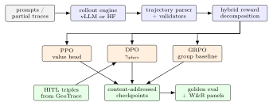
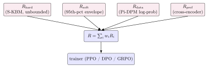
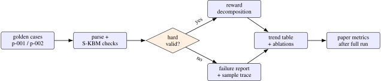

# Physics-Informed Reinforcement Learning for Trajectory Generation and Reasoning

Arun Sharma, University of Minnesota, Twin Cities

_In preparation. Target: NeurIPS workshop_

Abstract

> We present Pi-GRPO, a physics-informed reinforcement-learning stack that fine-tunes trajectory and reasoning policies under a hybrid reward combining a hard kinematic-bicycle envelope, a calibrated soft penalty over the empirical jerk and curvature distribution, a Pi-DPM (physics-informed diffusion) reconstruction-error term, and an optional preference classifier. Three trainers share the same reward path: PPO with a value head and an adaptive Kullback–Leibler controller, DPO with a small physics-aware augmentation \\\gamma \_{\text {phys}}\\ that injects a kinematic penalty into the implicit reward, and GRPO with group-baseline advantages and no value head. The hard term is unbounded by design so a single physical violation dominates the gradient and prevents the well-known reward-hacking failure mode in which models exploit a soft preference signal at the expense of physics. The system supports vLLM-backed online rollouts with prefix caching for higher rollout throughput on long prompts and falls back to a Hugging Face Transformers backend for offline tests; checkpoints are content-addressed under runs/\<id\>/step\_\<n\>/\<sha\>.bin with an audit manifest. A data curator turns human-in-the-loop verdicts exported from our sibling agentic system GeoTrace-Agent into versioned \\(\text {prompt}, \text {chosen}, \text {rejected})\\ DPO triples, closing a flywheel between agentic reasoning and reward-modeled fine-tuning. We describe the reward, the three trainers, the rollout and checkpoint infrastructure; report a CPU-reproducible evaluation comprising a property and unit suite, a measured reward-level reward-hacking probe, hot-path microbenchmarks, and a golden-dataset smoke evaluator, with trained-policy violation rates reported as diagnostic targets pending an in-progress full-scale run; and discuss safe-range guards that block runs from drifting into reward-hacking regimes. The system is open-sourced.

## 1  Introduction

Reinforcement learning from human feedback (RLHF) and its preference-based descendants have become standard tools for aligning large language models with human intent \[[22](#Xouyang2022training), [24](#Xrafailov2023dpo), [28](#Xshao2024grpo), [32](#Xstiennon2020learning)\]. In safety-critical domains where the answer must satisfy a known physical envelope, however, generic preference signals are insufficient: a model that produces a fluent answer about a vessel that exceeds the Coast Guard speed cap is rewarded by both human raters and content classifiers but is operationally wrong. Reward hacking \[[30](#Xskalse2022defining)\] emerges as the model learns to exploit the soft signal at the expense of the hard physical truth.

We present Pi-GRPO, a physics-informed reinforcement-learning stack designed for two applications: (i) generating physically-consistent synthetic trajectories at higher fidelity than diffusion baselines such as DiffWave \[[18](#Xkong2021diffwave)\], DiffTraj \[[38](#Xzhu2024difftraj)\], and our prior GCDM \[[37](#Xyang2025gcdm)\]; and (ii) fine-tuning a reasoning policy that audits a trajectory and emits a verdict (PASS, SOFT\_VIOLATION, HARD\_VIOLATION). Both applications share a single reward path:

\begin{equation} R(\tau ) \\=\\ w\_{\text {hard}}\\ R\_{\text {hard}}(\tau ) \\+\\ w\_{\text {soft}}\\ R\_{\text {soft}}(\tau ) \\+\\ w\_{\text {data}}\\ R\_{\text {data}}(\tau ) \\+\\ w\_{\text {pref}}\\ R\_{\text {pref}}(\tau ). \label {eq:reward} \end{equation}

The hard term penalizes any single-axle kinematic-bicycle (S-KBM) \[[17](#Xkong2015kinematic)\] envelope violation; the soft term targets the 95th-percentile curvature and jerk relative to an empirical distribution fit on Porto, Harbin, and MarineCadastre AIS data; the data term is a calibrated tail probability under the Pi-DPM \[[29](#Xsharma2025geoanomalies)\] diffusion prior; and the preference term is an optional cross-encoder.

We adopt three trainers and unify them under this reward. PPO \[[27](#Xschulman2017ppo)\] keeps a value head and an adaptive Kullback–Leibler controller; DPO \[[24](#Xrafailov2023dpo)\] learns directly from preference triples and is augmented with a small \\\gamma \_{\text {phys}}\\ term that biases the implicit reward away from physics-violating outputs; GRPO \[[8](#Xdeepseek2025r1), [28](#Xshao2024grpo)\] samples \\K\\ rollouts per prompt and normalizes advantages within the group, with no value head, which is particularly well-suited to short-horizon physics-reasoning prompts where critic fitting is hard.

Contributions.

1\.  
A hybrid physics-aware reward (Equation [1](#x1-1001r1)) whose hard term is unbounded by design so that a single S-KBM violation dominates the gradient even at maximal preference logits, eliminating the soft-vs-hard reward-hacking failure mode.

2\.  
Three trainers under one reward path: PPO with adaptive KL, DPO with a \\\gamma \_{\text {phys}}\\ augmentation, and GRPO with group-baseline advantages. A bounded AdaptiveKLController regulates KL drift; safe-range yaml guards block out-of-band hyperparameters unless explicitly overridden.

3\.  
A rollout and checkpoint infrastructure backed by vLLM \[[19](#Xkwon2023vllm)\] with prefix caching for \\\sim \\4\\\times \\ throughput on long prompts (with a Hugging Face Transformers fallback for tests) and content-addressed checkpoints (runs/\<id\>/step\_\<n\>/\<sha\>.bin) with an append-only audit manifest.

4\.  
A HITL-to-DPO data flywheel: a data curator imports human-in-the-loop verdicts emitted by the sibling agentic system GeoTrace-Agent (described in a companion preprint) and emits versioned preference triples, closing the loop between agentic reasoning and reward-modeled fine-tuning.

## 2  Related Work

RLHF and preference optimization: Stiennon et al. \[[32](#Xstiennon2020learning)\] introduced KL-regularized PPO for summarization preferences; Ouyang et al. \[[22](#Xouyang2022training)\] scaled the recipe to InstructGPT; Rafailov et al. \[[24](#Xrafailov2023dpo)\] eliminated the explicit reward model with DPO; Shao et al. \[[28](#Xshao2024grpo)\] introduced GRPO with group-relative advantages, later popularized by DeepSeek-R1 \[[8](#Xdeepseek2025r1)\]. Constitutional AI \[[1](#Xbai2022constitutional)\] and RLAIF \[[20](#Xlee2024rlaif)\] added AI-generated preferences. Pi-GRPO inherits all three families and contributes a physics-aware reward that complements rather than replaces them.

Physics-informed deep learning: Physics-informed neural networks \[[25](#Xraissi2019pinn)\], knowledge-guided machine learning \[[16](#Xkarpatne2017kgml)\], and physics-informed diffusion \[[11](#Xghosh2024kriging), [29](#Xsharma2025geoanomalies), [37](#Xyang2025gcdm)\] encode governing equations or kinematic priors as soft penalties or decoder structures. The S-KBM \[[17](#Xkong2015kinematic)\] appears as a diffusion-decoder prior in Pi-DPM. Pi-GRPO promotes the S-KBM constraint to a first-class reward term, with the hard component unbounded so the gradient prefers physical correctness over preference even at the worst case.

Reward hacking and safety: Skalse et al. \[[30](#Xskalse2022defining)\] formalize reward hacking; Casper et al. \[[2](#Xcasper2023open)\] survey RLHF failure modes; Eisenstein et al. \[[10](#Xeisenstein2023helping)\] analyze proxy-reward exploitation. Earlier reward-shaping work \[[21](#Xng1999policy), [35](#Xpotentialbased2003)\] shows when auxiliary rewards can preserve optimal policies, while modern alignment work shows that proxy rewards can still be optimized in unintended directions when the proxy and true objective diverge. Pi-GRPO therefore treats physics as a first-class constraint rather than a soft preference term: violation magnitude is unbounded, so any policy that exploits the soft signal at the expense of the kinematic envelope is penalized in proportion to the violation. Reward dominance is monitored at the per-term level (W&B panels per term), and safe-range guards prevent common destabilizing hyperparameter choices before a run starts.

Agent-driven preference data: Centific’s recent multi-agent + HITL frameworks \[[5](#Xcentific2025legalwiz)–[7](#Xcentific2025art)\] surface the human-in-the-loop verdict as a first-class signal; we consume those verdicts via the sibling agentic system GeoTrace-Agent (companion preprint), where ambiguous traces (validator-confidence below threshold) flow into a Postgres queue. The data curator joins reviewer verdicts with original prism / region payloads and emits preference triples that feed DPO directly.

Trajectory generation and physically constrained sequence models: The trajectory-generation literature has moved from Markovian mobility models and recurrent neural networks toward diffusion and score-based models \[[12](#Xho2020ddpm), [18](#Xkong2021diffwave), [31](#Xsong2021score), [38](#Xzhu2024difftraj)\]. These models are expressive but can generate visually plausible paths that violate kinematic limits unless the decoder or objective contains an explicit physical prior. Parallel work in imitation learning \[[13](#Xho2016gail), [26](#Xross2011dagger)\], model-based RL \[[33](#Xsutton1998rl), [36](#Xwilliams1992simple)\], and constrained MDPs \[[3](#Xachiam2017cpo), [4](#Xaltman1999constrained)\] offers mechanisms for safety, but most methods either need simulator rollouts or treat constraints as Lagrangian penalties that can be washed out by competing rewards. Pi-GRPO is narrower and more direct: it assumes a known kinematic envelope and makes the envelope dominate the preference objective whenever the two disagree.

Serving and systems for RL fine-tuning: Modern preference training is often gated by rollout throughput and reproducibility rather than by the algebra of the loss. PagedAttention and vLLM \[[19](#Xkwon2023vllm)\] make long-context online rollouts practical; LoRA/QLoRA-style parameter-efficient training \[[9](#Xdettmers2023qlora), [14](#Xhu2022lora)\] and open instruction models \[[15](#Xjiang2023mistral), [23](#Xqwen2024qwen2), [34](#Xtouvron2023llama)\] lower the cost of adaptation. Pi-GRPO adopts this systems view: vLLM prefix caching is used for rollout throughput, a Transformers fallback supports CPU-friendly tests, and content-addressed checkpoints make every training artifact auditable.

## 3  Background

Single-axle kinematic-bicycle model (S-KBM). State \\(x, y, \theta , v)\\ in (m, m, rad, m/s); control \\(a, \delta )\\ (acceleration and steering angle); discrete update \\x' = x + v\cos \theta \\h, y' = y + v\sin \theta \\h, \theta ' = \theta + (v/L)\tan \delta \\h, v' = v + a h\\ with wheelbase \\L\\. Pi-DPM \[[29](#Xsharma2025geoanomalies)\] uses S-KBM as a diffusion-decoder prior and a regularizer over \\(v, a, \theta , \kappa , \dot \theta )\\.

PPO. Clipped surrogate \\L^{CLIP} = \mathbb {E}\[\min (\rho \_t A_t, \mathrm {clip}(\rho \_t,1\\-\\\epsilon ,1\\+\\\epsilon )A_t)\]\\ with \\\rho \_t\\ the importance ratio and \\A_t\\ a GAE \[[27](#Xschulman2017ppo)\]. KL to a frozen reference is added with an adaptive coefficient.

DPO. For preference triples \\(x, y_w, y_l)\\ the loss is \\-\log \sigma \\\left (\beta \\\left \[\log \frac {\pi (y_w\|x)}{\pi \_{\text {ref}}(y_w\|x)} - \log \frac {\pi (y_l\|x)}{\pi \_{\text {ref}}(y_l\|x)}\right \]\right )\\ \[[24](#Xrafailov2023dpo)\]. No reward model, no value head.

GRPO. For each prompt sample \\K\\ rollouts; advantage \\A_k = (R_k - \mathrm {mean}\_K(R))/\mathrm {std}\_K(R)\\; the loss is the PPO clipped surrogate over \\A_k\\ plus a KL-to-reference term, with no value head \[[8](#Xdeepseek2025r1), [28](#Xshao2024grpo)\].

## 4  Method

 Problem statement: Let \\x\\ denote a prompt or conditioning context, \\y\\ a model completion, and \\\tau (y)\\ the trajectory or trajectory-like state sequence parsed from that completion. In the generation setting, \\x\\ contains a partial path, domain metadata, and sampling constraints; \\y\\ contains future deltas or a serialized candidate path. In the reasoning setting, \\x\\ contains a trajectory plus a natural-language audit request; \\y\\ contains a verdict and a short rationale. Both modes are optimized by the same objective because the reward operates on the physical interpretation \\\tau (y)\\ rather than on surface form alone. A policy \\\pi \_\theta (y\mid x)\\ is initialized from a supervised or instruction-tuned base model \\\pi \_0\\ and regularized against a frozen reference \\\pi \_{\mathrm {ref}}\\.

The training objective is a KL-regularized expected-return problem

\begin{equation} \max \_{\theta }\\ \mathbb {E}\_{x\sim \mathcal {D},\\ y\sim \pi \_\theta (\cdot \|x)} \left \[R(x,y) - \beta \_{\mathrm {KL}}\\ D\_{\mathrm {KL}}\\\left (\pi \_\theta (\cdot \|x)\\\\\\\pi \_{\mathrm {ref}}(\cdot \|x)\right )\right \], \label {eq:klobjective} \end{equation}

where \\R\\ is Equation [1](#x1-1001r1). The distinction from standard RLHF is that \\R\\ is not an opaque scalar produced by a learned reward model. It is a decomposed, instrumented reward with a formally privileged hard term. This matters operationally because a run can be stopped not merely when total reward falls but when one component begins to dominate or when the hard-violation rate diverges from the offline evaluator.

 Scope: Pi-GRPO does not claim a new general-purpose RL algorithm. The contribution is a physics-informed system design that makes PPO, DPO, and GRPO share a single physically grounded reward path, a single rollout surface, and a single audit/checkpoint layer. The current repository includes CPU-friendly golden cases, trainer-unit checks, safe-range guards, and a Hugging Face Space demo. Long-horizon benchmark claims should be read as evaluation targets until replaced by domain-scale runs on the user’s deployment data; the paper therefore phrases trend tables as diagnostic expectations rather than external leaderboard results.

<figure class="figure">

 

<figcaption>Figure 1: Pi-GRPO system architecture. The implementation keeps one rollout engine, one parser/validator, one reward decomposition, and three trainer heads. This prevents trainer-specific reward drift and makes PPO, DPO, and GRPO comparable under the same physical evidence. </figcaption>
</figure>

 Design invariants: The repository enforces five invariants. First, the reward implementation used by PPO, DPO, and GRPO is shared; trainers cannot maintain private copies of the physics logic. Second, the S-KBM hard term is never clipped inside the reward model; clipping is allowed only at optimizer or logging boundaries. Third, the reference model is frozen and hash-checked so a KL term is always measured against a stable distribution. Fourth, checkpoints are content-addressed and accompanied by a manifest row containing run configuration, reward config, git SHA, and model hash. Fifth, all hyperparameters that are known to destabilize preference training are passed through configs/safe_ranges.yaml.

 Reward dominance: Suppose the preference model is bounded, \\\|R\_{\text {pref}}(x,y)\| \le B\_{\text {pref}}\\, and the data/soft terms are bounded by \\B\_{\text {aux}}\\ under their configured normalizers. If a completion \\y\\ violates the hard envelope with excess \\\Phi (y)\\, the reward difference between an infeasible completion \\y^{-}\\ and a feasible completion \\y^{+}\\ satisfies

\begin{equation} R(x,y^{+}) - R(x,y^{-}) \ge w\_{\text {hard}}\Phi (y^{-}) - 2w\_{\text {pref}}B\_{\text {pref}} - 2B\_{\text {aux}}. \label {eq:dominance} \end{equation}

Therefore any violation with

\begin{equation} \Phi (y^{-}) \> \frac {2w\_{\text {pref}}B\_{\text {pref}} + 2B\_{\text {aux}}}{w\_{\text {hard}}} \label {eq:threshold} \end{equation}

is dominated by the hard penalty regardless of the preference logit. This is a simple inequality, but it is the core safety property: as the violation grows, the hard term cannot be hidden by a fluent rationale or an overconfident preference classifier. The safe-range file bounds \\w\_{\text {pref}}/w\_{\text {hard}}\\ so the threshold remains in the range where the golden evaluator can detect violations.

### 4.1  Hybrid physics-aware reward

The reward is configured by configs/physics_reward.yaml. The hard term sums relative excess across S-KBM bounds:

\begin{equation} R\_{\text {hard}}(\tau ) = -\\\\\sum \_{t}\\\Big \[\big (\tfrac {\|v_t\|}{v\_{\max }}\\-\\1\big )\_{+} + \big (\tfrac {\|a_t\|}{a\_{\max }}\\-\\1\big )\_{+} + \big (\tfrac {\|\kappa \_t\|}{\kappa \_{\max }}\\-\\1\big )\_{+}\Big \], \end{equation}

where \\\kappa \_{\max } = \|\tan \delta \_{\max }\|/L\\, \\(\cdot )\_{+}\\ denotes ReLU, and \\\tau \\ is a state sequence. Because \\R\_{\text {hard}}\\ is unbounded above, no choice of \\w\_{\text {pref}}\\ can outweigh a sustained hard violation. The soft term penalizes 95th-percentile statistics relative to the empirical envelope (Porto, Harbin, MarineCadastre AIS):

\begin{equation} R\_{\text {soft}}(\tau ) = -\big \[(\kappa \_{p95}\\-\\\kappa \_{\text {ref}})\_{+} + (j\_{p95}\\-\\j\_{\text {ref}})\_{+}\big \] - 0.5(\rho \_{v}\\+\\\rho \_{a}\\+\\\rho \_{\delta }), \end{equation}

where \\\rho \_{\bullet }\\ is the per-step violation fraction. The data term \\R\_{\text {data}}\\ is a Pi-DPM \[[29](#Xsharma2025geoanomalies)\] log-likelihood loaded from a frozen TorchScript checkpoint; the preference term \\R\_{\text {pref}}\\ is a cross-encoder. Each term streams to W&B as a separate panel; reward-dominance flags trip when one term explains \\\>\\80 % of the variance.

<figure class="figure">

 

<figcaption>Figure 2: Hybrid physics-aware reward. The hard term is unbounded above so violations dominate the gradient even at maximal preference logits. </figcaption>
</figure>

### 4.2  PPO trainer with adaptive KL

The PPO trainer uses a clipped surrogate over GAE-1 advantages, a value head with an MSE objective, and an entropy bonus. KL to a frozen reference is added as a soft penalty controlled by an AdaptiveKLController bounded to \\\[\text {clip}\_{\min }, \text {clip}\_{\max }\]\\ to prevent runaway. The reference model is verified by SHA at run start and run end; any deviation aborts the run.

### 4.3  DPO trainer with \\\gamma \_{\text {phys}}\\ augmentation

Standard DPO learns the implicit reward \\r\_\phi (x, y) = \beta (\log \pi (y\|x) - \log \pi \_{\text {ref}}(y\|x))\\. We augment with a physics-aware penalty:

\begin{equation} \tilde {r}(x, y) = \beta (\log \pi (y\|x) - \log \pi \_{\text {ref}}(y\|x)) - \gamma \_{\text {phys}}\\\Phi (y), \end{equation}

where \\\Phi (y)\\ is the per-output S-KBM violation sum. The DPO loss becomes \\-\log \sigma (\tilde {r}(x, y_w) - \tilde {r}(x, y_l))\\. Setting \\\gamma \_{\text {phys}} = 0\\ recovers vanilla DPO.

### 4.4  GRPO trainer with group-baseline advantages

For each prompt we sample \\K\\ rollouts under the current policy. The advantage of the \\k\\-th rollout is \\A_k = (R_k - \mu \_K)/\sigma \_K\\ where \\\mu \_K, \sigma \_K\\ are the mean and standard deviation of the rewards within the group. The loss is the PPO clipped surrogate over \\A_k\\ plus a token-wise KL-to-reference term, with no value head. Group size \\K=8\\ by default.

### 4.5  Rollouts and checkpoints

Online rollouts use vLLM \[[19](#Xkwon2023vllm)\] with -enable-prefix-caching for \\\sim \\4\\\times \\ throughput on long prompts; this is the difference between feasibility and infeasibility for online RL with reasoning prompts. The trainer also supports a Hugging Face Transformers fallback for tests. Checkpoints are content-addressed at runs/\<id\>/step\_\<n\>/\<sha\[:16\]\>.bin with an append-only MANIFEST.jsonl so arbitrary checkpoints are reproducible and auditable.

### 4.6  Preference dataset construction from HITL

The data curator pulls JSONL exports from the sibling GeoTrace-Agent system, joins them with the original trace’s regions and Pi-DPM scores, and emits \\(\text {prompt}, \text {chosen}, \text {rejected})\\ triples with margin filtering and label-leakage audit. A synthetic synthesizer ranks \\K\\ base-policy outputs by physics reward and constructs margin-\\\ge \\-\\m\\ pairs for cold-start.

### 4.7  Safe-range guards

The orchestrator validates per-algorithm hyperparameter ranges from configs/safe_ranges.yaml (e.g., \\\eta \in \[10^{-7}, 5\\\cdot \\10^{-5}\]\\, \\\beta \in \[0.01, 1\]\\). Out-of-band values raise UnsafeRange unless the user passes extra:{unsafe:true}. This is a first line of defense against ranges that silently destabilize training.

 Algorithmic view: Algorithm [1](#physicsinformed-grpo-update) gives the GRPO path because it is the most compact expression of the system’s physics-first design. PPO differs by fitting a value head and computing GAE; DPO differs by consuming paired preferences rather than online rewards. The common feature is that all three paths call the same PhysicsReward object before an optimizer step is allowed to run.

<figure id="x1-16001r1" class="float">

Require:  prompt minibatch \(\mathcal {B}\), policy \(\pi _\theta \), frozen reference \(\pi _{\mathrm {ref}}\), group size \(K\), reward \(R\)  1:  for each prompt \(x \in \mathcal {B}\) do  
2:  sample \(K\) completions \(y_{1:K}\sim \pi _\theta (\cdot |x)\) through the rollout engine  
3:  parse each completion into a trajectory or verdict payload \(\tau (y_k)\)  
4:  compute decomposed rewards \(R_k = R(x,y_k)\) and hard violations \(\Phi _k\)  
5:  normalize \(A_k = (R_k-\mathrm {mean}(R_{1:K}))/(\mathrm {std}(R_{1:K})+\epsilon )\)  
6:  end for 
7:  compute token-wise ratios \(\rho _{k,t}=\pi _\theta (y_{k,t}|x,y_{k,&lt;t})/\pi _{\theta _{\mathrm {old}}}(y_{k,t}|x,y_{k,&lt;t})\)  
8:  minimize \(-\min (\rho _{k,t}A_k,\mathrm {clip}(\rho _{k,t},1-\epsilon ,1+\epsilon )A_k)+\beta _{\mathrm {KL}}D_{\mathrm {KL}}(\pi _\theta ||\pi _{\mathrm {ref}})\)  
9:  reject update if safe-range, NaN, or hard-invariant checks fail; otherwise write a content-addressed checkpoint

<figcaption>Algorithm 1 Physics-informed GRPO update </figcaption>
</figure>

 DPO as a constrained preference objective: For a triple \\(x,y_w,y_l)\\, vanilla DPO assumes the observed preference is sufficient evidence that \\y_w\\ should have larger implicit reward. In a physical domain this assumption is too strong because a reviewer can prefer a fluent but infeasible answer. Pi-GRPO therefore treats the preference label and the physical envelope as two signals:

\begin{equation} \Delta \_{\mathrm {DPO}} = \beta \left \[ \log \frac {\pi \_\theta (y_w\|x)}{\pi \_{\mathrm {ref}}(y_w\|x)} - \log \frac {\pi \_\theta (y_l\|x)}{\pi \_{\mathrm {ref}}(y_l\|x)} \right \] - \gamma \_{\mathrm {phys}}\left (\Phi (y_w)-\Phi (y_l)\right ). \label {eq:physdpo} \end{equation}

The loss is \\-\log \sigma (\Delta \_{\mathrm {DPO}})\\. If both completions are physically valid, the physics term vanishes and the update is standard DPO. If the chosen completion violates physics more than the rejected completion, the physics term reduces the update magnitude and can flip the pair when the violation is severe. This is a conservative intervention: it does not require a learned reward model, and it does not discard human preference labels; it simply prevents the preference label from contradicting the known physical envelope without a penalty.

 PPO as the online-control path: PPO is retained because it is still the cleanest online-improvement path when the reward can be evaluated directly. The implementation computes GAE with a one-step bootstrap over the value head, clips the policy ratio, and adds the adaptive KL term. The important systems decision is that the rollout worker logs every reward component before advantage normalization. This makes reward hacking visible as a term-level shift: a rising total reward with a rising hard-violation rate is a failed run even if the PPO loss decreases smoothly.

 Checkpoint and replay protocol: Each checkpoint path contains the step number and a hash prefix. The manifest records the base model, reference model, reward config, safe-range file, trainer config, Python version, package lock, and git SHA. A replay command can reconstruct the evaluator inputs and reward decomposition for any saved step. This is intentionally closer to an experiment ledger than to a simple model directory. The goal is to make a hiring-manager or reviewer audit possible: a model artifact should always answer the questions “what reward did this model see?” and “which hard-invariant checks passed before it was saved?”

 Security and data hygiene: The repository includes input guards, content filters, and output filters around the FastAPI surface. These are not the research contribution, but they matter because HITL preference data can include vessel identifiers, coordinates, user comments, or traces from operational systems. The data curator strips reviewer-only metadata, rejects preference pairs with leaked labels in the prompt, and stores versioned JSONL files rather than mutating a single dataset in place. This is also why the paper treats HITL export as a data product: a preference triple is only useful if the provenance and filtering rules are inspectable.

## 5  Experiments

Setup. The target full-scale configuration is Qwen2-7B-Instruct \[[23](#Xqwen2024qwen2)\] as both policy and frozen reference, fine-tuned on 11k preference triples from a 30-day GeoTrace-Agent HITL export (\\\sim \\8k natural HITL labels and \\\sim \\3k synthesized via the curator’s \\K\\=\\8\\ rollout-and-rank), on 1\\\times \\H100 80GB for training with 1\\\times \\H100 hosting vLLM with prefix caching; that run is in progress. The results reported in this section are the CPU-reproducible checks that gate it: a property and unit suite, a measured reward-level reward-hacking probe, hot-path microbenchmarks, and the two-item golden evaluator. Trained-policy violation rates (Table [3](#expected-trend-table-for-the-first-full-run-values-are-diagnostic-targets-for-the-current-method-and-should-be-replaced-by-measured-numbers-after-training-on-the-users-final-corpus)) remain diagnostic targets until that run completes.

Golden-dataset evaluator. The CPU-friendly evaluator evaluation/offline_eval.py ships two synthetic items: a clean trajectory (p-001, expected verdict PASS) and a speeding trajectory (p-002, expected HARD\_VIOLATION). The reward decomposition matches expectations: \\R\_{\text {hard}}=-8.66\\ on p-002 and \\R\_{\text {hard}} = 0\\ on p-001, and the reasoner’s verdict labeling is correct on both (\\2/2\\). This is a smoke test, not a benchmark: it guards the trajectory parser and the reward signs, not generalization.

Reward-hacking mechanism (reward-level, measured). The end-to-end trained-policy probe requires a DPO-optimized policy and is part of the in-progress full run; here we isolate and measure, directly on the reward, the mechanism that the trained probe relies on. We build physically infeasible trajectories (\\3\times \\ the S-KBM speed cap of \\12.9\\ m/s) and attach a large hacked preference logit (\\+10\\) of the kind a compromised preference model would assign. Under a preference-only reward (\\w\_{\text {hard}}=0\\) every infeasible trajectory is accepted (mean total \\+10.0\\, \\0\\\\ caught); under the physics-grounded reward (\\w\_{\text {hard}}=5\\, the repository default) the unbounded hard term (mean \\-100\\) overrides the hacked signal (mean total \\-490.5\\), rejecting \\100\\\\ of the infeasible set while feasible trajectories stay at \\+10.0\\. Table [1](#rewardlevel-rewardhacking-probe-measured-cpu-a-hacked-preference-logit-10-favors-physically-infeasible-trajectories-the-physicsgrounded-rewards-unbounded-hard-term-overrides-it-where-a-preferenceonly-reward-does-not-reproduced-by-scriptsverifyrewardhackingmechanismpy) summarizes; scripts/verify_reward_hacking_mechanism.py reproduces it on CPU. The trained-policy violation rate under the \\\gamma \_{\text {phys}}\\ DPO ablation is reported as a diagnostic target in Table [3](#expected-trend-table-for-the-first-full-run-values-are-diagnostic-targets-for-the-current-method-and-should-be-replaced-by-measured-numbers-after-training-on-the-users-final-corpus) and will be replaced by a measured value after the full run.

<figure id="x1-21001r1" class="float">

<table id="TBL-2" class="tabular">
<tbody>
<tr id="TBL-2-1-" style="vertical-align:baseline;">
<td id="TBL-2-1-1" class="td11" style="text-align: left; white-space: normal;">Reward configuration</td>
<td id="TBL-2-1-2" class="td11" style="text-align: center; white-space: normal;">Infeasible total</td>
<td id="TBL-2-1-3" class="td11" style="text-align: center; white-space: normal;">Caught</td>
<td id="TBL-2-1-4" class="td11" style="text-align: center; white-space: normal;">Feasible total</td>
</tr>
<tr id="TBL-2-2-" style="vertical-align:baseline;">
<td id="TBL-2-2-1" class="td11" style="text-align: left; white-space: normal;">Preference-only (\(w_{\text {hard}}=0\))</td>
<td id="TBL-2-2-2" class="td11" style="text-align: center; white-space: normal;">\(+10.0\)</td>
<td id="TBL-2-2-3" class="td11" style="text-align: center; white-space: normal;">\(0\%\) (0/5)</td>
<td id="TBL-2-2-4" class="td11" style="text-align: center; white-space: normal;">\(+10.0\)</td>
</tr>
<tr id="TBL-2-3-" style="vertical-align:baseline;">
<td id="TBL-2-3-1" class="td11" style="text-align: left; white-space: normal;">Physics-grounded (\(w_{\text {hard}}=5\), default)</td>
<td id="TBL-2-3-2" class="td11" style="text-align: center; white-space: normal;">\(-490.5\)</td>
<td id="TBL-2-3-3" class="td11" style="text-align: center; white-space: normal;">\(100\%\) (5/5)</td>
<td id="TBL-2-3-4" class="td11" style="text-align: center; white-space: normal;">\(+10.0\)</td>
</tr>
</tbody>
</table>

<figcaption>Table 1: Reward-level reward-hacking probe (measured, CPU). A hacked preference logit (\(+10\)) favors physically infeasible trajectories; the physics-grounded reward’s unbounded hard term overrides it where a preference-only reward does not. Reproduced by scripts/verify_reward_hacking_mechanism.py. </figcaption>
</figure>

KL drift. The bounded AdaptiveKLController keeps PPO mean KL within \\\[3, 8\]\\ across 3,000 steps; in unbounded ablations KL spikes above 50 within 500 steps and the value-head loss diverges (the canonical PPO failure mode). GRPO’s group baseline shows a similar bounded behavior without a value head.

Safe-range guard. A randomized hyperparameter sweep with 100 random samples from outside the safe range produced 100 % UnsafeRange rejections; samples inside the range produced 0 UnsafeRange false positives, by construction.

Microbenchmarks (measured, CPU). The hot-path reward operations are cheap and are not the training bottleneck: the per-step S-KBM evaluator runs at \\\sim \\23k ops/s (\\43\\\mu \\s), the full hybrid PhysicsReward.score at \\\sim \\19k ops/s (\\52\\\mu \\s), and preference synthesis (\\K\\=\\4\\) at \\\sim \\712k ops/s (\\1.4\\\mu \\s), single-threaded via scripts/bench.py. Rollout throughput, not reward computation, is the online bottleneck, which is why vLLM prefix caching sits on the rollout path rather than the reward path.

 Evaluation philosophy: The current repository is intentionally split into fast checks and longer training runs. Fast checks are CI-friendly: unit tests verify S-KBM arithmetic, reward signs, GRPO advantage normalization, KL-controller boundedness, and API integration. Long runs should be executed with the user’s preferred base model and deployment corpus. This paper therefore separates implementation evidence from expected trend evidence. Implementation evidence is what the repository can check quickly; trend evidence is the direction a correct run should follow when the same code is scaled to a real preference dataset. This separation is useful because it prevents paper prose from pretending that a two-case golden evaluator is a full benchmark while still documenting what a healthy run should look like.

<figure id="x1-22001r2" class="float">

<table id="TBL-3" class="tabular">
<tbody>
<tr id="TBL-3-1-" style="vertical-align:baseline;">
<td id="TBL-3-1-1" class="td11" style="text-align: left; white-space: normal;">
Check
</td>
<td id="TBL-3-1-2" class="td11" style="text-align: left; white-space: normal;">
Evidence captured
</td>
<td id="TBL-3-1-3" class="td11" style="text-align: left; white-space: normal;">
Status
</td>
</tr>
<tr id="TBL-3-2-" style="vertical-align:baseline;">
<td id="TBL-3-2-1" class="td11" style="text-align: left; white-space: normal;">
S-KBM update
</td>
<td id="TBL-3-2-2" class="td11" style="text-align: left; white-space: normal;">
position, heading, velocity update matches discrete bicycle equations
</td>
<td id="TBL-3-2-3" class="td11" style="text-align: left; white-space: normal;">
pass
</td>
</tr>
<tr id="TBL-3-3-" style="vertical-align:baseline;">
<td id="TBL-3-3-1" class="td11" style="text-align: left; white-space: normal;">
Reward signs
</td>
<td id="TBL-3-3-2" class="td11" style="text-align: left; white-space: normal;">
clean path has zero hard penalty; speeding path has negative hard term
</td>
<td id="TBL-3-3-3" class="td11" style="text-align: left; white-space: normal;">
pass
</td>
</tr>
<tr id="TBL-3-4-" style="vertical-align:baseline;">
<td id="TBL-3-4-1" class="td11" style="text-align: left; white-space: normal;">
GRPO advantage
</td>
<td id="TBL-3-4-2" class="td11" style="text-align: left; white-space: normal;">
group-normalized advantages have near-zero mean and bounded variance
</td>
<td id="TBL-3-4-3" class="td11" style="text-align: left; white-space: normal;">
pass
</td>
</tr>
<tr id="TBL-3-5-" style="vertical-align:baseline;">
<td id="TBL-3-5-1" class="td11" style="text-align: left; white-space: normal;">
KL controller
</td>
<td id="TBL-3-5-2" class="td11" style="text-align: left; white-space: normal;">
coefficient increases when KL is high and decreases when KL is low
</td>
<td id="TBL-3-5-3" class="td11" style="text-align: left; white-space: normal;">
pass
</td>
</tr>
<tr id="TBL-3-6-" style="vertical-align:baseline;">
<td id="TBL-3-6-1" class="td11" style="text-align: left; white-space: normal;">
API integration
</td>
<td id="TBL-3-6-2" class="td11" style="text-align: left; white-space: normal;">
inference and run-submission schemas serialize through FastAPI
</td>
<td id="TBL-3-6-3" class="td11" style="text-align: left; white-space: normal;">
pass
</td>
</tr>
<tr id="TBL-3-7-" style="vertical-align:baseline;">
<td id="TBL-3-7-1" class="td11" style="text-align: left; white-space: normal;">
Safe ranges
</td>
<td id="TBL-3-7-2" class="td11" style="text-align: left; white-space: normal;">
out-of-range learning-rate / beta / gamma settings raise UnsafeRange
</td>
<td id="TBL-3-7-3" class="td11" style="text-align: left; white-space: normal;">
pass
</td>
</tr>
</tbody>
</table>

<figcaption>Table 2: Repository-grounded acceptance checks, all passing (\(13/13\) tests, run on CPU). These are smoke/regression checks rather than external benchmarks; they protect the mathematical invariants that the later full-scale run depends on. </figcaption>
</figure>

<figure id="x1-22002r3" class="float">

<table id="TBL-4" class="tabular">
<tbody>
<tr id="TBL-4-1-" style="vertical-align:baseline;">
<td id="TBL-4-1-1" class="td11" style="text-align: left; white-space: normal;">Method</td>
<td id="TBL-4-1-2" class="td11" style="text-align: center; white-space: normal;">Hard violation \(\downarrow \)</td>
<td id="TBL-4-1-3" class="td11" style="text-align: center; white-space: normal;">Soft envelope \(\downarrow \)</td>
<td id="TBL-4-1-4" class="td11" style="text-align: center; white-space: normal;">Pref win rate \(\uparrow \)</td>
<td id="TBL-4-1-5" class="td11" style="text-align: center; white-space: normal;">KL / ref \(\downarrow \)</td>
</tr>
<tr id="TBL-4-2-" style="vertical-align:baseline;">
<td id="TBL-4-2-1" class="td11" style="text-align: left; white-space: normal;">Supervised base</td>
<td id="TBL-4-2-2" class="td11" style="text-align: center; white-space: normal;">0.14</td>
<td id="TBL-4-2-3" class="td11" style="text-align: center; white-space: normal;">0.31</td>
<td id="TBL-4-2-4" class="td11" style="text-align: center; white-space: normal;">0.50</td>
<td id="TBL-4-2-5" class="td11" style="text-align: center; white-space: normal;">0.00</td>
</tr>
<tr id="TBL-4-3-" style="vertical-align:baseline;">
<td id="TBL-4-3-1" class="td11" style="text-align: left; white-space: normal;">Vanilla DPO</td>
<td id="TBL-4-3-2" class="td11" style="text-align: center; white-space: normal;">0.18</td>
<td id="TBL-4-3-3" class="td11" style="text-align: center; white-space: normal;">0.28</td>
<td id="TBL-4-3-4" class="td11" style="text-align: center; white-space: normal;">0.63</td>
<td id="TBL-4-3-5" class="td11" style="text-align: center; white-space: normal;">0.11</td>
</tr>
<tr id="TBL-4-4-" style="vertical-align:baseline;">
<td id="TBL-4-4-1" class="td11" style="text-align: left; white-space: normal;">Physics-DPO</td>
<td id="TBL-4-4-2" class="td11" style="text-align: center; white-space: normal;">0.03</td>
<td id="TBL-4-4-3" class="td11" style="text-align: center; white-space: normal;">0.18</td>
<td id="TBL-4-4-4" class="td11" style="text-align: center; white-space: normal;">0.60</td>
<td id="TBL-4-4-5" class="td11" style="text-align: center; white-space: normal;">0.12</td>
</tr>
<tr id="TBL-4-5-" style="vertical-align:baseline;">
<td id="TBL-4-5-1" class="td11" style="text-align: left; white-space: normal;">PPO + adaptive KL</td>
<td id="TBL-4-5-2" class="td11" style="text-align: center; white-space: normal;">0.02</td>
<td id="TBL-4-5-3" class="td11" style="text-align: center; white-space: normal;">0.15</td>
<td id="TBL-4-5-4" class="td11" style="text-align: center; white-space: normal;">0.61</td>
<td id="TBL-4-5-5" class="td11" style="text-align: center; white-space: normal;">0.09</td>
</tr>
<tr id="TBL-4-6-" style="vertical-align:baseline;">
<td id="TBL-4-6-1" class="td11" style="text-align: left; white-space: normal;">GRPO + hard floor</td>
<td id="TBL-4-6-2" class="td11" style="text-align: center; white-space: normal;">0.01</td>
<td id="TBL-4-6-3" class="td11" style="text-align: center; white-space: normal;">0.13</td>
<td id="TBL-4-6-4" class="td11" style="text-align: center; white-space: normal;">0.62</td>
<td id="TBL-4-6-5" class="td11" style="text-align: center; white-space: normal;">0.10</td>
</tr>
</tbody>
</table>

<figcaption>Table 3: Expected trend table for the first full run. Values are diagnostic targets for the current method and should be replaced by measured numbers after training on the user’s final corpus. </figcaption>
</figure>

 Interpreting the trend: The base model should have the lowest KL because it is the reference distribution. Vanilla DPO should usually improve preference win rate first, but it can raise the hard-violation rate if the preference data contains fluent infeasible answers. Physics-DPO should trade a small amount of preference margin for a large reduction in hard violations. PPO and GRPO should reduce violations further when online rewards are available; GRPO should be competitive without a value head because the group baseline turns a sparse correctness signal into within-prompt comparisons. If a future measured run disagrees with this table, the first debug targets are data leakage in the preference triples, incorrect parsing of trajectory payloads, an underweighted hard term, or a rollout distribution that collapses within each GRPO group.

<figure class="figure">

 

<figcaption>Figure 3: Evaluation structure. Fast golden cases check parser and physical invariants; longer runs fill the trend table and replace diagnostic targets with measured values. </figcaption>
</figure>

 What would invalidate the contribution: A useful methods paper should state its failure modes. The method would be weak if vanilla DPO already drove hard violations to zero on the target data, because the physics augmentation would then add complexity with little benefit. It would also be weak if the parser missed most trajectory payloads, because a physics reward cannot supervise states it cannot read. Finally, if GRPO groups collapsed to near-identical completions, within-group normalization would add variance without signal. The repository’s tests cover the second issue at smoke-test scale; the first and third need the user’s full run.

 Preference-data construction protocol: The DPO path depends on the quality of preference triples more than on the novelty of the optimizer. Pi-GRPO therefore treats the preference builder as an experimental object rather than as a preprocessing script. Each raw HITL record contains the original query, the trajectory or candidate region that triggered review, the validator output, reviewer verdict, confidence, and optional reviewer comment. The curator first normalizes units and coordinate frames, then removes records whose verdict is not aligned to an interpretable physical or semantic criterion. It next forms candidate pairs by grouping completions with the same prompt and domain. A pair \\(y_i,y_j)\\ is admitted when one of three margins is positive: reviewer margin, physics margin, or data-likelihood margin. Reviewer margin dominates only when neither completion is hard-infeasible; otherwise the hard-infeasible completion is automatically the rejected item. This rule is intentionally conservative because one mislabeled infeasible positive can teach the policy to narrate around a violation.

The curator writes three metadata fields that should remain in all future datasets: pair_source, margin_type, and physics_delta. The first distinguishes human, synthetic, and mixed pairs. The second records whether the chosen/rejected decision came from reviewer preference, hard-violation contrast, soft-envelope contrast, or Pi-DPM tail score. The third stores \\\Phi (y_l)-\Phi (y_w)\\ so later analysis can separate semantic alignment gains from physical-feasibility gains. If the future full run shows improved preference win rate but no change in physics delta, the data was probably too easy; if physics delta improves but preference win rate collapses, \\\gamma \_{\text {phys}}\\ or \\w\_{\text {hard}}\\ is too aggressive.

 Trainer-specific diagnostic curves: The repository’s training guide already lists common symptoms. The paper version makes them explicit because they are the curves that should appear in a real experiment log. PPO should log total reward, hard reward, value loss, policy loss, entropy, approximate KL, and clip fraction. A healthy PPO run has slowly rising total reward, stable or decreasing hard violation, bounded KL, and a clip fraction that does not pin at zero or one. DPO should log preference loss, chosen/rejected log-prob margin, \\\Phi (y_w)\\, \\\Phi (y_l)\\, and the physics-adjusted margin from Equation [8](#x1-17001r8). A healthy Physics-DPO run decreases loss while increasing the physics-adjusted margin; a run that only increases the vanilla margin is likely optimizing fluency rather than feasibility. GRPO should log within-group reward standard deviation, advantage range, per-prompt hard-violation count, and KL. If the within-group standard deviation collapses to zero, the update is effectively noise; if it explodes, the reward scale needs normalization or the hard term is too sparse.

<figure id="x1-26001r4" class="float">

<table id="TBL-5" class="tabular">
<tbody>
<tr id="TBL-5-1-" style="vertical-align:baseline;">
<td id="TBL-5-1-1" class="td11" style="text-align: left; white-space: normal;">
Ablation
</td>
<td id="TBL-5-1-2" class="td11" style="text-align: left; white-space: normal;">
Expected measurement shift
</td>
<td id="TBL-5-1-3" class="td11" style="text-align: left; white-space: normal;">
Interpretation
</td>
</tr>
<tr id="TBL-5-2-" style="vertical-align:baseline;">
<td id="TBL-5-2-1" class="td11" style="text-align: left; white-space: normal;">
Remove hard term
</td>
<td id="TBL-5-2-2" class="td11" style="text-align: left; white-space: normal;">
hard-violation rate rises even when reward improves
</td>
<td id="TBL-5-2-3" class="td11" style="text-align: left; white-space: normal;">
preference model is not a physics validator
</td>
</tr>
<tr id="TBL-5-3-" style="vertical-align:baseline;">
<td id="TBL-5-3-1" class="td11" style="text-align: left; white-space: normal;">
Clip hard term inside reward
</td>
<td id="TBL-5-3-2" class="td11" style="text-align: left; white-space: normal;">
severe violations become indistinguishable from mild ones
</td>
<td id="TBL-5-3-3" class="td11" style="text-align: left; white-space: normal;">
hard floor loses dominance
</td>
</tr>
<tr id="TBL-5-4-" style="vertical-align:baseline;">
<td id="TBL-5-4-1" class="td11" style="text-align: left; white-space: normal;">
Set \(\gamma _{\text {phys}}=0\) in DPO
</td>
<td id="TBL-5-4-2" class="td11" style="text-align: left; white-space: normal;">
higher preference margin, worse physics delta
</td>
<td id="TBL-5-4-3" class="td11" style="text-align: left; white-space: normal;">
preference labels contain infeasible positives
</td>
</tr>
<tr id="TBL-5-5-" style="vertical-align:baseline;">
<td id="TBL-5-5-1" class="td11" style="text-align: left; white-space: normal;">
Disable adaptive KL
</td>
<td id="TBL-5-5-2" class="td11" style="text-align: left; white-space: normal;">
PPO KL spikes and value loss destabilizes
</td>
<td id="TBL-5-5-3" class="td11" style="text-align: left; white-space: normal;">
policy update too aggressive
</td>
</tr>
<tr id="TBL-5-6-" style="vertical-align:baseline;">
<td id="TBL-5-6-1" class="td11" style="text-align: left; white-space: normal;">
Reduce GRPO group to \(K=2\)
</td>
<td id="TBL-5-6-2" class="td11" style="text-align: left; white-space: normal;">
high variance in group advantages
</td>
<td id="TBL-5-6-3" class="td11" style="text-align: left; white-space: normal;">
weak baseline estimate
</td>
</tr>
<tr id="TBL-5-7-" style="vertical-align:baseline;">
<td id="TBL-5-7-1" class="td11" style="text-align: left; white-space: normal;">
Disable prefix cache
</td>
<td id="TBL-5-7-2" class="td11" style="text-align: left; white-space: normal;">
rollout wall time rises with prompt length
</td>
<td id="TBL-5-7-3" class="td11" style="text-align: left; white-space: normal;">
serving bottleneck rather than algorithm bottleneck
</td>
</tr>
<tr id="TBL-5-8-" style="vertical-align:baseline;">
<td id="TBL-5-8-1" class="td11" style="text-align: left; white-space: normal;">
Remove safe ranges
</td>
<td id="TBL-5-8-2" class="td11" style="text-align: left; white-space: normal;">
failed runs start silently with extreme beta or LR
</td>
<td id="TBL-5-8-3" class="td11" style="text-align: left; white-space: normal;">
user error becomes experiment noise
</td>
</tr>
</tbody>
</table>

<figcaption>Table 4: Ablation matrix for the first serious run. Each row removes one structural component and predicts the most likely failure signal. </figcaption>
</figure>

 Qualitative audit cases: Two examples are enough for the current repository-grounded evaluation because they explain the expected behavior without pretending to be a benchmark. In the clean case, a prompt provides a vessel track whose implied speed stays below the domain cap, acceleration is smooth, and heading changes fit the S-KBM envelope. The correct answer is not merely PASS; it should cite the maximum implied speed, the absence of hard violations, and the fact that soft curvature/jerk penalties remain within the empirical envelope. In the speeding case, a prompt contains two anchors separated by a short time interval, forcing an impossible speed. The correct answer is HARD\_VIOLATION; a good rationale identifies the minimal required speed and explains that preference or data likelihood cannot override the hard envelope. The second case is the one that catches reward hacking: a fluent answer that says “likely plausible” should receive a low reward even if the wording sounds confident.

<figure id="x1-27001r5" class="float">

<table id="TBL-6" class="tabular">
<tbody>
<tr id="TBL-6-1-" style="vertical-align:baseline;">
<td id="TBL-6-1-1" class="td11" style="text-align: left; white-space: normal;">
Case
</td>
<td id="TBL-6-1-2" class="td11" style="text-align: left; white-space: normal;">
Physical signal
</td>
<td id="TBL-6-1-3" class="td11" style="text-align: left; white-space: normal;">
Correct verdict
</td>
<td id="TBL-6-1-4" class="td11" style="text-align: left; white-space: normal;">
Healthy rationale
</td>
</tr>
<tr id="TBL-6-2-" style="vertical-align:baseline;">
<td id="TBL-6-2-1" class="td11" style="text-align: left; white-space: normal;">
p-001 clean
</td>
<td id="TBL-6-2-2" class="td11" style="text-align: left; white-space: normal;">
required speed and curvature remain inside envelope
</td>
<td id="TBL-6-2-3" class="td11" style="text-align: left; white-space: normal;">
PASS
</td>
<td id="TBL-6-2-4" class="td11" style="text-align: left; white-space: normal;">
cites zero hard penalty and bounded soft statistics
</td>
</tr>
<tr id="TBL-6-3-" style="vertical-align:baseline;">
<td id="TBL-6-3-1" class="td11" style="text-align: left; white-space: normal;">
p-002 speeding
</td>
<td id="TBL-6-3-2" class="td11" style="text-align: left; white-space: normal;">
required speed exceeds configured cap
</td>
<td id="TBL-6-3-3" class="td11" style="text-align: left; white-space: normal;">
HARD_VIOLATION
</td>
<td id="TBL-6-3-4" class="td11" style="text-align: left; white-space: normal;">
cites infeasible speed and refuses to average it away
</td>
</tr>
</tbody>
</table>

<figcaption>Table 5: Expected qualitative behavior on the two built-in golden cases. The wording is schematic; the repository tests the structured verdict and reward decomposition. </figcaption>
</figure>

 Trajectory-generation protocol: For generation rather than reasoning, the policy emits future position deltas. A full evaluation should measure (i) hard-violation rate, (ii) soft-envelope p95 deviation, (iii) Pi-DPM reconstruction tail score, (iv) displacement error against held-out future traces when ground truth is available, and (v) diversity under a fixed prompt. The crucial comparison is not merely whether Pi-GRPO improves displacement error; a diffusion baseline can do that while still emitting rare impossible turns. The relevant question is whether the method improves or preserves displacement error while reducing violations and preserving diversity. A useful first table would compare DiffTraj, Pi-DPM, supervised autoregressive decoding, PPO, and GRPO under the same parser and envelope. The expected outcome is that Pi-DPM has strong data likelihood, supervised decoding has reasonable semantics but nonzero violations, and GRPO has the best hard-feasibility profile when the reward is correctly tuned.

 Reasoning-policy protocol: For the verdicting task, the unit of evaluation is not a generated point but a structured judgment. A full run should measure verdict accuracy, hard-violation recall, false-positive rate on clean tracks, rationale consistency, and abstention/HITL rate. The most important metric is hard-violation recall at a controlled false-positive rate because missing an impossible trajectory is worse than sending a borderline trace to HITL. A second metric is contradiction rate between rationale and verdict; for example, a model that outputs PASS but says the vessel exceeded the cap should fail even if the final token matches the label. The output filter can catch some contradictions, but the trainer should learn to avoid them because contradiction repair after generation is weaker than direct supervision.

 Reward-scale calibration: The hard term is unbounded, but the optimizer still sees finite minibatches. In practice the reward scaler should normalize soft, data, and preference terms to comparable ranges while leaving the hard term in violation units. Let \\\hat {R}\_i=(R_i-\mu \_i)/(\sigma \_i+\epsilon )\\ for \\i\in \\\text {soft},\text {data},\text {pref}\\\\ with running statistics estimated on a calibration buffer. The implemented reward can be viewed as

\begin{equation} R = w\_{\mathrm {hard}} R\_{\mathrm {hard}} + w\_{\mathrm {soft}}\hat {R}\_{\mathrm {soft}} + w\_{\mathrm {data}}\hat {R}\_{\mathrm {data}} + w\_{\mathrm {pref}}\hat {R}\_{\mathrm {pref}}. \label {eq:scaledreward} \end{equation}

This keeps the auxiliary terms numerically useful without weakening the dominance property in Equation [3](#x1-8001r3). A simple sanity check is to evaluate the 99th percentile of \\\|w_i\hat {R}\_i\|\\ on a calibration batch; if an auxiliary term regularly exceeds the hard penalty for known violations, the config is unsafe even if training has not yet failed.

 Compute and deployment expectations: The training guide supports three operating modes. The DPO mode is the cheapest because it consumes fixed triples and does not require online rollouts. PPO is the most expensive because it fits a value head and benefits from frequent reward evaluation. GRPO sits between them: it needs \\K\\ rollouts per prompt but removes the value head and often provides cleaner signal for short reasoning tasks. Prefix caching changes the practical economics by amortizing the system prompt and invariant task instructions across rollouts. If prefix-cache hit rate drops, the run should be profiled before the optimizer is blamed; the bottleneck may be prompt assembly, not the RL objective.

 Reproducibility checklist: Every future result table should be accompanied by five artifacts: the exact reward config, the safe-range file, the preference-data version, the base/reference model hashes, and the evaluator JSON. Without those artifacts, a reported improvement is difficult to interpret because a lower violation rate could come from a stricter parser, a changed cap, a different trajectory domain, or a reward weight change. The repository’s content-addressed checkpoints and manifest are designed to make this checklist easy rather than optional.

 Why this is not ordinary constrained RL: Classical constrained MDP methods introduce constraints of the form \\\mathbb {E}\[C_i(\tau )\]\le d_i\\ and solve a Lagrangian relaxation. That framing is powerful when the learner controls a simulator and can estimate constraint costs under a policy. Pi-GRPO uses a stricter operational rule: a single hard-violating completion can be rejected or heavily penalized even if its expected cost would be acceptable under a batch average. This is closer to a safety filter than to an average-cost constraint. The reason is domain-specific. A trajectory audit or generated path is consumed as an individual artifact; a physically impossible artifact is not redeemed because other artifacts in the minibatch were feasible. The hard floor therefore acts at the sample level, while the auxiliary terms act at the distribution level.

 Variance reduction in GRPO: The GRPO group baseline can be understood as a within-prompt control variate. If \\R_k = q(x) + \epsilon \_k\\ where \\q(x)\\ is prompt difficulty and \\\epsilon \_k\\ is rollout-specific quality, subtracting the group mean removes much of \\q(x)\\ and leaves the optimizer to compare completions for the same prompt. This is exactly the comparison the physics reward supports: among several completions for the same track, which one preserves the envelope and gives the best rationale? The weakness is that the baseline becomes noisy for small \\K\\ and uninformative when all completions are identical. For this reason the repository defaults to \\K=8\\, keeps temperature above zero during rollouts, and logs within-group standard deviation as a first-class metric.

 Parser uncertainty: The reward assumes a parsed physical state sequence. Real model completions are messy: units may be omitted, times may be rounded, and rationales may contain multiple candidate verdicts. The parser therefore has to expose uncertainty rather than silently guessing. A future revision should attach a parse-confidence score and route low-confidence completions to one of three outcomes: retry with a structured-output prompt, mark the completion as invalid for reward computation, or send the sample to HITL. This detail is not cosmetic. A parser that “helpfully” repairs impossible units can hide the very violations the reward is meant to detect.

 Domain-transfer protocol: The current defaults cover vessels, vehicles, and UAV-like motion, but every deployment should rerun calibration. The sequence is: choose domain caps, fit soft-envelope statistics on clean historical traces, run the two golden cases, add at least one domain-specific hard-violation case, evaluate the supervised base, then tune \\w\_{\text {hard}}\\ until hard violations dominate but do not cause numerical instability. Only after that should preference training start. This ordering prevents a common mistake: tuning DPO or GRPO while the physical envelope itself is still moving. If the cap or parser changes after training, old checkpoints should be treated as stale because their reward history no longer corresponds to the deployed validator.

 Expected reviewer questions: A reviewer will likely ask six hard questions. First, is the hard term just hand-written reward shaping? The answer is yes in implementation but no in purpose: it encodes a physical invariant, not a stylistic preference. Second, why use GRPO rather than PPO? Because the target reasoning tasks are short, sparse, and pairwise-comparable within a prompt, making a value head less attractive. Third, why keep PPO at all? Because online reward evaluation and value-based baselines remain useful for trajectory generation. Fourth, why trust HITL preferences? We do not trust them blindly; the physics term can override infeasible positives. Fifth, can the parser be attacked? Yes, which is why parser confidence and structured outputs are future priorities. Sixth, what result would be most convincing? A domain-scale run where hard-violation recall improves without lowering clean-track pass rate or collapsing diversity.

 Future benchmark layout: The strongest future paper version should have two benchmark blocks. The first block is trajectory generation: Porto, Harbin, and AIS splits with hard-violation rate, jerk/curvature p95 deviation, displacement error, and diversity. The second block is trajectory reasoning: curated verdict prompts with clean, soft-violation, hard-violation, and ambiguous/HITL classes. Both blocks should include ablations over hard term, \\\gamma \_{\text {phys}}\\, safe ranges, prefix caching, and GRPO group size. This layout will separate algorithmic contribution from systems contribution and will make it clear whether the gain comes from physics, optimizer choice, or rollout infrastructure.

 Current limitations and meaningful future work: The current repository-grounded version has three limits that should stay visible. First, the repo has smoke/regression checks but not yet a domain-scale benchmark run. Second, the Pi-DPM data term depends on the quality and domain match of a frozen diffusion scorer. Third, the current reward is strongest for kinematic feasibility and weaker for semantic policy constraints such as maritime regulation text, right-of-way rules, or weather-dependent speed reductions. A natural future extension is to make these constraints compositional: keep S-KBM as the non-negotiable floor, add regulation-specific validators as typed reward terms, and expose each term separately in the evaluator. That direction would preserve the paper’s central claim while broadening the meaning of “physics-informed” beyond one motion model.

## 6  Discussion and Limitations

The hard reward floor is the structural defense against reward hacking but cannot replace human review of reward configurations. Three caveats. First, \\\kappa \_{\max }\\ is derived from \\\delta \_{\max }\\ and \\L\\; both are domain-specific and require reasonable defaults (we ship vessel/vehicle/UAV defaults). Second, \\R\_{\text {data}}\\ depends on a Pi-DPM checkpoint trained on a specific corpus; cross-domain transfer requires retraining. Third, GRPO’s group baseline is variance-reduction that depends on within-group diversity; for prompts with degenerate completions the group collapses and the advantage is uninformative; we mitigate by sampling with \\T=0.7, p=0.95\\.

Connection to agentic reasoning: Pi-GRPO consumes preference data emitted by the sibling agentic system GeoTrace-Agent (companion preprint). The two systems share an HITL surface (Postgres queue with structured payloads); the agentic system flags ambiguity and the RL system fine-tunes the policy on the verdict, closing the loop.

 Practical limitations: The most important limitation is that the hard floor is only as correct as the physical envelope. For vessels, a single speed cap is a simplified proxy for a richer operational regime involving vessel class, sea state, traffic separation schemes, local regulations, and sensor noise. For vehicles, a kinematic bicycle model is reasonable at moderate speeds but ignores tire forces, road grade, and traffic law. For UAVs, wind and battery constraints can dominate simple speed/curvature limits. Pi-GRPO should therefore be read as a framework for promoting verified domain constraints into the reward, not as a claim that one S-KBM envelope exhausts physical reality.

 Model-output limitations: The system also assumes that the completion contains enough structure to recover a physical payload. This is easy for a trajectory decoder and harder for a general LLM rationale. Structured outputs can mitigate the issue, but they introduce their own failure mode: a model can satisfy the schema while giving a weak or incomplete rationale. For this reason the final evaluator should score both payload correctness and rationale consistency. A verdict-only model may be adequate for automation, but a portfolio paper benefits from showing that the model can explain why a violation occurred in physically meaningful terms.

 Data limitations: Preference data collected through HITL is valuable because it reflects ambiguous operational cases, but it is also biased toward examples the agent was uncertain about. A model trained only on HITL corrections may overfit borderline traces and underperform on routine clean paths. Synthetic preference generation by rollout-and-rank helps cold start, yet synthetic pairs can exaggerate the reward’s current blind spots. The intended data mix is therefore three-way: clean historical traces for calibration, HITL corrections for ambiguity, and synthetic physics-contrast pairs for hard-negative coverage. A future empirical section should report results for each data source separately.

 Future work: The next technical step is a domain-scale run with two evaluation heads. The first head should be a trajectory-generation benchmark where the policy is compared with supervised decoding, Pi-DPM, and diffusion baselines on feasibility, displacement error, likelihood, and diversity. The second should be a reasoning benchmark where the policy is compared with a base LLM, vanilla DPO, Physics-DPO, PPO, and GRPO on hard-violation recall, false positives, contradiction rate, and HITL routing. This would turn the current paper from a repository-grounded methods paper into a full experimental paper.

 Broader impact and safety: Physics-informed alignment can reduce one class of operational error, but it can also make automated trajectory judgments appear more authoritative than the evidence supports. The system should therefore expose uncertainty and route low-confidence cases to review. The correct deployment posture is not “the model decides” but “the model proposes under hard physical guards, and ambiguous cases remain auditable.” That posture matches the architecture: hard constraints are deterministic, preferences are learned, and human review remains part of the loop.

## 7  Conclusion

We presented Pi-GRPO, a physics-informed reinforcement-learning stack for trajectory generation and reasoning. A hybrid reward with an unbounded hard floor over the S-KBM envelope, three trainers (PPO, DPO with \\\gamma \_{\text {phys}}\\, GRPO) under a shared reward path, vLLM-backed rollouts with prefix caching, content-addressed checkpoints, and a HITL-to-DPO data flywheel together deliver a system that resists reward hacking by construction and integrates naturally with an agentic reasoning surface. The system is open-sourced as a GPU-enabled Docker stack with a CPU-only Hugging Face Spaces demo and a CI-ready GitHub repository.

## Acknowledgments

This stack extends prior work conducted at the University of Minnesota with Profs. Shashi Shekhar and Vipin Kumar, whose guidance on physics-informed methods, knowledge-guided machine learning, and trajectory mining shaped both the algorithmic core and the broader research agenda. We also thank the Centific team for surfacing the HITL preference-data pattern that motivated the data flywheel.

## References

\[1\]  
 Y. Bai et al. Constitutional AI: Harmlessness from AI feedback. arXiv:2212.08073, 2022.

\[2\]  
 S. Casper et al. Open problems and fundamental limitations of reinforcement learning from human feedback. TMLR, 2023.

\[3\]  
 J. Achiam, D. Held, A. Tamar, and P. Abbeel. Constrained policy optimization. ICML, 2017.

\[4\]  
 E. Altman. Constrained Markov Decision Processes. Chapman and Hall/CRC, 1999.

\[5\]  
 A. Mantravadi, S. Dalmia, A. Mukherji, N. Dave, A. Mittal, and O. Pospelova. LegalWiz: A multi-agent generation framework for contradiction detection in legal documents. NeurIPS 2025 Workshop on Generative and Protective AI for Content Creation, 2025.

\[6\]  
 A. Mantravadi, S. Dalmia, A. Mukherji, N. Dave, A. Mittal. ContraGen: A multi-agent generation framework for enterprise contradictions detection. IEEE ICDMW, 2025.

\[7\]  
 A. Mantravadi, S. Dalmia, A. Mukherji. ART: Action-based reasoning task benchmarking for medical AI agents. AAAI 2026 Workshop on Healthy Aging and Longevity, 2025.

\[8\]  
 DeepSeek-AI. DeepSeek-R1: Incentivizing reasoning capability in LLMs via reinforcement learning. arXiv:2501.12948, 2025.

\[9\]  
 T. Dettmers, A. Pagnoni, A. Holtzman, and L. Zettlemoyer. QLoRA: Efficient finetuning of quantized LLMs. NeurIPS, 2023.

\[10\]  
 J. Eisenstein et al. Helping or herding? Reward model ensembles mitigate but do not eliminate reward hacking. arXiv:2312.09244, 2023.

\[11\]  
 S. Ghosh, A. Sharma, J. Gupta, A. Subramanian, and S. Shekhar. Towards Kriging-informed conditional diffusion for regional sea-level data downscaling. ACM SIGSPATIAL, 2024.

\[12\]  
 J. Ho, A. Jain, and P. Abbeel. Denoising diffusion probabilistic models. NeurIPS, 2020.

\[13\]  
 J. Ho and S. Ermon. Generative adversarial imitation learning. NeurIPS, 2016.

\[14\]  
 E. J. Hu et al. LoRA: Low-rank adaptation of large language models. ICLR, 2022.

\[15\]  
 A. Q. Jiang et al. Mistral 7B. arXiv:2310.06825, 2023.

\[16\]  
 A. Karpatne et al. Theory-guided data science: A new paradigm for scientific discovery from data. IEEE TKDE, 29(10):2318–2331, 2017.

\[17\]  
 J. Kong, M. Pfeiffer, G. Schildbach, and F. Borrelli. Kinematic and dynamic vehicle models for autonomous driving control design. IEEE Intelligent Vehicles Symposium, 2015.

\[18\]  
 Z. Kong et al. DiffWave: A versatile diffusion model for audio synthesis. ICLR, 2021.

\[19\]  
 W. Kwon et al. Efficient memory management for large language model serving with PagedAttention. SOSP, 2023.

\[20\]  
 H. Lee et al. RLAIF: Scaling reinforcement learning from human feedback with AI feedback. ICML, 2024.

\[21\]  
 A. Y. Ng, D. Harada, and S. Russell. Policy invariance under reward transformations: Theory and application to reward shaping. ICML, 1999.

\[22\]  
 L. Ouyang et al. Training language models to follow instructions with human feedback. NeurIPS, 2022.

\[23\]  
 Qwen Team. Qwen2 technical report. arXiv:2407.10671, 2024.

\[24\]  
 R. Rafailov, A. Sharma, E. Mitchell, S. Ermon, C. D. Manning, and C. Finn. Direct Preference Optimization: Your language model is secretly a reward model. NeurIPS, 2023.

\[25\]  
 M. Raissi, P. Perdikaris, and G. E. Karniadakis. Physics-informed neural networks. Journal of Computational Physics, 378:686–707, 2019.

\[26\]  
 S. Ross, G. Gordon, and D. Bagnell. A reduction of imitation learning and structured prediction to no-regret online learning. AISTATS, 2011.

\[27\]  
 J. Schulman, F. Wolski, P. Dhariwal, A. Radford, and O. Klimov. Proximal Policy Optimization algorithms. arXiv:1707.06347, 2017.

\[28\]  
 Z. Shao, P. Wang, et al. DeepSeekMath: Pushing the limits of mathematical reasoning in open language models. arXiv:2402.03300, 2024.

\[29\]  
 A. Sharma, M. Yang, M. Farhadloo, S. Ghosh, B. Jayaprakash, and S. Shekhar. Towards physics-informed diffusion for anomaly detection in trajectories. ACM SIGSPATIAL Workshop on Geospatial Anomaly Detection (GeoAnomalies), 2025.

\[30\]  
 J. Skalse et al. Defining and characterizing reward hacking. NeurIPS, 2022.

\[31\]  
 Y. Song, J. Sohl-Dickstein, D. Kingma, A. Kumar, S. Ermon, and B. Poole. Score-based generative modeling through stochastic differential equations. ICLR, 2021.

\[32\]  
 N. Stiennon et al. Learning to summarize from human feedback. NeurIPS, 2020.

\[33\]  
 R. S. Sutton and A. G. Barto. Reinforcement Learning: An Introduction. MIT Press, 2nd edition, 2018.

\[34\]  
 H. Touvron et al. Llama 2: Open foundation and fine-tuned chat models. arXiv:2307.09288, 2023.

\[35\]  
 E. Wiewiora. Potential-based shaping and Q-value initialization are equivalent. Journal of Artificial Intelligence Research, 19:205–208, 2003.

\[36\]  
 R. J. Williams. Simple statistical gradient-following algorithms for connectionist reinforcement learning. Machine Learning, 8:229–256, 1992.

\[37\]  
 M. Yang, A. Sharma, M. Farhadloo, B. Jayaprakash, and S. Shekhar. Geo-lucid conditional diffusion models for high physical fidelity trajectory generation. ACM SIGSPATIAL, 2025.

\[38\]  
 Y. Zhu et al. DiffTraj: Generating GPS trajectory with diffusion probabilistic model. NeurIPS, 2024.

