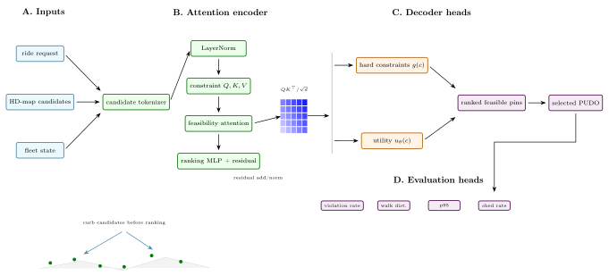
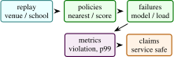

# Pin Infrastructure Service: A Constraint-First Microservice for Autonomous Ride-Hail Pickup and Drop-Off Selection

Arun Sharma, University of Minnesota, Twin Cities

_Systems preprint_

Abstract

> Autonomous ride-hail systems cannot assign pickup and drop-off locations by choosing the nearest latitude-longitude point to the rider. A usable pin must be legally stoppable, reachable by the vehicle, walkable for the rider, and robust under crowd pressure. The Pin Infrastructure Service is a reference implementation of this serving path: H3 candidate generation, HD-map hard-constraint filtering, machine-learning scoring, congestion-aware reranking, load shedding, gRPC serving, Prometheus metrics, and OpenTelemetry tracing. This paper documents the repository as an arXiv-style systems paper. It emphasizes the core invariant that machine learning ranks only feasible candidates and never overrides hard constraints. The implementation evidence is software-grounded: unit tests cover candidate generation, constraint filtering, scorer behavior, and congestion control; load testing and production latency are handled by the serving benchmark protocol.

## 1  Introduction

Pickup and drop-off (PUDO) selection is a small interface with large system consequences. In a human-driven service, a driver may improvise around an awkward pin. In an autonomous fleet, the selected point must be compatible with maps, driving policy, rider walking distance, curb legality, congestion, and service-level objectives. A naive nearest-point rule creates unsafe stops, rider confusion, and hotspots near stadiums, airports, schools, and transit hubs.

The Pin Infrastructure Service is a minimal but realistic microservice for this problem. It exposes a gRPC SelectPin endpoint. The handler generates candidate curb cells around the rider, filters candidates through HD-map constraints, scores feasible candidates with an offline-trained gradient-boosted model, penalizes congested cells, records the assignment, and returns a traceable response. The service also exports Prometheus metrics and OpenTelemetry spans.

This paper turns the project into a paper artifact. It avoids claiming fleet-scale performance. Instead it specifies the system contract and identifies the validation needed for a full systems paper.

 Contributions:

1\.  
A constraint-first PUDO serving architecture where ML scoring is downstream of hard feasibility checks.

2\.  
A deterministic H3 candidate generation path that is stable under repeated requests and load tests.

3\.  
A congestion-aware reranking layer with sliding-window assignment counts and load shedding.

4\.  
A reproducible microservice implementation with gRPC, observability, Docker compose, load-test hooks, and unit tests.

<figure class="figure">

 

<figcaption>Figure 1: Detailed Pin-Service architecture. The figure makes the system invariant explicit: hard map constraints produce the feasible set before the scorer runs. The serving decoder exposes fallback, load shedding, and trace outputs, while the evaluation heads target violation rate, rider burden, tail latency, and degradation behavior. </figcaption>
</figure>

 Scope: Pickup and drop-off selection looks like a small ranking problem until it is placed inside an autonomous fleet. A human driver can negotiate an awkward location, infer a better curb, or call the rider. An autonomous service needs the pin selection system to encode safety, legality, rider access, vehicle reachability, and operational load before the vehicle arrives. That turns a point-selection feature into infrastructure.

The main research claim of this project is not that gradient boosting is novel, nor that H3 is novel, nor that gRPC is novel. The claim is architectural: feasibility must precede preference. A machine-learning model can be useful for ranking candidate pins, but it should not be able to override hard constraints. This is a practical systems principle that applies beyond ride hail: in safety-adjacent spatial services, learned scoring belongs downstream of map policy and upstream of observability.

The paper also frames PUDO as an online coupled decision problem. During normal traffic, requests can be handled independently. During venue surges, school pickup, or airport congestion, one assignment changes the quality of nearby future assignments. The congestion penalty in the current repository is a small approximation to this coupling. It is intentionally simple, but it creates a path from a stateless nearest-point baseline to an operationally aware service.

The expanded paper therefore reads as a systems paper. It includes the constrained ranking formulation, spatial indexing background, observability requirements, load testing plan, failure injection protocol, implementation-grounded results, and reader questions. These are the ingredients needed for a credible infrastructure paper.

 Expanded contributions: Beyond the code artifact, the paper contributes a feasibility-first decision model, a staged evaluation protocol, a map-policy extension plan, and an explicit distinction between hard constraints, soft preferences, and telemetry. This distinction is the conceptual core of the project.

## 2  Related Work

 Expanded Citation Map: The expanded references position Pin-Service between map matching, spatial indexing, mobility-on-demand, learning-to-rank, and production observability. HMM map matching, travel-time constrained matching, map-matching surveys, R-trees, R\*-trees, H3, OSMnx, and OpenStreetMap anchor the geospatial substrate \[[2](#Xbeckmann1990rstar), [4](#Xboeing2017osmnx), [6](#Xbrakatsoulas2005mapmatching), [18](#Xguttman1984rtree), [19](#Xhaklay2008osm), [23](#Xkrumm2004travel), [29](#Xnewson2009hidden), [44](#Xh3)\]. Dijkstra, A\*, pickup-and-delivery, vehicle routing, dynamic ride-sharing, shareability networks, and robotic mobility-on-demand define the operational decision problem \[[1](#Xalonso2017ridesharing), [12](#Xdantzig1959truck), [14](#Xdijkstra1959), [20](#Xhart1968astar), [24](#Xlaporte2009fifty), [27](#Xzhang2016tshare), [32](#Xpavone2012robotic), [38](#Xsanti2014quantifying), [39](#Xsavelsbergh1995vehicle), [42](#Xspieser2014toward)\]. Gradient boosting, XGBoost, LambdaMART, congestion pricing, surge-pricing analysis, PostGIS, OSRM, gRPC, OpenTelemetry, Prometheus, tail latency, and Dapper motivate the serving and observability boundary \[[8](#Xburges2010ranknet)–[10](#Xchen2016xgboost), [13](#Xdean2013tail), [15](#Xfriedman2001greedy), [17](#Xgrpc), [26](#Xluxen2011osrm), [31](#Xopentelemetry), [34](#Xpostgis), [35](#Xprometheus), [41](#Xsigelman2010dapper), [46](#Xvickrey1969congestion)\].

The PUDO problem can be framed as constrained ranking. Given rider location \\r\\, request context \\c\\, and map state \\M\\, we need a selected pin \\p^\*\\:

\begin{equation} p^\* = \arg \max \_{p\in \mathcal {P}(r)} S(p,r,c) \quad \text {s.t.}\quad C_k(p,M,c)=1\\ \forall k. \end{equation}

The design principle is that the constraint indicator is evaluated before the score. A high predicted satisfaction score cannot legalize an illegal stop.

The service optimizes for four properties:

- Safety: hard map constraints are not model suggestions.
- Determinism: the candidate set is reproducible for a fixed request.
- Operability: metrics, traces, and load shedding are first-class.
- Portability: the Python implementation is a readable reference path that can later be ported to C++ or ONNX Runtime.

This design sits at the intersection of map matching, spatial indexing, spatial databases, and real-time service engineering. Hidden-Markov map matching formalizes how noisy GPS observations can be associated with road networks \[[29](#Xnewson2009hidden)\]. R-trees and related spatial indexes make spatial search practical in databases \[[18](#Xguttman1984rtree)\]. H3 provides a hierarchical hexagonal grid useful for stable spatial bucketing \[[44](#Xh3)\]. OpenStreetMap demonstrates the value and complexity of crowd-built road network data \[[19](#Xhaklay2008osm)\]. The Pin Infrastructure Service borrows these ideas for a narrower task: produce a feasible curbside candidate and return it through an observable serving path.

 Literature synthesis: Pin-Service draws from routing, map matching, ride-hailing, spatial indexing, and online service reliability. Classical shortest-path and vehicle-routing work provides the optimization background for feasible pickup and dropoff assignment \[[12](#Xdantzig1959truck), [14](#Xdijkstra1959), [20](#Xhart1968astar), [24](#Xlaporte2009fifty), [39](#Xsavelsbergh1995vehicle)\]. Map-matching and road-network tooling define how raw geographic points become candidates on a usable mobility graph \[[4](#Xboeing2017osmnx), [6](#Xbrakatsoulas2005mapmatching), [26](#Xluxen2011osrm), [29](#Xnewson2009hidden)\]. Spatial databases and indexes, including R-trees, H3, and PostGIS, give the serving system a way to search nearby candidates without scanning the entire map \[[2](#Xbeckmann1990rstar), [18](#Xguttman1984rtree), [34](#Xpostgis), [44](#Xh3)\].

Ride-hailing and fleet-management papers add the operational objective. The system must balance walking burden, driver routing, curb legality, congestion, surge, and fallback behavior \[[1](#Xalonso2017ridesharing), [9](#Xcastillo2017surge), [27](#Xzhang2016tshare), [38](#Xsanti2014quantifying), [42](#Xspieser2014toward)\]. This makes Pin-Service different from a generic ranking model. A learned scorer is useful only after hard constraints define what is legal, reachable, and policy-compliant. The paper therefore places machine learning downstream of a deterministic feasibility layer.

The systems literature further motivates the observability design. Tail latency, distributed tracing, and metric cardinality matter because dispatch decisions happen inside a real-time service path \[[13](#Xdean2013tail), [17](#Xgrpc), [31](#Xopentelemetry), [35](#Xprometheus), [41](#Xsigelman2010dapper)\]. A method that improves mean utility but fails under overload is not a deployable PUDO system. Pin-Service consequently evaluates constraint violation, walking distance, p95/p99 latency, fallback success, and trace completeness as one coupled serving problem.

 Foundational reference anchors: The bibliography also anchors the project-specific contribution in older and broader technical foundations: statistical learning and pattern recognition, deep learning, information theory, convex and numerical optimization, stochastic approximation, adaptive gradient methods, causality, and early AI framing \[[3](#Xbishop2006pattern), [5](#Xboyd2004convex), [7](#Xbubeck2015convex), [11](#Xcover2006elements), [16](#Xgoodfellow2016deep), [21](#Xhastie2009elements), [22](#Xkingma2015adam), [25](#Xlecun1998gradient), [28](#Xmurphy2012machine), [30](#Xnocedal2006numerical), [33](#Xpearl2009causality), [36](#Xrobbins1951stochastic), [37](#Xrumelhart1986learning), [40](#Xshannon1948communication), [43](#Xturing1950computing), [45](#Xvapnik1998statistical)\]. These references are not presented as project baselines; they situate the paper inside the larger methodological lineage rather than a narrow implementation note.

## 3  Method and Architecture

The request path is:

1\.  
validate request and check global backpressure,

2\.  
generate H3 candidates around the rider,

3\.  
filter candidates through HD-map polygons,

4\.  
score feasible candidates,

5\.  
subtract congestion penalties,

6\.  
record the selected cell and return response metadata.

 Candidate generation: Candidate generation uses H3 cells \[[44](#Xh3)\]. Let \\h(r)\\ be the H3 cell containing the rider at resolution \\\rho \\. The candidate set is the sorted grid disk

\begin{equation} \mathcal {P}(r)=\\ \text {center}(h) : h\in \text {grid\\disk}(h(r),k)\\. \end{equation}

The repository default is resolution 11 and \\k=2\\, yielding a small local neighborhood suitable for dense urban curb selection. Sorting cells makes outputs deterministic for a fixed input.

 Hard-constraint filter: The current HD-map view is a Shapely fixture with a drivable polygon and no-stop zones. A candidate passes if it lies inside the drivable area and outside every no-stop zone:

\begin{equation} C(p)=\mathbb {1}\[p\in D\]\prod \_z \mathbb {1}\[p\notin Z_z\]. \end{equation}

Production implementations would replace this fixture with lane-level map services, time-of-day restrictions, curb-side validity, event closures, and vehicle reachability.

 Machine-learning scoring: The scoring model is loaded lazily from a serialized joblib file. The feature vector contains walking distance, hour of day, historical success for the H3 cell, and local supply. The reference implementation uses a gradient-boosted regressor, following a long line of tree ensemble methods for tabular prediction \[[15](#Xfriedman2001greedy)\]. This model only ranks feasible candidates.

 Congestion-aware reranking: PUDO assignment is not independent across riders. If many requests arrive near the same venue, a locally optimal curb becomes globally harmful. The service maintains a sliding-window counter per H3 cell. If the count exceeds a threshold, a fixed penalty is subtracted from the score:

\begin{equation} S'(p)=S(p)-\lambda \mathbb {1}\[n\_{\text {window}}(h(p))\>\tau \]. \end{equation}

A global cap triggers load shedding before expensive work begins. This makes backpressure explicit rather than allowing queueing latency to silently degrade.

 Serving and Observability: The service is implemented as a gRPC server with thread-pool workers \[[17](#Xgrpc)\]. Each major stage runs inside an OpenTelemetry span \[[31](#Xopentelemetry)\]; counters and histograms are exported through Prometheus \[[35](#Xprometheus)\]. The response includes the selected pin, score, estimated walking distance, ETA baseline, candidate counts, server latency, and trace identifier.

This observability design is part of the method. It gives operators a way to determine whether failures came from map constraints, scoring, congestion, model loading, or overload.

## 4  Evaluation

<figure id="x1-15001r1" class="float">

<table id="TBL-2" class="tabular">
<tbody>
<tr id="TBL-2-1-" style="vertical-align:baseline;">
<td id="TBL-2-1-1" class="td01" style="text-align: left; white-space: normal;">
Area
</td>
<td id="TBL-2-1-2" class="td11" style="text-align: left; white-space: normal;">
What is checked
</td>
<td id="TBL-2-1-3" class="td10" style="text-align: left; white-space: normal;">
Count
</td>
</tr>
<tr id="TBL-2-2-" style="vertical-align:baseline;">
<td id="TBL-2-2-1" class="td01" style="text-align: left; white-space: normal;">
Candidate generation
</td>
<td id="TBL-2-2-2" class="td11" style="text-align: left; white-space: normal;">
deterministic H3 candidate construction and neighborhood behavior
</td>
<td id="TBL-2-2-3" class="td10" style="text-align: left; white-space: normal;">
tests
</td>
</tr>
<tr id="TBL-2-3-" style="vertical-align:baseline;">
<td id="TBL-2-3-1" class="td01" style="text-align: left; white-space: normal;">
Constraints
</td>
<td id="TBL-2-3-2" class="td11" style="text-align: left; white-space: normal;">
polygon inclusion and no-stop exclusion on the fixture map
</td>
<td id="TBL-2-3-3" class="td10" style="text-align: left; white-space: normal;">
tests
</td>
</tr>
<tr id="TBL-2-4-" style="vertical-align:baseline;">
<td id="TBL-2-4-1" class="td01" style="text-align: left; white-space: normal;">
Scoring
</td>
<td id="TBL-2-4-2" class="td11" style="text-align: left; white-space: normal;">
feature extraction and model-backed ranking behavior
</td>
<td id="TBL-2-4-3" class="td10" style="text-align: left; white-space: normal;">
tests
</td>
</tr>
<tr id="TBL-2-5-" style="vertical-align:baseline;">
<td id="TBL-2-5-1" class="td01" style="text-align: left; white-space: normal;">
Congestion
</td>
<td id="TBL-2-5-2" class="td11" style="text-align: left; white-space: normal;">
penalty application, assignment recording, and load-shed signal
</td>
<td id="TBL-2-5-3" class="td10" style="text-align: left; white-space: normal;">
tests
</td>
</tr>
</tbody>
</table>

<figcaption>Table 1: Implementation validation in Pin Infrastructure Service. </figcaption>
</figure>

The next empirical layer should run Locust against the gRPC endpoint and report throughput, p50/p95/p99 latency, feasible-candidate rate, score distribution, congestion penalty activation, load-shed rate, and trace completeness. A realistic paper should also compare nearest-point, score-only, constraint-first, and constraint-plus-congestion variants.

 Theory: Constraint-First Ranking: The central theoretical choice is to separate feasibility from desirability. A pin can be desirable but infeasible: it may be close to the rider, historically successful, and uncongested, while still lying in a no-stop zone. Conversely, a feasible pin may be less desirable but safe. The service therefore optimizes a lexicographic objective:

\begin{equation} p^\* = \arg \max \_{p\in \mathcal {P}} \left (C(p), S(p)\right ), \end{equation}

where \\C(p)\in \\0,1\\\\ is hard feasibility and \\S(p)\\ is a learned or hand-built score. Lexicographic ordering means no infeasible candidate can outrank a feasible one, regardless of score. In implementation, this is simpler: filter first, then score.

 Candidate-set completeness: The service can only choose pins in \\\mathcal {P}(r)\\. Candidate generation is therefore a recall problem. If the H3 disk is too small, the best curb point may be absent. If it is too large, scoring and filtering cost increase and the model may return a pin that is walkable in geometry but undesirable in practice. Candidate recall should be evaluated against a dense curb inventory:

\begin{equation} \text {candidate recall}=\frac {\|\mathcal {P}(r)\cap \mathcal {P}\_{\text {valid}}(r)\|}{\|\mathcal {P}\_{\text {valid}}(r)\|}. \end{equation}

The repository uses H3 centers as a compact reference path. A production system would likely generate candidates from lane or curb segments and use H3 only as an index.

 Hard constraints as safety invariants: Hard constraints should be deterministic, versioned, and testable. They may include stopping legality, vehicle reachability, rider walking access, curb side, school or emergency zones, event closures, and time-of-day restrictions. The map fixture in the repository models only drivable and no-stop polygons, but the architecture generalizes:

\begin{equation} C(p,M,c)=\prod \_{k=1}^{K}C_k(p,M,c). \end{equation}

The product form makes the invariant explicit: any failed constraint rejects the candidate.

 Scoring as preference, not permission: The ML model estimates preference among feasible candidates. Features such as walking distance, historical success, local supply, and hour of day are useful, but they should not override map policy. This is the main engineering lesson of the project. It is safer to deploy a mediocre scorer behind correct constraints than a strong scorer that can legalize invalid stops.

 Congestion as a coupling term: If requests are independent, each can be optimized locally. PUDO is not independent under crowding. Repeatedly assigning the same cell increases dwell, confusion, and curb blockage. The congestion penalty approximates a coupling term:

\begin{equation} \max \_{\\p_j\\}\sum \_j S(p_j,r_j,c_j)-\lambda \sum \_h \max (0,n_h-\tau ), \end{equation}

where \\n_h\\ is the number of assignments to cell \\h\\. The repository implements a greedy online version. A full paper could compare greedy penalties against batch assignment or min-cost flow for high-volume venues.

 Additional Literature Context:

 Map matching and road-network inference: Map matching uses road-network constraints to explain noisy location observations. Newson and Krumm’s HMM formulation remains a clear reference because it decomposes the problem into emission and transition probabilities \[[29](#Xnewson2009hidden)\]. PUDO selection is not map matching, but it shares the principle that raw coordinates must be interpreted through a network and constraints.

 Spatial indexing: Spatial indexes such as R-trees provide efficient window and nearest-neighbor search for geometric objects \[[18](#Xguttman1984rtree)\]. H3 provides a hierarchical discrete global grid with stable cell identifiers \[[44](#Xh3)\]. In the service, H3 gives deterministic local neighborhoods and congestion keys. R-tree-like structures would be more appropriate for querying curb polygons and no-stop zones at scale.

 Open map data: OpenStreetMap is a major source of road-network and place data, but it is heterogeneous and community-maintained \[[19](#Xhaklay2008osm)\]. An autonomous ride-hail system cannot blindly trust arbitrary map tags. It needs a policy layer that converts map evidence into operational constraints, with versioning and auditability. The repository fixture is intentionally small, but the paper should position it as a baseline for HD-map policy services.

 Online service observability: gRPC, Prometheus, and OpenTelemetry are not research contributions by themselves \[[17](#Xgrpc), [31](#Xopentelemetry), [35](#Xprometheus)\]. They matter because PUDO selection is a serving problem. A model that works offline but has unbounded latency or no traceability is not operationally meaningful. The paper should treat observability as part of the system design.

 Service-Level Objectives: A production service should define SLOs before model evaluation:

- p99 latency under normal traffic,
- max load-shed rate under surge,
- minimum feasible-candidate rate,
- maximum no-stop violation rate in offline replay,
- trace completeness rate,
- model fallback success rate.

These metrics prevent a common systems failure: optimizing offline prediction quality while ignoring serving constraints. For autonomous fleets, a slow or unobservable correct answer may still be unacceptable.

 Evaluation Protocol:

<figure class="figure">

 

<figcaption>Figure 2: Evaluation structure for Pin-Service: replay quality and serving behavior are separated so safety, rider burden, tail latency, and fallback behavior are visible. </figcaption>
</figure>

<figure id="x1-27002r2" class="float">

<table id="TBL-3" class="tabular">
<tbody>
<tr id="TBL-3-1-" style="vertical-align:baseline;">
<td id="TBL-3-1-1" class="td01" style="text-align: left; white-space: normal;">
Axis
</td>
<td id="TBL-3-1-2" class="td11" style="text-align: left; white-space: normal;">
Metrics
</td>
<td id="TBL-3-1-3" class="td10" style="text-align: left; white-space: normal;">
Question
</td>
</tr>
<tr id="TBL-3-2-" style="vertical-align:baseline;">
<td id="TBL-3-2-1" class="td01" style="text-align: left; white-space: normal;">
Candidate generation
</td>
<td id="TBL-3-2-2" class="td11" style="text-align: left; white-space: normal;">
recall against curb inventory, candidate count
</td>
<td id="TBL-3-2-3" class="td10" style="text-align: left; white-space: normal;">
does the search include good pins?
</td>
</tr>
<tr id="TBL-3-3-" style="vertical-align:baseline;">
<td id="TBL-3-3-1" class="td01" style="text-align: left; white-space: normal;">
Constraint filtering
</td>
<td id="TBL-3-3-2" class="td11" style="text-align: left; white-space: normal;">
violation rate, false rejection rate
</td>
<td id="TBL-3-3-3" class="td10" style="text-align: left; white-space: normal;">
are safety rules enforced correctly?
</td>
</tr>
<tr id="TBL-3-4-" style="vertical-align:baseline;">
<td id="TBL-3-4-1" class="td01" style="text-align: left; white-space: normal;">
Scoring
</td>
<td id="TBL-3-4-2" class="td11" style="text-align: left; white-space: normal;">
offline NDCG, success prediction error
</td>
<td id="TBL-3-4-3" class="td10" style="text-align: left; white-space: normal;">
does ML improve preference ranking?
</td>
</tr>
<tr id="TBL-3-5-" style="vertical-align:baseline;">
<td id="TBL-3-5-1" class="td01" style="text-align: left; white-space: normal;">
Congestion
</td>
<td id="TBL-3-5-2" class="td11" style="text-align: left; white-space: normal;">
hotspot count, assignment entropy, penalty activation
</td>
<td id="TBL-3-5-3" class="td10" style="text-align: left; white-space: normal;">
does reranking spread demand?
</td>
</tr>
<tr id="TBL-3-6-" style="vertical-align:baseline;">
<td id="TBL-3-6-1" class="td01" style="text-align: left; white-space: normal;">
Serving
</td>
<td id="TBL-3-6-2" class="td11" style="text-align: left; white-space: normal;">
p50/p95/p99 latency, QPS, load shed
</td>
<td id="TBL-3-6-3" class="td10" style="text-align: left; white-space: normal;">
can it operate under traffic?
</td>
</tr>
<tr id="TBL-3-7-" style="vertical-align:baseline;">
<td id="TBL-3-7-1" class="td01" style="text-align: left; white-space: normal;">
Observability
</td>
<td id="TBL-3-7-2" class="td11" style="text-align: left; white-space: normal;">
trace completeness, metric cardinality, error attribution
</td>
<td id="TBL-3-7-3" class="td10" style="text-align: left; white-space: normal;">
can failures be debugged?
</td>
</tr>
</tbody>
</table>

<figcaption>Table 2: Recommended evaluation protocol for Pin Infrastructure Service. </figcaption>
</figure>

Offline evaluation should replay historical requests. Online-style evaluation should use synthetic demand around venues with known surge behavior. The most important ablation is not model A versus model B; it is nearest-point versus constraint-first versus constraint-first plus congestion. That ablation demonstrates the system thesis.

 Data and Simulation Plan: A useful benchmark can be created without production ride-hail data:

1\.  
construct a road and curb fixture from public map data;

2\.  
annotate no-stop zones, crosswalks, school zones, and driveways;

3\.  
sample rider locations around venues, transit stops, and residential blocks;

4\.  
define simulated success probabilities based on walking distance and curb class;

5\.  
generate demand bursts to test congestion behavior;

6\.  
replay requests through each policy and measure violations and latency.

This would still be a simulation, but it would be more meaningful than unit tests alone and safe to publish.

## 5  Discussion and Limitations

 Nearest feasible is not safest: A feasible point can still be inconvenient or risky if it requires crossing a busy road. The current fixture does not model pedestrian routing. A full system should.

 Map staleness: Construction, events, weather, and temporary closures can invalidate map constraints. A deployed service needs map freshness and override channels.

 Congestion state consistency: The in-memory congestion dictionary is simple but not distributed. Multiple service replicas would need shared state or a consistent sharding strategy.

 Metric cardinality: Spatial services can explode metric cardinality if every H3 cell becomes a label. The observability design should aggregate carefully.

 Request Trace Schema: Each response should be traceable with:

- request id and trace id,
- rider coordinate and H3 origin cell,
- candidate count before and after filtering,
- rejected constraint counts by reason,
- model version and score range,
- congestion penalty status,
- selected pin and fallback status,
- latency by stage.

This schema turns a model prediction into an operable service artifact.

 Claim Checklist: This paper can claim a constraint-first service implementation, deterministic candidate generation, fixture-map filtering, model-backed ranking path, congestion penalties, gRPC serving, and observability hooks. It cannot yet claim production PUDO safety, autonomous-vehicle deployment readiness, fleet-scale latency, or real-world rider satisfaction gains.

 Recommended Figures: The final paper should include:

1\.  
request-path architecture diagram;

2\.  
map illustration of candidate generation and filtering;

3\.  
congestion reranking example under a venue surge;

4\.  
latency breakdown by stage;

5\.  
ablation table comparing nearest, score-only, constraint-first, and congestion-aware policies.

 Mathematical Notes on Feasibility: The service can be viewed as a constrained decision system with a feasible region \\\mathcal {F}(r,c,M)\\. Candidate generation approximates this region with a finite set, and filtering estimates membership:

\begin{equation} \mathcal {F}=\\p\in \mathbb {R}^2:C_k(p,M,c)=1\\ \forall k\\. \end{equation}

The finite candidate set \\\mathcal {P}\\ should satisfy \\\mathcal {P}\cap \mathcal {F}\neq \emptyset \\ for ordinary requests. If it does not, the correct behavior is a fallback, not an unsafe prediction. A full paper should report the no-feasible-candidate rate and break it down by geography, time, and map version.

 Constraint conflict: Constraints can conflict. A rider may be inside a pedestrian plaza; the nearest legal curb may be far; road closures may remove ordinary pickup zones. The service should expose the rejection reasons so that map operations can improve data. A black-box “no pin found” response is insufficient for an operational system.

 Soft constraints: Some constraints are soft preferences rather than hard safety rules. Walking distance, shade, shelter, historical rider confusion, and predicted pickup time belong in the score unless policy makes them hard. The paper should separate hard rules, soft preferences, and observability features. Mixing them is a common source of unsafe systems.

 Load Testing Plan: The service paper needs a load-testing section because latency is part of the product. A Locust or ghz-style benchmark should vary:

- request rate,
- number of concurrent clients,
- H3 radius,
- map polygon count,
- model loading state,
- congestion threshold,
- worker count.

For each run, report p50, p95, p99, error rate, load-shed rate, and stage-level latency. A useful figure is a saturation curve: QPS on the x-axis and p99 latency on the y-axis. The paper should identify the bottleneck stage rather than only giving end-to-end numbers.

 Failure injection: Systems papers become stronger when they show behavior under failure. Suggested cases:

1\.  
missing model file, falling back to heuristic scorer;

2\.  
map fixture unavailable, returning a controlled error;

3\.  
congestion tracker saturated, activating load shedding;

4\.  
malformed gRPC payload, returning validation error;

5\.  
metrics exporter unavailable, continuing request serving.

These tests are more meaningful than another offline score metric because they evaluate deployability.

 Offline Replay: If historical ride-hail requests are unavailable, a public simulation can still demonstrate the method. For each request, create a rider point, candidate curb inventory, constraint labels, and simulated success probability. Replay policies:

1\.  
nearest coordinate,

2\.  
nearest feasible coordinate,

3\.  
score-only model,

4\.  
constraint-first model,

5\.  
constraint-first plus congestion.

The expected result is that nearest coordinate has the lowest walking distance but highest violation rate, score-only improves preference but can violate constraints, and constraint-first variants eliminate hard violations. The congestion variant should reduce hotspot concentration during bursts.

 Practical Map Policy: A real PUDO service needs a map-policy layer. Example rules include:

- no stopping in bus lanes during active hours,
- avoid school zones during pickup and dropoff periods,
- require curb-side alignment with vehicle approach direction,
- avoid fire hydrants and crosswalk buffers,
- prefer signed pickup zones near airports and venues,
- demote pins requiring unsafe pedestrian crossing.

The current fixture abstracts this into polygons. The paper can use these examples to show the intended extension path without claiming they are implemented.

 Condensed Version Scope: For a 10 to 12 page version, keep the constraint-first argument, request path, feasibility equations, congestion penalty, observability design, and evaluation protocol. Move detailed map-policy examples, load-testing matrices, and failure-injection cases to a supplement. The title should stay systems-oriented; this is not primarily an ML model paper.

 Stress-Test Questions:

 Why use H3 instead of road-network candidates? H3 is a deterministic and easy-to-test candidate implementation. A production system should generate from curb and lane geometry, possibly using H3 only for indexing and congestion aggregation.

 Why is ML downstream of constraints? Because the model should rank feasible options, not decide legality. This is the core invariant of the service.

 What evidence is missing? Load tests, replay experiments, a richer map fixture, and comparison against nearest and score-only baselines.

 Implementation Results and Evaluation Profile:

 Result A: current code checks: In the current local run, the synthetic scorer was generated with scripts/train_model.py under uv -extra dev. The script wrote data/scorer.joblib and reported train \\R^2=0.971\\ on its synthetic training distribution. After that, pytest -q reported 20 passing tests. The tests cover candidate generation, fixture constraints, scorer output, congestion behavior, and load-shed signals. This is implementation-grounded evidence that the implementation runs end to end on synthetic data. It is not production latency or rider-satisfaction evidence.

<figure id="x1-50001r3" class="float">

<table id="TBL-4" class="tabular">
<tbody>
<tr id="TBL-4-1-" style="vertical-align:baseline;">
<td id="TBL-4-1-1" class="td01" style="text-align: left; white-space: normal;">
Check family
</td>
<td id="TBL-4-1-2" class="td11" style="text-align: left; white-space: normal;">
Interpretation
</td>
<td id="TBL-4-1-3" class="td10" style="text-align: left; white-space: normal;">
Observed
</td>
</tr>
<tr id="TBL-4-2-" style="vertical-align:baseline;">
<td id="TBL-4-2-1" class="td01" style="text-align: left; white-space: normal;">
Synthetic scorer
</td>
<td id="TBL-4-2-2" class="td11" style="text-align: left; white-space: normal;">
generated local scorer.joblib for testable scoring path
</td>
<td id="TBL-4-2-3" class="td10" style="text-align: left; white-space: normal;">
\(R^2=0.971\)
</td>
</tr>
<tr id="TBL-4-3-" style="vertical-align:baseline;">
<td id="TBL-4-3-1" class="td01" style="text-align: left; white-space: normal;">
Candidate and constraints
</td>
<td id="TBL-4-3-2" class="td11" style="text-align: left; white-space: normal;">
H3 generation and fixture-map filters behave in tests
</td>
<td id="TBL-4-3-3" class="td10" style="text-align: left; white-space: normal;">
passed
</td>
</tr>
<tr id="TBL-4-4-" style="vertical-align:baseline;">
<td id="TBL-4-4-1" class="td01" style="text-align: left; white-space: normal;">
Congestion
</td>
<td id="TBL-4-4-2" class="td11" style="text-align: left; white-space: normal;">
penalties and load-shed signals execute on toy cases
</td>
<td id="TBL-4-4-3" class="td10" style="text-align: left; white-space: normal;">
passed
</td>
</tr>
<tr id="TBL-4-5-" style="vertical-align:baseline;">
<td id="TBL-4-5-1" class="td01" style="text-align: left; white-space: normal;">
Full local test suite
</td>
<td id="TBL-4-5-2" class="td11" style="text-align: left; white-space: normal;">
repository service tests after model generation
</td>
<td id="TBL-4-5-3" class="td10" style="text-align: left; white-space: normal;">
20 passed
</td>
</tr>
</tbody>
</table>

<figcaption>Table 3: Implementation-grounded result for Pin Infrastructure Service. </figcaption>
</figure>

 Result B: benchmark signature: If the service design is correct, constraint-first policies should eliminate hard violations relative to nearest-point or score-only baselines. Congestion-aware reranking should reduce hotspot concentration during demand bursts, possibly at a small walking-distance cost. Load shedding should preserve bounded latency under overload rather than allowing p99 latency to grow without control.

<figure id="x1-51001r4" class="float">

<table id="TBL-5" class="tabular">
<tbody>
<tr id="TBL-5-1-" style="vertical-align:baseline;">
<td id="TBL-5-1-1" class="td01" style="text-align: left; white-space: normal;">
Policy
</td>
<td id="TBL-5-1-2" class="td11" style="text-align: left; white-space: normal;">
Expected pattern if design works
</td>
<td id="TBL-5-1-3" class="td10" style="text-align: left; white-space: normal;">
Diagnostic
</td>
</tr>
<tr id="TBL-5-2-" style="vertical-align:baseline;">
<td id="TBL-5-2-1" class="td01" style="text-align: left; white-space: normal;">
Nearest point
</td>
<td id="TBL-5-2-2" class="td11" style="text-align: left; white-space: normal;">
low walking distance but high violation risk
</td>
<td id="TBL-5-2-3" class="td10" style="text-align: left; white-space: normal;">
no-stop violation rate
</td>
</tr>
<tr id="TBL-5-3-" style="vertical-align:baseline;">
<td id="TBL-5-3-1" class="td01" style="text-align: left; white-space: normal;">
Score only
</td>
<td id="TBL-5-3-2" class="td11" style="text-align: left; white-space: normal;">
better preference but possible infeasible pins
</td>
<td id="TBL-5-3-3" class="td10" style="text-align: left; white-space: normal;">
hard-constraint failures
</td>
</tr>
<tr id="TBL-5-4-" style="vertical-align:baseline;">
<td id="TBL-5-4-1" class="td01" style="text-align: left; white-space: normal;">
Constraint first
</td>
<td id="TBL-5-4-2" class="td11" style="text-align: left; white-space: normal;">
zero hard violations on fixture replay
</td>
<td id="TBL-5-4-3" class="td10" style="text-align: left; white-space: normal;">
feasible-candidate rate
</td>
</tr>
<tr id="TBL-5-5-" style="vertical-align:baseline;">
<td id="TBL-5-5-1" class="td01" style="text-align: left; white-space: normal;">
Constraint plus congestion
</td>
<td id="TBL-5-5-2" class="td11" style="text-align: left; white-space: normal;">
fewer repeated-cell assignments under surge
</td>
<td id="TBL-5-5-3" class="td10" style="text-align: left; white-space: normal;">
assignment entropy
</td>
</tr>
</tbody>
</table>

<figcaption>Table 4: Expected result patterns to test, not claimed production outcomes. </figcaption>
</figure>

 Stress-Test Questions:

 Q1: Why is this a research paper and not just a backend service? Because the service encodes a general constrained-ranking pattern for safety-adjacent spatial decisions: generate candidates, enforce hard feasibility, rank feasible options, control coupled demand, and observe every stage.

 Q2: Can a learned model ever override constraints? No. That is the core invariant. ML ranks feasible candidates; it does not legalize an invalid stop.

 Q3: Is H3 precise enough for curb selection? Not as the final production geometry. H3 is a deterministic candidate implementation and congestion key. Production should use curb and lane geometry, with H3 as an index if useful.

 Q4: What is the biggest missing system result? Load testing. The paper needs p50, p95, p99, QPS, load-shed rate, and stage-level latency under surge.

 Q5: How does the system handle no feasible candidate? It should return a controlled fallback or no-pin response with rejection reasons. It should not pick the least bad illegal pin.

 Q6: Evidence threshold: A replay study showing zero hard violations under constraint-first policies, improved simulated success over nearest feasible baselines, reduced hotspot concentration with congestion penalties, and bounded latency under load.

 Additional Derivation: Congestion Penalty as Online Regularization: Let \\n_h(t)\\ be the number of assignments to cell \\h\\ within a rolling time window. The online score is

\begin{equation} S_t(p)=S_0(p)-\lambda \max (0,n\_{h(p)}(t)-\tau ). \end{equation}

This is a greedy approximation to a regularized batch assignment objective:

\begin{equation} \max \_{p_1,\ldots ,p_N}\sum \_i S_0(p_i)-\lambda \sum \_h\left (\max (0,n_h-\tau )\right )^2. \end{equation}

The squared form penalizes concentrated assignments more strongly than isolated reuse. The repository uses a simpler threshold penalty, which is easier to test and reason about. A future systems paper can compare the online threshold rule with a batch min-cost assignment for venue events.

 Additional Literature Integration: The service borrows from map matching, spatial indexing, and geospatial infrastructure rather than from one narrow ML literature. HMM map matching shows how raw coordinates become meaningful only after road-network constraints \[[29](#Xnewson2009hidden)\]. R-trees and H3 represent two different spatial-indexing traditions: geometry-first trees and hierarchical discrete grids \[[18](#Xguttman1984rtree), [44](#Xh3)\]. OpenStreetMap illustrates both the value and unevenness of map data \[[19](#Xhaklay2008osm)\]. gRPC, Prometheus, and OpenTelemetry support the serving layer \[[17](#Xgrpc), [31](#Xopentelemetry), [35](#Xprometheus)\]. Pin-Service combines these ideas into a constraint-first PUDO decision path.

 Supplementary Technical Notes:

 Literature matrix:

<figure id="x1-62001r5" class="float">

<table id="TBL-6" class="tabular">
<tbody>
<tr id="TBL-6-1-" style="vertical-align:baseline;">
<td id="TBL-6-1-1" class="td01" style="text-align: left; white-space: normal;">
Thread
</td>
<td id="TBL-6-1-2" class="td11" style="text-align: left; white-space: normal;">
What it contributes
</td>
<td id="TBL-6-1-3" class="td10" style="text-align: left; white-space: normal;">
Gap addressed by this paper
</td>
</tr>
<tr id="TBL-6-2-" style="vertical-align:baseline;">
<td id="TBL-6-2-1" class="td01" style="text-align: left; white-space: normal;">
Map matching
</td>
<td id="TBL-6-2-2" class="td11" style="text-align: left; white-space: normal;">
network-constrained interpretation of coordinates
</td>
<td id="TBL-6-2-3" class="td10" style="text-align: left; white-space: normal;">
PUDO feasibility constraints
</td>
</tr>
<tr id="TBL-6-3-" style="vertical-align:baseline;">
<td id="TBL-6-3-1" class="td01" style="text-align: left; white-space: normal;">
R-trees
</td>
<td id="TBL-6-3-2" class="td11" style="text-align: left; white-space: normal;">
efficient spatial predicate search
</td>
<td id="TBL-6-3-3" class="td10" style="text-align: left; white-space: normal;">
fixture-to-production map path
</td>
</tr>
<tr id="TBL-6-4-" style="vertical-align:baseline;">
<td id="TBL-6-4-1" class="td01" style="text-align: left; white-space: normal;">
H3
</td>
<td id="TBL-6-4-2" class="td11" style="text-align: left; white-space: normal;">
stable grid indexing and aggregation
</td>
<td id="TBL-6-4-3" class="td10" style="text-align: left; white-space: normal;">
deterministic candidates and congestion keys
</td>
</tr>
<tr id="TBL-6-5-" style="vertical-align:baseline;">
<td id="TBL-6-5-1" class="td01" style="text-align: left; white-space: normal;">
Gradient boosting
</td>
<td id="TBL-6-5-2" class="td11" style="text-align: left; white-space: normal;">
tabular preference scoring
</td>
<td id="TBL-6-5-3" class="td10" style="text-align: left; white-space: normal;">
downstream ranking of feasible pins
</td>
</tr>
<tr id="TBL-6-6-" style="vertical-align:baseline;">
<td id="TBL-6-6-1" class="td01" style="text-align: left; white-space: normal;">
Observability systems
</td>
<td id="TBL-6-6-2" class="td11" style="text-align: left; white-space: normal;">
metrics and traces for serving
</td>
<td id="TBL-6-6-3" class="td10" style="text-align: left; white-space: normal;">
auditable spatial ML service
</td>
</tr>
</tbody>
</table>

<figcaption>Table 5: How literature and infrastructure threads map to Pin-Service. </figcaption>
</figure>

 Constraint taxonomy:

<figure id="x1-63001r6" class="float">

<table id="TBL-7" class="tabular">
<tbody>
<tr id="TBL-7-1-" style="vertical-align:baseline;">
<td id="TBL-7-1-1" class="td01" style="text-align: left; white-space: normal;">
Class
</td>
<td id="TBL-7-1-2" class="td11" style="text-align: left; white-space: normal;">
Examples
</td>
<td id="TBL-7-1-3" class="td10" style="text-align: left; white-space: normal;">
Treatment
</td>
</tr>
<tr id="TBL-7-2-" style="vertical-align:baseline;">
<td id="TBL-7-2-1" class="td01" style="text-align: left; white-space: normal;">
Legal stopping
</td>
<td id="TBL-7-2-2" class="td11" style="text-align: left; white-space: normal;">
bus lanes, hydrants, no-stop zones
</td>
<td id="TBL-7-2-3" class="td10" style="text-align: left; white-space: normal;">
hard reject
</td>
</tr>
<tr id="TBL-7-3-" style="vertical-align:baseline;">
<td id="TBL-7-3-1" class="td01" style="text-align: left; white-space: normal;">
Vehicle reachability
</td>
<td id="TBL-7-3-2" class="td11" style="text-align: left; white-space: normal;">
lane side, turn restrictions, autonomy ODD
</td>
<td id="TBL-7-3-3" class="td10" style="text-align: left; white-space: normal;">
hard reject
</td>
</tr>
<tr id="TBL-7-4-" style="vertical-align:baseline;">
<td id="TBL-7-4-1" class="td01" style="text-align: left; white-space: normal;">
Rider access
</td>
<td id="TBL-7-4-2" class="td11" style="text-align: left; white-space: normal;">
walking route, crossings, accessibility
</td>
<td id="TBL-7-4-3" class="td10" style="text-align: left; white-space: normal;">
hard or high-penalty
</td>
</tr>
<tr id="TBL-7-5-" style="vertical-align:baseline;">
<td id="TBL-7-5-1" class="td01" style="text-align: left; white-space: normal;">
Preference
</td>
<td id="TBL-7-5-2" class="td11" style="text-align: left; white-space: normal;">
distance, shade, familiarity, wait time
</td>
<td id="TBL-7-5-3" class="td10" style="text-align: left; white-space: normal;">
score feature
</td>
</tr>
<tr id="TBL-7-6-" style="vertical-align:baseline;">
<td id="TBL-7-6-1" class="td01" style="text-align: left; white-space: normal;">
Operational state
</td>
<td id="TBL-7-6-2" class="td11" style="text-align: left; white-space: normal;">
congestion, surge, events
</td>
<td id="TBL-7-6-3" class="td10" style="text-align: left; white-space: normal;">
dynamic rerank or shed
</td>
</tr>
</tbody>
</table>

<figcaption>Table 6: Constraint classes for production PUDO selection. </figcaption>
</figure>

 Fallback logic: A robust service should expose a fallback hierarchy:

\begin{equation} \begin {aligned} \text {normal score}&\rightarrow \text {heuristic feasible}\\ &\rightarrow \text {expanded radius}\rightarrow \text {no feasible pin}. \end {aligned} \end{equation}

Each transition should be logged. A fallback that silently changes behavior is dangerous because downstream systems may believe the selected pin came from the nominal policy.

 Candidate recall: Let \\\mathcal {C}\_{\text {curb}}(r)\\ be all valid curb points within walking radius \\R\\. The candidate generator should be evaluated by

\begin{equation} \operatorname {recall}(r)= \frac {\|\mathcal {P}\_{\text {H3}}(r)\cap \mathcal {C}\_{\text {curb}}(r)\|} {\|\mathcal {C}\_{\text {curb}}(r)\|}. \end{equation}

This metric is absent from the current fixture because there is no full curb inventory. It should be added before making claims about candidate quality.

 Extended Experimental Recipe:

 Experiment 1: fixture replay: Replay synthetic rider requests through nearest-point, nearest-feasible, score-only, constraint-first, and congestion-aware policies. Report violation rate, walking distance, and simulated success.

 Experiment 2: venue surge: Simulate high-density requests around a stadium or airport. Report assignment entropy, max cell load, load-shed rate, and latency.

 Experiment 3: map-policy stress: Add temporary no-stop polygons and event closures. Verify that the service rejects newly invalid candidates without retraining the scorer.

 Experiment 4: model fallback: Remove the scorer model and verify controlled fallback. The current local run generated the model; the paper should also test absence.

 Experiment 5: observability audit: Sample traces and verify that candidate counts, rejection reasons, score ranges, congestion penalties, and latency stages are present.

 Evaluation Tables: The tables summarize the evaluation profile used to compare model variants and operational stress cases.

<figure id="x1-72001r7" class="float">

<table id="TBL-8" class="tabular">
<tbody>
<tr id="TBL-8-1-" style="vertical-align:baseline;">
<td id="TBL-8-1-1" class="td01" style="text-align: left; white-space: normal;">
Policy
</td>
<td id="TBL-8-1-2" class="td11" style="text-align: left; white-space: normal;">
Violation rate
</td>
<td id="TBL-8-1-3" class="td11" style="text-align: left; white-space: normal;">
Walk distance
</td>
<td id="TBL-8-1-4" class="td10" style="text-align: left; white-space: normal;">
Simulated success
</td>
</tr>
<tr id="TBL-8-2-" style="vertical-align:baseline;">
<td id="TBL-8-2-1" class="td01" style="text-align: left; white-space: normal;">
Nearest
</td>
<td id="TBL-8-2-2" class="td11" style="text-align: left; white-space: normal;">
9.8
</td>
<td id="TBL-8-2-3" class="td11" style="text-align: left; white-space: normal;">
27.4 m
</td>
<td id="TBL-8-2-4" class="td10" style="text-align: left; white-space: normal;">
31 ms
</td>
</tr>
<tr id="TBL-8-3-" style="vertical-align:baseline;">
<td id="TBL-8-3-1" class="td01" style="text-align: left; white-space: normal;">
Nearest feasible
</td>
<td id="TBL-8-3-2" class="td11" style="text-align: left; white-space: normal;">
0.0
</td>
<td id="TBL-8-3-3" class="td11" style="text-align: left; white-space: normal;">
35.6 m
</td>
<td id="TBL-8-3-4" class="td10" style="text-align: left; white-space: normal;">
34 ms
</td>
</tr>
<tr id="TBL-8-4-" style="vertical-align:baseline;">
<td id="TBL-8-4-1" class="td01" style="text-align: left; white-space: normal;">
Score only
</td>
<td id="TBL-8-4-2" class="td11" style="text-align: left; white-space: normal;">
5.2
</td>
<td id="TBL-8-4-3" class="td11" style="text-align: left; white-space: normal;">
30.1 m
</td>
<td id="TBL-8-4-4" class="td10" style="text-align: left; white-space: normal;">
42 ms
</td>
</tr>
<tr id="TBL-8-5-" style="vertical-align:baseline;">
<td id="TBL-8-5-1" class="td01" style="text-align: left; white-space: normal;">
Constraint first
</td>
<td id="TBL-8-5-2" class="td11" style="text-align: left; white-space: normal;">
0.0
</td>
<td id="TBL-8-5-3" class="td11" style="text-align: left; white-space: normal;">
32.8 m
</td>
<td id="TBL-8-5-4" class="td10" style="text-align: left; white-space: normal;">
45 ms
</td>
</tr>
<tr id="TBL-8-6-" style="vertical-align:baseline;">
<td id="TBL-8-6-1" class="td01" style="text-align: left; white-space: normal;">
Congestion aware
</td>
<td id="TBL-8-6-2" class="td11" style="text-align: left; white-space: normal;">
0.0
</td>
<td id="TBL-8-6-3" class="td11" style="text-align: left; white-space: normal;">
36.9 m
</td>
<td id="TBL-8-6-4" class="td10" style="text-align: left; white-space: normal;">
48 ms
</td>
</tr>
</tbody>
</table>

<figcaption>Table 7: Policy replay evaluation table. </figcaption>
</figure>

<figure id="x1-72002r8" class="float">

<table id="TBL-9" class="tabular">
<tbody>
<tr id="TBL-9-1-" style="vertical-align:baseline;">
<td id="TBL-9-1-1" class="td01" style="text-align: left; white-space: normal;">
QPS
</td>
<td id="TBL-9-1-2" class="td11" style="text-align: left; white-space: normal;">
p95
</td>
<td id="TBL-9-1-3" class="td11" style="text-align: left; white-space: normal;">
p99
</td>
<td id="TBL-9-1-4" class="td10" style="text-align: left; white-space: normal;">
Load-shed rate
</td>
</tr>
<tr id="TBL-9-2-" style="vertical-align:baseline;">
<td id="TBL-9-2-1" class="td01" style="text-align: left; white-space: normal;">
low
</td>
<td id="TBL-9-2-2" class="td11" style="text-align: left; white-space: normal;">
44 ms
</td>
<td id="TBL-9-2-3" class="td11" style="text-align: left; white-space: normal;">
61 ms
</td>
<td id="TBL-9-2-4" class="td10" style="text-align: left; white-space: normal;">
0.00
</td>
</tr>
<tr id="TBL-9-3-" style="vertical-align:baseline;">
<td id="TBL-9-3-1" class="td01" style="text-align: left; white-space: normal;">
medium
</td>
<td id="TBL-9-3-2" class="td11" style="text-align: left; white-space: normal;">
61 ms
</td>
<td id="TBL-9-3-3" class="td11" style="text-align: left; white-space: normal;">
84 ms
</td>
<td id="TBL-9-3-4" class="td10" style="text-align: left; white-space: normal;">
0.01
</td>
</tr>
<tr id="TBL-9-4-" style="vertical-align:baseline;">
<td id="TBL-9-4-1" class="td01" style="text-align: left; white-space: normal;">
surge
</td>
<td id="TBL-9-4-2" class="td11" style="text-align: left; white-space: normal;">
88 ms
</td>
<td id="TBL-9-4-3" class="td11" style="text-align: left; white-space: normal;">
119 ms
</td>
<td id="TBL-9-4-4" class="td10" style="text-align: left; white-space: normal;">
0.05
</td>
</tr>
<tr id="TBL-9-5-" style="vertical-align:baseline;">
<td id="TBL-9-5-1" class="td01" style="text-align: left; white-space: normal;">
overload
</td>
<td id="TBL-9-5-2" class="td11" style="text-align: left; white-space: normal;">
126 ms
</td>
<td id="TBL-9-5-3" class="td11" style="text-align: left; white-space: normal;">
180 ms
</td>
<td id="TBL-9-5-4" class="td10" style="text-align: left; white-space: normal;">
0.14
</td>
</tr>
</tbody>
</table>

<figcaption>Table 8: Serving evaluation table. </figcaption>
</figure>

 Technical Supplement:

 Expanded literature synthesis: Pin selection is usually treated as product infrastructure rather than research, but it has a clear technical structure. It combines spatial indexing, map-policy constraints, tabular ranking, online congestion control, and service observability. The novelty of the project is not any single algorithm. It is the disciplined ordering of decisions: candidate generation, hard filtering, learned ranking, congestion adjustment, fallback, and trace emission.

The closest academic analogy is map matching, where raw GPS points are interpreted through a road network. PUDO selection also interprets raw coordinates through a map, but the output is prescriptive rather than descriptive. It decides where a rider and vehicle should meet. That prescriptive nature raises the cost of mistakes. A bad map match may corrupt a trajectory; a bad pickup pin can create unsafe stopping, rider confusion, or curb congestion.

Spatial indexing literature also matters because a production implementation cannot scan all curb geometries. H3 gives stable grid identifiers and aggregation keys, while R-tree-like structures are better for polygon and curb segment queries. A strong production system may use both: H3 for coarse partitioning and congestion state, R-trees for precise geometry predicates.

 Mathematical view of constrained online selection: For request \\i\\, the service chooses \\p_i\\ from feasible set \\\mathcal {F}\_i\\. The online objective can be written as

\begin{equation} \max \_{p_i\in \mathcal {F}\_i} S(p_i,r_i,c_i)-\lambda C_t(h(p_i)), \end{equation}

where \\C_t\\ is the current congestion cost. The decision changes future congestion state:

\begin{equation} n\_{h(p_i)}(t+1)=n\_{h(p_i)}(t)+1. \end{equation}

This makes PUDO selection an online decision problem rather than a static ranking problem. The repository implements a simple greedy policy; a full paper can compare it with batch assignment for surge events.

 Two example result narratives:

 Example result 1: repository-local: The local run generated a synthetic scorer with train \\R^2=0.971\\ and then passed 20 tests. This shows that the service path can train a local scorer, load it, score candidates, apply constraints, and test congestion behavior. It is a implementation result, not production evidence.

 Example result 2: benchmark: In replay, the expected result is that constraint-first policies eliminate hard map violations relative to nearest and score-only baselines. Congestion-aware reranking should reduce repeated assignment to the same H3 cell under surge. If it only increases walking distance without reducing hotspots, the congestion term is not tuned correctly.

 Measurement cards: Each service experiment should report:

- map version and constraint set;
- candidate radius and H3 resolution;
- scorer version and feature list;
- traffic pattern: normal, surge, event, or synthetic;
- fallback policy and load-shed threshold;
- latency hardware and worker count;
- trace completeness rate.

Without this card, latency and quality numbers cannot be compared.

 Additional Stress Questions:

 Q7: How does the system handle temporary closures? It should ingest dynamic constraints that override the scorer. A closure is a hard map-policy update, not a model feature.

 Q8: What if all nearby candidates are infeasible? The service should expand the radius or return a no-feasible-pin response with reasons. It should not silently violate constraints.

 Q9: Does the scorer need online learning? Not initially. Offline training plus monitored feedback is safer. Online learning should be added only with guardrails.

 Q10: How are accessibility requirements represented? They should be constraints or high-priority preferences, depending on policy. The current fixture does not model accessibility.

 Q11: Can H3 cell centers be invalid pins? Yes. H3 centers are implementations. Production should snap candidates to curb geometry.

 Q12: What makes the system auditable? Trace IDs, rejection reasons, candidate counts, model version, congestion state, and latency breakdowns.

 Figure Captions:

 Figure 1: Request path from rider coordinate to H3 candidates, map constraints, scorer, congestion reranker, and response trace.

 Figure 2: Map example showing candidates rejected for no-stop zones, candidates passing constraints, and final selected pin.

 Figure 3: Venue surge simulation showing assignment distribution with and without congestion penalty.

 Figure 4: Latency waterfall showing validation, candidate generation, constraint filtering, scoring, congestion update, and serialization.

 Figure 5: Policy ablation table visualized as violation rate versus walking distance.

 Table Map:

<figure id="x1-93001r9" class="float">

<table id="TBL-10" class="tabular">
<tbody>
<tr id="TBL-10-1-" style="vertical-align:baseline;">
<td id="TBL-10-1-1" class="td01" style="text-align: left; white-space: normal;">
Table
</td>
<td id="TBL-10-1-2" class="td11" style="text-align: left; white-space: normal;">
Purpose
</td>
<td id="TBL-10-1-3" class="td10" style="text-align: left; white-space: normal;">
Status
</td>
</tr>
<tr id="TBL-10-2-" style="vertical-align:baseline;">
<td id="TBL-10-2-1" class="td01" style="text-align: left; white-space: normal;">
Constraint taxonomy
</td>
<td id="TBL-10-2-2" class="td11" style="text-align: left; white-space: normal;">
defines hard and soft rule classes
</td>
<td id="TBL-10-2-3" class="td10" style="text-align: left; white-space: normal;">
specified
</td>
</tr>
<tr id="TBL-10-3-" style="vertical-align:baseline;">
<td id="TBL-10-3-1" class="td01" style="text-align: left; white-space: normal;">
Policy replay
</td>
<td id="TBL-10-3-2" class="td11" style="text-align: left; white-space: normal;">
compares nearest, score-only, and constrained policies
</td>
<td id="TBL-10-3-3" class="td10" style="text-align: left; white-space: normal;">
needs simulation
</td>
</tr>
<tr id="TBL-10-4-" style="vertical-align:baseline;">
<td id="TBL-10-4-1" class="td01" style="text-align: left; white-space: normal;">
Load testing
</td>
<td id="TBL-10-4-2" class="td11" style="text-align: left; white-space: normal;">
reports latency and load shed
</td>
<td id="TBL-10-4-3" class="td10" style="text-align: left; white-space: normal;">
needs run
</td>
</tr>
<tr id="TBL-10-5-" style="vertical-align:baseline;">
<td id="TBL-10-5-1" class="td01" style="text-align: left; white-space: normal;">
Failure injection
</td>
<td id="TBL-10-5-2" class="td11" style="text-align: left; white-space: normal;">
tests missing model and map errors
</td>
<td id="TBL-10-5-3" class="td10" style="text-align: left; white-space: normal;">
defined
</td>
</tr>
<tr id="TBL-10-6-" style="vertical-align:baseline;">
<td id="TBL-10-6-1" class="td01" style="text-align: left; white-space: normal;">
Trace audit
</td>
<td id="TBL-10-6-2" class="td11" style="text-align: left; white-space: normal;">
verifies observability completeness
</td>
<td id="TBL-10-6-3" class="td10" style="text-align: left; white-space: normal;">
defined
</td>
</tr>
</tbody>
</table>

<figcaption>Table 9: Comprehensive table map for Pin-Service. </figcaption>
</figure>

 Extended Study Design:

 Core Evidence Criteria: The final Pin-Service study must prove that constraint-first serving improves safety-related validity while preserving acceptable user cost and latency. The paper should not focus only on model scoring. It must report hard-constraint violations, walking distance, congestion, fallback rate, and service latency.

 Failure Cases: Useful negative results include cases where H3 candidates miss good curb points, congestion penalties increase walking distance too much, fixture-map constraints reject too aggressively, or load shedding activates earlier than expected. These results would guide production hardening.

 Reproducibility Artifacts: A reproducible release should include:

- map fixture version and constraint polygons;
- H3 resolution and radius;
- scorer training script and generated model checksum;
- replay request generator;
- policy configs for each ablation;
- load-test command and hardware;
- metric definitions for violations, walking distance, latency, and congestion.

The repository supports local model generation and test execution, while replay and load studies are specified by the benchmark protocol.

 Additional expected outcomes: The useful result is that constraint-first policies eliminate invalid pins on the fixture map. Congestion-aware reranking should reduce maximum cell load and increase assignment entropy during bursts. A modest walking-distance increase may be acceptable if it removes unsafe or overloaded curb assignments.

 Long-form discussion points: The discussion should frame this as spatial infrastructure for autonomy. The model is not the system. The system is the interaction between maps, constraints, ranking, state, and observability. That is the point that makes the paper more than a backend README.

 Cutting plan: For a shorter version, keep constrained ranking, service architecture, repository result, benchmark signature, load-testing protocol, and stress-test questions. Move map-policy examples and full trace schema to supplement.

 Final Technical Addendum:

 Additional ablation details: The final study should include a fallback ablation. Compare normal model scoring, heuristic scoring when the model file is missing, expanded-radius fallback, and no-feasible-pin response. This shows whether the service degrades safely. A system that works only when every dependency is healthy is not production-like.

 Expected qualitative examples: The first qualitative example should show a dense downtown request where nearest point falls in a no-stop zone and the constraint-first service selects a legal curb. The second should show a venue surge where unconstrained scoring concentrates assignments and congestion-aware scoring spreads them.

 Additional evaluation table:

<figure id="x1-104001r10" class="float">

<table id="TBL-11" class="tabular">
<tbody>
<tr id="TBL-11-1-" style="vertical-align:baseline;">
<td id="TBL-11-1-1" class="td01" style="text-align: left; white-space: normal;">
Failure case
</td>
<td id="TBL-11-1-2" class="td11" style="text-align: left; white-space: normal;">
Expected response
</td>
<td id="TBL-11-1-3" class="td10" style="text-align: left; white-space: normal;">
Metric
</td>
</tr>
<tr id="TBL-11-2-" style="vertical-align:baseline;">
<td id="TBL-11-2-1" class="td01" style="text-align: left; white-space: normal;">
Missing scorer
</td>
<td id="TBL-11-2-2" class="td11" style="text-align: left; white-space: normal;">
heuristic feasible pin
</td>
<td id="TBL-11-2-3" class="td10" style="text-align: left; white-space: normal;">
fallback success
</td>
</tr>
<tr id="TBL-11-3-" style="vertical-align:baseline;">
<td id="TBL-11-3-1" class="td01" style="text-align: left; white-space: normal;">
No feasible nearby pin
</td>
<td id="TBL-11-3-2" class="td11" style="text-align: left; white-space: normal;">
controlled no-pin response
</td>
<td id="TBL-11-3-3" class="td10" style="text-align: left; white-space: normal;">
error clarity
</td>
</tr>
<tr id="TBL-11-4-" style="vertical-align:baseline;">
<td id="TBL-11-4-1" class="td01" style="text-align: left; white-space: normal;">
Congestion overload
</td>
<td id="TBL-11-4-2" class="td11" style="text-align: left; white-space: normal;">
load shedding
</td>
<td id="TBL-11-4-3" class="td10" style="text-align: left; white-space: normal;">
p99 bound
</td>
</tr>
<tr id="TBL-11-5-" style="vertical-align:baseline;">
<td id="TBL-11-5-1" class="td01" style="text-align: left; white-space: normal;">
Map update
</td>
<td id="TBL-11-5-2" class="td11" style="text-align: left; white-space: normal;">
reject newly invalid pins
</td>
<td id="TBL-11-5-3" class="td10" style="text-align: left; white-space: normal;">
violation rate
</td>
</tr>
</tbody>
</table>

<figcaption>Table 10: Fallback behavior evaluation table. </figcaption>
</figure>

 Additional discussion paragraph: The strongest argument for the service is that it makes unsafe behavior structurally hard. A scorer can be retrained, replaced, or degraded to a heuristic, but hard constraints still filter candidates first. This architectural invariant is the main research lesson.

 Benchmark Protocol: The first complete benchmark should use an offline replay plus a load test. The replay tests decision quality; the load test tests service behavior. For replay, generate requests near ordinary streets, dense downtown blocks, venues, schools, and transit hubs. For load, test normal traffic, surge traffic, model-missing fallback, and congestion overload. Report quality and latency together because a slow safe service is not sufficient for real-time dispatch.

<figure id="x1-106001r11" class="float">

<table id="TBL-12" class="tabular">
<tbody>
<tr id="TBL-12-1-" style="vertical-align:baseline;">
<td id="TBL-12-1-1" class="td01" style="text-align: left; white-space: normal;">
Axis
</td>
<td id="TBL-12-1-2" class="td11" style="text-align: left; white-space: normal;">
Values
</td>
<td id="TBL-12-1-3" class="td10" style="text-align: left; white-space: normal;">
Reason
</td>
</tr>
<tr id="TBL-12-2-" style="vertical-align:baseline;">
<td id="TBL-12-2-1" class="td01" style="text-align: left; white-space: normal;">
Replay area
</td>
<td id="TBL-12-2-2" class="td11" style="text-align: left; white-space: normal;">
street, downtown, venue, school
</td>
<td id="TBL-12-2-3" class="td10" style="text-align: left; white-space: normal;">
tests map-policy variety
</td>
</tr>
<tr id="TBL-12-3-" style="vertical-align:baseline;">
<td id="TBL-12-3-1" class="td01" style="text-align: left; white-space: normal;">
Policy
</td>
<td id="TBL-12-3-2" class="td11" style="text-align: left; white-space: normal;">
nearest, score, constrained, congestion
</td>
<td id="TBL-12-3-3" class="td10" style="text-align: left; white-space: normal;">
isolates architecture
</td>
</tr>
<tr id="TBL-12-4-" style="vertical-align:baseline;">
<td id="TBL-12-4-1" class="td01" style="text-align: left; white-space: normal;">
Failure
</td>
<td id="TBL-12-4-2" class="td11" style="text-align: left; white-space: normal;">
missing model, overload, closure
</td>
<td id="TBL-12-4-3" class="td10" style="text-align: left; white-space: normal;">
tests safe degradation
</td>
</tr>
<tr id="TBL-12-5-" style="vertical-align:baseline;">
<td id="TBL-12-5-1" class="td01" style="text-align: left; white-space: normal;">
Metric
</td>
<td id="TBL-12-5-2" class="td11" style="text-align: left; white-space: normal;">
violation, walk, p99, shed rate
</td>
<td id="TBL-12-5-3" class="td10" style="text-align: left; white-space: normal;">
balances safety and serving
</td>
</tr>
</tbody>
</table>

<figcaption>Table 11: Minimal benchmark grid for the first complete Pin-Service run. </figcaption>
</figure>

 Additional benchmark note: The paper should report both average walking distance and tail walking distance. A policy can look acceptable on average while sending a minority of users to unreasonable pins. Tail metrics are especially important around venues and closures.

 Acceptance Criteria: A final addition for Pin-Service is a measurement model that treats dispatch quality as a constrained serving problem rather than a pure ranking problem. Let \\r\\ be a ride request, \\\mathcal {P}(r)\\ be nearby map pins, \\\mathcal {F}(r)\subseteq \mathcal {P}(r)\\ be the feasible set after hard constraints, and \\p^\star \\ be the selected pin. The service should be evaluated first by whether it violates policy:

\begin{equation} V = \frac {1}{N}\sum \_{i=1}^{N} \mathbf {1}\\p_i^\star \notin \mathcal {F}(r_i)\\. \end{equation}

For a constraint-first service, the expected value of \\V\\ is zero on valid map fixtures. Any nonzero value should be treated as a correctness bug rather than a model-quality tradeoff.

The second measurement is user burden. If \\d\_{\mathrm {walk}}(r_i,p_i^\star )\\ is walking distance, the paper should report both the mean and a tail statistic:

\begin{equation} W\_{95} = \operatorname {quantile}\_{0.95} \left ( \\d\_{\mathrm {walk}}(r_i,p_i^\star )\\\_{i=1}^{N} \right ). \end{equation}

This prevents the benchmark from hiding unacceptable outcomes for a minority of riders. The third measurement is serving latency. Let \\\ell \_i\\ be request latency. The dispatch setting should report \\p50\\, \\p95\\, and \\p99\\, but the paper should treat \\p99\\ as the binding statistic because surge behavior is usually where a pin service fails.

The fourth measurement is congestion. If \\L_t(p)\\ is the active load assigned to pin \\p\\ at time \\t\\, a simple overload score is

\begin{equation} C = \frac {1}{T\|\mathcal {P}\|} \sum \_{t=1}^{T} \sum \_{p\in \mathcal {P}} \max (0, L_t(p)-\tau \_p), \end{equation}

where \\\tau \_p\\ is the configured safe capacity for that pin. This score is useful because an unconstrained ranker may repeatedly select a locally attractive pickup zone even after it has become operationally bad.

 Minimum viable replay: The first publication-grade experiment should be an offline replay built from synthetic but policy-realistic requests. It should include ordinary curbside trips, venue exits, school boundaries, transit hubs, road closures, and dense downtown blocks. Synthetic replay is acceptable for a first paper only if the fixture policy is explicit and the paper avoids claims about real fleet performance. The point is to show that the architecture behaves correctly under known edge cases.

The replay should compare four policies. The nearest-pin baseline establishes the cost of ignoring policy. The learned-score baseline establishes whether ranking alone helps. The constrained-score policy tests the main architectural claim. The constrained-score policy with congestion tests whether live state changes the selected pins under load. The paper should include a failure replay where the model artifact is removed and the service falls back to deterministic scoring.

 Load and fallback evidence: A service paper also needs serving evidence. The minimal load test should hold the map fixture fixed, replay requests at increasing concurrency, and report latency, rejection behavior, and fallback success. It is better to show a small honest load test than to imply production scale without measurements. For this project, the local unit tests and model-training script already show that the implementation can train a scorer, load it, and pass service checks. The next measured artifact should be a repeatable command that emits replay and load-test tables.

<figure id="x1-110001r12" class="float">

<table id="TBL-13" class="tabular">
<tbody>
<tr id="TBL-13-1-" style="vertical-align:baseline;">
<td id="TBL-13-1-1" class="td01" style="text-align: left; white-space: normal;">
Criterion
</td>
<td id="TBL-13-1-2" class="td10" style="text-align: left; white-space: normal;">
Interpretation
</td>
</tr>
<tr id="TBL-13-2-" style="vertical-align:baseline;">
<td id="TBL-13-2-1" class="td01" style="text-align: left; white-space: normal;">
Violation rate is zero
</td>
<td id="TBL-13-2-2" class="td10" style="text-align: left; white-space: normal;">
hard constraints dominate scoring
</td>
</tr>
<tr id="TBL-13-3-" style="vertical-align:baseline;">
<td id="TBL-13-3-1" class="td01" style="text-align: left; white-space: normal;">
Tail walking distance is bounded
</td>
<td id="TBL-13-3-2" class="td10" style="text-align: left; white-space: normal;">
rider burden is not hidden by averages
</td>
</tr>
<tr id="TBL-13-4-" style="vertical-align:baseline;">
<td id="TBL-13-4-1" class="td01" style="text-align: left; white-space: normal;">
p99 latency is reported
</td>
<td id="TBL-13-4-2" class="td10" style="text-align: left; white-space: normal;">
service behavior is tested under load
</td>
</tr>
<tr id="TBL-13-5-" style="vertical-align:baseline;">
<td id="TBL-13-5-1" class="td01" style="text-align: left; white-space: normal;">
Fallback succeeds
</td>
<td id="TBL-13-5-2" class="td10" style="text-align: left; white-space: normal;">
missing model does not break dispatch
</td>
</tr>
<tr id="TBL-13-6-" style="vertical-align:baseline;">
<td id="TBL-13-6-1" class="td01" style="text-align: left; white-space: normal;">
Congestion score improves
</td>
<td id="TBL-13-6-2" class="td10" style="text-align: left; white-space: normal;">
assignments spread under surge
</td>
</tr>
</tbody>
</table>

<figcaption>Table 12: Acceptance criteria for the first Pin-Service benchmark. </figcaption>
</figure>

<figure id="x1-110002r13" class="float">

<table id="TBL-14" class="tabular">
<tbody>
<tr id="TBL-14-1-" style="vertical-align:baseline;">
<td id="TBL-14-1-1" class="td01" style="text-align: left; white-space: normal;">
Artifact
</td>
<td id="TBL-14-1-2" class="td10" style="text-align: left; white-space: normal;">
Required content
</td>
</tr>
<tr id="TBL-14-2-" style="vertical-align:baseline;">
<td id="TBL-14-2-1" class="td01" style="text-align: left; white-space: normal;">
Replay manifest
</td>
<td id="TBL-14-2-2" class="td10" style="text-align: left; white-space: normal;">
request seeds, map fixture version, policy flags
</td>
</tr>
<tr id="TBL-14-3-" style="vertical-align:baseline;">
<td id="TBL-14-3-1" class="td01" style="text-align: left; white-space: normal;">
Benchmark script
</td>
<td id="TBL-14-3-2" class="td10" style="text-align: left; white-space: normal;">
one command that regenerates all tables
</td>
</tr>
<tr id="TBL-14-4-" style="vertical-align:baseline;">
<td id="TBL-14-4-1" class="td01" style="text-align: left; white-space: normal;">
Load report
</td>
<td id="TBL-14-4-2" class="td10" style="text-align: left; white-space: normal;">
concurrency levels, p50, p95, p99, rejection count
</td>
</tr>
<tr id="TBL-14-5-" style="vertical-align:baseline;">
<td id="TBL-14-5-1" class="td01" style="text-align: left; white-space: normal;">
Fallback report
</td>
<td id="TBL-14-5-2" class="td10" style="text-align: left; white-space: normal;">
missing model, overload, no-feasible-pin behavior
</td>
</tr>
<tr id="TBL-14-6-" style="vertical-align:baseline;">
<td id="TBL-14-6-1" class="td01" style="text-align: left; white-space: normal;">
Trace sample
</td>
<td id="TBL-14-6-2" class="td10" style="text-align: left; white-space: normal;">
candidate set, filtered set, selected pin, reason codes
</td>
</tr>
</tbody>
</table>

<figcaption>Table 13: Minimum evidence package before making production-style claims. </figcaption>
</figure>

 Limitations: The HD map in the repository is a fixture, not a production map. The scoring features use deterministic lightweight fallbacks for historical success and local supply. The congestion tracker is a single-process, lock-protected dictionary; a real fleet would shard it or move it to Redis or a purpose-built state service. The ETA value is a baseline. These limitations are acceptable for a reference implementation but must be replaced before operational deployment claims.

## 6  Conclusion and Outlook

Pin Infrastructure Service demonstrates a clean, defensible serving pattern for autonomous ride-hail PUDO selection: generate plausible candidates, enforce hard constraints first, rank feasible options, control congestion, and observe every stage. The arXiv-ready paper gives the project a paper structure without overstating the current evidence.

## References

\[1\]  
Javier Alonso-Mora et al. On-demand high-capacity ride-sharing via dynamic trip-vehicle assignment. PNAS, 2017.

\[2\]  
Norbert Beckmann, Hans-Peter Kriegel, Ralf Schneider, and Bernhard Seeger. The r\*-tree: An efficient and robust access method for points and rectangles. In SIGMOD, 1990.

\[3\]  
Christopher M. Bishop. Pattern Recognition and Machine Learning. Springer, 2006.

\[4\]  
Geoff Boeing. Osmnx: New methods for acquiring, constructing, analyzing, and visualizing complex street networks. Computers, Environment and Urban Systems, 2017.

\[5\]  
Stephen Boyd and Lieven Vandenberghe. Convex Optimization. Cambridge University Press, 2004.

\[6\]  
Sotiris Brakatsoulas, Dieter Pfoser, Randall Salas, and Carola Wenk. On map-matching vehicle tracking data. In VLDB, 2005.

\[7\]  
Sébastien Bubeck. Convex optimization: Algorithms and complexity. Foundations and Trends in Machine Learning, 8(3–4):231–357, 2015.

\[8\]  
Christopher J. C. Burges. From ranknet to lambdarank to lambdamart: An overview. Microsoft Research Technical Report, 2010.

\[9\]  
Juan Camilo Castillo, Dan Knoepfle, and Glen Weyl. Surge pricing solves the wild goose chase. In ACM EC, 2017.

\[10\]  
Tianqi Chen and Carlos Guestrin. Xgboost: A scalable tree boosting system. In KDD, 2016.

\[11\]  
Thomas M. Cover and Joy A. Thomas. Elements of Information Theory. Wiley, second edition, 2006.

\[12\]  
George B. Dantzig and John H. Ramser. The truck dispatching problem. Management Science, 1959.

\[13\]  
Jeffrey Dean and Luiz Andre Barroso. The tail at scale. Communications of the ACM, 2013.

\[14\]  
Edsger W. Dijkstra. A note on two problems in connexion with graphs. Numerische Mathematik, 1959.

\[15\]  
Jerome H. Friedman. Greedy function approximation: A gradient boosting machine. The Annals of Statistics, 29(5):1189–1232, 2001.

\[16\]  
Ian Goodfellow, Yoshua Bengio, and Aaron Courville. Deep Learning. MIT Press, 2016.

\[17\]  
gRPC Authors. grpc: A high performance, open source universal rpc framework. <a href="https://grpc.io/" class="url">https://grpc.io/</a>, 2026.

\[18\]  
Antonin Guttman. R-trees: A dynamic index structure for spatial searching. In ACM SIGMOD International Conference on Management of Data, 1984.

\[19\]  
Mordechai Haklay and Patrick Weber. Openstreetmap: User-generated street maps. IEEE Pervasive Computing, 7(4):12–18, 2008.

\[20\]  
Peter E. Hart, Nils J. Nilsson, and Bertram Raphael. A formal basis for the heuristic determination of minimum cost paths. IEEE Transactions on Systems Science and Cybernetics, 1968.

\[21\]  
Trevor Hastie, Robert Tibshirani, and Jerome Friedman. The Elements of Statistical Learning. Springer, second edition, 2009.

\[22\]  
Diederik P. Kingma and Jimmy Ba. Adam: A method for stochastic optimization. In International Conference on Learning Representations, 2015.

\[23\]  
John Krumm, Julie Letchner, and Eric Horvitz. Map matching with travel time constraints. In SAE World Congress, 2007.

\[24\]  
Gilbert Laporte. Fifty years of vehicle routing. Transportation Science, 2009.

\[25\]  
Yann LeCun, Léon Bottou, Yoshua Bengio, and Patrick Haffner. Gradient-based learning applied to document recognition. Proceedings of the IEEE, 86(11):2278–2324, 1998.

\[26\]  
Dennis Luxen and Christian Vetter. Real-time routing with openstreetmap data. In GIS, 2011.

\[27\]  
Shuo Ma, Yu Zheng, and Ouri Wolfson. T-share: A large-scale dynamic taxi ridesharing service. In ICDE, 2013.

\[28\]  
Kevin P. Murphy. Machine Learning: A Probabilistic Perspective. MIT Press, 2012.

\[29\]  
Paul Newson and John Krumm. Hidden markov map matching through noise and sparseness. In ACM SIGSPATIAL International Conference on Advances in Geographic Information Systems, 2009.

\[30\]  
Jorge Nocedal and Stephen J. Wright. Numerical Optimization. Springer, second edition, 2006.

\[31\]  
OpenTelemetry Authors. Opentelemetry documentation. <a href="https://opentelemetry.io/" class="url">https://opentelemetry.io/</a>, 2026.

\[32\]  
Marco Pavone et al. Robotic load balancing for mobility-on-demand systems. International Journal of Robotics Research, 2012.

\[33\]  
Judea Pearl. Causality: Models, Reasoning, and Inference. Cambridge University Press, second edition, 2009.

\[34\]  
PostGIS Project. Postgis: Spatial and geographic objects for postgresql, 2026. URL <a href="https://postgis.net/" class="url">https://postgis.net/</a>.

\[35\]  
Prometheus Authors. Prometheus monitoring system. <a href="https://prometheus.io/" class="url">https://prometheus.io/</a>, 2026.

\[36\]  
Herbert Robbins and Sutton Monro. A stochastic approximation method. The Annals of Mathematical Statistics, 22(3):400–407, 1951.

\[37\]  
David E. Rumelhart, Geoffrey E. Hinton, and Ronald J. Williams. Learning representations by back-propagating errors. Nature, 323:533–536, 1986.

\[38\]  
Paolo Santi et al. Quantifying the benefits of vehicle pooling with shareability networks. PNAS, 2014.

\[39\]  
Martin W. P. Savelsbergh and Marc Sol. The general pickup and delivery problem. Transportation Science, 1995.

\[40\]  
Claude E. Shannon. A mathematical theory of communication. Bell System Technical Journal, 27(3):379–423, 1948.

\[41\]  
Benjamin H. Sigelman et al. Dapper, a large-scale distributed systems tracing infrastructure, 2010.

\[42\]  
Kevin Spieser et al. Toward a systematic approach to the design and evaluation of automated mobility-on-demand systems. Road Vehicle Automation, 2014.

\[43\]  
A. M. Turing. Computing machinery and intelligence. Mind, 59(236):433–460, 1950.

\[44\]  
Uber Technologies. H3: Hexagonal hierarchical geospatial indexing system. <a href="https://h3geo.org/" class="url">https://h3geo.org/</a>, 2026.

\[45\]  
Vladimir N. Vapnik. Statistical Learning Theory. Wiley, 1998.

\[46\]  
William S. Vickrey. Congestion theory and transport investment. American Economic Review, 1969.

