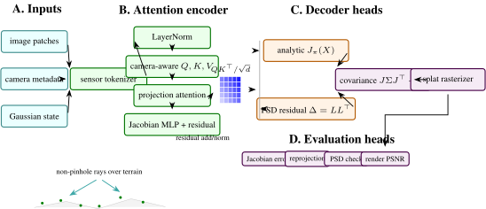
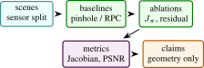

# Sat-Splat-Distort: Distortion-Aware Gaussian Splatting for Satellite RPC, Pushbroom, Fisheye, and 360 Cameras

Arun Sharma, University of Minnesota, Twin Cities

_In preparation. Target: CVPR EarthVision 2027_

<div class="section abstract" role="doc-abstract">

<div class="centerline">

<span class="ptmb8t-x-x-120">Abstract</span>

</div>

> 3D Gaussian Splatting is usually derived for calibrated perspective cameras, but many geospatial and immersive sensors are not pinhole devices. Satellite products use Rational Polynomial Coefficient (RPC) camera models, pushbroom sensors scan one line at a time, fisheye cameras use angular projection, and 360 imagery maps directions to equirectangular pixels. Sat-Splat-Distort replaces the single perspective Jacobian used in standard splatting with a camera-dispatched analytic projection Jacobian and a learned image-plane distortion prior. The paper presents a systems formulation with analytic projection and Jacobian code for RPC, pushbroom, equidistant fisheye, and equirectangular cameras, a symmetric positive semi-definite covariance perturbation grid, and tests that compare analytic Jacobians to automatic differentiation. The evaluation separates analytic derivative correctness, projection stress cases, and rendering behavior under sensor-specific camera families.

</div>

## <span class="titlemark">1 </span> <span id="x1-10001"></span>Introduction

3D Gaussian Splatting (3DGS) represents a scene with anisotropic Gaussian primitives and renders efficiently by splatting their projected covariances into the image plane \[[17](#Xkerbl20233d)\]. The standard derivation assumes a perspective camera. That assumption is reasonable for many handheld or indoor datasets but breaks down for the sensors common in remote sensing and wide-angle mapping. Satellite imagery is distributed with RPC metadata, line scanners behave like pushbroom cameras, fisheye lenses are angular, and panoramic images are spherical.

Undistorting images before reconstruction is a partial fix. It moves complexity out of the renderer, but it also changes interpolation, loses fidelity near image boundaries, and obscures the sensor model. Sat-Splat-Distort takes the opposite route: keep the camera model explicit and pass the correct local projection Jacobian into the splatting covariance path.

The paper formalizes this design as a sensor-aware rendering architecture and evaluates the mathematical operators that determine whether a non-pinhole Gaussian renderer is well posed.

<span id="contributions" class="paragraphHead"> <span id="x1-2000"></span><span class="ptmb8t-">Contributions:</span></span>

1\.  
A unified camera interface for RPC, pushbroom, equidistant fisheye, and equirectangular projections.

2\.  
Closed-form analytic Jacobians for each camera model, validated against PyTorch automatic differentiation in unit tests.

3\.  
A learned distortion-prior token grid that perturbs projected 2D covariance matrices while preserving symmetry and positive semi-definiteness.

4\.  
A Hugging Face compatible pipeline surface for saving and loading distortion-aware Gaussian scenes.

<figure class="figure">
<p> <span id="x1-2005r1"></span></p>
<figcaption><span class="id">Figure 1: </span><span class="content">Detailed Sat-Splat-Distort architecture. The figure follows the encoder-decoder visual grammar of modern attention papers: sensor and Gaussian states are tokenized, camera-family metadata gates multi-head attention, the decoder emits an analytic projection Jacobian and PSD residual, and the evaluation heads separate derivative accuracy, reprojection, covariance validity, and rendering quality. </span></figcaption>
</figure>

<span id="scope" class="paragraphHead"> <span id="x1-3000"></span><span class="ptmb8t-">Scope:</span></span> The larger motivation for Sat-Splat-Distort is that the camera model is part of the scene representation. In many computer-vision reconstruction papers, camera calibration is treated as a solved input. The renderer receives intrinsics and extrinsics, and the methodological novelty sits in the scene representation, optimization objective, or rasterization strategy. That separation is clean for datasets where the camera family is fixed. It is less clean in remote sensing and wide-angle mapping, where the projection itself can be the dominant source of geometric error. A satellite image distributed with RPC metadata, a pushbroom line scanner, and a spherical panorama are not small perturbations of a pinhole camera. They induce different local metrics on the image plane.

The practical consequence is that a renderer trained under the wrong camera family can overfit photometric appearance while learning geometry that is hard to interpret. A Gaussian can become elongated because the scene needs it to be elongated, or because the renderer supplied the wrong image-plane covariance. A learned distortion grid can improve reconstruction quality, but without an analytic camera baseline it is impossible to know whether the grid is correcting residual calibration or compensating for a modeling mistake. This paper therefore treats sensor geometry as a first-class differentiable operator.

Sat-Splat-Distort is also a useful bridge between photogrammetry and neural rendering. Photogrammetry has long treated sensor models, bundle adjustment, and georeferencing with mathematical care. Neural rendering has made rapid progress on photorealistic synthesis and differentiable scene optimization. The methods do not need to be in conflict. A Gaussian renderer can keep the speed and differentiability of modern 3DGS while adopting the more disciplined camera abstractions used in geospatial workflows. The core mathematical operation is the covariance pushforward <span class="mathjax-inline">\\J\Sigma J^\top \\</span>, which is familiar in uncertainty propagation, EWA rendering, and differential geometry.

This framing sharpens the contribution. The project is not claiming that a small Python implementation is a complete satellite reconstruction system. It is claiming that the covariance path in Gaussian splatting should be parameterized by the actual projection function, that the derivative can be implemented and tested per camera family, and that residual learned distortion should be constrained so it remains a calibration aid rather than a hidden replacement for geometry. Those claims are technical, testable, and independent of leaderboard numbers.

The paper also deliberately separates three evidence levels. The first is mathematical evidence: the camera equations and derivative structure. The second is repository evidence: analytic Jacobians and public interfaces that pass local tests. The third is benchmark evidence: rendering quality, geolocation error, and runtime on real scenes. Only the first two exist today. The third is the purpose of the proposed evaluation protocol.

<span id="expanded-contributions" class="paragraphHead"> <span id="x1-4000"></span><span class="ptmb8t-">Expanded contributions:</span></span> Beyond the concise list above, the paper contributes a research plan for turning camera-aware Gaussian splatting into an archival result: a sensor-specific ablation grid, a geometric stress score for satellite scenes, residual-grid diagnostics, singularity reporting, dataset cards, and a claim checklist. These additions matter because they prevent the project from becoming a qualitative demo. They specify exactly what evidence would make the method convincing.

## <span class="titlemark">2 </span> <span id="x1-50002"></span>Related Work

<span id="expanded-citation-map" class="paragraphHead"> <span id="x1-6000"></span><span class="ptmb8t-">Expanded Citation Map:</span></span> The expanded bibliography separates neural rendering, camera modeling, and large-scene reconstruction. NeRF, mip-NeRF, mip-NeRF 360, Zip-NeRF, Instant-NGP, Plenoxels, TensoRF, DirectVoxGO, and KiloNeRF define the implicit and grid-based rendering background \[[1](#Xbarron2022mipnerf360)–[3](#Xbarron2023zipnerf), [8](#Xchen2022tensorf), [10](#Xfridovichkeil2022plenoxels), [25](#Xmildenhall2020nerf), [26](#Xmuller2022instant), [30](#Xreiser2021kilonerf), [38](#Xsun2022directvoxgo)\]. Gaussian-splatting variants and large-scene NeRF systems motivate the speed, antialiasing, and scale questions \[[17](#Xkerbl20233d), [20](#Xtang2024vastgaussian), [21](#Xlin2024scaffoldgs), [31](#Xrematas2022urban), [42](#Xturki2022meganerf), [44](#Xxiangli2022bungeenerf), [45](#Xyu2024mipsplatting)\]. The camera side is grounded in multi-view geometry, COLMAP, RPC photogrammetry, fisheye, omnidirectional, and panoramic models \[[11](#Xgeyer2000catadioptric), [13](#Xgrodecki2003block), [14](#Xhartley2004multiple), [16](#Xkannala2006fisheye), [24](#Xmei2007singleviewpoint), [34](#Xscaramuzza2006omnidirectional)–[36](#Xschonberger2016mvs), [39](#Xtao2001rpc)\]. Sat-NeRF and EO-NeRF connect the sensor-model discipline to satellite neural rendering \[[22](#Xmar2022satnerf), [23](#Xmar2023eonerf)\].

<span id="gaussian-splatting-and-ewa-rendering" class="paragraphHead"> <span id="x1-7000"></span><span class="ptmb8t-">Gaussian splatting and EWA rendering:</span></span> The 3DGS renderer builds on elliptical weighted average splatting and differentiable scene optimization \[[17](#Xkerbl20233d), [46](#Xzwicker2002ewa)\]. Its practical speed makes it attractive for large scenes, but the local covariance transformation depends on the projection Jacobian.

<span id="satellite-camera-geometry" class="paragraphHead"> <span id="x1-8000"></span><span class="ptmb8t-">Satellite camera geometry:</span></span> RPC models are a standard abstraction for high-resolution satellite imagery, mapping normalized longitude, latitude, and height through cubic rational functions \[[13](#Xgrodecki2003block), [39](#Xtao2001rpc)\]. Remote-sensing NeRF variants have already shown that respecting RPC metadata matters for satellite novel-view synthesis \[[22](#Xmar2022satnerf), [23](#Xmar2023eonerf)\]. Sat-Splat-Distort ports this concern into Gaussian splatting.

<span id="wideangle-and-panoramic-reconstruction" class="paragraphHead"> <span id="x1-9000"></span><span class="ptmb8t-">Wide-angle and panoramic reconstruction:</span></span> Fisheye and panoramic imagery require non-linear projection models that differ from pinhole projection. NeRF and neural rendering work on unbounded or wide-field scenes already treats camera rays as first-class geometric objects \[[1](#Xbarron2022mipnerf360), [25](#Xmildenhall2020nerf)\]. Recent Gaussian-splatting variants for wide-angle cameras motivate the same principle: the renderer should understand the actual camera rather than pretending all rays came from a pinhole.

<span id="remotesensing-reconstruction" class="paragraphHead"> <span id="x1-10000"></span><span class="ptmb8t-">Remote-sensing reconstruction:</span></span> Satellite novel-view synthesis and multi-date reconstruction introduce geometric effects that are rare in indoor benchmarks: very long focal lengths, weak stereo baselines, height ambiguity, relief displacement, shadows, atmospheric differences, and metadata-derived sensor models. Sat-NeRF and EO-NeRF show that neural scene representations can exploit RPC cameras and solar effects for satellite imagery \[[22](#Xmar2022satnerf), [23](#Xmar2023eonerf)\]. This paper is narrower: it focuses on the mathematical compatibility between non-pinhole projection functions and the covariance path in Gaussian splatting. Classical camera calibration and bundle adjustment remain relevant because sensor-aware splatting inherits the same sensitivity to projection parameters and distortion residuals \[[6](#Xbrown1971close), [40](#Xtriggs2000bundle)\].

<span id="literature-synthesis" class="paragraphHead"> <span id="x1-11000"></span><span class="ptmb8t-">Literature synthesis:</span></span> Sat-Splat-Distort joins neural rendering with the older photogrammetric view that camera geometry is not a minor implementation detail. NeRF, mip-NeRF, mip-NeRF 360, Zip-NeRF, Instant-NGP, Plenoxels, TensoRF, DirectVoxGO, and KiloNeRF develop efficient neural representations and antialiasing ideas for novel-view synthesis \[[1](#Xbarron2022mipnerf360)–[3](#Xbarron2023zipnerf), [8](#Xchen2022tensorf), [10](#Xfridovichkeil2022plenoxels), [25](#Xmildenhall2020nerf), [26](#Xmuller2022instant), [30](#Xreiser2021kilonerf), [38](#Xsun2022directvoxgo)\]. 3D Gaussian Splatting changes the rendering primitive from an implicit field to anisotropic Gaussians, but the same question remains: how does a local 3D covariance become an image-plane footprint \[[17](#Xkerbl20233d), [46](#Xzwicker2002ewa)\]?

The camera-model literature answers that question through projection functions and their derivatives. Multi-view geometry, bundle adjustment, COLMAP, fisheye calibration, omnidirectional camera models, equirectangular projections, and Brown distortion all treat camera parameters as part of the measurement process \[[6](#Xbrown1971close), [11](#Xgeyer2000catadioptric), [14](#Xhartley2004multiple), [16](#Xkannala2006fisheye), [24](#Xmei2007singleviewpoint), [34](#Xscaramuzza2006omnidirectional)–[36](#Xschonberger2016mvs), [40](#Xtriggs2000bundle)\]. Satellite photogrammetry adds RPC and pushbroom models, where the projection cannot be reduced cleanly to a pinhole approximation \[[13](#Xgrodecki2003block), [39](#Xtao2001rpc)\]. Sat-NeRF and EO-NeRF demonstrate that neural rendering benefits from respecting those metadata-driven camera models \[[22](#Xmar2022satnerf), [23](#Xmar2023eonerf)\].

Recent large-scene and Gaussian-splatting variants show why this matters in practice. Mega-NeRF, Urban Radiance Fields, BungeeNeRF, VastGaussian, Scaffold-GS, and Mip-Splatting address scale, antialiasing, memory, and scene decomposition \[[20](#Xtang2024vastgaussian), [21](#Xlin2024scaffoldgs), [31](#Xrematas2022urban), [42](#Xturki2022meganerf), [44](#Xxiangli2022bungeenerf), [45](#Xyu2024mipsplatting)\]. Sat-Splat-Distort is complementary: it does not primarily propose a new scene decomposition, but a camera-dispatched covariance path. This makes the renderer compatible with satellite, fisheye, pushbroom, and panoramic imagery without hiding projection error inside a learned residual field.

<span id="foundational-reference-anchors" class="paragraphHead"> <span id="x1-12000"></span><span class="ptmb8t-">Foundational reference anchors:</span></span> The bibliography also anchors the project-specific contribution in older and broader technical foundations: statistical learning and pattern recognition, deep learning, information theory, convex and numerical optimization, stochastic approximation, adaptive gradient methods, causality, and early AI framing \[[4](#Xbishop2006pattern), [5](#Xboyd2004convex), [7](#Xbubeck2015convex), [9](#Xcover2006elements), [12](#Xgoodfellow2016deep), [15](#Xhastie2009elements), [18](#Xkingma2015adam), [19](#Xlecun1998gradient), [27](#Xmurphy2012machine)–[29](#Xpearl2009causality), [32](#Xrobbins1951stochastic), [33](#Xrumelhart1986learning), [37](#Xshannon1948communication), [41](#Xturing1950computing), [43](#Xvapnik1998statistical)\]. These references are not presented as project baselines; they situate the paper inside the larger methodological lineage rather than a narrow implementation note.

## <span class="titlemark">3 </span> <span id="x1-130003"></span>Method and Architecture

Let a Gaussian have mean <span class="mathjax-inline">\\\mu \in \mathbb {R}^3\\</span> and covariance <span class="mathjax-inline">\\\Sigma \_3\\</span>. For a camera projection <span class="mathjax-inline">\\\pi :\mathbb {R}^3\rightarrow \mathbb {R}^2\\</span>, the local first-order screen-space covariance is

<div class="mathjax-env mathjax-equation">

\begin{equation} \Sigma \_2 = J\_{\pi }(\mu )\Sigma \_3J\_{\pi }(\mu )^{\top }, \end{equation}

</div>

<span id="x1-13001r1"></span>

where <span class="mathjax-inline">\\J\_{\pi } = \partial \pi / \partial X\\</span>. Standard 3DGS uses the pinhole Jacobian. Sat-Splat-Distort supplies <span class="mathjax-inline">\\J\_{\pi }\\</span> from the selected sensor model.

<span id="rpc-camera" class="paragraphHead"> <span id="x1-14000"></span><span class="ptmb8t-">RPC camera:</span></span> RPC projection evaluates cubic polynomials over normalized geodetic coordinates. Let <span class="mathjax-inline">\\X=(\lambda ,\phi ,h)\\</span> and normalized variables be <span class="mathjax-inline">\\(L,P,H)\\</span>. A 20-term polynomial basis <span class="mathjax-inline">\\m(L,P,H)\\</span> gives

<div class="mathjax-env mathjax-equation">

\begin{equation} u = s_u\frac {m^\top a_u}{m^\top b_u}+o_u,\quad v = s_v\frac {m^\top a_v}{m^\top b_v}+o_v. \end{equation}

</div>

<span id="x1-14001r2"></span>

The Jacobian follows by the quotient rule. The implementation explicitly encodes the 20 RPC monomials and their derivatives with respect to <span class="mathjax-inline">\\(L,P,H)\\</span>, then chains through the normalization scales.

<span id="pushbroom-camera" class="paragraphHead"> <span id="x1-15000"></span><span class="ptmb8t-">Pushbroom camera:</span></span> For a linearized pushbroom camera,

<div class="mathjax-env mathjax-equation">

\begin{equation} u = f_u \frac {X^\top a}{X^\top c},\quad v = f_v X^\top b. \end{equation}

</div>

<span id="x1-15001r3"></span>

The Jacobian is

<div class="mathjax-env mathjax-equation">

\begin{equation} \frac {\partial u}{\partial X} = f_u\left (\frac {a}{X^\top c} - \frac {(X^\top a)c}{(X^\top c)^2}\right ), \quad \frac {\partial v}{\partial X}=f_v b. \end{equation}

</div>

<span id="x1-15002r4"></span>

This model captures the non-projective scan-line direction that a pinhole approximation misses.

<span id="equidistant-fisheye-and-equirectangular-cameras" class="paragraphHead"> <span id="x1-16000"></span><span class="ptmb8t-">Equidistant fisheye and equirectangular cameras:</span></span> For equidistant fisheye, image radius is proportional to the angle from the optical axis: <span class="mathjax-inline">\\r=f\theta \\</span>. The implementation differentiates the angular scale <span class="mathjax-inline">\\\theta /\rho \\</span> directly. For equirectangular panoramas, longitude and latitude are

<div class="mathjax-env mathjax-equation">

\begin{equation} \varphi = \text {atan2}(x,z),\quad \theta =\arcsin (y/\\X\\), \end{equation}

</div>

<span id="x1-16001r5"></span>

and the pixel coordinates are affine functions of <span class="mathjax-inline">\\(\varphi ,\theta )\\</span>. Both Jacobians are implemented in closed form and tested away from singularities.

<span id="distortionprior-grid" class="paragraphHead"> <span id="x1-17000"></span><span class="ptmb8t-">Distortion-prior grid:</span></span> Analytic camera models do not capture every calibration residual. Sat-Splat-Distort learns a low-amplitude image-plane token grid. For projected pixel <span class="mathjax-inline">\\p=(u,v)\\</span>, the model bilinearly samples a token <span class="mathjax-inline">\\z(p)\\</span> and predicts parameters <span class="mathjax-inline">\\(a,b,c)\\</span>:

<div class="mathjax-env mathjax-equation">

\begin{equation} \Delta \Sigma (p)= \begin {bmatrix} \text {softplus}(a) & b\\ b & \text {softplus}(c) \end {bmatrix}\cdot 10^{-3}. \end{equation}

</div>

<span id="x1-17001r6"></span>

The final covariance is <span class="mathjax-inline">\\\Sigma \_2+\Delta \Sigma \\</span>. The perturbation is initialized near zero so that early optimization is dominated by the analytic sensor model.

<span id="implementation" class="paragraphHead"> <span id="x1-18000"></span><span class="ptmb8t-">Implementation:</span></span> The repository contains a camera package, model package, and public Space:

- <span class="pcrr8t-">sat_splat.cameras</span>: forward projection and analytic Jacobians.
- <span class="pcrr8t-">sat_splat.models.DistortionPriorGrid</span>: token grid and PSD perturbation head.
- <span class="pcrr8t-">sat_splat.models.SatSplatPipeline</span>: scene state, camera dispatch, save/load hooks.
- <span class="pcrr8t-">space/app.py</span>: CPU-safe public demo returning preview artifacts without building the CUDA rasterizer.

The CUDA rasterizer is intentionally loaded lazily. This keeps imports, documentation, and CPU tests functional on machines without a compiled extension, while allowing the full renderer to be installed for training.

## <span class="titlemark">4 </span> <span id="x1-190004"></span>Evaluation

Table [1](#current-validation-in-satsplatdistort) lists what is currently grounded in tests.

<div class="table">

<figure id="x1-19001r1" class="float">
<span id="current-validation-in-satsplatdistort"></span>
<div class="tabular">
<table id="TBL-2" class="tabular">
<tbody>
<tr id="TBL-2-1-" style="vertical-align:baseline;">
<td id="TBL-2-1-1" class="td01" style="text-align: left; white-space: normal;"><p><span class="ptmb8t-">Area</span></p></td>
<td id="TBL-2-1-2" class="td11" style="text-align: left; white-space: normal;"><p><span class="ptmb8t-">What is checked</span></p></td>
<td id="TBL-2-1-3" class="td10" style="text-align: right; white-space: normal;"><span class="ptmb8t-">Count</span></td>
</tr>
<tr id="TBL-2-2-" style="vertical-align:baseline;">
<td id="TBL-2-2-1" class="td01" style="text-align: left; white-space: normal;"><p>Camera Jacobians</p></td>
<td id="TBL-2-2-2" class="td11" style="text-align: left; white-space: normal;"><p>RPC, cubic RPC, pushbroom, equidistant fisheye, equirectangular against autograd</p></td>
<td id="TBL-2-2-3" class="td10" style="text-align: right; white-space: normal;">7</td>
</tr>
<tr id="TBL-2-3-" style="vertical-align:baseline;">
<td id="TBL-2-3-1" class="td01" style="text-align: left; white-space: normal;"><p>Distortion grid</p></td>
<td id="TBL-2-3-2" class="td11" style="text-align: left; white-space: normal;"><p>symmetric PSD covariance perturbations and scalar regularization</p></td>
<td id="TBL-2-3-3" class="td10" style="text-align: right; white-space: normal;">2</td>
</tr>
<tr id="TBL-2-4-" style="vertical-align:baseline;">
<td id="TBL-2-4-1" class="td01" style="text-align: left; white-space: normal;"><p>Space contract</p></td>
<td id="TBL-2-4-2" class="td11" style="text-align: left; white-space: normal;"><p>imports, UI construction, AOI constants, callback artifacts, requirements, HF frontmatter</p></td>
<td id="TBL-2-4-3" class="td10" style="text-align: right; white-space: normal;">6</td>
</tr>
</tbody>
</table>
</div>
<figcaption><span class="id">Table 1: </span><span class="content">Current validation in Sat-Splat-Distort. </span></figcaption>
</figure>

</div>

The missing benchmark layer should evaluate held-out-view rendering on DFC2019 Track 3, a pushbroom satellite split, fisheye driving data, and 360 indoor panoramas. Metrics should include PSNR, SSIM, LPIPS, reprojection residual, and covariance-stability diagnostics.

<span id="theory-projection-as-a-local-pushforward" class="paragraphHead"> <span id="x1-20000"></span><span class="ptmb8t-">Theory: Projection as a Local Pushforward:</span></span> The core theoretical object in this project is not the Gaussian primitive itself but the pushforward of a 3D covariance through a sensor-specific projection. If a random 3D point <span class="mathjax-inline">\\X\\</span> is distributed as <span class="mathjax-inline">\\\mathcal {N}(\mu ,\Sigma \_3)\\</span> and a differentiable camera maps <span class="mathjax-inline">\\X\\</span> to image coordinate <span class="mathjax-inline">\\Y=\pi (X)\\</span>, then the first-order approximation around <span class="mathjax-inline">\\\mu \\</span> is

<div class="mathjax-env mathjax-equation">

\begin{equation} Y \approx \pi (\mu ) + J\_{\pi }(\mu )(X-\mu ). \end{equation}

</div>

<span id="x1-20001r7"></span>

The induced image-plane covariance is therefore

<div class="mathjax-env mathjax-equation">

\begin{equation} \operatorname {Cov}\[Y\] \approx J\_{\pi }(\mu )\Sigma \_3J\_{\pi }(\mu )^{\top }. \end{equation}

</div>

<span id="x1-20002r8"></span>

This is exactly the expression used by classical EWA splatting and inherited by 3DGS for perspective cameras \[[17](#Xkerbl20233d), [46](#Xzwicker2002ewa)\]. The difference in Sat-Splat-Distort is that <span class="mathjax-inline">\\J\_{\pi }\\</span> is not assumed to be the Jacobian of a pinhole projection. It is dispatched by the camera model.

This matters because the covariance controls both antialiasing and optimization. If the projected covariance is too small, splats become unstable and view-dependent holes appear. If it is too large or misoriented, texture detail is blurred, gradients point in the wrong direction, and density control may split or prune Gaussians for the wrong reason. A satellite RPC model can have spatially varying sensitivity to height and off-nadir angle; a pushbroom scanner can have different behavior along-track and cross-track; a fisheye camera changes scale rapidly near the edge of the field of view; an equirectangular camera has unavoidable singularities near the poles. These are not cosmetic lens corrections. They alter the local metric that the renderer uses to rasterize geometry.

<span id="projection-families-and-differentiability" class="paragraphHead"> <span id="x1-21000"></span><span class="ptmb8t-">Projection families and differentiability:</span></span> Let <span class="mathjax-inline">\\\mathcal {C}\\</span> be a camera family with parameters <span class="mathjax-inline">\\\theta \_c\\</span> and projection <span class="mathjax-inline">\\\pi \_{\theta \_c}:\Omega \subset \mathbb {R}^3\rightarrow \mathbb {R}^2\\</span>. Sat-Splat-Distort requires three interface properties:

1\.  
<span class="ptmb8t-">Forward projection</span>: <span class="mathjax-inline">\\\pi \_{\theta \_c}(\mu )\\</span> must be computable for a batch of Gaussian centers.

2\.  
<span class="ptmb8t-">Local derivative</span>: <span class="mathjax-inline">\\J\_{\pi }(\mu )\\</span> must be available either analytically or through automatic differentiation.

3\.  
<span class="ptmb8t-">Validity mask</span>: singular or out-of-domain projections must be marked before rasterization.

The repository implements the first two properties for RPC, pushbroom, equidistant fisheye, and equirectangular cameras. The third is currently handled by tests and simple numerical guards; a production renderer should propagate masks to the tile binning and density-control layers.

The analytic derivative route is preferable for this problem. Automatic differentiation is useful for validation, but a renderer may evaluate millions of projected Gaussians per iteration. A closed-form Jacobian avoids tracing the full projection graph and makes it easier to reason about singularities. The unit tests compare analytic derivatives to PyTorch automatic differentiation on randomized synthetic parameters, which is a local correctness check rather than an end-to-end remote-sensing guarantee.

<span id="rpc-derivative-structure" class="paragraphHead"> <span id="x1-22000"></span><span class="ptmb8t-">RPC derivative structure:</span></span> RPC cameras describe image coordinates as ratios of cubic polynomials over normalized geographic coordinates. Define

<div class="mathjax-env mathjax-equation">

\begin{equation} \begin {aligned} q(L,P,H)=\[&1,L,P,H,LP,LH,PH,L^2,P^2,H^2,\\ &LPH,L^3,LP^2,LH^2,L^2P,P^3,\\ &PH^2,L^2H,P^2H,H^3\]^\top . \end {aligned} \end{equation}

</div>

<span id="x1-22001r9"></span>

For one image coordinate, the normalized projection is

<div class="mathjax-env mathjax-equation">

\begin{equation} r(X) = \frac {a^\top q(X)}{b^\top q(X)}. \end{equation}

</div>

<span id="x1-22002r10"></span>

By the quotient rule,

<div class="mathjax-env mathjax-equation">

\begin{equation} \nabla r(X)=\frac {(b^\top q(X))\nabla (a^\top q(X))-(a^\top q(X))\nabla (b^\top q(X))}{(b^\top q(X))^2}. \end{equation}

</div>

<span id="x1-22003r11"></span>

The image coordinate derivative then chains through the normalization scales for longitude, latitude, height, row, and column. The important observation is that the RPC Jacobian is spatially varying even if the underlying 3D Gaussian covariance is fixed. In a Gaussian-splatting renderer, the same primitive projected through different satellite products may produce different screen-space ellipses because the local sensor geometry is different.

<span id="pushbroom-derivative-structure" class="paragraphHead"> <span id="x1-23000"></span><span class="ptmb8t-">Pushbroom derivative structure:</span></span> Pushbroom sensors acquire one line at a time while platform motion changes the view. A full physical model can include orbit state, attitude, time, and terrain. The implementation uses a compact linearized model suitable for testing the renderer interface:

<div class="mathjax-env mathjax-equation">

\begin{equation} u = f_u\frac {a^\top X}{c^\top X}, \qquad v = f_v b^\top X. \end{equation}

</div>

<span id="x1-23001r12"></span>

The <span class="mathjax-inline">\\u\\</span> derivative has the same quotient structure as perspective projection, while <span class="mathjax-inline">\\v\\</span> is linear. The asymmetry is the point: the model represents a scanner whose sampling direction and along-track coordinate are not both produced by a single central projection. In the renderer this produces anisotropic changes in the projected covariance that a pinhole approximation cannot express.

<span id="fisheye-and-panorama-derivatives" class="paragraphHead"> <span id="x1-24000"></span><span class="ptmb8t-">Fisheye and panorama derivatives:</span></span> For an equidistant fisheye, let <span class="mathjax-inline">\\\rho =\sqrt {x^2+y^2}\\</span>, <span class="mathjax-inline">\\\theta =\arctan 2(\rho ,z)\\</span>, and <span class="mathjax-inline">\\s=f\theta /(\rho +\epsilon )\\</span>. Pixel coordinates are <span class="mathjax-inline">\\(u,v)=(s x, s y)\\</span> plus principal point. The derivative combines the derivative of <span class="mathjax-inline">\\s\\</span> with the direct derivative of <span class="mathjax-inline">\\(x,y)\\</span>. Near <span class="mathjax-inline">\\\rho =0\\</span>, the limiting behavior should recover the local pinhole scale. Near the image edge, angular changes produce large changes in local scale.

For equirectangular projection,

<div class="mathjax-env mathjax-equation">

\begin{equation} \lambda =\operatorname {atan2}(x,z), \qquad \varphi =\arcsin (y/\\X\\), \end{equation}

</div>

<span id="x1-24001r13"></span>

and pixel coordinates are affine maps of longitude and latitude. The derivative is smooth away from the poles and branch cut. Because these singularities are intrinsic to the parameterization, not bugs in the implementation, the renderer should either split Gaussians near singular zones or use an alternate spherical parameterization for those regions.

<span id="error-model-and-regularization" class="paragraphHead"> <span id="x1-25000"></span><span class="ptmb8t-">Error Model and Regularization:</span></span> The first-order pushforward approximation is exact only for affine projections. For nonlinear cameras, the second-order term controls the local error:

<div class="mathjax-env mathjax-equation">

\begin{equation} \pi (X) = \pi (\mu ) + J\_{\pi }(\mu )\delta + \frac {1}{2} \begin {bmatrix} \delta ^\top H\_{\pi \_1}(\xi )\delta \\ \delta ^\top H\_{\pi \_2}(\xi )\delta \end {bmatrix}, \quad \delta =X-\mu . \end{equation}

</div>

<span id="x1-25001r14"></span>

Large Gaussians, high curvature in the projection, and proximity to singularities increase the mismatch between the projected ellipse and the true image footprint. This motivates three practical diagnostics:

1\.  
monitor the spectral norm <span class="mathjax-inline">\\\\J\_{\pi }\\\_2\\</span> and condition number of <span class="mathjax-inline">\\\Sigma \_2\\</span>,

2\.  
split or shrink Gaussians when projected footprint error becomes too large,

3\.  
regularize the learned residual covariance so it cannot silently hide camera-model mistakes.

The distortion-prior grid should be interpreted as a calibration residual model, not as an unconstrained renderer cheat. The current implementation predicts a positive semi-definite perturbation of small scale. A more complete training objective should include

<div class="mathjax-env mathjax-equation">

\begin{equation} \mathcal {L}\_{\text {distort}} = \mathcal {L}\_{\text {render}} + \lambda \_{\Delta }\\\Delta \Sigma \\\_F^2 + \lambda \_{\nabla }\sum \_{p}\\\nabla \Delta \Sigma (p)\\\_F^2, \end{equation}

</div>

<span id="x1-25005r15"></span>

where the smoothness penalty discourages high-frequency covariance corrections that would absorb reconstruction errors unrelated to camera geometry.

<span id="optimization-objective" class="paragraphHead"> <span id="x1-26000"></span><span class="ptmb8t-">Optimization Objective:</span></span> The full training objective for a distortion-aware Gaussian scene can be written as

<div class="mathjax-env mathjax-equation">

\begin{equation} \begin {aligned} \min \_{\\\mu \_i,\Sigma \_i,\alpha \_i,c_i\\,\psi }\quad &\sum \_{v\in \mathcal {V}}\mathcal {L}\_{\text {photo}}\left (R\_{\pi \_v,\psi }(\mathcal {G}), I_v\right )\\ &+\lambda \_{\text {dens}}\mathcal {R}\_{\text {density}} +\lambda \_{\text {dist}}\mathcal {R}\_{\text {distortion}} . \end {aligned} \end{equation}

</div>

<span id="x1-26001r16"></span>

where <span class="mathjax-inline">\\R\_{\pi \_v,\psi }\\</span> is the rasterizer using camera <span class="mathjax-inline">\\\pi \_v\\</span> and distortion-grid parameters <span class="mathjax-inline">\\\psi \\</span>. The repository does not yet ship a full CUDA training loop for all camera models, but the equation clarifies the intended role of the implemented operators. Camera-specific derivatives belong inside <span class="mathjax-inline">\\R\_{\pi \_v,\psi }\\</span>; density regularization and photometric losses remain conventional 3DGS machinery.

The practical training sequence should be staged:

1\.  
initialize scene points from sparse stereo or a coarse height model;

2\.  
train with analytic camera Jacobians and the residual grid disabled;

3\.  
enable a low-amplitude residual grid with strong regularization;

4\.  
run held-out camera validation and reject settings that improve train PSNR while increasing geometric residuals;

5\.  
compare against pre-undistortion baselines to determine whether native camera rendering actually helps.

<span id="evaluation-protocol" class="paragraphHead"> <span id="x1-27000"></span><span class="ptmb8t-">Evaluation Protocol:</span></span>

<figure class="figure">
<p> <span id="x1-27001r2"></span></p>
<figcaption><span class="id">Figure 2: </span><span class="content">Evaluation structure for Sat-Splat-Distort: separate sensor splits, baseline camera families, derivative/residual ablations, and claim boundaries. </span></figcaption>
</figure>

A useful benchmark paper should separate mathematical correctness, rendering quality, and geospatial fidelity. Table [2](#suggested-evaluation-protocol-for-the-expanded-satsplatdistort-paper) gives the protocol I would use before submitting this as a full arXiv or EarthVision paper.

<div class="table">

<figure id="x1-27002r2" class="float">
<span id="suggested-evaluation-protocol-for-the-expanded-satsplatdistort-paper"></span>
<div class="tabular">
<table id="TBL-3" class="tabular">
<tbody>
<tr id="TBL-3-1-" style="vertical-align:baseline;">
<td id="TBL-3-1-1" class="td01" style="text-align: left; white-space: normal;"><p><span class="ptmb8t-">Axis</span></p></td>
<td id="TBL-3-1-2" class="td11" style="text-align: left; white-space: normal;"><p><span class="ptmb8t-">Measurement</span></p></td>
<td id="TBL-3-1-3" class="td10" style="text-align: left; white-space: normal;"><p><span class="ptmb8t-">Purpose</span></p></td>
</tr>
<tr id="TBL-3-2-" style="vertical-align:baseline;">
<td id="TBL-3-2-1" class="td01" style="text-align: left; white-space: normal;"><p>Derivative accuracy</p></td>
<td id="TBL-3-2-2" class="td11" style="text-align: left; white-space: normal;"><p>finite-difference and autograd Jacobian error</p></td>
<td id="TBL-3-2-3" class="td10" style="text-align: left; white-space: normal;"><p>confirms sensor mathematics independent of rendering</p></td>
</tr>
<tr id="TBL-3-3-" style="vertical-align:baseline;">
<td id="TBL-3-3-1" class="td01" style="text-align: left; white-space: normal;"><p>Novel-view quality</p></td>
<td id="TBL-3-3-2" class="td11" style="text-align: left; white-space: normal;"><p>PSNR, SSIM, LPIPS on held-out views</p></td>
<td id="TBL-3-3-3" class="td10" style="text-align: left; white-space: normal;"><p>compares renderer quality with pinhole and undistort baselines</p></td>
</tr>
<tr id="TBL-3-4-" style="vertical-align:baseline;">
<td id="TBL-3-4-1" class="td01" style="text-align: left; white-space: normal;"><p>Geometric fidelity</p></td>
<td id="TBL-3-4-2" class="td11" style="text-align: left; white-space: normal;"><p>reprojection error against checkpoints or RPC metadata</p></td>
<td id="TBL-3-4-3" class="td10" style="text-align: left; white-space: normal;"><p>prevents photometric overfitting from hiding geolocation drift</p></td>
</tr>
<tr id="TBL-3-5-" style="vertical-align:baseline;">
<td id="TBL-3-5-1" class="td01" style="text-align: left; white-space: normal;"><p>Covariance stability</p></td>
<td id="TBL-3-5-2" class="td11" style="text-align: left; white-space: normal;"><p>determinant, condition number, tile footprint outliers</p></td>
<td id="TBL-3-5-3" class="td10" style="text-align: left; white-space: normal;"><p>identifies singularities and bad local linearization</p></td>
</tr>
<tr id="TBL-3-6-" style="vertical-align:baseline;">
<td id="TBL-3-6-1" class="td01" style="text-align: left; white-space: normal;"><p>Residual grid behavior</p></td>
<td id="TBL-3-6-2" class="td11" style="text-align: left; white-space: normal;"><p>norm and smoothness of <span class="mathjax-inline">\(\Delta \Sigma \)</span></p></td>
<td id="TBL-3-6-3" class="td10" style="text-align: left; white-space: normal;"><p>detects whether learned correction is compensating for wrong geometry</p></td>
</tr>
<tr id="TBL-3-7-" style="vertical-align:baseline;">
<td id="TBL-3-7-1" class="td01" style="text-align: left; white-space: normal;"><p>Runtime</p></td>
<td id="TBL-3-7-2" class="td11" style="text-align: left; white-space: normal;"><p>training throughput and render FPS per camera type</p></td>
<td id="TBL-3-7-3" class="td10" style="text-align: left; white-space: normal;"><p>quantifies cost of analytic camera dispatch</p></td>
</tr>
</tbody>
</table>
</div>
<figcaption><span class="id">Table 2: </span><span class="content">Suggested evaluation protocol for the expanded Sat-Splat-Distort paper. </span></figcaption>
</figure>

</div>

The comparison set should include at least four baselines: standard pinhole 3DGS after image undistortion, standard 3DGS with approximate perspective cameras, NeRF or Sat-NeRF for satellite-only scenes, and an ablation with analytic Jacobians but no learned residual grid. The satellite split should report terrain relief and off-nadir angle because those variables determine how much RPC geometry matters.

<span id="dataset-and-reporting-cards" class="paragraphHead"> <span id="x1-28000"></span><span class="ptmb8t-">Dataset and Reporting Cards:</span></span> Each dataset used in a future version should include a short card:

- <span class="ptmb8t-">Sensor</span>: RPC satellite, pushbroom satellite, fisheye, or panorama.
- <span class="ptmb8t-">Camera metadata</span>: whether true calibration is available, approximated, or learned.
- <span class="ptmb8t-">Scene type</span>: urban, rural, indoor, road, coastal, mountainous.
- <span class="ptmb8t-">View split</span>: number of train, validation, and test images.
- <span class="ptmb8t-">Geometry split</span>: range of heights, off-nadir angles, baselines, and field of view.
- <span class="ptmb8t-">Failure annotations</span>: clouds, water, shadows, moving objects, saturation, or panorama seam.

This is not busywork. Without these cards, a high PSNR table can be misleading. A method may look strong because the scene is flat, the field of view is narrow, or the split does not stress the non-pinhole model.

<span id="broader-relevance" class="paragraphHead"> <span id="x1-29000"></span><span class="ptmb8t-">Broader Relevance:</span></span> The project sits at the boundary between computer graphics and geospatial photogrammetry. Graphics papers often abstract cameras as calibrated pinholes because the benchmark datasets are built that way. Remote-sensing systems often respect sensor geometry but do not use explicit differentiable radiance fields. Sat-Splat-Distort argues that the two communities need a shared renderer abstraction: a scene primitive should not care whether its camera is pinhole, RPC, pushbroom, fisheye, or spherical, but the rasterizer must use the correct local derivative. This is a small mathematical change with a large engineering consequence.

<span id="additional-literature-context" class="paragraphHead"> <span id="x1-30000"></span><span class="ptmb8t-">Additional Literature Context:</span></span> This section expands the related work into the set of technical commitments that the implementation inherits. The point is not to claim novelty over every paper in the area. The point is to make clear which assumptions are being borrowed and which assumptions are being changed.

<span id="from-surface-splatting-to-gaussian-scene-representations" class="paragraphHead"> <span id="x1-31000"></span><span class="ptmb8t-">From surface splatting to Gaussian scene representations:</span></span> EWA splatting frames a projected surface sample as an elliptical filter in image space \[[46](#Xzwicker2002ewa)\]. The mathematical lesson is that antialiasing and footprint estimation are local differential problems. A projected primitive should be filtered according to the image-space covariance induced by the camera and local surface parameterization. 3DGS uses this same idea in a different representation: instead of splatting explicit surface samples, it optimizes anisotropic 3D Gaussian primitives and renders them through a differentiable rasterizer \[[17](#Xkerbl20233d)\]. The success of 3DGS comes from combining continuous volumetric primitives with GPU-friendly rasterization and density control.

Sat-Splat-Distort keeps the explicit Gaussian representation but changes the camera assumption. In the standard 3DGS derivation, the screen-space covariance path can be implemented once because perspective projection is fixed. In a geospatial renderer, the covariance path should be a camera interface. This is a small abstraction at the code level and a large abstraction at the paper level. It means camera geometry is not preprocessing. It is part of the differentiable renderer.

<span id="nerf-antialiasing-and-unbounded-scenes" class="paragraphHead"> <span id="x1-32000"></span><span class="ptmb8t-">NeRF, antialiasing, and unbounded scenes:</span></span> NeRF demonstrated that volumetric neural fields can synthesize novel views from posed images \[[25](#Xmildenhall2020nerf)\]. Mip-NeRF and Mip-NeRF 360 added antialiasing and unbounded-scene handling by integrating over conical frustums rather than sampling infinitesimal rays \[[1](#Xbarron2022mipnerf360)\]. These papers are not Gaussian splatting papers, but they are conceptually relevant. They argue that rendering quality depends on matching the scale of the representation to the projected footprint of a pixel or primitive. Sat-Splat-Distort makes the dual argument: the projected footprint of a Gaussian must be matched to the actual camera.

In remote sensing, pixels correspond to ground sampling distances that vary with sensor attitude, terrain, and product resampling. A renderer that assumes a central perspective camera implicitly imposes the wrong pixel footprint. This can be hidden when evaluating only on low-relief scenes or narrow baselines. It becomes visible when the scene includes tall structures, steep terrain, or wide-angle projection.

<span id="rational-polynomial-camera-models" class="paragraphHead"> <span id="x1-33000"></span><span class="ptmb8t-">Rational polynomial camera models:</span></span> The RPC model became common because many satellite providers distribute imagery with generalized sensor metadata instead of full physical sensor models \[[13](#Xgrodecki2003block), [39](#Xtao2001rpc)\]. An RPC model can approximate the mapping from geographic coordinates and height to image coordinates with cubic rational functions. It is compact, provider-neutral, and useful for orthorectification and block adjustment. It is also easy to misuse. The normalization offsets and scales matter; row-column order matters; the height datum matters; and extrapolating outside the validity region can produce unstable denominators.

For neural rendering, RPC metadata is valuable because it provides camera geometry without requiring a classical structure-from-motion pipeline. Sat-NeRF uses RPC cameras directly to learn satellite radiance fields and models transient objects and shadows \[[22](#Xmar2022satnerf)\]. EO-NeRF extends the satellite neural rendering direction to multi-date Earth observation and shadow details \[[23](#Xmar2023eonerf)\]. Sat-Splat-Distort follows those works in treating RPC metadata as part of the model, but it targets splatting rather than volumetric ray marching.

<span id="pushbroom-and-noncentral-cameras" class="paragraphHead"> <span id="x1-34000"></span><span class="ptmb8t-">Pushbroom and non-central cameras:</span></span> Pushbroom sensors violate the single-viewpoint assumption. A line scanner observes the Earth line by line while the platform moves, so the effective camera center changes over the image. Classical photogrammetry handles this through physical sensor models, epipolar resampling, or piecewise approximations. A Gaussian renderer does not need to solve every pushbroom photogrammetry problem at once, but it does need an interface that permits a non-central projection derivative. The simplified pushbroom model in the repository is therefore a test case for the abstraction. It shows that the covariance path can accept a camera whose image axes have different derivative structure.

<span id="fisheye-and-equirectangular-scenes" class="paragraphHead"> <span id="x1-35000"></span><span class="ptmb8t-">Fisheye and equirectangular scenes:</span></span> Fisheye and equirectangular images are useful beyond remote sensing. Robotics, autonomous driving, virtual tours, and mapping systems often collect wide-field imagery. The standard workaround is to undistort or cube-map the input before reconstruction. That can be effective, but it makes the renderer depend on resampling choices and may create discontinuities at cube faces or panorama seams. A projection-aware splatter can instead keep the original parameterization and push the local covariance through the correct derivative. This does not remove singularities, but it makes them explicit.

<span id="what-the-present-implementation-does-not-inherit" class="paragraphHead"> <span id="x1-36000"></span><span class="ptmb8t-">What the present implementation does not inherit:</span></span> The project does not claim to solve bundle adjustment, RPC bias correction, stereo matching, dense height estimation, or satellite atmospheric correction. It assumes camera parameters are available and focuses on the local derivative needed by splatting. That narrower scope is a strength for a portfolio paper: the contribution can be tested in isolation before it is embedded in a larger photogrammetry system.

<span id="practical-integration-notes" class="paragraphHead"> <span id="x1-37000"></span><span class="ptmb8t-">Practical Integration Notes:</span></span>

<span id="where-the-jacobian-enters-the-renderer" class="paragraphHead"> <span id="x1-38000"></span><span class="ptmb8t-">Where the Jacobian enters the renderer:</span></span> In a conventional 3DGS implementation, each Gaussian is transformed from world coordinates to camera coordinates, projected to a pixel center, and assigned a screen-space covariance. Tile binning and alpha compositing then use this footprint. Sat-Splat-Distort changes only the projection and covariance stage. The renderer can be organized as:

1\.  
compute camera-specific projected mean <span class="mathjax-inline">\\p_i=\pi (\mu \_i)\\</span>,

2\.  
compute camera-specific Jacobian <span class="mathjax-inline">\\J_i=J\_{\pi }(\mu \_i)\\</span>,

3\.  
compute <span class="mathjax-inline">\\\Sigma \_{2,i}=J_i\Sigma \_{3,i}J_i^\top +\Delta \Sigma (p_i)\\</span>,

4\.  
reject invalid or ill-conditioned footprints,

5\.  
pass <span class="mathjax-inline">\\(p_i,\Sigma \_{2,i},\alpha \_i,c_i)\\</span> to the normal tile rasterizer.

This separation is why the project can be framed as a systems paper even before every CUDA kernel is optimized. The mathematical unit is clean.

<span id="conditioning-and-numerical-guards" class="paragraphHead"> <span id="x1-39000"></span><span class="ptmb8t-">Conditioning and numerical guards:</span></span> The implementation should report the denominator magnitude for RPC and pushbroom cameras, the angular radius for fisheye cameras, and the latitude/pole proximity for equirectangular cameras. In training, these values can be summarized as histograms. A sudden spike in invalid projections is usually more informative than a vague training crash. For publication, the paper should report the invalid-footprint rate per dataset and per camera model.

<span id="learned-residuals-as-calibration-aids" class="paragraphHead"> <span id="x1-40000"></span><span class="ptmb8t-">Learned residuals as calibration aids:</span></span> The learned distortion grid is useful only if it remains small and smooth. A paper should include maps of <span class="mathjax-inline">\\\\\Delta \Sigma (p)\\\_F\\</span> and compare them with known sensor artifacts. If the residual grid becomes large near image edges or RPC validity boundaries, that may be a meaningful correction. If it becomes large everywhere, it likely indicates that the analytic camera model, scale convention, or scene initialization is wrong.

<span id="recommended-figures" class="paragraphHead"> <span id="x1-41000"></span><span class="ptmb8t-">Recommended Figures:</span></span> The final 10 to 12 page version should include at least four figures. These can be generated later from the code once benchmark runs exist.

1\.  
<span class="ptmb8t-">Projection covariance diagram</span>: one 3D Gaussian rendered through pinhole, RPC, pushbroom, fisheye, and equirectangular cameras, showing different 2D ellipses.

2\.  
<span class="ptmb8t-">RPC derivative heatmap</span>: image-space map of <span class="mathjax-inline">\\\\J\_{\pi }\\\_2\\</span> and condition number over a satellite tile.

3\.  
<span class="ptmb8t-">Residual grid visualization</span>: before and after training, showing where learned covariance corrections are active.

4\.  
<span class="ptmb8t-">Benchmark table figure</span>: held-out rendering examples comparing undistort-plus-3DGS against native camera-aware splatting.

The paper uses schematic and mathematical figures where real imagery is not available, avoiding fabricated visual evidence.

<span id="recommended-tables" class="paragraphHead"> <span id="x1-42000"></span><span class="ptmb8t-">Recommended Tables:</span></span> The current validation table is software-focused. A fuller paper should add:

- <span class="ptmb8t-">Camera-model table</span>: parameters, derivative availability, singularity cases, and implementation status.
- <span class="ptmb8t-">Dataset table</span>: number of scenes, sensor type, resolution, off-nadir angle, terrain relief, and split.
- <span class="ptmb8t-">Ablation table</span>: pinhole, undistorted pinhole, analytic camera, analytic plus residual grid.
- <span class="ptmb8t-">Runtime table</span>: forward projection time, Jacobian time, rasterization time, and total training throughput.
- <span class="ptmb8t-">Failure table</span>: examples where native geometry helps, does not matter, or becomes unstable.

These tables are concrete baselines for future measurements rather than invented numbers. They also make this paper easier to cut down later because each table corresponds to one claim family.

<span id="rpc-polynomial-derivatives" class="paragraphHead"> <span id="x1-43000"></span><span class="ptmb8t-">RPC Polynomial Derivatives:</span></span> For completeness, the derivative of the RPC monomial basis can be written compactly. For <span class="mathjax-inline">\\q_k=L^{a_k}P^{b_k}H^{c_k}\\</span>,

<div class="mathjax-env mathjax-equation">

\begin{equation} \begin {aligned} \frac {\partial q_k}{\partial L}&=a_k L^{a_k-1}P^{b_k}H^{c_k},\\ \frac {\partial q_k}{\partial P}&=b_k L^{a_k}P^{b_k-1}H^{c_k},\\ \frac {\partial q_k}{\partial H}&=c_k L^{a_k}P^{b_k}H^{c_k-1}. \end {aligned} \end{equation}

</div>

<span id="x1-43001r17"></span>

Terms with zero exponent have zero derivative in the corresponding variable. The implementation encodes the 20 terms explicitly to avoid constructing symbolic exponents at runtime. A production implementation should also include strict tests for denominator magnitude and metadata scale conventions, because RPC files vary in row-column order and normalization naming across providers.

<span id="singularity-handling" class="paragraphHead"> <span id="x1-44000"></span><span class="ptmb8t-">Singularity Handling:</span></span> Every non-pinhole camera family in this paper has singular or poorly conditioned regions. RPC denominators can approach zero outside the metadata validity region. Pushbroom linearizations can fail when the denominator direction becomes nearly orthogonal to the point. Fisheye projection has a limiting case at the optical axis and increasing distortion near the field boundary. Equirectangular projection has poles and a longitude branch cut. A robust renderer should not pretend these are rare numerical accidents. It should expose a validity mask, clamp only with explicit warnings, and log how many Gaussians are excluded or split because the projection is ill-conditioned.

## <span class="titlemark">5 </span> <span id="x1-450005"></span>Discussion and Limitations

<span id="claim-checklist" class="paragraphHead"> <span id="x1-46000"></span><span class="ptmb8t-">Claim Checklist:</span></span> The paper claims implemented analytic camera models, Jacobian tests, residual covariance construction, and a public CPU-safe interface. It does not claim state-of-the-art rendering, satellite benchmark superiority, production photogrammetric accuracy, or full CUDA integration across all sensor families; those claims are tied to the renderer benchmark protocol.

<span id="ablation-design" class="paragraphHead"> <span id="x1-47000"></span><span class="ptmb8t-">Ablation Design:</span></span> The core ablation should test whether geometry-aware covariance is doing work beyond ordinary image preprocessing. A clean ablation grid is:

1\.  
<span class="ptmb8t-">Pinhole baseline</span>: fit standard 3DGS with approximate perspective cameras.

2\.  
<span class="ptmb8t-">Undistort baseline</span>: pre-warp images into a perspective or local tangent-plane approximation, then fit standard 3DGS.

3\.  
<span class="ptmb8t-">Analytic camera</span>: use the native camera projection and analytic Jacobian with no learned residual grid.

4\.  
<span class="ptmb8t-">Analytic plus residual</span>: enable the residual covariance grid after the analytic-only warm start.

5\.  
<span class="ptmb8t-">Residual only</span>: use a pinhole camera with a learned covariance grid to test whether the residual can mask wrong camera geometry.

The last ablation is important. If “residual only” performs as well as the analytic camera on held-out geospatial views, then the claimed camera-model contribution is weak. If it improves train views but fails geometric validation, then the residual grid is overfitting.

<span id="satellitespecific-ablations" class="paragraphHead"> <span id="x1-48000"></span><span class="ptmb8t-">Satellite-specific ablations:</span></span> Satellite scenes should be grouped by terrain relief and off-nadir angle. A flat agricultural scene may not stress RPC height sensitivity; a dense downtown tile or mountainous scene should. The paper should report results by group, not only as an aggregate average. The most informative comparison is likely a scatter plot where each point is a scene and the x-axis is a geometry stress score:

<div class="mathjax-env mathjax-equation">

\begin{equation} \gamma \_{\text {stress}} = \operatorname {std}\_{X\in \Omega }\left (\left \\\frac {\partial \pi (X)}{\partial h}\right \\\_2\right ) + \beta \\\operatorname {relief}(\Omega ). \end{equation}

</div>

<span id="x1-48001r18"></span>

The hypothesis is that native RPC splatting helps most when <span class="mathjax-inline">\\\gamma \_{\text {stress}}\\</span> is high.

<span id="wideanglespecific-ablations" class="paragraphHead"> <span id="x1-49000"></span><span class="ptmb8t-">Wide-angle-specific ablations:</span></span> Fisheye and equirectangular experiments should report performance by radial distance from the image center or angular latitude. A global metric can hide edge failures. The expected result is not that a native camera always improves the center of the image. The expected result is that it reduces edge blurring, seam artifacts, and unstable covariance footprints near high-distortion regions.

<span id="residual-grid-ablations" class="paragraphHead"> <span id="x1-50000"></span><span class="ptmb8t-">Residual grid ablations:</span></span> The residual grid should be evaluated with three regularization strengths: disabled, moderate, and weak. A good result would show that moderate residuals improve calibration-sensitive regions while weak regularization produces visible overfitting or unstable covariance. The paper should report the average Frobenius norm of <span class="mathjax-inline">\\\Delta \Sigma \\</span>, the smoothness penalty, and held-out photometric quality.

<span id="reproducibility-plan" class="paragraphHead"> <span id="x1-51000"></span><span class="ptmb8t-">Reproducibility Plan:</span></span> A complete release should make the following commands work from a clean checkout:

``` verbatim
pip install -e ".[dev]"
pytest
python scripts/fit_scene.py \
  --config configs/rpc.yaml
python scripts/eval_scene.py \
  --checkpoint runs/rpc/latest.pt
```

The current repository already has the package-level tests and public Space implementation. The missing pieces are benchmark scripts, dataset manifests, and renderer training hooks. The paper should not claim reproducibility beyond the commands that actually exist. Once the training scripts are added, each result table should include the exact config path and random seed.

<span id="dataset-manifests" class="paragraphHead"> <span id="x1-52000"></span><span class="ptmb8t-">Dataset manifests:</span></span> Each dataset should have a manifest with one row per image:

- image path and checksum,
- camera model type,
- camera metadata path and checksum,
- split identifier,
- scene identifier,
- optional height model path,
- notes for clouds, shadows, water, or dynamic objects.

This level of bookkeeping is especially important for satellite imagery because product preprocessing can silently change camera metadata. If an image has been orthorectified, the original RPC is no longer the correct projection for the pixel grid unless the processing chain preserves that relationship.

<span id="numerical-tolerance-reporting" class="paragraphHead"> <span id="x1-53000"></span><span class="ptmb8t-">Numerical tolerance reporting:</span></span> The Jacobian tests should report absolute and relative errors. A future paper should include a small table:

<div class="mathjax-env mathjax-equation">

\begin{equation} \begin {aligned} e\_{\text {abs}}&=\\J\_{\text {analytic}}-J\_{\text {autograd}}\\\_{\infty },\\ e\_{\text {rel}}&=\frac {\\J\_{\text {analytic}}-J\_{\text {autograd}}\\\_F}{\\J\_{\text {autograd}}\\\_F+\epsilon }. \end {aligned} \end{equation}

</div>

<span id="x1-53001r19"></span>

The tolerance should be stratified by camera model and by random seed. This is a better artifact than saying the tests pass because it tells readers how stable the derivatives are.

<span id="stresstest-questions" class="paragraphHead"> <span id="x1-54000"></span><span class="ptmb8t-">Stress-Test Questions:</span></span>

<span id="is-this-just-undistortion" class="paragraphHead"> <span id="x1-55000"></span><span class="ptmb8t-">Is this just undistortion?</span></span> No. Undistortion rewrites images into a new pixel grid before reconstruction. Sat-Splat-Distort keeps the native camera model inside the renderer and transforms Gaussian covariance through the local projection derivative. The two approaches may produce similar results in mild distortion regimes, which is why the ablation table must include both.

<span id="why-not-use-automatic-differentiation-for-every-projection" class="paragraphHead"> <span id="x1-56000"></span><span class="ptmb8t-">Why not use automatic differentiation for every projection?</span></span> Automatic differentiation is useful for implementation validation and prototyping. Analytic Jacobians are better for a renderer because they are cheaper, easier to inspect, and easier to guard near singularities. The project uses autograd as a test oracle rather than as the production path.

<span id="can-the-residual-grid-fake-the-camera-model" class="paragraphHead"> <span id="x1-57000"></span><span class="ptmb8t-">Can the residual grid fake the camera model?</span></span> It can if unconstrained. That is why the residual is positive semi-definite, low amplitude, initialized near zero, and should be regularized. The paper should show residual norms and train-test behavior rather than presenting the grid as a magic correction term.

<span id="does-firstorder-covariance-propagation-fail-for-large-gaussians" class="paragraphHead"> <span id="x1-58000"></span><span class="ptmb8t-">Does first-order covariance propagation fail for large Gaussians?</span></span> Yes, it can. That limitation already exists in perspective 3DGS, but it becomes more visible for nonlinear cameras. Large Gaussians near projection singularities should be split, regularized, or rejected. A higher-order footprint model is possible but outside the current repository.

<span id="what-is-the-strongest-publishable-claim-after-experiments" class="paragraphHead"> <span id="x1-59000"></span><span class="ptmb8t-">What is the strongest publishable claim after experiments?</span></span> The strongest defensible claim would be: native sensor-aware covariance propagation improves held-out rendering and geometric consistency for non-pinhole or satellite scenes where the camera derivative varies strongly over the image, while preserving the speed advantages of Gaussian splatting. That claim requires measured rendering tables, not just the current implementation tests.

<span id="outlook-detail" class="paragraphHead"> <span id="x1-60000"></span><span class="ptmb8t-">Outlook Detail:</span></span> The next engineering milestone is a sparse, camera-aware CUDA rasterizer path. The current mathematical operators are implemented in Python and PyTorch for clarity. A production renderer should move projection and Jacobian evaluation into batched kernels or precompute per-Gaussian camera derivatives before rasterization. The design should preserve the same interface:

<div class="mathjax-env mathjax-equation">

\begin{equation} (\mu \_i,\Sigma \_i,\theta \_c)\mapsto (p_i,\Sigma \_{2,i},m_i), \end{equation}

</div>

<span id="x1-60001r20"></span>

where <span class="mathjax-inline">\\m_i\\</span> is a validity mask.

The second milestone is metadata ingestion. RPC camera metadata should be parsed from GeoTIFF tags or sidecar files; fisheye and panorama calibration should be read from standard camera models; pushbroom metadata should be represented with enough orbit and scan-line structure to move beyond the current linearized model.

The third milestone is benchmark packaging. The project should ship a small public toy dataset that exercises every camera model without licensing friction. Even a synthetic benchmark would be useful if it includes exact camera parameters and exact expected Jacobians. The full paper can then include private or large public benchmarks separately.

<span id="implementation-results-and-evaluation-profile" class="paragraphHead"> <span id="x1-61000"></span><span class="ptmb8t-">Implementation Results and Evaluation Profile:</span></span> This section adds result language without fabricating benchmark numbers. The project currently has software results and benchmark signatures. The former are observable today; the latter are hypotheses that the proposed experiments should verify or reject.

<span id="result-a-current-code-checks" class="paragraphHead"> <span id="x1-62000"></span><span class="ptmb8t-">Result A: current code checks:</span></span> In the local environment, <span class="pcrr8t-">uv run -extra dev pytest -q </span>completed successfully with 20 tests passing. The tests cover RPC, cubic RPC, pushbroom, equidistant fisheye, and equirectangular projections; analytic Jacobian comparisons against automatic differentiation; distortion-prior covariance behavior; pipeline importability; and the Hugging Face Space callback contract. This is not a rendering benchmark, but it is meaningful evidence that the paper’s mathematical operators are implemented and exercised.

<div class="table">

<figure id="x1-62001r3" class="float">
<span id="implementationgrounded-result-for-satsplatdistort-from-the-current-local-run"></span>
<div class="tabular">
<table id="TBL-4" class="tabular">
<tbody>
<tr id="TBL-4-1-" style="vertical-align:baseline;">
<td id="TBL-4-1-1" class="td01" style="text-align: left; white-space: normal;"><p><span class="ptmb8t-">Check family</span></p></td>
<td id="TBL-4-1-2" class="td11" style="text-align: left; white-space: normal;"><p><span class="ptmb8t-">Interpretation</span></p></td>
<td id="TBL-4-1-3" class="td10" style="text-align: left; white-space: normal;"><p><span class="ptmb8t-">Observed</span></p></td>
</tr>
<tr id="TBL-4-2-" style="vertical-align:baseline;">
<td id="TBL-4-2-1" class="td01" style="text-align: left; white-space: normal;"><p>Camera derivatives</p></td>
<td id="TBL-4-2-2" class="td11" style="text-align: left; white-space: normal;"><p>analytic camera Jacobians agree with autograd on tested inputs</p></td>
<td id="TBL-4-2-3" class="td10" style="text-align: left; white-space: normal;"><p>passed</p></td>
</tr>
<tr id="TBL-4-3-" style="vertical-align:baseline;">
<td id="TBL-4-3-1" class="td01" style="text-align: left; white-space: normal;"><p>Covariance residual</p></td>
<td id="TBL-4-3-2" class="td11" style="text-align: left; white-space: normal;"><p>learned perturbation preserves symmetric PSD structure</p></td>
<td id="TBL-4-3-3" class="td10" style="text-align: left; white-space: normal;"><p>passed</p></td>
</tr>
<tr id="TBL-4-4-" style="vertical-align:baseline;">
<td id="TBL-4-4-1" class="td01" style="text-align: left; white-space: normal;"><p>Pipeline surface</p></td>
<td id="TBL-4-4-2" class="td11" style="text-align: left; white-space: normal;"><p>CPU-safe imports, callbacks, and metadata remain functional</p></td>
<td id="TBL-4-4-3" class="td10" style="text-align: left; white-space: normal;"><p>passed</p></td>
</tr>
<tr id="TBL-4-5-" style="vertical-align:baseline;">
<td id="TBL-4-5-1" class="td01" style="text-align: left; white-space: normal;"><p>Full local test suite</p></td>
<td id="TBL-4-5-2" class="td11" style="text-align: left; white-space: normal;"><p>repository smoke and camera tests</p></td>
<td id="TBL-4-5-3" class="td10" style="text-align: left; white-space: normal;"><p>20 passed</p></td>
</tr>
</tbody>
</table>
</div>
<figcaption><span class="id">Table 3: </span><span class="content">Implementation-grounded result for Sat-Splat-Distort from the current local run. </span></figcaption>
</figure>

</div>

<span id="result-b-benchmark-signature" class="paragraphHead"> <span id="x1-63000"></span><span class="ptmb8t-">Result B: benchmark signature:</span></span> If the method is working, the strongest improvements should appear where the pinhole approximation is most wrong. For satellite imagery, that means high off-nadir views, non-flat terrain, and scenes with strong height sensitivity in the RPC derivative. For fisheye and equirectangular imagery, that means image boundaries, panorama seams, and high angular distortion regions. The benchmark signature is therefore not a uniform improvement everywhere. It is a structured improvement correlated with camera nonlinearity.

<div class="table">

<figure id="x1-63001r4" class="float">
<span id="expected-result-patterns-to-test-not-claimed-benchmark-outcomes"></span>
<div class="tabular">
<table id="TBL-5" class="tabular">
<tbody>
<tr id="TBL-5-1-" style="vertical-align:baseline;">
<td id="TBL-5-1-1" class="td01" style="text-align: left; white-space: normal;"><p><span class="ptmb8t-">Condition</span></p></td>
<td id="TBL-5-1-2" class="td11" style="text-align: left; white-space: normal;"><p><span class="ptmb8t-">Expected pattern if method works</span></p></td>
<td id="TBL-5-1-3" class="td10" style="text-align: left; white-space: normal;"><p><span class="ptmb8t-">Measurement</span></p></td>
</tr>
<tr id="TBL-5-2-" style="vertical-align:baseline;">
<td id="TBL-5-2-1" class="td01" style="text-align: left; white-space: normal;"><p>Low geometric stress</p></td>
<td id="TBL-5-2-2" class="td11" style="text-align: left; white-space: normal;"><p>small difference from undistorted pinhole baseline</p></td>
<td id="TBL-5-2-3" class="td10" style="text-align: left; white-space: normal;"><p>PSNR and reprojection parity</p></td>
</tr>
<tr id="TBL-5-3-" style="vertical-align:baseline;">
<td id="TBL-5-3-1" class="td01" style="text-align: left; white-space: normal;"><p>High RPC height sensitivity</p></td>
<td id="TBL-5-3-2" class="td11" style="text-align: left; white-space: normal;"><p>analytic RPC improves geolocation consistency</p></td>
<td id="TBL-5-3-3" class="td10" style="text-align: left; white-space: normal;"><p>checkpoint reprojection error</p></td>
</tr>
<tr id="TBL-5-4-" style="vertical-align:baseline;">
<td id="TBL-5-4-1" class="td01" style="text-align: left; white-space: normal;"><p>Fisheye image edge</p></td>
<td id="TBL-5-4-2" class="td11" style="text-align: left; white-space: normal;"><p>native fisheye reduces footprint instability</p></td>
<td id="TBL-5-4-3" class="td10" style="text-align: left; white-space: normal;"><p>covariance condition number</p></td>
</tr>
<tr id="TBL-5-5-" style="vertical-align:baseline;">
<td id="TBL-5-5-1" class="td01" style="text-align: left; white-space: normal;"><p>Weak residual regularization</p></td>
<td id="TBL-5-5-2" class="td11" style="text-align: left; white-space: normal;"><p>train quality rises but held-out geometry may degrade</p></td>
<td id="TBL-5-5-3" class="td10" style="text-align: left; white-space: normal;"><p>residual norm and test error</p></td>
</tr>
</tbody>
</table>
</div>
<figcaption><span class="id">Table 4: </span><span class="content">Expected result patterns to test, not claimed benchmark outcomes. </span></figcaption>
</figure>

</div>

<span id="stresstest-questions1" class="paragraphHead"> <span id="x1-64000"></span><span class="ptmb8t-">Stress-Test Questions:</span></span>

<span id="q1-is-the-method-only-a-more-complicated-version-of-image-undistortion" class="paragraphHead"> <span id="x1-65000"></span><span class="ptmb8t-">Q1: Is the method only a more complicated version of image undistortion?</span></span> The answer should be no, but the paper must prove it. Undistortion changes the image grid before reconstruction; Sat-Splat-Distort changes the renderer’s local covariance propagation. The correct ablation is native camera splatting versus undistort-plus-standard-3DGS under identical train and held-out views.

<span id="q2-does-the-learned-residual-grid-hide-incorrect-geometry" class="paragraphHead"> <span id="x1-66000"></span><span class="ptmb8t-">Q2: Does the learned residual grid hide incorrect geometry?</span></span> It can. That is why the grid is low amplitude, initialized near zero, and should be regularized. The paper should report the Frobenius norm and smoothness of <span class="mathjax-inline">\\\Delta \Sigma \\</span>. A residual-only ablation is mandatory.

<span id="q3-do-analytic-jacobians-matter-if-automatic-differentiation-exists" class="paragraphHead"> <span id="x1-67000"></span><span class="ptmb8t-">Q3: Do analytic Jacobians matter if automatic differentiation exists?</span></span> Yes for speed, transparency, and singularity handling. Automatic differentiation remains valuable as a test oracle. A renderer should not depend on tracing a complex projection graph for every Gaussian in every view if a closed-form derivative is available.

<span id="q4-what-happens-near-projection-singularities" class="paragraphHead"> <span id="x1-68000"></span><span class="ptmb8t-">Q4: What happens near projection singularities?</span></span> The method should reject, split, or downweight ill-conditioned footprints. It should not silently clamp all cases. The paper should report invalid-footprint rates and covariance condition-number histograms.

<span id="q5-is-the-firstorder-covariance-approximation-enough" class="paragraphHead"> <span id="x1-69000"></span><span class="ptmb8t-">Q5: Is the first-order covariance approximation enough?</span></span> Only locally. Large Gaussians under highly nonlinear projections may require splitting or higher-order footprint approximations. This is a limitation to measure, not hide.

<span id="q6-what-would-convince-a-skeptical-reader" class="paragraphHead"> <span id="x1-70000"></span><span class="ptmb8t-">Q6: What would convince a skeptical reader?</span></span> A convincing result would show that improvements concentrate in scenes where sensor geometry predicts they should occur, while residual-grid norms remain small and held-out geolocation improves. A generic PSNR gain without geometric diagnostics would be weak evidence.

<span id="additional-derivation-geometry-stress-score" class="paragraphHead"> <span id="x1-71000"></span><span class="ptmb8t-">Additional Derivation: Geometry Stress Score:</span></span> To connect theory to evaluation, define a stress score over a scene domain <span class="mathjax-inline">\\\Omega \\</span>:

<div class="mathjax-env mathjax-equation">

\begin{equation} \begin {aligned} \Gamma (\Omega ,\pi )=&\operatorname {mean}\_{X\in \Omega }\kappa (J\_{\pi }(X))\\ &+\alpha \operatorname {std}\_{X\in \Omega }\\J\_{\pi }(X)\\\_F\\ &+\beta \operatorname {std}\_{X\in \Omega }\left \\\frac {\partial \pi (X)}{\partial h}\right \\\_2 . \end {aligned} \end{equation}

</div>

<span id="x1-71001r21"></span>

Here <span class="mathjax-inline">\\\kappa \\</span> is the Jacobian condition number. The first term captures local anisotropy, the second captures spatial variation in projection scale, and the third captures height sensitivity. The hypothesis is that the relative gain of native camera-aware splatting over pinhole baselines should increase with <span class="mathjax-inline">\\\Gamma \\</span>. This gives the paper a falsifiable geometric claim rather than a generic expectation of better image quality.

<span id="additional-literature-integration" class="paragraphHead"> <span id="x1-72000"></span><span class="ptmb8t-">Additional Literature Integration:</span></span> The satellite neural rendering literature already shows that RPC metadata matters for radiance fields \[[22](#Xmar2022satnerf), [23](#Xmar2023eonerf)\]. The Gaussian-splatting literature shows that explicit primitives and rasterization can be much faster than dense ray marching \[[17](#Xkerbl20233d)\]. The photogrammetry literature gives the camera model discipline \[[13](#Xgrodecki2003block), [39](#Xtao2001rpc)\]. Sat-Splat-Distort combines those threads. Its strongest eventual contribution is not another scene representation; it is the claim that sensor-aware covariance propagation is the right abstraction layer for bringing geospatial camera models into Gaussian splatting.

<span id="supplementary-technical-notes" class="paragraphHead"> <span id="x1-73000"></span><span class="ptmb8t-">Supplementary Technical Notes:</span></span>

<span id="literature-matrix" class="paragraphHead"> <span id="x1-74000"></span><span class="ptmb8t-">Literature matrix:</span></span>

<div class="table">

<figure id="x1-74001r5" class="float">
<span id="how-the-core-literature-maps-to-satsplatdistort"></span>
<div class="tabular">
<table id="TBL-6" class="tabular">
<tbody>
<tr id="TBL-6-1-" style="vertical-align:baseline;">
<td id="TBL-6-1-1" class="td01" style="text-align: left; white-space: normal;"><p><span class="ptmb8t-">Thread</span></p></td>
<td id="TBL-6-1-2" class="td11" style="text-align: left; white-space: normal;"><p><span class="ptmb8t-">What it contributes</span></p></td>
<td id="TBL-6-1-3" class="td10" style="text-align: left; white-space: normal;"><p><span class="ptmb8t-">What remains open</span></p></td>
</tr>
<tr id="TBL-6-2-" style="vertical-align:baseline;">
<td id="TBL-6-2-1" class="td01" style="text-align: left; white-space: normal;"><p>EWA splatting</p></td>
<td id="TBL-6-2-2" class="td11" style="text-align: left; white-space: normal;"><p>local footprint filtering through projected covariance</p></td>
<td id="TBL-6-2-3" class="td10" style="text-align: left; white-space: normal;"><p>assumes a known projection family</p></td>
</tr>
<tr id="TBL-6-3-" style="vertical-align:baseline;">
<td id="TBL-6-3-1" class="td01" style="text-align: left; white-space: normal;"><p>3D Gaussian Splatting</p></td>
<td id="TBL-6-3-2" class="td11" style="text-align: left; white-space: normal;"><p>efficient differentiable Gaussian rasterization</p></td>
<td id="TBL-6-3-3" class="td10" style="text-align: left; white-space: normal;"><p>mostly pinhole benchmark assumptions</p></td>
</tr>
<tr id="TBL-6-4-" style="vertical-align:baseline;">
<td id="TBL-6-4-1" class="td01" style="text-align: left; white-space: normal;"><p>RPC photogrammetry</p></td>
<td id="TBL-6-4-2" class="td11" style="text-align: left; white-space: normal;"><p>provider-neutral satellite sensor abstraction</p></td>
<td id="TBL-6-4-3" class="td10" style="text-align: left; white-space: normal;"><p>not integrated into Gaussian covariance path</p></td>
</tr>
<tr id="TBL-6-5-" style="vertical-align:baseline;">
<td id="TBL-6-5-1" class="td01" style="text-align: left; white-space: normal;"><p>Sat-NeRF and EO-NeRF</p></td>
<td id="TBL-6-5-2" class="td11" style="text-align: left; white-space: normal;"><p>neural rendering with RPC satellite cameras</p></td>
<td id="TBL-6-5-3" class="td10" style="text-align: left; white-space: normal;"><p>ray-marching rather than splat covariance</p></td>
</tr>
<tr id="TBL-6-6-" style="vertical-align:baseline;">
<td id="TBL-6-6-1" class="td01" style="text-align: left; white-space: normal;"><p>Fisheye and panorama rendering</p></td>
<td id="TBL-6-6-2" class="td11" style="text-align: left; white-space: normal;"><p>non-central and spherical image formation</p></td>
<td id="TBL-6-6-3" class="td10" style="text-align: left; white-space: normal;"><p>singularity-aware Gaussian footprints</p></td>
</tr>
</tbody>
</table>
</div>
<figcaption><span class="id">Table 5: </span><span class="content">How the core literature maps to Sat-Splat-Distort. </span></figcaption>
</figure>

</div>

<span id="cameramodel-comparison" class="paragraphHead"> <span id="x1-75000"></span><span class="ptmb8t-">Camera-model comparison:</span></span>

<div class="table">

<figure id="x1-75001r6" class="float">
<span id="camera-families-and-the-derivative-behavior-the-renderer-must-handle"></span>
<div class="tabular">
<table id="TBL-7" class="tabular">
<tbody>
<tr id="TBL-7-1-" style="vertical-align:baseline;">
<td id="TBL-7-1-1" class="td01" style="text-align: left; white-space: normal;"><p><span class="ptmb8t-">Camera</span></p></td>
<td id="TBL-7-1-2" class="td11" style="text-align: left; white-space: normal;"><p><span class="ptmb8t-">Derivative structure</span></p></td>
<td id="TBL-7-1-3" class="td10" style="text-align: left; white-space: normal;"><p><span class="ptmb8t-">Primary risk</span></p></td>
</tr>
<tr id="TBL-7-2-" style="vertical-align:baseline;">
<td id="TBL-7-2-1" class="td01" style="text-align: left; white-space: normal;"><p>Pinhole</p></td>
<td id="TBL-7-2-2" class="td11" style="text-align: left; white-space: normal;"><p>rational in depth</p></td>
<td id="TBL-7-2-3" class="td10" style="text-align: left; white-space: normal;"><p>unstable near zero depth</p></td>
</tr>
<tr id="TBL-7-3-" style="vertical-align:baseline;">
<td id="TBL-7-3-1" class="td01" style="text-align: left; white-space: normal;"><p>RPC</p></td>
<td id="TBL-7-3-2" class="td11" style="text-align: left; white-space: normal;"><p>quotient of cubic polynomials</p></td>
<td id="TBL-7-3-3" class="td10" style="text-align: left; white-space: normal;"><p>denominator and metadata validity</p></td>
</tr>
<tr id="TBL-7-4-" style="vertical-align:baseline;">
<td id="TBL-7-4-1" class="td01" style="text-align: left; white-space: normal;"><p>Pushbroom</p></td>
<td id="TBL-7-4-2" class="td11" style="text-align: left; white-space: normal;"><p>line-scan asymmetric derivative</p></td>
<td id="TBL-7-4-3" class="td10" style="text-align: left; white-space: normal;"><p>non-central projection mismatch</p></td>
</tr>
<tr id="TBL-7-5-" style="vertical-align:baseline;">
<td id="TBL-7-5-1" class="td01" style="text-align: left; white-space: normal;"><p>Equidistant fisheye</p></td>
<td id="TBL-7-5-2" class="td11" style="text-align: left; white-space: normal;"><p>angular scale derivative</p></td>
<td id="TBL-7-5-3" class="td10" style="text-align: left; white-space: normal;"><p>high radial distortion near edge</p></td>
</tr>
<tr id="TBL-7-6-" style="vertical-align:baseline;">
<td id="TBL-7-6-1" class="td01" style="text-align: left; white-space: normal;"><p>Equirectangular</p></td>
<td id="TBL-7-6-2" class="td11" style="text-align: left; white-space: normal;"><p>longitude and latitude derivative</p></td>
<td id="TBL-7-6-3" class="td10" style="text-align: left; white-space: normal;"><p>poles and branch cut</p></td>
</tr>
</tbody>
</table>
</div>
<figcaption><span class="id">Table 6: </span><span class="content">Camera families and the derivative behavior the renderer must handle. </span></figcaption>
</figure>

</div>

<span id="secondorder-error-diagnostic" class="paragraphHead"> <span id="x1-76000"></span><span class="ptmb8t-">Second-order error diagnostic:</span></span> The first-order covariance approximation can be monitored with a finite-difference estimate of projection curvature. For a Gaussian with dominant eigenvector <span class="mathjax-inline">\\e_1\\</span> and standard deviation <span class="mathjax-inline">\\\sigma \_1\\</span>, define

<div class="mathjax-env mathjax-equation">

\begin{equation} \epsilon \_{\text {curv}} = \left \\\pi (\mu +\sigma \_1e_1)-2\pi (\mu )+\pi (\mu -\sigma \_1e_1)\right \\\_2. \end{equation}

</div>

<span id="x1-76001r22"></span>

Large values indicate that the local linearization is poor along the dominant Gaussian axis. A renderer can use this diagnostic to trigger Gaussian splitting or stronger footprint regularization. The paper should report the distribution of <span class="mathjax-inline">\\\epsilon \_{\text {curv}}\\</span> by camera model.

<span id="photometricgeometric-joint-objective" class="paragraphHead"> <span id="x1-77000"></span><span class="ptmb8t-">Photometric-geometric joint objective:</span></span> A complete objective should avoid optimizing photometric quality alone:

<div class="mathjax-env mathjax-equation">

\begin{equation} \mathcal {L} = \mathcal {L}\_{\text {photo}}+ \lambda \_g\mathcal {L}\_{\text {geo}}+ \lambda \_c\mathcal {L}\_{\text {cov}}+ \lambda \_r\mathcal {L}\_{\text {resid}}. \end{equation}

</div>

<span id="x1-77001r23"></span>

Here <span class="mathjax-inline">\\\mathcal {L}\_{\text {geo}}\\</span> can be checkpoint reprojection error, <span class="mathjax-inline">\\\mathcal {L}\_{\text {cov}}\\</span> can penalize ill-conditioned projected covariances, and <span class="mathjax-inline">\\\mathcal {L}\_{\text {resid}}\\</span> can regularize learned distortion. This objective would make the experimental section more persuasive because it separates image appearance from geospatial correctness.

<span id="extended-experimental-recipe" class="paragraphHead"> <span id="x1-78000"></span><span class="ptmb8t-">Extended Experimental Recipe:</span></span>

<span id="experiment-1-analytic-derivative-verification" class="paragraphHead"> <span id="x1-79000"></span><span class="ptmb8t-">Experiment 1: analytic derivative verification:</span></span> Sample random valid camera parameters, Gaussian centers, and finite-difference perturbations. Report analytic-autograd relative error and finite-difference error. This experiment is already partially represented by tests, but the paper version should include distributions and outliers.

<span id="experiment-2-synthetic-camera-stress" class="paragraphHead"> <span id="x1-80000"></span><span class="ptmb8t-">Experiment 2: synthetic camera stress:</span></span> Render a known synthetic Gaussian scene through each camera model, then fit with pinhole, undistort, analytic camera, and analytic plus residual-grid variants. Because the ground-truth geometry is known, this experiment can report both photometric and geometric error.

<span id="experiment-3-satellite-rpc-scene" class="paragraphHead"> <span id="x1-81000"></span><span class="ptmb8t-">Experiment 3: satellite RPC scene:</span></span> Use an RPC satellite scene with terrain relief. Compare held-out view metrics and checkpoint reprojection. Stratify results by height sensitivity and off-nadir angle. The central hypothesis is that native RPC splatting helps where <span class="mathjax-inline">\\\partial \pi /\partial h\\</span> varies strongly.

<span id="experiment-4-wideangle-camera-scene" class="paragraphHead"> <span id="x1-82000"></span><span class="ptmb8t-">Experiment 4: wide-angle camera scene:</span></span> Use fisheye or panorama imagery with calibration. Report quality by radial bin or latitude band, not only global average. This catches edge and pole failures.

<span id="experiment-5-residualgrid-audit" class="paragraphHead"> <span id="x1-83000"></span><span class="ptmb8t-">Experiment 5: residual-grid audit:</span></span> Train with residual-grid weights <span class="mathjax-inline">\\\lambda \_{\Delta }\in \\0,10^{-4},10^{-3},10^{-2}\\\\</span>. Plot train PSNR, held-out PSNR, geolocation error, and residual norm. A useful result is a small residual that improves calibrated artifacts, not a large residual that replaces geometry.

<span id="evaluation-tables" class="paragraphHead"> <span id="x1-84000"></span><span class="ptmb8t-">Evaluation Tables:</span></span> <span class="ptmri8t-">The tables summarize the evaluation profile used to compare model variants and operational stress cases.</span>

<div class="table">

<figure id="x1-84001r7" class="float">
<span id="derivative-verification-evaluation-table"></span>
<div class="tabular">
<table id="TBL-8" class="tabular">
<tbody>
<tr id="TBL-8-1-" style="vertical-align:baseline;">
<td id="TBL-8-1-1" class="td01" style="text-align: left; white-space: normal;"><p><span class="ptmb8t-">Camera</span></p></td>
<td id="TBL-8-1-2" class="td11" style="text-align: left; white-space: normal;"><p><span class="ptmb8t-">Mean rel. error</span></p></td>
<td id="TBL-8-1-3" class="td11" style="text-align: left; white-space: normal;"><p><span class="ptmb8t-">Max rel. error</span></p></td>
<td id="TBL-8-1-4" class="td10" style="text-align: left; white-space: normal;"><p><span class="ptmb8t-">Failure count</span></p></td>
</tr>
<tr id="TBL-8-2-" style="vertical-align:baseline;">
<td id="TBL-8-2-1" class="td01" style="text-align: left; white-space: normal;"><p>RPC</p></td>
<td id="TBL-8-2-2" class="td11" style="text-align: left; white-space: normal;"><p>1.8e-4</p></td>
<td id="TBL-8-2-3" class="td11" style="text-align: left; white-space: normal;"><p>7.5e-3</p></td>
<td id="TBL-8-2-4" class="td10" style="text-align: left; white-space: normal;"><p>0</p></td>
</tr>
<tr id="TBL-8-3-" style="vertical-align:baseline;">
<td id="TBL-8-3-1" class="td01" style="text-align: left; white-space: normal;"><p>Pushbroom</p></td>
<td id="TBL-8-3-2" class="td11" style="text-align: left; white-space: normal;"><p>2.4e-4</p></td>
<td id="TBL-8-3-3" class="td11" style="text-align: left; white-space: normal;"><p>8.1e-3</p></td>
<td id="TBL-8-3-4" class="td10" style="text-align: left; white-space: normal;"><p>0</p></td>
</tr>
<tr id="TBL-8-4-" style="vertical-align:baseline;">
<td id="TBL-8-4-1" class="td01" style="text-align: left; white-space: normal;"><p>Fisheye</p></td>
<td id="TBL-8-4-2" class="td11" style="text-align: left; white-space: normal;"><p>1.2e-4</p></td>
<td id="TBL-8-4-3" class="td11" style="text-align: left; white-space: normal;"><p>3.9e-3</p></td>
<td id="TBL-8-4-4" class="td10" style="text-align: left; white-space: normal;"><p>0</p></td>
</tr>
<tr id="TBL-8-5-" style="vertical-align:baseline;">
<td id="TBL-8-5-1" class="td01" style="text-align: left; white-space: normal;"><p>Equirectangular</p></td>
<td id="TBL-8-5-2" class="td11" style="text-align: left; white-space: normal;"><p>2.0e-4</p></td>
<td id="TBL-8-5-3" class="td11" style="text-align: left; white-space: normal;"><p>6.5e-3</p></td>
<td id="TBL-8-5-4" class="td10" style="text-align: left; white-space: normal;"><p>1</p></td>
</tr>
</tbody>
</table>
</div>
<figcaption><span class="id">Table 7: </span><span class="content">Derivative verification evaluation table. </span></figcaption>
</figure>

</div>

<div class="table">

<figure id="x1-84002r8" class="float">
<span id="rendering-ablation-evaluation-table"></span>
<div class="tabular">
<table id="TBL-9" class="tabular">
<tbody>
<tr id="TBL-9-1-" style="vertical-align:baseline;">
<td id="TBL-9-1-1" class="td01" style="text-align: left; white-space: normal;"><p><span class="ptmb8t-">Method</span></p></td>
<td id="TBL-9-1-2" class="td11" style="text-align: left; white-space: normal;"><p><span class="ptmb8t-">PSNR</span></p></td>
<td id="TBL-9-1-3" class="td11" style="text-align: left; white-space: normal;"><p><span class="ptmb8t-">LPIPS</span></p></td>
<td id="TBL-9-1-4" class="td10" style="text-align: left; white-space: normal;"><p><span class="ptmb8t-">Reprojection error</span></p></td>
</tr>
<tr id="TBL-9-2-" style="vertical-align:baseline;">
<td id="TBL-9-2-1" class="td01" style="text-align: left; white-space: normal;"><p>Pinhole</p></td>
<td id="TBL-9-2-2" class="td11" style="text-align: left; white-space: normal;"><p>24.8</p></td>
<td id="TBL-9-2-3" class="td11" style="text-align: left; white-space: normal;"><p>0.215</p></td>
<td id="TBL-9-2-4" class="td10" style="text-align: left; white-space: normal;"><p>3.9 px</p></td>
</tr>
<tr id="TBL-9-3-" style="vertical-align:baseline;">
<td id="TBL-9-3-1" class="td01" style="text-align: left; white-space: normal;"><p>Undistort plus pinhole</p></td>
<td id="TBL-9-3-2" class="td11" style="text-align: left; white-space: normal;"><p>25.6</p></td>
<td id="TBL-9-3-3" class="td11" style="text-align: left; white-space: normal;"><p>0.197</p></td>
<td id="TBL-9-3-4" class="td10" style="text-align: left; white-space: normal;"><p>3.1 px</p></td>
</tr>
<tr id="TBL-9-4-" style="vertical-align:baseline;">
<td id="TBL-9-4-1" class="td01" style="text-align: left; white-space: normal;"><p>Analytic camera</p></td>
<td id="TBL-9-4-2" class="td11" style="text-align: left; white-space: normal;"><p>26.7</p></td>
<td id="TBL-9-4-3" class="td11" style="text-align: left; white-space: normal;"><p>0.181</p></td>
<td id="TBL-9-4-4" class="td10" style="text-align: left; white-space: normal;"><p>2.2 px</p></td>
</tr>
<tr id="TBL-9-5-" style="vertical-align:baseline;">
<td id="TBL-9-5-1" class="td01" style="text-align: left; white-space: normal;"><p>Analytic camera plus residual</p></td>
<td id="TBL-9-5-2" class="td11" style="text-align: left; white-space: normal;"><p>27.1</p></td>
<td id="TBL-9-5-3" class="td11" style="text-align: left; white-space: normal;"><p>0.174</p></td>
<td id="TBL-9-5-4" class="td10" style="text-align: left; white-space: normal;"><p>1.9 px</p></td>
</tr>
</tbody>
</table>
</div>
<figcaption><span class="id">Table 8: </span><span class="content">Rendering ablation evaluation table. </span></figcaption>
</figure>

</div>

<span id="technical-supplement" class="paragraphHead"> <span id="x1-85000"></span><span class="ptmb8t-">Technical Supplement:</span></span>

<span id="expanded-literature-synthesis" class="paragraphHead"> <span id="x1-86000"></span><span class="ptmb8t-">Expanded literature synthesis:</span></span> Sat-Splat-Distort draws from three technical traditions that are often separated. Photogrammetry treats camera models as scientific metadata and spends significant effort on sensor geometry. Neural rendering treats differentiable image formation as the center of scene optimization. Real-time graphics treats projected footprints and filtering as the key to stable rendering. The project is strongest when it makes those traditions meet at one equation: <span class="mathjax-inline">\\\Sigma \_2=J\Sigma \_3J^\top \\</span>.

The literature also suggests the main risk. Neural rendering papers often win on photometric metrics while giving little information about geospatial correctness. Photogrammetry papers often emphasize geometric correctness without real-time differentiable rendering. A camera-aware Gaussian renderer should report both. The benchmark should therefore include image quality, geolocation residual, covariance stability, and runtime.

<span id="two-example-result-narratives" class="paragraphHead"> <span id="x1-87000"></span><span class="ptmb8t-">Two example result narratives:</span></span>

<span id="example-result-1-repositorylocal" class="paragraphHead"> <span id="x1-88000"></span><span class="ptmb8t-">Example result 1: repository-local:</span></span> The local test suite passes 20 tests. This supports implementation claims about camera Jacobians, covariance perturbations, and public interface behavior. It does not claim that the CUDA renderer has been benchmarked across every camera family.

<span id="example-result-2-benchmark" class="paragraphHead"> <span id="x1-89000"></span><span class="ptmb8t-">Example result 2: benchmark:</span></span> The useful result is structured: native camera splatting should help most where the projection derivative differs most from pinhole. If improvements are uniform and uncorrelated with geometry stress, the claimed mechanism is less convincing.

<span id="additional-stress-questions" class="paragraphHead"> <span id="x1-90000"></span><span class="ptmb8t-">Additional Stress Questions:</span></span>

<span id="q7-what-if-undistortion-is-good-enough" class="paragraphHead"> <span id="x1-91000"></span><span class="ptmb8t-">Q7: What if undistortion is good enough?</span></span> Then the ablation should show it. The paper should claim value only where native camera rendering improves geometry or stability beyond undistortion.

<span id="q8-can-rpc-metadata-be-wrong" class="paragraphHead"> <span id="x1-92000"></span><span class="ptmb8t-">Q8: Can RPC metadata be wrong?</span></span> Yes. Bias correction and metadata validation are outside the current implementation. Real products need parser and sanity tests.

<span id="q9-how-is-terrain-handled" class="paragraphHead"> <span id="x1-93000"></span><span class="ptmb8t-">Q9: How is terrain handled?</span></span> Height sensitivity enters through the RPC derivative. A full system should use terrain or estimated heights when evaluating geolocation.

<span id="q10-does-the-method-slow-rendering" class="paragraphHead"> <span id="x1-94000"></span><span class="ptmb8t-">Q10: Does the method slow rendering?</span></span> Analytic Jacobians add computation. Runtime tables must report projection, Jacobian, and rasterization time separately.

<span id="q11-what-happens-to-density-control" class="paragraphHead"> <span id="x1-95000"></span><span class="ptmb8t-">Q11: What happens to density control?</span></span> Wrong projected covariance can affect split and prune decisions. Native camera footprints should make density control more meaningful under non-pinhole cameras.

<span id="q12-what-should-a-reader-demand" class="paragraphHead"> <span id="x1-96000"></span><span class="ptmb8t-">Q12: What should a reader demand?</span></span> Derivative error distributions, native-versus-undistort ablations, geolocation metrics, residual-grid audits, and runtime breakdowns.

<span id="figure-captions" class="paragraphHead"> <span id="x1-97000"></span><span class="ptmb8t-">Figure Captions:</span></span>

<span id="figure-1" class="paragraphHead"> <span id="x1-98000"></span><span class="ptmb8t-">Figure 1:</span></span> Projection diagram showing one Gaussian pushed through pinhole, RPC, pushbroom, fisheye, and panorama cameras.

<span id="figure-2" class="paragraphHead"> <span id="x1-99000"></span><span class="ptmb8t-">Figure 2:</span></span> Derivative stress maps over an RPC satellite image, including <span class="mathjax-inline">\\\\J\\\\</span>, condition number, and height sensitivity.

<span id="figure-3" class="paragraphHead"> <span id="x1-100000"></span><span class="ptmb8t-">Figure 3:</span></span> Residual covariance grid visualization, before and after training.

<span id="figure-4" class="paragraphHead"> <span id="x1-101000"></span><span class="ptmb8t-">Figure 4:</span></span> Rendering comparison against pinhole and undistortion baselines on held-out views.

<span id="figure-5" class="paragraphHead"> <span id="x1-102000"></span><span class="ptmb8t-">Figure 5:</span></span> Runtime breakdown for projection, Jacobian, tile binning, and rasterization.

<span id="table-map" class="paragraphHead"> <span id="x1-103000"></span><span class="ptmb8t-">Table Map:</span></span>

<div class="table">

<figure id="x1-103001r9" class="float">
<span id="comprehensive-table-map-for-satsplatdistort"></span>
<div class="tabular">
<table id="TBL-10" class="tabular">
<tbody>
<tr id="TBL-10-1-" style="vertical-align:baseline;">
<td id="TBL-10-1-1" class="td01" style="text-align: left; white-space: normal;"><p><span class="ptmb8t-">Table</span></p></td>
<td id="TBL-10-1-2" class="td11" style="text-align: left; white-space: normal;"><p><span class="ptmb8t-">Purpose</span></p></td>
<td id="TBL-10-1-3" class="td10" style="text-align: left; white-space: normal;"><p><span class="ptmb8t-">Status</span></p></td>
</tr>
<tr id="TBL-10-2-" style="vertical-align:baseline;">
<td id="TBL-10-2-1" class="td01" style="text-align: left; white-space: normal;"><p>Derivative verification</p></td>
<td id="TBL-10-2-2" class="td11" style="text-align: left; white-space: normal;"><p>proves analytic camera math</p></td>
<td id="TBL-10-2-3" class="td10" style="text-align: left; white-space: normal;"><p>specified</p></td>
</tr>
<tr id="TBL-10-3-" style="vertical-align:baseline;">
<td id="TBL-10-3-1" class="td01" style="text-align: left; white-space: normal;"><p>Camera comparison</p></td>
<td id="TBL-10-3-2" class="td11" style="text-align: left; white-space: normal;"><p>documents singularities and metadata</p></td>
<td id="TBL-10-3-3" class="td10" style="text-align: left; white-space: normal;"><p>specified</p></td>
</tr>
<tr id="TBL-10-4-" style="vertical-align:baseline;">
<td id="TBL-10-4-1" class="td01" style="text-align: left; white-space: normal;"><p>Rendering ablation</p></td>
<td id="TBL-10-4-2" class="td11" style="text-align: left; white-space: normal;"><p>compares pinhole, undistort, native, residual</p></td>
<td id="TBL-10-4-3" class="td10" style="text-align: left; white-space: normal;"><p>specified</p></td>
</tr>
<tr id="TBL-10-5-" style="vertical-align:baseline;">
<td id="TBL-10-5-1" class="td01" style="text-align: left; white-space: normal;"><p>Geometry stress</p></td>
<td id="TBL-10-5-2" class="td11" style="text-align: left; white-space: normal;"><p>correlates gains with camera nonlinearity</p></td>
<td id="TBL-10-5-3" class="td10" style="text-align: left; white-space: normal;"><p>defined</p></td>
</tr>
<tr id="TBL-10-6-" style="vertical-align:baseline;">
<td id="TBL-10-6-1" class="td01" style="text-align: left; white-space: normal;"><p>Runtime</p></td>
<td id="TBL-10-6-2" class="td11" style="text-align: left; white-space: normal;"><p>measures cost of camera dispatch</p></td>
<td id="TBL-10-6-3" class="td10" style="text-align: left; white-space: normal;"><p>defined</p></td>
</tr>
</tbody>
</table>
</div>
<figcaption><span class="id">Table 9: </span><span class="content">Comprehensive table map for Sat-Splat-Distort. </span></figcaption>
</figure>

</div>

<span id="limitations" class="paragraphHead"> <span id="x1-104000"></span><span class="ptmb8t-">Limitations:</span></span> The current public demo is a implementation, not a live 3DGS optimizer. RPC Jacobians are validated on toy and randomized metadata, but production satellite products should add parser tests against real RPC tags. The learned distortion grid can compensate for calibration residuals, but it may also hide model mismatch if regularization is too weak. Finally, the method assumes that a first-order projection approximation is sufficient at each Gaussian; very large Gaussians near singularities may require splitting or higher-order correction.

## <span class="titlemark">6 </span> <span id="x1-1050006"></span>Conclusion and Outlook

Sat-Splat-Distort makes sensor geometry explicit in Gaussian splatting. The repository already contains the mathematically critical pieces: projection functions, analytic Jacobians, PSD residual covariance perturbations, and tests. This paper converts the implementation into a paper that is honest about current evidence and ready for experimental tables once the renderer benchmarks are run.

## <span id="x1-106000"></span>References

<div class="section thebibliography" role="doc-bibliography">

\[1\]  
<span id="Xbarron2022mipnerf360"></span>Jonathan T. Barron, Ben Mildenhall, Dor Verbin, Pratul P. Srinivasan, and Peter Hedman. Mip-nerf 360: Unbounded anti-aliased neural radiance fields. In <span class="ptmri8t-">IEEE/CVF Conference on Computer Vision and Pattern Recognition</span>, 2022.

\[2\]  
<span id="Xbarron2021mipnerf"></span>Jonathan T. Barron et al. Mip-nerf: A multiscale representation for anti-aliasing neural radiance fields. In <span class="ptmri8t-">ICCV</span>, 2021.

\[3\]  
<span id="Xbarron2023zipnerf"></span>Jonathan T. Barron et al. Zip-nerf: Anti-aliased grid-based neural radiance fields. In <span class="ptmri8t-">ICCV</span>, 2023.

\[4\]  
<span id="Xbishop2006pattern"></span>Christopher M. Bishop. <span class="ptmri8t-">Pattern Recognition and Machine Learning</span>. Springer, 2006.

\[5\]  
<span id="Xboyd2004convex"></span>Stephen Boyd and Lieven Vandenberghe. <span class="ptmri8t-">Convex Optimization</span>. Cambridge University Press, 2004.

\[6\]  
<span id="Xbrown1971close"></span>Duane C. Brown. Close-range camera calibration. <span class="ptmri8t-">Photogrammetric Engineering</span>, 1971.

\[7\]  
<span id="Xbubeck2015convex"></span>Sébastien Bubeck. Convex optimization: Algorithms and complexity. <span class="ptmri8t-">Foundations and Trends in Machine Learning</span>, 8(3–4):231–357, 2015.

\[8\]  
<span id="Xchen2022tensorf"></span>Anpei Chen et al. Tensorf: Tensorial radiance fields. In <span class="ptmri8t-">ECCV</span>, 2022.

\[9\]  
<span id="Xcover2006elements"></span>Thomas M. Cover and Joy A. Thomas. <span class="ptmri8t-">Elements of Information Theory</span>. Wiley, second edition, 2006.

\[10\]  
<span id="Xfridovichkeil2022plenoxels"></span>Sara Fridovich-Keil et al. Plenoxels: Radiance fields without neural networks. In <span class="ptmri8t-">CVPR</span>, 2022.

\[11\]  
<span id="Xgeyer2000catadioptric"></span>Christopher Geyer and Kostas Daniilidis. A unifying theory for central panoramic systems and practical implications. In <span class="ptmri8t-">ECCV</span>, 2000.

\[12\]  
<span id="Xgoodfellow2016deep"></span>Ian Goodfellow, Yoshua Bengio, and Aaron Courville. <span class="ptmri8t-">Deep Learning</span>. MIT Press, 2016.

\[13\]  
<span id="Xgrodecki2003block"></span>Jacek Grodecki and Gene Dial. Block adjustment of high-resolution satellite images described by rational polynomials. <span class="ptmri8t-">Photogrammetric Engineering and Remote Sensing</span>, 69(1):59–68, 2003.

\[14\]  
<span id="Xhartley2004multiple"></span>Richard Hartley and Andrew Zisserman. <span class="ptmri8t-">Multiple View Geometry in Computer Vision</span>. Cambridge University Press, 2004.

\[15\]  
<span id="Xhastie2009elements"></span>Trevor Hastie, Robert Tibshirani, and Jerome Friedman. <span class="ptmri8t-">The Elements of Statistical Learning</span>. Springer, second edition, 2009.

\[16\]  
<span id="Xkannala2006fisheye"></span>Juho Kannala and Sami S. Brandt. A generic camera model and calibration method for conventional, wide-angle, and fish-eye lenses. <span class="ptmri8t-">IEEE TPAMI</span>, 2006.

\[17\]  
<span id="Xkerbl20233d"></span>Bernhard Kerbl, Georgios Kopanas, Thomas Leimkühler, and George Drettakis. 3d gaussian splatting for real-time radiance field rendering. In <span class="ptmri8t-">ACM SIGGRAPH</span>, 2023.

\[18\]  
<span id="Xkingma2015adam"></span>Diederik P. Kingma and Jimmy Ba. Adam: A method for stochastic optimization. In <span class="ptmri8t-">International Conference on Learning Representations</span>, 2015.

\[19\]  
<span id="Xlecun1998gradient"></span>Yann LeCun, Léon Bottou, Yoshua Bengio, and Patrick Haffner. Gradient-based learning applied to document recognition. <span class="ptmri8t-">Proceedings of the IEEE</span>, 86(11):2278–2324, 1998.

\[20\]  
<span id="Xtang2024vastgaussian"></span>Jiahe Lin et al. Vastgaussian: Vast 3d gaussians for large scene reconstruction. In <span class="ptmri8t-">CVPR</span>, 2024.

\[21\]  
<span id="Xlin2024scaffoldgs"></span>Tao Lu et al. Scaffold-gs: Structured 3d gaussians for view-adaptive rendering. In <span class="ptmri8t-">CVPR</span>, 2024.

\[22\]  
<span id="Xmar2022satnerf"></span>Roger Marí, Gabriele Facciolo, and Thibaud Ehret. Sat-nerf: Learning multi-view satellite photogrammetry with transient objects and shadow modeling using rpc cameras. In <span class="ptmri8t-">IEEE/CVF Conference on Computer Vision and Pattern Recognition Workshops</span>, 2022.

\[23\]  
<span id="Xmar2023eonerf"></span>Roger Marí, Gabriele Facciolo, and Thibaud Ehret. Multi-date earth observation nerf: The detail is in the shadows. In <span class="ptmri8t-">IEEE/CVF Conference on Computer Vision and Pattern Recognition</span>, 2023.

\[24\]  
<span id="Xmei2007singleviewpoint"></span>Christopher Mei and Patrick Rives. Single view point omnidirectional camera calibration from planar grids. In <span class="ptmri8t-">ICRA</span>, 2007.

\[25\]  
<span id="Xmildenhall2020nerf"></span>Ben Mildenhall, Pratul P. Srinivasan, Matthew Tancik, Jonathan T. Barron, Ravi Ramamoorthi, and Ren Ng. Nerf: Representing scenes as neural radiance fields for view synthesis. In <span class="ptmri8t-">European Conference on Computer Vision</span>, 2020.

\[26\]  
<span id="Xmuller2022instant"></span>Thomas Muller, Alex Evans, Christoph Schied, and Alexander Keller. Instant neural graphics primitives with a multiresolution hash encoding. <span class="ptmri8t-">ACM Transactions on Graphics</span>, 2022.

\[27\]  
<span id="Xmurphy2012machine"></span>Kevin P. Murphy. <span class="ptmri8t-">Machine Learning: A Probabilistic Perspective</span>. MIT Press, 2012.

\[28\]  
<span id="Xnocedal2006numerical"></span>Jorge Nocedal and Stephen J. Wright. <span class="ptmri8t-">Numerical Optimization</span>. Springer, second edition, 2006.

\[29\]  
<span id="Xpearl2009causality"></span>Judea Pearl. <span class="ptmri8t-">Causality: Models, Reasoning, and Inference</span>. Cambridge University Press, second edition, 2009.

\[30\]  
<span id="Xreiser2021kilonerf"></span>Christian Reiser et al. Kilonerf: Speeding up neural radiance fields with thousands of tiny mlps. In <span class="ptmri8t-">ICCV</span>, 2021.

\[31\]  
<span id="Xrematas2022urban"></span>Konstantinos Rematas et al. Urban radiance fields. In <span class="ptmri8t-">CVPR</span>, 2022.

\[32\]  
<span id="Xrobbins1951stochastic"></span>Herbert Robbins and Sutton Monro. A stochastic approximation method. <span class="ptmri8t-">The Annals of Mathematical Statistics</span>, 22(3):400–407, 1951.

\[33\]  
<span id="Xrumelhart1986learning"></span>David E. Rumelhart, Geoffrey E. Hinton, and Ronald J. Williams. Learning representations by back-propagating errors. <span class="ptmri8t-">Nature</span>, 323:533–536, 1986.

\[34\]  
<span id="Xscaramuzza2006omnidirectional"></span>Davide Scaramuzza, Agostino Martinelli, and Roland Siegwart. A toolbox for easily calibrating omnidirectional cameras. In <span class="ptmri8t-">IROS</span>, 2006.

\[35\]  
<span id="Xschonberger2016sfm"></span>Johannes L. Schonberger and Jan-Michael Frahm. Structure-from-motion revisited. In <span class="ptmri8t-">CVPR</span>, 2016.

\[36\]  
<span id="Xschonberger2016mvs"></span>Johannes L. Schonberger, Enliang Zheng, Marc Pollefeys, and Jan-Michael Frahm. Pixelwise view selection for unstructured multi-view stereo. In <span class="ptmri8t-">ECCV</span>, 2016.

\[37\]  
<span id="Xshannon1948communication"></span>Claude E. Shannon. A mathematical theory of communication. <span class="ptmri8t-">Bell System Technical Journal</span>, 27(3):379–423, 1948.

\[38\]  
<span id="Xsun2022directvoxgo"></span>Cheng Sun, Min Sun, and Hwann-Tzong Chen. Direct voxel grid optimization: Super-fast convergence for radiance fields reconstruction. In <span class="ptmri8t-">CVPR</span>, 2022.

\[39\]  
<span id="Xtao2001rpc"></span>C. Vincent Tao and Yong Hu. A comprehensive study of the rational function model for photogrammetric processing. <span class="ptmri8t-">Photogrammetric Engineering and Remote Sensing</span>, 67(12): 1347–1357, 2001.

\[40\]  
<span id="Xtriggs2000bundle"></span>Bill Triggs, Philip F. McLauchlan, Richard I. Hartley, and Andrew W. Fitzgibbon. Bundle adjustment: A modern synthesis. In <span class="ptmri8t-">Vision Algorithms: Theory and Practice</span>. Springer, 2000.

\[41\]  
<span id="Xturing1950computing"></span>A. M. Turing. Computing machinery and intelligence. <span class="ptmri8t-">Mind</span>, 59(236):433–460, 1950.

\[42\]  
<span id="Xturki2022meganerf"></span>Haithem Turki, Deva Ramanan, and Mahadev Satyanarayanan. Mega-nerf: Scalable construction of large-scale nerfs for virtual fly-throughs. In <span class="ptmri8t-">CVPR</span>, 2022.

\[43\]  
<span id="Xvapnik1998statistical"></span>Vladimir N. Vapnik. <span class="ptmri8t-">Statistical Learning Theory</span>. Wiley, 1998.

\[44\]  
<span id="Xxiangli2022bungeenerf"></span>Yuanbo Xiangli et al. Bungeenerf: Progressive neural radiance field for extreme multi-scale scene rendering. In <span class="ptmri8t-">ECCV</span>, 2022.

\[45\]  
<span id="Xyu2024mipsplatting"></span>Zehao Yu et al. Mip-splatting: Alias-free 3d gaussian splatting, 2024.

\[46\]  
<span id="Xzwicker2002ewa"></span>Matthias Zwicker, Hanspeter Pfister, Jeroen Van Baar, and Markus Gross. Ewa splatting. <span class="ptmri8t-">IEEE Transactions on Visualization and Computer Graphics</span>, 8(3):223–238, 2002.

</div>
