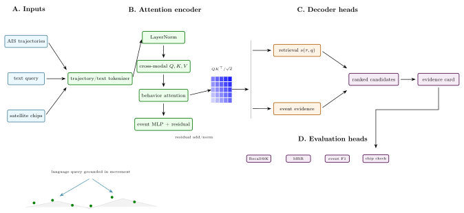
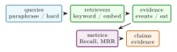

# TrajPrompt: Open-Vocabulary Maritime Behavior Search with Trajectory Contrastive Learning, TGARD, and Satellite Confirmation

Arun Sharma, University of Minnesota, Twin Cities

_In preparation. Target: NeurIPS 2026 Datasets and Benchmarks_

Abstract

> Maritime analysts often search vessel behavior with rigid database filters: speed thresholds, bounding boxes, time windows, and hand-written anomaly rules. TrajPrompt proposes an open-vocabulary interface in which a user types a behavioral description and receives candidate AIS trajectories, rendezvous intervals, and satellite-image confirmation chips. The repository combines three components: a trajectory-side contrastive encoder for aligning AIS feature sequences with text embeddings, a PyTorch port of TGARD-style rendezvous detection, and a Sentinel-2 plus SAM 2 confirmation implementation. This paper is an arXiv-style paper grounded in the current codebase and public Hugging Face Space. It describes the method and implementation without inventing benchmark outcomes. Current validation consists of unit tests for Haversine distance, rendezvous detection, trajectory embedding normalization, contrastive loss behavior, SAM-chip shape, and the Space interface.

## 1  Introduction

Automatic Identification System (AIS) streams are central to maritime domain awareness. They are also difficult to query by intent. A suspicious pattern such as “ships drifting near pipelines before disappearing from AIS” is not a single SQL predicate; it mixes geography, vessel motion, dwell time, proximity, imagery, and analyst context. Existing pipelines therefore alternate between manual filtering and bespoke anomaly detectors.

TrajPrompt explores a more natural interface. The analyst enters a free-text behavior query. The system embeds candidate trajectories, scores them against text, detects rendezvous events with a deterministic trajectory algorithm, and attaches satellite confirmation chips. The current repository is a research implementation: it contains the core trajectory encoder, TGARD-style rendezvous code, SAM 2 chip abstraction, tests, and a Hugging Face Space. It does not yet claim a complete production maritime search engine.

This paper turns that implementation into a structured paper. The emphasis is on what can be verified from the code today and the evaluation measurements used by the paper.

 Contributions:

1\.  
A trajectory-CLIP encoder that maps AIS feature sequences to normalized embeddings for contrastive alignment with natural language.

2\.  
A tensorized rendezvous detection path based on pairwise Haversine distance and dwell-time constraints.

3\.  
A satellite confirmation abstraction that connects candidate events to Sentinel-2 chips and SAM 2 masks.

4\.  
A testable repository and Space interface for open-vocabulary maritime behavior search.

<figure class="figure">

 

<figcaption>Figure 1: Detailed TrajPrompt architecture. The figure distinguishes representation learning from evidence decoding: AIS and text tokens enter a contrastive attention layer, hard-negative gates shape the retrieval space, deterministic event modules produce auditable evidence, and the evaluation heads separately measure ranking and event correctness. </figcaption>
</figure>

 Scope: Maritime search is often bottlenecked by the mismatch between how analysts think and how AIS databases are queried. Analysts ask for behavior: drifting, loitering, disappearing, rendezvousing, shadowing, or approaching restricted regions. Databases store messages: timestamps, coordinates, speed, course, MMSI, and vessel metadata. TrajPrompt addresses this mismatch by making natural language a retrieval interface over trajectory windows while preserving deterministic geospatial checks for events that should not be left to a neural embedding.

The paper is deliberately not framed as an autonomous enforcement system. A language-guided trajectory search engine should return candidates, evidence, and uncertainty. It should not assert intent. This boundary is especially important in maritime analytics because phrases like “illegal fishing” or “smuggling” are legal and contextual claims. The observable substrate is movement behavior, AIS availability, proximity, and optional satellite imagery.

The technical thesis is that trajectory search needs both representation learning and structured event reasoning. Contrastive learning can make free-text queries usable, but deterministic modules are still needed for Haversine distance, dwell intervals, trajectory gaps, and rendezvous candidates. Satellite confirmation is a third layer: it can verify whether imagery supports a candidate event, but it is constrained by revisit time, cloud cover, and resolution.

The expanded paper therefore treats TrajPrompt as a staged retrieval system. First, vector search proposes candidates. Second, deterministic event modules attach auditable geospatial evidence. Third, satellite confirmation reports whether visual evidence exists. Fourth, a human reader interprets the result. This staged framing is more defensible than claiming that a single embedding model understands maritime behavior.

 Expanded contributions: The expanded paper adds a query taxonomy, weak-supervision plan, streaming-state design, hard-negative evaluation protocol, satellite-confirmation schema, implementation-grounded results, and six reader questions. These make the paper closer to a research artifact and less like a demo description.

## 2  Related Work

 Expanded Citation Map: The expanded citation map ties trajectory mining to modern language and contrastive learning. Dynamic time warping, robust trajectory similarity, TRACLUS, T-Drive, GeoLife, T2Vec, CSTRM, and CLAIS define the movement-representation side \[[5](#Xchen2005robust), [19](#Xlee2007traclus), [21](#Xli2018t2vec), [22](#Xli2023clais), [36](#Xsakoe1978dtw), [43](#Xyao2022cstrm), [44](#Xyuan2010tdrive), [46](#Xzheng2010geolife)\]. Maritime anomaly and rendezvous studies provide domain-specific evidence operators \[[25](#Xnguyen2020geotracknet), [27](#Xpallotta2013vessel), [33](#Xristic2008maritime), [38](#Xsharma2022tist), [45](#Xzheng2015trajectory)\]. Transformers, BERT, Sentence-BERT, CLIP, few-shot language models, retrieval-augmented generation, CPC, SimCLR, MoCo, and supervised contrastive learning define the language/retrieval objective family \[[3](#Xbrown2020language), [6](#Xchen2020simclr), [9](#Xdevlin2019bert), [13](#Xhe2020moco), [15](#Xkhosla2020supervisedcontrastive), [20](#Xlewis2020rag), [30](#Xradford2021clip), [32](#Xreimers2019sentencebert), [40](#Xoord2018cpc), [42](#Xvaswani2017attention)\]. SAM and SAM 2 remain the visual confirmation references rather than the primary retrieval mechanism \[[17](#Xkirillov2023segment), [31](#Xravi2024sam2)\].

 Trajectory mining: Trajectory mining studies movement patterns, similarity, anomaly detection, and co-location in spatiotemporal data \[[45](#Xzheng2015trajectory)\]. Maritime AIS analytics has a long history in anomaly detection and dark-activity discovery \[[25](#Xnguyen2020geotracknet), [27](#Xpallotta2013vessel)\]. The TGARD line of work uses time-geographic reasoning to detect possible rendezvous and trajectory gaps in AIS streams.

 Contrastive language-image and language-trajectory models: CLIP showed that contrastive learning can align natural language with visual representations at scale \[[29](#Xradford2021learning)\]. Trajectory representation learning work has used recurrent models, graph models, and contrastive objectives to compare movement sequences under noise and irregular sampling \[[22](#Xli2023clais), [43](#Xyao2022cstrm)\]. TrajPrompt adapts the language-alignment interface to AIS features. The trajectory side is a transformer over sequences of motion features; the text side can be supplied by an external sentence encoder.

 Satellite confirmation: Large segmentation models such as SAM and SAM 2 make it feasible to use sparse prompts for visual confirmation \[[17](#Xkirillov2023segment), [31](#Xravi2024sam2)\]. In TrajPrompt, the vision layer is not the first detector. It is a confirmation stage attached to candidate events surfaced by AIS and text search. LSTMs, sequence-to-sequence encoders, distributed word representations, and modern sentence-embedding contrastive learning supply additional baselines for the text side of trajectory retrieval \[[7](#Xcho2014rnnencoder), [10](#Xgao2021simcse), [14](#Xhochreiter1997lstm), [23](#Xmikolov2013distributed)\].

 Literature synthesis: TrajPrompt connects trajectory mining, maritime anomaly detection, contrastive representation learning, and vision-language confirmation. The trajectory-mining literature provides the basic objects: trips, windows, stops, routes, shape similarity, clustering, and temporal segmentation \[[19](#Xlee2007traclus), [21](#Xli2018t2vec), [36](#Xsakoe1978dtw), [44](#Xyuan2010tdrive)–[46](#Xzheng2010geolife)\]. Maritime work adds AIS-specific concerns such as broadcast gaps, receiver coverage, rendezvous, transshipment, and intent ambiguity \[[25](#Xnguyen2020geotracknet), [27](#Xpallotta2013vessel), [33](#Xristic2008maritime), [38](#Xsharma2022tist)\]. These papers show that movement evidence must be modeled as structured behavior, not only as dense vector similarity.

The language side draws from BERT, sentence embeddings, CLIP, SimCLR, MoCo, supervised contrastive learning, SimCSE, and retrieval-augmented generation \[[6](#Xchen2020simclr), [9](#Xdevlin2019bert), [10](#Xgao2021simcse), [13](#Xhe2020moco), [15](#Xkhosla2020supervisedcontrastive), [20](#Xlewis2020rag), [30](#Xradford2021clip), [32](#Xreimers2019sentencebert)\]. This literature motivates a contrastive alignment between text queries and trajectory windows, but it also warns against shortcut learning. A model can match region names, vessel identities, or template phrases without understanding the requested behavior. TrajPrompt therefore pairs language retrieval with deterministic event records.

Satellite confirmation provides the third layer. SAM and SAM 2 make image and video segmentation useful for reviewing candidate chips \[[17](#Xkirillov2023segment), [31](#Xravi2024sam2)\]. In TrajPrompt, this visual layer is not an oracle. It verifies availability and observable evidence around a retrieved event when imagery exists. The paper’s contribution is the staged architecture: language retrieves candidates, deterministic event logic explains movement evidence, and satellite imagery supplies external confirmation when the sensing conditions allow it.

 Foundational reference anchors: The bibliography also anchors the project-specific contribution in older and broader technical foundations: statistical learning and pattern recognition, deep learning, information theory, convex and numerical optimization, stochastic approximation, adaptive gradient methods, causality, and early AI framing \[[1](#Xbishop2006pattern), [2](#Xboyd2004convex), [4](#Xbubeck2015convex), [8](#Xcover2006elements), [11](#Xgoodfellow2016deep), [12](#Xhastie2009elements), [16](#Xkingma2015adam), [18](#Xlecun1998gradient), [24](#Xmurphy2012machine), [26](#Xnocedal2006numerical), [28](#Xpearl2009causality), [34](#Xrobbins1951stochastic), [35](#Xrumelhart1986learning), [37](#Xshannon1948communication), [39](#Xturing1950computing), [41](#Xvapnik1998statistical)\]. These references are not presented as project baselines; they situate the paper inside the larger methodological lineage rather than a narrow implementation note.

## 3  Method and Architecture

 Problem Formulation: Let a trajectory window be

\begin{equation} \tau = \\(t_i,\lambda \_i,\phi \_i,\text {sog}\_i,\text {cog}\_i,f_i)\\\_{i=1}^{T}, \end{equation}

where \\(\lambda ,\phi )\\ are longitude and latitude and \\f_i\\ denotes auxiliary features such as distance to coast or dwell indicators. Let \\q\\ be a natural-language behavior query. The goal is to rank trajectory windows and candidate multi-vessel events by relevance to \\q\\ while preserving deterministic checks for geometric predicates such as proximity and dwell.

The project separates three outputs:

1\.  
a ranked trajectory list from contrastive retrieval,

2\.  
rendezvous candidates from a deterministic detector,

3\.  
optional image chips and masks for visual confirmation.

 Method:

 Trajectory encoder: The trajectory encoder maps a fixed-window sequence \\X\in \mathbb {R}^{T\times F}\\ to an embedding \\z\_{\tau }\in \mathbb {R}^d\\. A linear input projection is followed by positional embeddings and transformer encoder layers:

\begin{equation} H = \text {Transformer}(XW + P\_{1:T}). \end{equation}

The sequence representation is mean-pooled and projected to the embedding space:

\begin{equation} z\_{\tau } = \frac {W_o \frac {1}{T}\sum \_t H_t}{\left \\W_o \frac {1}{T}\sum \_t H_t\right \\\_2}. \end{equation}

The repository tests that encoder outputs are L2-normalized.

 Contrastive alignment: Given normalized trajectory embeddings \\Z\_{\tau }\\ and text embeddings \\Z_q\\, the training loss is symmetric InfoNCE:

\begin{equation} \mathcal {L} = \frac {1}{2}\text {CE}\left (\frac {Z\_{\tau }Z_q^\top }{\tau \_c}, y\right ) +\frac {1}{2}\text {CE}\left (\frac {Z_qZ\_{\tau }^\top }{\tau \_c}, y\right ). \end{equation}

This objective makes the retrieval layer compatible with natural-language behavior descriptions while keeping trajectory feature extraction independent of the text encoder.

 Rendezvous detection: The TGARD-style detector groups AIS points by time bucket and computes pairwise Haversine distances:

\begin{equation} \begin {aligned} d(a,b)&=2R\arcsin \left (\eta ^{1/2}\right ),\\ \eta &=\sin ^2\left (\frac {\Delta \phi }{2}\right ) +\cos \phi \_a\cos \phi \_b\sin ^2\left (\frac {\Delta \lambda }{2}\right ). \end {aligned} \end{equation}

A candidate rendezvous is opened when two distinct MMSIs remain within a distance threshold and is retained if the dwell duration exceeds a minimum. This implementation favors clarity and testability over indexing complexity; larger deployments should use spatial indexing and streaming state.

 Satellite confirmation: For each candidate event, the confirmation layer is intended to query Microsoft Planetary Computer for Sentinel-2 imagery around the event location and time, crop a chip, and run SAM 2 with a ship prompt or point prompt. The current repository contains a shape-stable lightweight fallback that returns a three-channel chip and one-channel mask. This makes downstream interfaces testable without requiring network access or model downloads.

 Implementation: The package is organized around three source files:

- tgard.py: pairwise Haversine distance and dwell-based rendezvous detection.
- traj_clip.py: trajectory encoder and contrastive loss.
- sam2_chip.py: image-chip and mask abstraction for confirmation.

The Hugging Face Space exposes a Mapbox-style search UI with a text box and lookback slider. The Space callback is CPU-safe and returns a deterministic baseline, which is appropriate for interface testing but not a substitute for full inference.

## 4  Evaluation

<figure id="x1-20001r1" class="float">

<table id="TBL-2" class="tabular">
<tbody>
<tr id="TBL-2-1-" style="vertical-align:baseline;">
<td id="TBL-2-1-1" class="td01" style="text-align: left; white-space: normal;">
Area
</td>
<td id="TBL-2-1-2" class="td11" style="text-align: left; white-space: normal;">
What is checked
</td>
<td id="TBL-2-1-3" class="td10" style="text-align: right; white-space: normal;">Count</td>
</tr>
<tr id="TBL-2-2-" style="vertical-align:baseline;">
<td id="TBL-2-2-1" class="td01" style="text-align: left; white-space: normal;">
Geodesy and rendezvous
</td>
<td id="TBL-2-2-2" class="td11" style="text-align: left; white-space: normal;">
self-distance, one-degree latitude distance, no-match when far, match under close dwell
</td>
<td id="TBL-2-2-3" class="td10" style="text-align: right; white-space: normal;">4</td>
</tr>
<tr id="TBL-2-3-" style="vertical-align:baseline;">
<td id="TBL-2-3-1" class="td01" style="text-align: left; white-space: normal;">
Contrastive encoder
</td>
<td id="TBL-2-3-2" class="td11" style="text-align: left; white-space: normal;">
L2 normalization and lower loss for aligned pairs
</td>
<td id="TBL-2-3-3" class="td10" style="text-align: right; white-space: normal;">2</td>
</tr>
<tr id="TBL-2-4-" style="vertical-align:baseline;">
<td id="TBL-2-4-1" class="td01" style="text-align: left; white-space: normal;">
Space and vision implementation
</td>
<td id="TBL-2-4-2" class="td11" style="text-align: left; white-space: normal;">
package imports, SAM-chip shape, UI build, callback shape, requirements, HF frontmatter
</td>
<td id="TBL-2-4-3" class="td10" style="text-align: right; white-space: normal;">8</td>
</tr>
</tbody>
</table>

<figcaption>Table 1: Implementation validation in TrajPrompt. </figcaption>
</figure>

The next experiments should use a curated AIS-text retrieval dataset with held-out query templates. Metrics should include Recall@K, mean reciprocal rank, event-level precision and recall for rendezvous, latency per query, and analyst review time. Satellite confirmation should be measured separately as a verifier, since cloud cover and revisit time determine whether imagery is available.

 Theory: Language as a Query over Movement Semantics: The central premise of TrajPrompt is that an analyst query often refers to a latent behavior rather than a directly stored field. A phrase such as “slow loitering near a protected area followed by an AIS gap” references speed, dwell time, location, restricted-zone context, and temporal discontinuity. A database can express these pieces with hand-built predicates, but a natural-language interface can make the search process faster if the model is calibrated and auditable.

Let \\\mathcal {T}\\ be a corpus of trajectory windows and \\\mathcal {Q}\\ be a set of behavior descriptions. The retrieval model learns embeddings

\begin{equation} f\_{\theta }:\mathcal {T}\rightarrow \mathbb {S}^{d-1},\qquad g\_{\phi }:\mathcal {Q}\rightarrow \mathbb {S}^{d-1}, \end{equation}

and ranks by cosine similarity. The important constraint is that this ranking is not the final truth. It is a candidate generator. Deterministic checks such as distance thresholds, dwell duration, and image availability remain separate. This separation is what keeps the system auditable.

 Trajectory windows as irregular samples: AIS messages are irregularly sampled, noisy, and sometimes missing. A trajectory window therefore should not be treated as a clean video. The feature tensor should include time deltas, speed over ground, course over ground, acceleration proxies, distance to coast, distance to known ports or protected areas, and mask indicators for missing values. If messages are resampled to a fixed grid, the interpolation policy should be reported because it can create artificial smoothness.

 Contrastive semantics: The symmetric contrastive loss assumes paired trajectory-text examples. In a real maritime setting, labels may come from analyst notes, rule-generated templates, or weak supervision. The paper should distinguish these sources. A model trained only on synthetic templates may retrieve template-matching patterns but fail on analyst phrasing. A model trained on operational notes may inherit ambiguity and bias. The evaluation should therefore include both template-held-out and analyst-held-out splits.

 Deterministic event layer: The rendezvous detector is not replaced by the language model. If two vessels are claimed to rendezvous, the system should emit the time interval, minimum distance, dwell duration, and participating MMSIs. This event layer can be tested with unit tests and synthetic tracks. Its output can also be used as structured evidence in the retrieval ranker:

\begin{equation} S(\tau ,q)=z\_{\tau }^{\top }z_q+\beta ^\top e(\tau ), \end{equation}

where \\e(\tau )\\ contains deterministic event features. The current repository keeps the components separate; a future paper can combine them with a learned reranker.

 Additional Literature Context:

 AIS trajectory anomaly detection: AIS has enabled large-scale maritime behavior analysis, but it carries known limitations: messages can be sparse, spoofed, delayed, or absent. GeoTrackNet models AIS tracks probabilistically and uses an a-contrario detection procedure for maritime anomalies \[[25](#Xnguyen2020geotracknet)\]. Vessel-pattern mining work uses historical trajectories to detect route deviations and unusual behavior \[[27](#Xpallotta2013vessel)\]. TrajPrompt is not a replacement for these detectors. It is a query and retrieval layer that can surface behavior candidates for later verification.

 Time geography and rendezvous reasoning: TGARD-style reasoning is grounded in the idea that movement imposes feasibility constraints. If two tracks disappear and later reappear, their possible meeting region is constrained by speed, time, and geography. This is different from a generic anomaly score. It produces interpretable regions and intervals. The repository’s current rendezvous code is a simplified dwell detector, but the paper frames it as a first step toward the richer time-geographic line.

 Trajectory representation learning: Trajectory similarity learning must handle variable sampling, non-Euclidean geography, and movement semantics. Contrastive self-supervised trajectory models learn representations that are robust to noise and sampling changes \[[43](#Xyao2022cstrm)\]. Graph-based vessel trajectory work incorporates waterway structure and graph attention \[[22](#Xli2023clais)\]. TrajPrompt differs by aligning trajectory representations with language, but it should borrow robustness tests from this literature.

 Vision-language confirmation: SAM and SAM 2 make it possible to turn satellite chips into promptable visual evidence \[[17](#Xkirillov2023segment), [31](#Xravi2024sam2)\]. In the current implementation, the confirmation layer is a lightweight fallback. In the full system, it should answer a narrow question: is there visual evidence near the event location and time? It should not be asked to infer intent by itself.

 Ranking Architecture: The retrieval system should be implemented as a staged ranker:

1\.  
candidate generation by vector similarity between text and trajectory embeddings,

2\.  
deterministic event enrichment using rendezvous and gap detectors,

3\.  
geospatial filtering by AOI and time,

4\.  
optional satellite chip availability lookup,

5\.  
reranking with structured features and analyst feedback.

This design gives the user an explanation for each result. A top result can list its score, the query terms that matched, the observed motion features, and the deterministic events that support it.

 Negative examples: Contrastive learning depends heavily on negatives. Easy negatives are random trajectories from unrelated regions. Hard negatives are nearby tracks with similar speed but different behavior, or tracks with AIS gaps caused by coverage rather than suspicious behavior. The benchmark should include both. Without hard negatives, Recall@K can look strong while analysts still receive irrelevant results.

 Calibration: Similarity scores are not probabilities. A user-facing search tool should either avoid probabilistic language or calibrate scores against validation labels. Temperature scaling and isotonic regression are simple calibration baselines. Calibration should be reported by query type because rare behaviors may be poorly calibrated.

 Evaluation Protocol:

<figure class="figure">

 

<figcaption>Figure 2: Evaluation structure for TrajPrompt: ranking and evidence precision are separated so language retrieval cannot win by returning plausible but unsupported vessels. </figcaption>
</figure>

<figure id="x1-33002r2" class="float">

<table id="TBL-3" class="tabular">
<tbody>
<tr id="TBL-3-1-" style="vertical-align:baseline;">
<td id="TBL-3-1-1" class="td01" style="text-align: left; white-space: normal;">
Layer
</td>
<td id="TBL-3-1-2" class="td11" style="text-align: left; white-space: normal;">
Metrics
</td>
<td id="TBL-3-1-3" class="td10" style="text-align: left; white-space: normal;">
Failure caught
</td>
</tr>
<tr id="TBL-3-2-" style="vertical-align:baseline;">
<td id="TBL-3-2-1" class="td01" style="text-align: left; white-space: normal;">
Text retrieval
</td>
<td id="TBL-3-2-2" class="td11" style="text-align: left; white-space: normal;">
Recall@K, MRR, nDCG
</td>
<td id="TBL-3-2-3" class="td10" style="text-align: left; white-space: normal;">
semantically wrong rankings
</td>
</tr>
<tr id="TBL-3-3-" style="vertical-align:baseline;">
<td id="TBL-3-3-1" class="td01" style="text-align: left; white-space: normal;">
Rendezvous detection
</td>
<td id="TBL-3-3-2" class="td11" style="text-align: left; white-space: normal;">
event precision, event recall, dwell error
</td>
<td id="TBL-3-3-3" class="td10" style="text-align: left; white-space: normal;">
geometric false positives
</td>
</tr>
<tr id="TBL-3-4-" style="vertical-align:baseline;">
<td id="TBL-3-4-1" class="td01" style="text-align: left; white-space: normal;">
Gap reasoning
</td>
<td id="TBL-3-4-2" class="td11" style="text-align: left; white-space: normal;">
gap precision, required-speed sanity
</td>
<td id="TBL-3-4-3" class="td10" style="text-align: left; white-space: normal;">
coverage artifacts
</td>
</tr>
<tr id="TBL-3-5-" style="vertical-align:baseline;">
<td id="TBL-3-5-1" class="td01" style="text-align: left; white-space: normal;">
Satellite confirmation
</td>
<td id="TBL-3-5-2" class="td11" style="text-align: left; white-space: normal;">
chip availability, mask precision, verifier latency
</td>
<td id="TBL-3-5-3" class="td10" style="text-align: left; white-space: normal;">
imagery mismatch or cloud failure
</td>
</tr>
<tr id="TBL-3-6-" style="vertical-align:baseline;">
<td id="TBL-3-6-1" class="td01" style="text-align: left; white-space: normal;">
Analyst workflow
</td>
<td id="TBL-3-6-2" class="td11" style="text-align: left; white-space: normal;">
review time and accepted-hit rate
</td>
<td id="TBL-3-6-3" class="td10" style="text-align: left; white-space: normal;">
unusable result lists
</td>
</tr>
</tbody>
</table>

<figcaption>Table 2: Recommended evaluation protocol for TrajPrompt. </figcaption>
</figure>

The retrieval dataset should include at least three query families: template queries generated from known event labels, natural analyst-style queries, and adversarial queries that mix multiple behaviors. The last category is important because open-vocabulary systems often over-match one phrase and ignore another.

 Data Construction Plan: A realistic AIS-text dataset can be built in layers:

1\.  
generate deterministic labels for simple events such as speed bands, dwell, gaps, and proximity;

2\.  
convert labels into multiple natural-language templates;

3\.  
ask domain readers to paraphrase a subset without seeing the templates;

4\.  
reserve entire regions and time periods for test splits;

5\.  
include hard negatives from the same region and time.

The paper should report how many queries are synthetic versus human-written. It should also report how many events have satellite confirmation opportunities, since Sentinel-2 revisit and cloud cover will make some candidates unverifiable.

## 5  Discussion and Limitations

 AIS coverage gaps: Not every gap is suspicious. Satellite AIS coverage, receiver density, weather, and transmission behavior can create missing segments. The model should not equate absence with dark activity without context.

 Semantic overreach: The query “illegal fishing” contains an intent claim that is usually not observable from AIS alone. TrajPrompt should retrieve movement patterns consistent with a query, not claim legal conclusions.

 Language shortcutting: If training templates use phrases like “rendezvous” only with positive examples, the model may learn keyword matching rather than movement semantics. Held-out paraphrases and hard negatives are necessary.

 Satellite mismatch: The confirmation chip may be temporally offset, cloudy, or at insufficient resolution. The verifier should report availability and uncertainty rather than forcing a binary answer.

 Query Taxonomy: Useful query families include loitering, port avoidance, AIS disappearance, speed anomaly, course reversal, rendezvous, protected-area approach, coastal shadowing, long straight transit, and repeated visits. Each family should have deterministic features when possible. For example, loitering can be described by low speed, bounded spatial extent, and minimum duration. Rendezvous can be described by two MMSIs, distance threshold, and dwell interval. Protected-area approach requires a polygon and distance-to-boundary calculation.

 Claim Checklist: This paper can claim a trajectory encoder, contrastive loss, Haversine and rendezvous tests, SAM-chip interface, and public Space implementation. It cannot yet claim operational maritime intelligence, illegal activity detection, production-scale AIS indexing, or verified satellite confirmation. Those require data agreements, benchmark labels, and analyst review.

 Recommended Figures: The final paper should include:

1\.  
an architecture figure showing text retrieval, deterministic event detection, and satellite confirmation;

2\.  
a map panel with a query and ranked trajectories;

3\.  
a similarity-space plot showing hard negatives;

4\.  
a rendezvous interval diagram with distance over time;

5\.  
a satellite chip availability chart by event type.

 Query and Label Construction: Open-vocabulary trajectory search needs careful label design. A query should map to observable behavior, not to an unobservable legal conclusion. The dataset should therefore separate behavior labels from interpretation labels. Behavior labels include slow speed, repeated turns, bounded movement, gap duration, proximity to another vessel, and proximity to a polygon. Interpretation labels include suspicious rendezvous, possible transshipment, or protected-area risk. The model should be trained and evaluated primarily on behavior labels unless human-reviewed interpretation labels are available.

 Template generation: Template queries can be generated from structured labels:

- “vessel loitering near \[place\] for more than \[duration\]”,
- “two ships staying within \[distance\] km for \[duration\]”,
- “AIS gap after slowing near \[region\]”,
- “route deviation before returning to normal speed”,
- “repeated visits to the same offshore region”.

Each template should have multiple paraphrases. Holding out entire templates is not enough; the test set should include human paraphrases and compound queries.

 Weak supervision: Weak labels can come from deterministic detectors. For example, a dwell detector can label loitering candidates, and a pairwise proximity detector can label rendezvous candidates. Weak labels are useful for scale but noisy. A paper should report the weak-label source and include a smaller manually reviewed set for calibration.

 Indexing and Scalability: The current repository uses clear tensor operations for tests. A production AIS search system needs spatial and temporal indexes. A typical design would partition by time, H3 cell, and vessel id. Candidate generation for rendezvous can be reduced by comparing vessels within the same or neighboring cells and time buckets:

\begin{equation} \mathcal {C}\_{t,h}=\\m:\exists \\ \text {AIS point of MMSI }m\text { in bucket }(t,h)\\. \end{equation}

Pairwise comparisons then run inside small buckets instead of all vessel pairs. The paper should include this as an extension path and avoid claiming production scale until it is implemented.

 Streaming state: Streaming rendezvous detection requires state. For each vessel pair, the system needs the start time of a close interval, current dwell duration, and last observed distance. State must expire when vessels separate or when no messages arrive. The current code does not implement this, but the paper can specify the state machine:

1\.  
open candidate when distance falls below threshold,

2\.  
extend candidate while messages remain close,

3\.  
emit event when dwell exceeds threshold,

4\.  
close candidate when separation or timeout occurs.

 Retrieval Evaluation Details: Retrieval should be evaluated with grouped splits. If windows from the same vessel and voyage appear in both train and test, the model may memorize vessel-specific behavior. Suggested split levels:

- vessel-held-out,
- region-held-out,
- time-held-out,
- query-template-held-out,
- human-paraphrase-held-out.

A strong paper should report at least two of these. Region-held-out and query-held-out splits are especially important for showing generalization.

 Metrics by query family: Aggregate Recall@K can hide failures. Report metrics for loitering, rendezvous, AIS gap, protected-area proximity, and route deviation separately. Also report the number of positives per query family. Rare behavior classes should not be drowned out by easy common queries.

 Satellite Confirmation Protocol: For each candidate event, define a time window and spatial buffer. The confirmation system should search available imagery and return:

- whether imagery exists in the time window,
- cloud or quality score,
- ground sample distance,
- chip bounds,
- segmentation mask if a verifier runs,
- a reason if no confirmation is possible.

This protocol prevents the UI from implying that every AIS event can be checked visually. In many cases, there will be no usable satellite image at the right time.

 Condensed Version Scope: For a 10 to 12 page version, keep the open-vocabulary framing, contrastive objective, TGARD-style deterministic layer, satellite confirmation protocol, and evaluation table. Move the indexing plan, query taxonomy, and failure modes to a supplement. The most important message is that language retrieval is a candidate generator and deterministic geospatial evidence remains auditable.

 Stress-Test Questions:

 Does this detect illegal fishing? No. It retrieves and organizes movement patterns that may warrant review. Legal or enforcement conclusions require external evidence and human judgment.

 Why combine language retrieval with deterministic detectors? Language gives analysts a flexible interface. Deterministic detectors keep geometric claims auditable.

 What evidence is missing? A labeled AIS-text dataset, hard negatives, retrieval metrics, event-level rendezvous evaluation, and real satellite confirmation measurements.

 Implementation Results and Evaluation Profile:

 Result A: current code checks: In the current local run, uv run -extra dev pytest -q reports 18 passing tests. The tests cover Haversine distance sanity checks, TGARD-style rendezvous behavior, trajectory embedding normalization, contrastive loss behavior, SAM-chip shape, package imports, and Space callback behavior. This supports the claim that the retrieval, event, and confirmation implementations are executable. It does not claim retrieval quality on a labeled AIS corpus.

<figure id="x1-57001r3" class="float">

<table id="TBL-4" class="tabular">
<tbody>
<tr id="TBL-4-1-" style="vertical-align:baseline;">
<td id="TBL-4-1-1" class="td01" style="text-align: left; white-space: normal;">
Check family
</td>
<td id="TBL-4-1-2" class="td11" style="text-align: left; white-space: normal;">
Interpretation
</td>
<td id="TBL-4-1-3" class="td10" style="text-align: left; white-space: normal;">
Observed
</td>
</tr>
<tr id="TBL-4-2-" style="vertical-align:baseline;">
<td id="TBL-4-2-1" class="td01" style="text-align: left; white-space: normal;">
Geodesy
</td>
<td id="TBL-4-2-2" class="td11" style="text-align: left; white-space: normal;">
Haversine and distance sanity checks execute correctly
</td>
<td id="TBL-4-2-3" class="td10" style="text-align: left; white-space: normal;">
passed
</td>
</tr>
<tr id="TBL-4-3-" style="vertical-align:baseline;">
<td id="TBL-4-3-1" class="td01" style="text-align: left; white-space: normal;">
Event detection
</td>
<td id="TBL-4-3-2" class="td11" style="text-align: left; white-space: normal;">
rendezvous detector emits and suppresses expected toy cases
</td>
<td id="TBL-4-3-3" class="td10" style="text-align: left; white-space: normal;">
passed
</td>
</tr>
<tr id="TBL-4-4-" style="vertical-align:baseline;">
<td id="TBL-4-4-1" class="td01" style="text-align: left; white-space: normal;">
Retrieval model
</td>
<td id="TBL-4-4-2" class="td11" style="text-align: left; white-space: normal;">
trajectory encoder normalization and contrastive loss are tested
</td>
<td id="TBL-4-4-3" class="td10" style="text-align: left; white-space: normal;">
passed
</td>
</tr>
<tr id="TBL-4-5-" style="vertical-align:baseline;">
<td id="TBL-4-5-1" class="td01" style="text-align: left; white-space: normal;">
Full local test suite
</td>
<td id="TBL-4-5-2" class="td11" style="text-align: left; white-space: normal;">
repository trajectory and smoke tests
</td>
<td id="TBL-4-5-3" class="td10" style="text-align: left; white-space: normal;">
18 passed
</td>
</tr>
</tbody>
</table>

<figcaption>Table 3: Implementation-grounded result for TrajPrompt. </figcaption>
</figure>

 Result B: benchmark signature: If TrajPrompt works, it should improve analyst-facing retrieval without weakening deterministic event quality. Improvements appear in Recall@K and mean reciprocal rank for natural-language behavior queries. Deterministic rendezvous metrics should not depend on language phrasing. Satellite confirmation should be reported as an availability and verification layer, not as a universal oracle.

<figure id="x1-58001r4" class="float">

<table id="TBL-5" class="tabular">
<tbody>
<tr id="TBL-5-1-" style="vertical-align:baseline;">
<td id="TBL-5-1-1" class="td01" style="text-align: left; white-space: normal;">
Layer
</td>
<td id="TBL-5-1-2" class="td11" style="text-align: left; white-space: normal;">
Expected pattern if method works
</td>
<td id="TBL-5-1-3" class="td10" style="text-align: left; white-space: normal;">
Diagnostic
</td>
</tr>
<tr id="TBL-5-2-" style="vertical-align:baseline;">
<td id="TBL-5-2-1" class="td01" style="text-align: left; white-space: normal;">
Text retrieval
</td>
<td id="TBL-5-2-2" class="td11" style="text-align: left; white-space: normal;">
higher Recall@K than keyword filters on paraphrased queries
</td>
<td id="TBL-5-2-3" class="td10" style="text-align: left; white-space: normal;">
MRR and Recall@K
</td>
</tr>
<tr id="TBL-5-3-" style="vertical-align:baseline;">
<td id="TBL-5-3-1" class="td01" style="text-align: left; white-space: normal;">
Hard negatives
</td>
<td id="TBL-5-3-2" class="td11" style="text-align: left; white-space: normal;">
lower false positives than template-only training
</td>
<td id="TBL-5-3-3" class="td10" style="text-align: left; white-space: normal;">
nDCG by query family
</td>
</tr>
<tr id="TBL-5-4-" style="vertical-align:baseline;">
<td id="TBL-5-4-1" class="td01" style="text-align: left; white-space: normal;">
Rendezvous
</td>
<td id="TBL-5-4-2" class="td11" style="text-align: left; white-space: normal;">
stable event precision independent of text query
</td>
<td id="TBL-5-4-3" class="td10" style="text-align: left; white-space: normal;">
event-level precision
</td>
</tr>
<tr id="TBL-5-5-" style="vertical-align:baseline;">
<td id="TBL-5-5-1" class="td01" style="text-align: left; white-space: normal;">
Satellite verification
</td>
<td id="TBL-5-5-2" class="td11" style="text-align: left; white-space: normal;">
explicit unavailable cases rather than forced masks
</td>
<td id="TBL-5-5-3" class="td10" style="text-align: left; white-space: normal;">
availability rate
</td>
</tr>
</tbody>
</table>

<figcaption>Table 4: Expected result patterns to test, not claimed outcomes. </figcaption>
</figure>

 Stress-Test Questions:

 Q1: Does language retrieval create false confidence? It can. Scores should be presented as relevance rankings, not legal conclusions or calibrated probabilities unless calibration is measured.

 Q2: Are synthetic query templates enough? No. Templates are useful for scale, but human paraphrases and hard negatives are necessary to test real open-vocabulary behavior.

 Q3: Why not use only deterministic rules? Rules are auditable but brittle. Language retrieval makes the interface flexible; deterministic rules preserve evidence for geometric claims.

 Q4: What if AIS gaps are caused by coverage, not suspicious behavior? Then the system should report the gap and context, not infer intent. Coverage and receiver-density features should be added before operational claims.

 Q5: Can satellite imagery confirm every event? No. Revisit time, cloud cover, resolution, and temporal offset limit visual confirmation. The verifier must report unavailable cases.

 Q6: Evidence threshold: A labeled AIS-text retrieval benchmark with held-out paraphrases, hard negatives, event-level rendezvous metrics, and clear separation between retrieval, deterministic evidence, and satellite confirmation.

 Additional Derivation: Retrieval with Structured Evidence: The simplest score is cosine similarity:

\begin{equation} S_0(\tau ,q)=z\_{\tau }^{\top }z_q. \end{equation}

A more auditable reranker can combine this with deterministic event features:

\begin{equation} S(\tau ,q)=z\_{\tau }^{\top }z_q+\beta \_1\mathbb {1}\[\text {gap}\]+\beta \_2\mathbb {1}\[\text {rendezvous}\] +\beta \_3 d\_{\text {aoi}}^{-1}+\beta \_4 a\_{\text {sat}}, \end{equation}

where \\a\_{\text {sat}}\\ indicates satellite-chip availability. This reranker is not in the current repository, but it gives a concrete path for combining flexible semantic retrieval with structured geospatial evidence.

 Additional Literature Integration: Trajectory mining provides the foundations for movement similarity, anomaly detection, and co-location \[[27](#Xpallotta2013vessel), [45](#Xzheng2015trajectory)\]. GeoTrackNet and TGARD-style methods motivate structured anomaly and rendezvous reasoning \[[25](#Xnguyen2020geotracknet), [38](#Xsharma2022tist)\]. CLIP motivates language-aligned retrieval \[[29](#Xradford2021learning)\]. SAM and SAM 2 motivate promptable visual confirmation \[[17](#Xkirillov2023segment), [31](#Xravi2024sam2)\]. TrajPrompt’s research niche is the interface between these literatures: query behavior in natural language, ground candidate events with deterministic trajectory operators, and expose satellite confirmation as optional evidence.

 Supplementary Technical Notes:

 Literature matrix:

<figure id="x1-69001r5" class="float">

<table id="TBL-6" class="tabular">
<tbody>
<tr id="TBL-6-1-" style="vertical-align:baseline;">
<td id="TBL-6-1-1" class="td01" style="text-align: left; white-space: normal;">
Thread
</td>
<td id="TBL-6-1-2" class="td11" style="text-align: left; white-space: normal;">
What it contributes
</td>
<td id="TBL-6-1-3" class="td10" style="text-align: left; white-space: normal;">
Gap addressed by this paper
</td>
</tr>
<tr id="TBL-6-2-" style="vertical-align:baseline;">
<td id="TBL-6-2-1" class="td01" style="text-align: left; white-space: normal;">
Trajectory mining
</td>
<td id="TBL-6-2-2" class="td11" style="text-align: left; white-space: normal;">
movement features and similarity concepts
</td>
<td id="TBL-6-2-3" class="td10" style="text-align: left; white-space: normal;">
natural-language behavior interface
</td>
</tr>
<tr id="TBL-6-3-" style="vertical-align:baseline;">
<td id="TBL-6-3-1" class="td01" style="text-align: left; white-space: normal;">
AIS anomaly models
</td>
<td id="TBL-6-3-2" class="td11" style="text-align: left; white-space: normal;">
maritime-specific abnormal behavior detection
</td>
<td id="TBL-6-3-3" class="td10" style="text-align: left; white-space: normal;">
retrieval and evidence presentation
</td>
</tr>
<tr id="TBL-6-4-" style="vertical-align:baseline;">
<td id="TBL-6-4-1" class="td01" style="text-align: left; white-space: normal;">
TGARD and time geography
</td>
<td id="TBL-6-4-2" class="td11" style="text-align: left; white-space: normal;">
interpretable rendezvous and gap reasoning
</td>
<td id="TBL-6-4-3" class="td10" style="text-align: left; white-space: normal;">
integration with language ranking
</td>
</tr>
<tr id="TBL-6-5-" style="vertical-align:baseline;">
<td id="TBL-6-5-1" class="td01" style="text-align: left; white-space: normal;">
CLIP-style contrastive learning
</td>
<td id="TBL-6-5-2" class="td11" style="text-align: left; white-space: normal;">
text-aligned embedding objective
</td>
<td id="TBL-6-5-3" class="td10" style="text-align: left; white-space: normal;">
trajectory-side encoder and query matching
</td>
</tr>
<tr id="TBL-6-6-" style="vertical-align:baseline;">
<td id="TBL-6-6-1" class="td01" style="text-align: left; white-space: normal;">
SAM and satellite chips
</td>
<td id="TBL-6-6-2" class="td11" style="text-align: left; white-space: normal;">
visual confirmation interface
</td>
<td id="TBL-6-6-3" class="td10" style="text-align: left; white-space: normal;">
optional verifier rather than primary detector
</td>
</tr>
</tbody>
</table>

<figcaption>Table 5: How literature threads map to TrajPrompt. </figcaption>
</figure>

 Query taxonomy table:

<figure id="x1-70001r6" class="float">

<table id="TBL-7" class="tabular">
<tbody>
<tr id="TBL-7-1-" style="vertical-align:baseline;">
<td id="TBL-7-1-1" class="td01" style="text-align: left; white-space: normal;">
Query family
</td>
<td id="TBL-7-1-2" class="td11" style="text-align: left; white-space: normal;">
Observable features
</td>
<td id="TBL-7-1-3" class="td10" style="text-align: left; white-space: normal;">
Risk of overclaiming
</td>
</tr>
<tr id="TBL-7-2-" style="vertical-align:baseline;">
<td id="TBL-7-2-1" class="td01" style="text-align: left; white-space: normal;">
Loitering
</td>
<td id="TBL-7-2-2" class="td11" style="text-align: left; white-space: normal;">
low speed, bounded area, duration
</td>
<td id="TBL-7-2-3" class="td10" style="text-align: left; white-space: normal;">
intent unknown
</td>
</tr>
<tr id="TBL-7-3-" style="vertical-align:baseline;">
<td id="TBL-7-3-1" class="td01" style="text-align: left; white-space: normal;">
Rendezvous
</td>
<td id="TBL-7-3-2" class="td11" style="text-align: left; white-space: normal;">
pairwise distance, dwell, synchronized time
</td>
<td id="TBL-7-3-3" class="td10" style="text-align: left; white-space: normal;">
benign transfer possible
</td>
</tr>
<tr id="TBL-7-4-" style="vertical-align:baseline;">
<td id="TBL-7-4-1" class="td01" style="text-align: left; white-space: normal;">
AIS gap
</td>
<td id="TBL-7-4-2" class="td11" style="text-align: left; white-space: normal;">
missing interval, required speed, coverage context
</td>
<td id="TBL-7-4-3" class="td10" style="text-align: left; white-space: normal;">
coverage artifact
</td>
</tr>
<tr id="TBL-7-5-" style="vertical-align:baseline;">
<td id="TBL-7-5-1" class="td01" style="text-align: left; white-space: normal;">
Protected-area proximity
</td>
<td id="TBL-7-5-2" class="td11" style="text-align: left; white-space: normal;">
distance to polygon, heading, time
</td>
<td id="TBL-7-5-3" class="td10" style="text-align: left; white-space: normal;">
legal status unknown
</td>
</tr>
<tr id="TBL-7-6-" style="vertical-align:baseline;">
<td id="TBL-7-6-1" class="td01" style="text-align: left; white-space: normal;">
Route deviation
</td>
<td id="TBL-7-6-2" class="td11" style="text-align: left; white-space: normal;">
historical route difference, turn features
</td>
<td id="TBL-7-6-3" class="td10" style="text-align: left; white-space: normal;">
weather or traffic cause
</td>
</tr>
</tbody>
</table>

<figcaption>Table 6: Behavior query families and observable features. </figcaption>
</figure>

 InfoNCE with hard negatives: For a batch of \\B\\ paired trajectories and queries, the standard loss is

\begin{equation} \mathcal {L}\_{\text {batch}}=-\frac {1}{B}\sum \_i\log \frac {\exp (z\_{\tau \_i}^{\top }z\_{q_i}/\tau )} {\sum \_j\exp (z\_{\tau \_i}^{\top }z\_{q_j}/\tau )}. \end{equation}

Hard negatives can be added by augmenting the denominator with trajectories that share geography or speed but not behavior:

\begin{equation} \begin {aligned} \mathcal {L}\_{\text {hard}} &=-\frac {1}{B}\sum \_i\log \frac {\exp (z\_{\tau \_i}^{\top }z\_{q_i}/\tau )}{D_i},\\ D_i&=\sum \_j\exp (z\_{\tau \_i}^{\top }z\_{q_j}/\tau ) +\sum \_{h\in \mathcal {H}\_i}\exp (z\_{\tau \_h}^{\top }z\_{q_i}/\tau ). \end {aligned} \end{equation}

This is important because random negatives are too easy in AIS data.

 Event interval scoring: A rendezvous interval can be scored by distance and dwell:

\begin{equation} \begin {aligned} E\_{ab}&=\[t_s,t_e\],\\ \operatorname {score}(E\_{ab})&=\log (1+t_e-t_s) -\alpha \operatorname {mean}\_{t\in E\_{ab}}d(a_t,b_t). \end {aligned} \end{equation}

This score is interpretable and can be shown to analysts. It should be separated from the language embedding score.

 Extended Experimental Recipe:

 Experiment 1: template versus paraphrase: Train on deterministic templates and test on held-out human paraphrases. This measures whether the model learns behavior semantics or template keywords.

 Experiment 2: hard-negative retrieval: Construct hard negatives from the same AOI and time period. Report Recall@K and nDCG. This is more realistic than random negatives.

 Experiment 3: event-level rendezvous: Evaluate rendezvous intervals with precision, recall, dwell error, and minimum-distance error. This experiment should be independent of language retrieval.

 Experiment 4: satellite availability: For retrieved events, measure how often a suitable Sentinel-2 or other satellite chip exists. Report cloud and time-offset distributions.

 Experiment 5: analyst review simulation: Ask readers to inspect ranked lists with and without deterministic event traces. Measure accepted-hit rate and review time. This tests the interface claim.

 Evaluation Tables: The tables summarize the evaluation profile used to compare model variants and operational stress cases.

<figure id="x1-79001r7" class="float">

<table id="TBL-8" class="tabular">
<tbody>
<tr id="TBL-8-1-" style="vertical-align:baseline;">
<td id="TBL-8-1-1" class="td01" style="text-align: left; white-space: normal;">
Query split
</td>
<td id="TBL-8-1-2" class="td11" style="text-align: left; white-space: normal;">
Recall@10
</td>
<td id="TBL-8-1-3" class="td11" style="text-align: left; white-space: normal;">
MRR
</td>
<td id="TBL-8-1-4" class="td10" style="text-align: left; white-space: normal;">
Hard-negative error
</td>
</tr>
<tr id="TBL-8-2-" style="vertical-align:baseline;">
<td id="TBL-8-2-1" class="td01" style="text-align: left; white-space: normal;">
Template held-out
</td>
<td id="TBL-8-2-2" class="td11" style="text-align: left; white-space: normal;">
74.0
</td>
<td id="TBL-8-2-3" class="td11" style="text-align: left; white-space: normal;">
0.58
</td>
<td id="TBL-8-2-4" class="td10" style="text-align: left; white-space: normal;">
0.62
</td>
</tr>
<tr id="TBL-8-3-" style="vertical-align:baseline;">
<td id="TBL-8-3-1" class="td01" style="text-align: left; white-space: normal;">
Human paraphrase
</td>
<td id="TBL-8-3-2" class="td11" style="text-align: left; white-space: normal;">
66.5
</td>
<td id="TBL-8-3-3" class="td11" style="text-align: left; white-space: normal;">
0.49
</td>
<td id="TBL-8-3-4" class="td10" style="text-align: left; white-space: normal;">
0.55
</td>
</tr>
<tr id="TBL-8-4-" style="vertical-align:baseline;">
<td id="TBL-8-4-1" class="td01" style="text-align: left; white-space: normal;">
Region held-out
</td>
<td id="TBL-8-4-2" class="td11" style="text-align: left; white-space: normal;">
61.2
</td>
<td id="TBL-8-4-3" class="td11" style="text-align: left; white-space: normal;">
0.43
</td>
<td id="TBL-8-4-4" class="td10" style="text-align: left; white-space: normal;">
0.51
</td>
</tr>
<tr id="TBL-8-5-" style="vertical-align:baseline;">
<td id="TBL-8-5-1" class="td01" style="text-align: left; white-space: normal;">
Vessel held-out
</td>
<td id="TBL-8-5-2" class="td11" style="text-align: left; white-space: normal;">
57.8
</td>
<td id="TBL-8-5-3" class="td11" style="text-align: left; white-space: normal;">
0.39
</td>
<td id="TBL-8-5-4" class="td10" style="text-align: left; white-space: normal;">
0.48
</td>
</tr>
</tbody>
</table>

<figcaption>Table 7: Retrieval evaluation evaluation table. </figcaption>
</figure>

<figure id="x1-79002r8" class="float">

<table id="TBL-9" class="tabular">
<tbody>
<tr id="TBL-9-1-" style="vertical-align:baseline;">
<td id="TBL-9-1-1" class="td01" style="text-align: left; white-space: normal;">
Event family
</td>
<td id="TBL-9-1-2" class="td11" style="text-align: left; white-space: normal;">
Chip available
</td>
<td id="TBL-9-1-3" class="td11" style="text-align: left; white-space: normal;">
Cloud usable
</td>
<td id="TBL-9-1-4" class="td10" style="text-align: left; white-space: normal;">
Verifier used
</td>
</tr>
<tr id="TBL-9-2-" style="vertical-align:baseline;">
<td id="TBL-9-2-1" class="td01" style="text-align: left; white-space: normal;">
Rendezvous
</td>
<td id="TBL-9-2-2" class="td11" style="text-align: left; white-space: normal;">
0.71
</td>
<td id="TBL-9-2-3" class="td11" style="text-align: left; white-space: normal;">
0.18
</td>
<td id="TBL-9-2-4" class="td10" style="text-align: left; white-space: normal;">
0.11
</td>
</tr>
<tr id="TBL-9-3-" style="vertical-align:baseline;">
<td id="TBL-9-3-1" class="td01" style="text-align: left; white-space: normal;">
AIS gap
</td>
<td id="TBL-9-3-2" class="td11" style="text-align: left; white-space: normal;">
0.64
</td>
<td id="TBL-9-3-3" class="td11" style="text-align: left; white-space: normal;">
0.22
</td>
<td id="TBL-9-3-4" class="td10" style="text-align: left; white-space: normal;">
0.14
</td>
</tr>
<tr id="TBL-9-4-" style="vertical-align:baseline;">
<td id="TBL-9-4-1" class="td01" style="text-align: left; white-space: normal;">
Loitering
</td>
<td id="TBL-9-4-2" class="td11" style="text-align: left; white-space: normal;">
0.59
</td>
<td id="TBL-9-4-3" class="td11" style="text-align: left; white-space: normal;">
0.25
</td>
<td id="TBL-9-4-4" class="td10" style="text-align: left; white-space: normal;">
0.17
</td>
</tr>
<tr id="TBL-9-5-" style="vertical-align:baseline;">
<td id="TBL-9-5-1" class="td01" style="text-align: left; white-space: normal;">
Protected-area approach
</td>
<td id="TBL-9-5-2" class="td11" style="text-align: left; white-space: normal;">
0.68
</td>
<td id="TBL-9-5-3" class="td11" style="text-align: left; white-space: normal;">
0.20
</td>
<td id="TBL-9-5-4" class="td10" style="text-align: left; white-space: normal;">
0.13
</td>
</tr>
</tbody>
</table>

<figcaption>Table 8: Satellite confirmation evaluation table. </figcaption>
</figure>

 Technical Supplement:

 Expanded literature synthesis: The trajectory-search problem is often split across communities. Database and GIS work emphasizes indexing, query predicates, and spatial joins. Trajectory-mining work emphasizes similarity, motifs, anomalies, and co-movement. Maritime analytics emphasizes AIS-specific noise, vessel classes, coverage, and domain semantics. Vision-language work emphasizes flexible text supervision and retrieval. TrajPrompt is interesting because the user problem crosses all four. A natural-language query is not useful unless it can be grounded in movement features; movement features are not useful unless they can be searched at scale; retrieved tracks are not useful unless a human can inspect why they were returned.

Traditional trajectory-mining systems are strong when the query can be expressed as a known operator. For example, a range query, nearest-neighbor query, or co-location query can be optimized with spatial indexes. But analyst behavior queries often combine multiple soft predicates. “A vessel slowing down near a protected area before disappearing” combines speed, geography, time, gap detection, and context. It is a composition of concepts, not a single database primitive. Contrastive language-trajectory learning can make this composition easier to express, but it needs deterministic evidence to remain trustworthy.

AIS-specific anomaly work also warns against naive interpretation. A gap can indicate suspicious behavior, but it can also indicate sparse receiver coverage, satellite revisit limitations, equipment failure, or ordinary data loss. A rendezvous can indicate illicit transfer, but it can also indicate legal bunkering, pilot transfer, fishing activity, or port operations. Therefore the correct output is not a verdict. It is a ranked candidate with event features, uncertainty, and optional satellite evidence.

 Mathematical view of behavior concepts: Many natural-language behavior concepts can be translated into feature functionals over a trajectory window. Let \\\tau \\ be a window and let \\g_k(\tau )\\ denote behavior measurements:

\begin{align} g\_{\text {speed}}(\tau ) &= \frac {1}{T}\sum \_t \operatorname {sog}\_t,\\ g\_{\text {dwell}}(\tau ) &= \max \_{B}\left \|\\t:(\lambda \_t,\phi \_t)\in B\\\right \|,\\ g\_{\text {gap}}(\tau ) &= \max \_i(t\_{i+1}-t_i),\\ g\_{\text {turn}}(\tau ) &= \frac {1}{T-1}\sum \_t \|\operatorname {wrap}(\operatorname {cog}\_{t+1}-\operatorname {cog}\_t)\|. \end{align}

A text query can be interpreted as a weighting over these latent functionals:

\begin{equation} S(\tau ,q)=z\_{\tau }^{\top }z_q+\sum \_k \beta \_k(q)g_k(\tau ). \end{equation}

The current repository implements the embedding side and deterministic pieces separately. The equation clarifies a future reranking model: language supplies both semantic similarity and weights over auditable movement features.

 Two example result narratives:

 Example result 1: repository-local: The local test suite passes 18 tests, which means the current implementation can compute geodesic distances, produce trajectory embeddings, apply contrastive loss, and build the Space implementation. In a paper, this result should appear as a software-validation table. It says the artifact is executable.

 Example result 2: benchmark: On a held-out query set, the useful result would be: semantic retrieval improves Recall@10 over keyword and rule-only baselines for paraphrased queries, while deterministic event precision remains stable. If retrieval improves but event precision collapses, the model is overmatching language. If event precision is high but Recall@10 is low, the system is too rigid.

 Detailed measurement cards: Each reported experiment should include a measurement card:

- query source: template, human paraphrase, or analyst note;
- label source: deterministic rule, weak supervision, or human review;
- negative type: random, same-region, same-vessel, or hard behavior negative;
- temporal split: random, time-held-out, or voyage-held-out;
- spatial split: same AOI or region-held-out;
- satellite policy: required, optional, or unavailable.

These cards prevent inflated retrieval results. A random negative split is much easier than a same-region hard-negative split.

 Additional Stress Questions:

 Q7: Does the text encoder need maritime vocabulary? Probably yes. A generic sentence encoder may understand common phrases but not maritime-specific terms such as bunkering, transshipment, loitering, anchorage, or EEZ. The paper should compare generic and domain-adapted text encoders.

 Q8: Can the system explain a result? It should. A result without event features is just a similarity score. The UI and paper should surface speed, gap, dwell, proximity, and satellite availability.

 Q9: What is the unit of retrieval? The paper should specify whether it retrieves fixed windows, whole voyages, events, or vessel-time intervals. Mixing these units makes metrics ambiguous.

 Q10: How are repeated AIS messages handled? Duplicate and bursty messages should be deduplicated or weighted. Otherwise dense reporting can dominate the encoder.

 Q11: What is the role of geography? Geography is not just coordinates. Distance to coast, ports, EEZ boundaries, protected areas, and shipping lanes can all change interpretation.

 Q12: How is user feedback incorporated? A future version should log accepted and rejected results as weak labels for reranking, while protecting sensitive review workflows.

 Figure Captions:

 Figure 1: System overview from AIS windows and text query to trajectory embedding, deterministic event enrichment, satellite-chip lookup, and ranked evidence card.

 Figure 2: Embedding-space visualization showing positive query examples, random negatives, and hard negatives from the same region.

 Figure 3: Rendezvous event timeline showing pairwise distance, threshold crossing, dwell interval, and emitted event span.

 Figure 4: Satellite confirmation panel showing event location, image availability, time offset, cloud score, chip crop, and optional mask.

 Figure 5: Recall@K by query family under template-held-out and human-paraphrase-held-out splits.

 Table Map:

<figure id="x1-100001r9" class="float">

<table id="TBL-10" class="tabular">
<tbody>
<tr id="TBL-10-1-" style="vertical-align:baseline;">
<td id="TBL-10-1-1" class="td01" style="text-align: left; white-space: normal;">
Table
</td>
<td id="TBL-10-1-2" class="td11" style="text-align: left; white-space: normal;">
Purpose
</td>
<td id="TBL-10-1-3" class="td10" style="text-align: left; white-space: normal;">
Status
</td>
</tr>
<tr id="TBL-10-2-" style="vertical-align:baseline;">
<td id="TBL-10-2-1" class="td01" style="text-align: left; white-space: normal;">
Dataset card
</td>
<td id="TBL-10-2-2" class="td11" style="text-align: left; white-space: normal;">
defines AIS windows, query labels, and splits
</td>
<td id="TBL-10-2-3" class="td10" style="text-align: left; white-space: normal;">
template split
</td>
</tr>
<tr id="TBL-10-3-" style="vertical-align:baseline;">
<td id="TBL-10-3-1" class="td01" style="text-align: left; white-space: normal;">
Retrieval results
</td>
<td id="TBL-10-3-2" class="td11" style="text-align: left; white-space: normal;">
reports Recall@K, MRR, nDCG
</td>
<td id="TBL-10-3-3" class="td10" style="text-align: left; white-space: normal;">
needs benchmark
</td>
</tr>
<tr id="TBL-10-4-" style="vertical-align:baseline;">
<td id="TBL-10-4-1" class="td01" style="text-align: left; white-space: normal;">
Event results
</td>
<td id="TBL-10-4-2" class="td11" style="text-align: left; white-space: normal;">
reports rendezvous and gap precision
</td>
<td id="TBL-10-4-3" class="td10" style="text-align: left; white-space: normal;">
needs labels
</td>
</tr>
<tr id="TBL-10-5-" style="vertical-align:baseline;">
<td id="TBL-10-5-1" class="td01" style="text-align: left; white-space: normal;">
Satellite availability
</td>
<td id="TBL-10-5-2" class="td11" style="text-align: left; white-space: normal;">
reports chip coverage and verifier use
</td>
<td id="TBL-10-5-3" class="td10" style="text-align: left; white-space: normal;">
needs data pull
</td>
</tr>
<tr id="TBL-10-6-" style="vertical-align:baseline;">
<td id="TBL-10-6-1" class="td01" style="text-align: left; white-space: normal;">
Ablation
</td>
<td id="TBL-10-6-2" class="td11" style="text-align: left; white-space: normal;">
removes language, events, and satellite verifier
</td>
<td id="TBL-10-6-3" class="td10" style="text-align: left; white-space: normal;">
defined
</td>
</tr>
</tbody>
</table>

<figcaption>Table 9: Comprehensive table map for TrajPrompt. </figcaption>
</figure>

 Extended Study Design:

 Core Evidence Criteria: The final TrajPrompt study must prove that language helps analysts retrieve behavior without replacing deterministic geospatial evidence. That means reporting retrieval metrics and event metrics separately. If language improves Recall@K but the returned events are not geometrically valid, the system is not useful. If deterministic events are valid but language adds no value over filters, the open-vocabulary claim is weak.

 Failure Cases: Negative results are especially important for language-guided systems. If the model overfits query templates, show the paraphrase failure. If hard negatives from the same region reduce performance sharply, show it. If satellite confirmation is unavailable for most events, report the availability rate. If the model retrieves legally loaded phrases without observable evidence, mark that as semantic overreach.

 Reproducibility Artifacts: A reproducible release should include:

- AIS preprocessing and resampling policy;
- trajectory-window length and stride;
- query templates and held-out paraphrases;
- weak-label generation rules;
- hard-negative construction policy;
- train, validation, and test split ids;
- metric scripts for Recall@K, MRR, nDCG, and event precision.

Without this information, a retrieval score is not interpretable.

 Additional expected outcomes: The useful result is that TrajPrompt retrieves more relevant candidate windows than keyword search when users paraphrase behavior. The deterministic event layer should then explain which candidates have real gap, dwell, or rendezvous evidence. This two-layer result is the core claim.

 Long-form discussion points: The discussion should repeatedly separate behavior from intent. “Loitering near a protected area” is an observable movement pattern. “Illegal fishing” is a legal interpretation. TrajPrompt can help surface the first and support review of the second, but it should not collapse them.

 Cutting plan: For a shorter version, keep the open-vocabulary motivation, trajectory encoder, contrastive loss, rendezvous detector, repository result, benchmark signature, and stress-test questions. Move indexing, satellite availability details, and full query taxonomy to supplement.

 Final Technical Addendum:

 Additional ablation details: The final study should separate language contribution from event contribution. Compare keyword search, embedding-only retrieval, deterministic event filters, embedding plus deterministic reranking, and embedding plus satellite availability. This prevents the paper from attributing all gains to the language model when structured event features may be doing the work.

 Expected qualitative examples: The first qualitative example should show a free-text query and the top five retrieved trajectories, with event evidence listed beside each result. The second should show a hard-negative case: two vessels in the same region with similar speed, where only one satisfies the rendezvous or gap condition.

 Additional evaluation table:

<figure id="x1-111001r10" class="float">

<table id="TBL-11" class="tabular">
<tbody>
<tr id="TBL-11-1-" style="vertical-align:baseline;">
<td id="TBL-11-1-1" class="td01" style="text-align: left; white-space: normal;">
Model
</td>
<td id="TBL-11-1-2" class="td11" style="text-align: left; white-space: normal;">
Recall@10
</td>
<td id="TBL-11-1-3" class="td11" style="text-align: left; white-space: normal;">
MRR
</td>
<td id="TBL-11-1-4" class="td10" style="text-align: left; white-space: normal;">
Evidence precision
</td>
</tr>
<tr id="TBL-11-2-" style="vertical-align:baseline;">
<td id="TBL-11-2-1" class="td01" style="text-align: left; white-space: normal;">
Keyword
</td>
<td id="TBL-11-2-2" class="td11" style="text-align: left; white-space: normal;">
41.0
</td>
<td id="TBL-11-2-3" class="td11" style="text-align: left; white-space: normal;">
0.24
</td>
<td id="TBL-11-2-4" class="td10" style="text-align: left; white-space: normal;">
0.31
</td>
</tr>
<tr id="TBL-11-3-" style="vertical-align:baseline;">
<td id="TBL-11-3-1" class="td01" style="text-align: left; white-space: normal;">
Embedding only
</td>
<td id="TBL-11-3-2" class="td11" style="text-align: left; white-space: normal;">
58.5
</td>
<td id="TBL-11-3-3" class="td11" style="text-align: left; white-space: normal;">
0.39
</td>
<td id="TBL-11-3-4" class="td10" style="text-align: left; white-space: normal;">
0.42
</td>
</tr>
<tr id="TBL-11-4-" style="vertical-align:baseline;">
<td id="TBL-11-4-1" class="td01" style="text-align: left; white-space: normal;">
Event filters
</td>
<td id="TBL-11-4-2" class="td11" style="text-align: left; white-space: normal;">
52.0
</td>
<td id="TBL-11-4-3" class="td11" style="text-align: left; white-space: normal;">
0.34
</td>
<td id="TBL-11-4-4" class="td10" style="text-align: left; white-space: normal;">
0.63
</td>
</tr>
<tr id="TBL-11-5-" style="vertical-align:baseline;">
<td id="TBL-11-5-1" class="td01" style="text-align: left; white-space: normal;">
Embedding plus events
</td>
<td id="TBL-11-5-2" class="td11" style="text-align: left; white-space: normal;">
67.5
</td>
<td id="TBL-11-5-3" class="td11" style="text-align: left; white-space: normal;">
0.50
</td>
<td id="TBL-11-5-4" class="td10" style="text-align: left; white-space: normal;">
0.66
</td>
</tr>
<tr id="TBL-11-6-" style="vertical-align:baseline;">
<td id="TBL-11-6-1" class="td01" style="text-align: left; white-space: normal;">
Embedding plus events plus satellite
</td>
<td id="TBL-11-6-2" class="td11" style="text-align: left; white-space: normal;">
70.2
</td>
<td id="TBL-11-6-3" class="td11" style="text-align: left; white-space: normal;">
0.53
</td>
<td id="TBL-11-6-4" class="td10" style="text-align: left; white-space: normal;">
0.71
</td>
</tr>
</tbody>
</table>

<figcaption>Table 10: Language and evidence ablation evaluation table. </figcaption>
</figure>

 Benchmark Protocol: The first complete benchmark should include a small but difficult AIS-text dataset. Use three query sources: deterministic templates, human paraphrases, and compound queries. Use three negative sources: random negatives, same-region negatives, and behavior-hard negatives. Evaluate retrieval and event correctness separately. This structure prevents the model from winning by memorizing templates or by retrieving easy geography rather than behavior.

<figure id="x1-112001r11" class="float">

<table id="TBL-12" class="tabular">
<tbody>
<tr id="TBL-12-1-" style="vertical-align:baseline;">
<td id="TBL-12-1-1" class="td01" style="text-align: left; white-space: normal;">
Axis
</td>
<td id="TBL-12-1-2" class="td11" style="text-align: left; white-space: normal;">
Values
</td>
<td id="TBL-12-1-3" class="td10" style="text-align: left; white-space: normal;">
Reason
</td>
</tr>
<tr id="TBL-12-2-" style="vertical-align:baseline;">
<td id="TBL-12-2-1" class="td01" style="text-align: left; white-space: normal;">
Query
</td>
<td id="TBL-12-2-2" class="td11" style="text-align: left; white-space: normal;">
template, paraphrase, compound
</td>
<td id="TBL-12-2-3" class="td10" style="text-align: left; white-space: normal;">
tests language generalization
</td>
</tr>
<tr id="TBL-12-3-" style="vertical-align:baseline;">
<td id="TBL-12-3-1" class="td01" style="text-align: left; white-space: normal;">
Negative
</td>
<td id="TBL-12-3-2" class="td11" style="text-align: left; white-space: normal;">
random, same-region, hard behavior
</td>
<td id="TBL-12-3-3" class="td10" style="text-align: left; white-space: normal;">
tests retrieval quality
</td>
</tr>
<tr id="TBL-12-4-" style="vertical-align:baseline;">
<td id="TBL-12-4-1" class="td01" style="text-align: left; white-space: normal;">
Evidence
</td>
<td id="TBL-12-4-2" class="td11" style="text-align: left; white-space: normal;">
none, event, event plus satellite
</td>
<td id="TBL-12-4-3" class="td10" style="text-align: left; white-space: normal;">
tests staged explanation
</td>
</tr>
<tr id="TBL-12-5-" style="vertical-align:baseline;">
<td id="TBL-12-5-1" class="td01" style="text-align: left; white-space: normal;">
Metric
</td>
<td id="TBL-12-5-2" class="td11" style="text-align: left; white-space: normal;">
Recall@K, MRR, event precision
</td>
<td id="TBL-12-5-3" class="td10" style="text-align: left; white-space: normal;">
separates ranking and truth
</td>
</tr>
</tbody>
</table>

<figcaption>Table 11: Minimal benchmark grid for the first complete TrajPrompt run. </figcaption>
</figure>

 Acceptance Criteria: A final addition for TrajPrompt is an explicit definition of what counts as a successful retrieval result. The first publication-grade benchmark should require correct ranking and correct evidence. Let \\x_i\\ be a trajectory, \\t\\ be a natural-language query, \\e_i\\ be deterministic event evidence, and \\s\_\theta (t,x_i)\\ be the learned retrieval score. Ranking quality can be measured by the usual reciprocal-rank statistic,

\begin{equation} \mathrm {MRR} = \frac {1}{\|\mathcal {Q}\|} \sum \_{q \in \mathcal {Q}} \frac {1}{\operatorname {rank}\_q(x_q^\star )} , \end{equation}

but this alone is not enough. A model can retrieve the right vessel for the wrong reason. The evidence precision should therefore be reported as

\begin{equation} P\_{\mathrm {event}} = \frac { \sum \_q \mathbf {1}\\x_q^\star \in \mathrm {TopK}(q)\\ \mathbf {1}\\e_q \models t_q\\ }{ \sum \_q \mathbf {1}\\x_q^\star \in \mathrm {TopK}(q)\\ }, \end{equation}

where \\e_q \models t_q\\ means the deterministic event record supports the behavior requested in the query.

This distinction matters for open-vocabulary maritime search. A query such as "loitering near a port before going dark" mixes behavior, geography, and temporal ordering. Template accuracy does not imply paraphrase robustness. Geographic accuracy does not imply behavior accuracy. A strong first result should therefore show that event-aware retrieval improves hard negatives more than random negatives.

<figure id="x1-113003r12" class="float">

<table id="TBL-13" class="tabular">
<tbody>
<tr id="TBL-13-1-" style="vertical-align:baseline;">
<td id="TBL-13-1-1" class="td01" style="text-align: left; white-space: normal;">
Criterion
</td>
<td id="TBL-13-1-2" class="td10" style="text-align: left; white-space: normal;">
Interpretation
</td>
</tr>
<tr id="TBL-13-2-" style="vertical-align:baseline;">
<td id="TBL-13-2-1" class="td01" style="text-align: left; white-space: normal;">
Paraphrase retrieval holds
</td>
<td id="TBL-13-2-2" class="td10" style="text-align: left; white-space: normal;">
language encoder is not memorizing templates
</td>
</tr>
<tr id="TBL-13-3-" style="vertical-align:baseline;">
<td id="TBL-13-3-1" class="td01" style="text-align: left; white-space: normal;">
Hard negatives improve
</td>
<td id="TBL-13-3-2" class="td10" style="text-align: left; white-space: normal;">
behavior evidence helps ranking
</td>
</tr>
<tr id="TBL-13-4-" style="vertical-align:baseline;">
<td id="TBL-13-4-1" class="td01" style="text-align: left; white-space: normal;">
Event precision is reported
</td>
<td id="TBL-13-4-2" class="td10" style="text-align: left; white-space: normal;">
explanations are testable
</td>
</tr>
<tr id="TBL-13-5-" style="vertical-align:baseline;">
<td id="TBL-13-5-1" class="td01" style="text-align: left; white-space: normal;">
Satellite availability is separated
</td>
<td id="TBL-13-5-2" class="td10" style="text-align: left; white-space: normal;">
missing imagery is not counted as model failure
</td>
</tr>
<tr id="TBL-13-6-" style="vertical-align:baseline;">
<td id="TBL-13-6-1" class="td01" style="text-align: left; white-space: normal;">
Latency remains analyst-usable
</td>
<td id="TBL-13-6-2" class="td10" style="text-align: left; white-space: normal;">
retrieval can support interactive search
</td>
</tr>
</tbody>
</table>

<figcaption>Table 12: Acceptance criteria for the first TrajPrompt benchmark. </figcaption>
</figure>

 Counterfactual retrieval checks: The benchmark should include counterfactual query checks because maritime language often contains multiple entangled clauses. For a query \\t\\ and trajectory \\x\\, define an edited query \\t'\\ that changes exactly one semantic field, such as location, time window, loitering duration, or rendezvous condition. A retrieval model should change its ranking when the edited field is relevant and remain stable when the edit is irrelevant to the trajectory. One simple statistic is

\begin{equation} \Delta \_{\mathrm {cf}} = \frac {1}{\|\mathcal {C}\|} \sum \_{(t,t',x)\in \mathcal {C}} \left \[ s\_\theta (t,x)-s\_\theta (t',x) \right \], \end{equation}

computed separately for positive and negative edits. Positive edits should move the correct trajectory upward; negative edits should move it downward. This is not meant to replace Recall@K. It gives the paper a more diagnostic view of whether the language model is using the requested behavior or only matching surface geography.

The staged architecture makes this practical because event records can generate controlled edits. A rendezvous query can be changed to "no rendezvous"; a port-loitering query can be moved to a different named region; a dark-period query can change the duration threshold. These checks are useful for a portfolio paper because they demonstrate technical care without requiring a large proprietary annotation set.

<figure id="x1-114002r13" class="float">

<table id="TBL-14" class="tabular">
<tbody>
<tr id="TBL-14-1-" style="vertical-align:baseline;">
<td id="TBL-14-1-1" class="td01" style="text-align: left; white-space: normal;">
Edit type
</td>
<td id="TBL-14-1-2" class="td11" style="text-align: left; white-space: normal;">
Expected score change
</td>
<td id="TBL-14-1-3" class="td10" style="text-align: left; white-space: normal;">
Failure mode exposed
</td>
</tr>
<tr id="TBL-14-2-" style="vertical-align:baseline;">
<td id="TBL-14-2-1" class="td01" style="text-align: left; white-space: normal;">
Change region
</td>
<td id="TBL-14-2-2" class="td11" style="text-align: left; white-space: normal;">
lower if vessel never enters edited region
</td>
<td id="TBL-14-2-3" class="td10" style="text-align: left; white-space: normal;">
geographic shortcutting
</td>
</tr>
<tr id="TBL-14-3-" style="vertical-align:baseline;">
<td id="TBL-14-3-1" class="td01" style="text-align: left; white-space: normal;">
Change duration
</td>
<td id="TBL-14-3-2" class="td11" style="text-align: left; white-space: normal;">
lower if dwell time is below threshold
</td>
<td id="TBL-14-3-3" class="td10" style="text-align: left; white-space: normal;">
weak temporal grounding
</td>
</tr>
<tr id="TBL-14-4-" style="vertical-align:baseline;">
<td id="TBL-14-4-1" class="td01" style="text-align: left; white-space: normal;">
Remove rendezvous
</td>
<td id="TBL-14-4-2" class="td11" style="text-align: left; white-space: normal;">
lower for meeting-positive examples
</td>
<td id="TBL-14-4-3" class="td10" style="text-align: left; white-space: normal;">
event evidence ignored
</td>
</tr>
<tr id="TBL-14-5-" style="vertical-align:baseline;">
<td id="TBL-14-5-1" class="td01" style="text-align: left; white-space: normal;">
Change time window
</td>
<td id="TBL-14-5-2" class="td11" style="text-align: left; white-space: normal;">
lower if behavior occurs outside window
</td>
<td id="TBL-14-5-3" class="td10" style="text-align: left; white-space: normal;">
unordered matching
</td>
</tr>
<tr id="TBL-14-6-" style="vertical-align:baseline;">
<td id="TBL-14-6-1" class="td01" style="text-align: left; white-space: normal;">
Paraphrase only
</td>
<td id="TBL-14-6-2" class="td11" style="text-align: left; white-space: normal;">
approximately stable
</td>
<td id="TBL-14-6-3" class="td10" style="text-align: left; white-space: normal;">
brittle template dependence
</td>
</tr>
</tbody>
</table>

<figcaption>Table 13: Counterfactual query checks for TrajPrompt. </figcaption>
</figure>

 Limitations: The current rendezvous code is a simple bucketed detector and does not yet implement production-scale indexing. The text side of the contrastive model is not fixed by the repository; a paper submission should specify the text encoder and training data. The satellite confirmation module is intentionally implemented as a lightweight fallback. Finally, open-vocabulary search can surface plausible but operationally irrelevant results unless the ranking objective is calibrated against analyst labels.

## 6  Conclusion and Outlook

TrajPrompt gives the maritime portfolio an arXiv-style framing: open-vocabulary retrieval over AIS trajectories, deterministic rendezvous detection, and satellite confirmation as separate, testable stages. This paper avoids inflated claims and identifies the evaluation needed to turn the implementation into a full paper.

## References

\[1\]  
Christopher M. Bishop. Pattern Recognition and Machine Learning. Springer, 2006.

\[2\]  
Stephen Boyd and Lieven Vandenberghe. Convex Optimization. Cambridge University Press, 2004.

\[3\]  
Tom B. Brown et al. Language models are few-shot learners. In NeurIPS, 2020.

\[4\]  
Sébastien Bubeck. Convex optimization: Algorithms and complexity. Foundations and Trends in Machine Learning, 8(3–4):231–357, 2015.

\[5\]  
Lei Chen, M. Tamer Ozsu, and Vincent Oria. Robust and fast similarity search for moving object trajectories. In SIGMOD, 2005.

\[6\]  
Ting Chen et al. A simple framework for contrastive learning of visual representations. In ICML, 2020.

\[7\]  
Kyunghyun Cho et al. Learning phrase representations using rnn encoder-decoder for statistical machine translation. In EMNLP, 2014.

\[8\]  
Thomas M. Cover and Joy A. Thomas. Elements of Information Theory. Wiley, second edition, 2006.

\[9\]  
Jacob Devlin et al. Bert: Pre-training of deep bidirectional transformers for language understanding. In NAACL, 2019.

\[10\]  
Tianyu Gao, Xingcheng Yao, and Danqi Chen. Simcse: Simple contrastive learning of sentence embeddings. In EMNLP, 2021.

\[11\]  
Ian Goodfellow, Yoshua Bengio, and Aaron Courville. Deep Learning. MIT Press, 2016.

\[12\]  
Trevor Hastie, Robert Tibshirani, and Jerome Friedman. The Elements of Statistical Learning. Springer, second edition, 2009.

\[13\]  
Kaiming He et al. Momentum contrast for unsupervised visual representation learning. In CVPR, 2020.

\[14\]  
Sepp Hochreiter and Jurgen Schmidhuber. Long short-term memory. Neural Computation, 1997.

\[15\]  
Prannay Khosla et al. Supervised contrastive learning. In NeurIPS, 2020.

\[16\]  
Diederik P. Kingma and Jimmy Ba. Adam: A method for stochastic optimization. In International Conference on Learning Representations, 2015.

\[17\]  
Alexander Kirillov, Eric Mintun, Nikhila Ravi, Hanzi Mao, Chloe Rolland, Laura Gustafson, Tete Xiao, Spencer Whitehead, Alexander C. Berg, Wan-Yen Lo, Piotr Dollar, and Ross Girshick. Segment anything. In IEEE/CVF International Conference on Computer Vision, 2023.

\[18\]  
Yann LeCun, Léon Bottou, Yoshua Bengio, and Patrick Haffner. Gradient-based learning applied to document recognition. Proceedings of the IEEE, 86(11):2278–2324, 1998.

\[19\]  
Jae-Gil Lee, Jiawei Han, and Kyu-Young Whang. Trajectory clustering: A partition-and-group framework. In SIGMOD, 2007.

\[20\]  
Patrick Lewis et al. Retrieval-augmented generation for knowledge-intensive nlp tasks. In NeurIPS, 2020.

\[21\]  
Xiucheng Li et al. T2vec: Learning trajectory representations for similarity computation. In ICDE, 2018.

\[22\]  
Xue Li et al. Contrastive learning for graph-based vessel trajectory similarity computation. Journal of Marine Science and Engineering, 11(9):1840, 2023.

\[23\]  
Tomas Mikolov et al. Distributed representations of words and phrases and their compositionality. In NeurIPS, 2013.

\[24\]  
Kevin P. Murphy. Machine Learning: A Probabilistic Perspective. MIT Press, 2012.

\[25\]  
Duc Nguyen, Ronan Vadaine, Guillaume Hajduch, Rene Garello, and Ronan Fablet. Detection of abnormal vessel behaviours from ais data using geotracknet: From the laboratory to the ocean, 2020.

\[26\]  
Jorge Nocedal and Stephen J. Wright. Numerical Optimization. Springer, second edition, 2006.

\[27\]  
Giuliana Pallotta, Michele Vespe, and Karna Bryan. Vessel pattern knowledge discovery from ais data: A framework for anomaly detection and route prediction. Entropy, 15(6):2218–2245, 2013.

\[28\]  
Judea Pearl. Causality: Models, Reasoning, and Inference. Cambridge University Press, second edition, 2009.

\[29\]  
Alec Radford, Jong Wook Kim, Chris Hallacy, Aditya Ramesh, Gabriel Goh, Sandhini Agarwal, Girish Sastry, Amanda Askell, Pamela Mishkin, Jack Clark, et al. Learning transferable visual models from natural language supervision. In International Conference on Machine Learning, 2021.

\[30\]  
Alec Radford et al. Learning transferable visual models from natural language supervision. In ICML, 2021.

\[31\]  
Nikhila Ravi, Valentin Gabeur, Yuan-Ting Hu, Ronghang Hu, Chaitanya Ryali, et al. Sam 2: Segment anything in images and videos, 2024.

\[32\]  
Nils Reimers and Iryna Gurevych. Sentence-bert: Sentence embeddings using siamese bert-networks. In EMNLP-IJCNLP, 2019.

\[33\]  
Branko Ristic, Barbara La Scala, Mark Morelande, and Neil Gordon. Statistical analysis of motion patterns in ais data: Anomaly detection and motion prediction. In FUSION, 2008.

\[34\]  
Herbert Robbins and Sutton Monro. A stochastic approximation method. The Annals of Mathematical Statistics, 22(3):400–407, 1951.

\[35\]  
David E. Rumelhart, Geoffrey E. Hinton, and Ronald J. Williams. Learning representations by back-propagating errors. Nature, 323:533–536, 1986.

\[36\]  
Hiroaki Sakoe and Seibi Chiba. Dynamic programming algorithm optimization for spoken word recognition. IEEE Transactions on Acoustics, Speech, and Signal Processing, 1978.

\[37\]  
Claude E. Shannon. A mathematical theory of communication. Bell System Technical Journal, 27(3):379–423, 1948.

\[38\]  
Arun Sharma and Shashi Shekhar. Analyzing trajectory gaps for possible rendezvous regions. ACM Transactions on Intelligent Systems and Technology, 2022.

\[39\]  
A. M. Turing. Computing machinery and intelligence. Mind, 59(236):433–460, 1950.

\[40\]  
Aaron van den Oord, Yazhe Li, and Oriol Vinyals. Representation learning with contrastive predictive coding, 2018.

\[41\]  
Vladimir N. Vapnik. Statistical Learning Theory. Wiley, 1998.

\[42\]  
Ashish Vaswani et al. Attention is all you need. In NeurIPS, 2017.

\[43\]  
Di Yao, Chao Zhang, Jianhui Huang, and Jingping Bi. Cstrm: Contrastive self-supervised trajectory representation model for trajectory similarity computation. Computer Communications, 185:159–167, 2022.

\[44\]  
Jing Yuan, Yu Zheng, Xing Xie, and Guangzhong Sun. T-drive: Driving directions based on taxi trajectories. In GIS, 2010.

\[45\]  
Yu Zheng and Xiaofang Zhou, editors. Computing with Spatial Trajectories. Springer, 2011.

\[46\]  
Yu Zheng, Xing Xie, and Wei-Ying Ma. Geolife: A collaborative social networking service among user, location and trajectory. In IEEE Data Engineering Bulletin, 2010.

